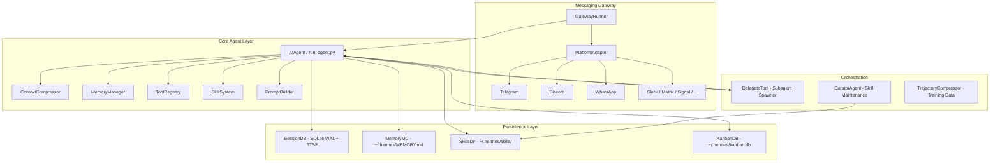
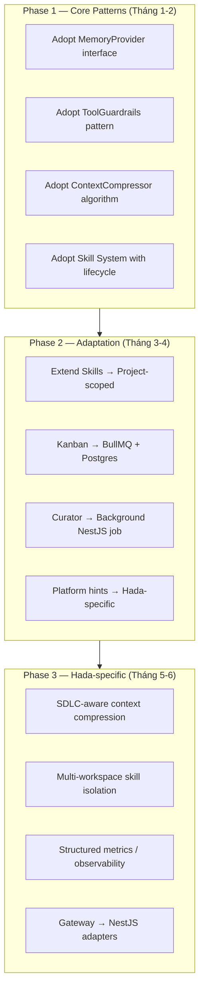

# Hermes Agent — Phân tích kỹ thuật toàn diện

> **Mục tiêu tài liệu:** Đánh giá chi tiết codebase Hermes Agent (Nous Research) về kiến trúc, điểm mạnh/yếu, và khả năng tích hợp/học hỏi cho framework Hada.
> **Nguồn:** `/Users/vanductai/Repo/research/oss/hermes-agent`
> **Đo lường:** Mọi nhận định đều được gắn với file code cụ thể, có thể kiểm chứng.

---

## 1. Tổng quan kiến trúc

Hermes Agent là một **AI agent framework đa nền tảng** được viết bằng Python, thiết kế để chạy trên CLI, Telegram, Discord, WhatsApp, Slack, WeChat, Signal, Matrix, Mattermost, Feishu, Email, SMS và nhiều nền tảng khác. Điểm cốt lõi là một **self-improving loop** — agent có thể tự tạo và cập nhật "skills" (kỹ năng) dưới dạng Markdown, giúp nó học từ mỗi phiên làm việc.



---

## 2. Phân tích kiến trúc chi tiết

### 2.1 Core Agent Loop (`run_agent.py`)

**Cơ chế:** Synchronous loop với budget tracking, interrupt checks, và function call handling. Agent nhận message → build system prompt → gọi LLM → xử lý tool calls → lặp lại đến khi xong hoặc hết budget.

**Điểm nổi bật:**
- **Model-agnostic:** Hỗ trợ OpenAI, Anthropic, Gemini, Ollama, OpenRouter thông qua `auxiliary_client.py`. Provider được detect tự động qua URL pattern.
- **Multi-turn tool loop:** Một lần gọi có thể tạo ra nhiều vòng tool calls. Agent tự kiểm soát khi nào dừng.
- **Interrupt-safe:** `agent.interrupt()` có thể được gọi từ bất kỳ thread nào, kể cả TUI overlay.

### 2.2 Prompt Builder (`agent/prompt_builder.py` — 1,181 dòng)

File này là **trung tâm điều phối ngữ cảnh** của toàn bộ agent. Các thành phần:

| Thành phần | Mục đích |
|---|---|
| `DEFAULT_AGENT_IDENTITY` | Định nghĩa nhân cách agent |
| `PLATFORM_HINTS` | Hướng dẫn định dạng cho từng platform (16+ nền tảng) |
| `MEMORY_GUIDANCE` | Hướng dẫn agent ghi nhớ đúng cách (declarative facts, không phải instructions) |
| `SKILLS_GUIDANCE` | Hướng dẫn khi nào tạo/cập nhật skill |
| `KANBAN_GUIDANCE` | Hướng dẫn đặc biệt cho chế độ Kanban worker |
| `TOOL_USE_ENFORCEMENT_GUIDANCE` | Buộc agent dùng tools thay vì chỉ mô tả |
| `OPENAI_MODEL_EXECUTION_GUIDANCE` | Patch behavior cụ thể cho GPT models |
| `GOOGLE_MODEL_OPERATIONAL_GUIDANCE` | Patch behavior cụ thể cho Gemini/Gemma |

**Cơ chế bảo mật tích hợp:** `_scan_context_content()` quét prompt injection trước khi load file context. Detect: invisible unicode, HTML injection, exfiltration patterns (`curl + SECRET`), `cat .env`...

**Skills index caching:** Two-layer cache — in-process LRU + disk snapshot (mtime/size manifest). Cold start từ filesystem scan, hot path từ snapshot. Cache key bao gồm platform, disabled skills list, available toolsets.

### 2.3 Memory System

#### 2.3.1 MemoryManager (`agent/memory_manager.py` — 558 dòng)

**Kiến trúc Provider Pattern:**
- Builtin provider (MEMORY.md) luôn được đăng ký đầu tiên, không thể xóa.
- Chỉ cho phép **đúng 1 external provider** để tránh tool schema bloat và xung đột.
- Failover an toàn: lỗi từ một provider không block provider khác.

**Lifecycle hooks đầy đủ:**
```
initialize → prefetch → on_turn_start → sync_turn → on_session_switch
→ on_pre_compress → on_memory_write → on_delegation → on_session_end → shutdown
```

**StreamingContextScrubber:** State machine xử lý `<memory-context>` tags trên streaming response. Tránh leak memory context ra UI khi tags bị split giữa các chunks.

#### 2.3.2 Session Storage (`hermes_state.py`)

- **SQLite WAL mode** cho concurrent reads.
- **FTS5** full-text search trên conversation history (`session_search` tool).
- **Declarative schema reconciliation:** Khi code thêm column mới, chỉ cần khai báo trong schema — runtime tự `ALTER TABLE` nếu cần. Không cần migration scripts.
- Atomic writes qua temp file + `os.replace()`.

### 2.4 Context Compression (`agent/context_compressor.py` — 1,415 dòng)

**3-pass compression algorithm:**

1. **Tool output pruning (no LLM):** Replace old tool results bằng 1-line summaries có nghĩa:
   ```
   [terminal] ran `npm test` → exit 0, 47 lines output
   [read_file] read config.py from line 1 (1,200 chars)
   ```
2. **Deduplication:** Identical tool results chỉ giữ bản mới nhất, các bản cũ thay bằng back-reference.
3. **LLM summarization:** Middle turns được summarize qua auxiliary model với structured template (Active Task, Goal, Completed Actions, Active State, Blocked, Key Decisions).

**Đo lường được:** Anti-thrashing protection — nếu 2 lần compress liên tiếp save < 10% tokens, skip compression. Có `_last_compression_savings_pct` và `_ineffective_compression_count`.

**Bảo mật:** `redact_sensitive_text()` được apply trước khi serialize cho summarizer — tránh API keys/tokens leak vào summary.

### 2.5 Subagent Delegation (`tools/delegate_tool.py` — 2,532 dòng)

**Hai chế độ:**
- `role='leaf'`: Worker đơn thuần, không được spawn thêm agents.
- `role='orchestrator'`: Có thể spawn children, tổng hợp kết quả. Depth bị capped (1–3 levels).

**Điểm kỹ thuật đáng chú ý:**
- `DELEGATE_BLOCKED_TOOLS`: `delegate_task` (no recursion), `clarify` (no user interaction), `memory` (no shared state pollution), `execute_code`.
- ThreadPoolExecutor với `max_concurrent_children` (default 3, configurable).
- Heartbeat monitoring: idle stale sau 150s, in-tool stale sau 600s.
- `interrupt_subagent()`: Signal child agent dừng tại iteration boundary tiếp theo.
- MCP toolset inheritance: Child agents có thể kế thừa parent's MCP toolsets.

### 2.6 Skill Curator (`agent/curator.py` — 1,493 dòng)

**Background skill maintenance agent** chạy sau khi agent idle đủ lâu (default: 7 ngày). Mục tiêu: ngăn skill library bị "phân mảnh" thành hàng trăm micro-skills.

**Auto lifecycle transitions:**
- `active` → `stale` sau 30 ngày không dùng.
- `stale` → `archived` sau 90 ngày.
- `archived` ← `active` nếu được dùng lại (reactivation).
- `pinned` skills không bao giờ bị touch.

**Curator prompt strategy:**
- Yêu cầu agent tạo "umbrella skills" (class-level) thay vì giữ nhiều micro-skills.
- Structured YAML output: `consolidations` + `prunings` lists để downstream tooling phân tích.
- Reconciliation layer: Model intent + tool-call evidence → classification. Phát hiện model hallucinate umbrella không tồn tại.

### 2.7 Tool Guardrails (`agent/tool_guardrails.py`)

**Pure function, stateless controller** — không có side effects, chỉ track observations và return decisions.

| Loại loop | Warn after | Block/Halt after |
|---|---|---|
| Exact same call failure | 2 lần | 5 lần |
| Same tool failure | 3 lần | 8 lần |
| Idempotent no progress | 2 lần | 5 lần |

Hard stop mặc định OFF (chỉ warn). Có thể bật qua `tool_loop_guardrails.hard_stop_enabled: true`.

### 2.8 Gateway Architecture (`gateway/`)

**31 file platform adapters** trong `gateway/platforms/`, mỗi file handle một nền tảng messaging. Mỗi adapter kế thừa từ `base.py` (138KB).

**Cơ chế đặc biệt:**
- `MEDIA:/absolute/path` trong response → auto-convert thành native attachment.
- Per-platform format hints inject vào system prompt.
- Session isolation: Mỗi gateway session có session_id riêng.
- Builtin hooks: rate limiting, pairing, mirror mode.

---

## 3. Đánh giá điểm mạnh

### 3.1 Skill System — Tự học có kiểm soát ✅

Hermes có cơ chế skill hoàn chỉnh nhất so với mọi OSS agent tôi đã phân tích:
- **Tự tạo:** Agent tự ghi skill sau khi giải quyết vấn đề phức tạp.
- **Tự cập nhật:** `skill_manage(action='patch')` khi phát hiện skill outdated.
- **Tự dọn dẹp:** Curator agent tự consolidate, archive skills theo lifecycle.
- **Platform-aware:** Skills có `platforms` frontmatter → chỉ show trên platform phù hợp.
- **Đo lường được:** `use_count`, `last_activity_at`, `state` (active/stale/archived/pinned) per skill.

### 3.2 Memory Architecture — Phân tầng rõ ràng ✅

| Tầng | Lưu trữ | Mục đích |
|---|---|---|
| MEMORY.md | File text | Durable facts, preferences (compact) |
| Session DB (SQLite FTS5) | DB | Full conversation history, searchable |
| Skills (Markdown files) | Files | Procedures, workflows, knowledge |
| Kanban DB | SQLite | Multi-agent task coordination |

**Guidance rõ ràng về "cái gì lưu ở đâu":** Memory chỉ cho declarative facts ("User prefers concise responses"), không lưu procedures. Skills cho procedures. Session search để recall quá khứ.

### 3.3 Context Compression — Production-grade ✅

- 3-pass algorithm với metrics đo lường.
- Structured summary template giữ lại Active Task chính xác.
- Anti-thrashing bảo vệ khỏi vòng lặp vô ích.
- Secret redaction trước khi gọi summary model.
- Iterative updates: Lần compress sau update lên lần trước, không từ đầu.

### 3.4 Prompt Injection Defense ✅

`_scan_context_content()` detect 10 loại attack pattern trong file context. Đây là phòng thủ hiếm gặp trong OSS agents.

### 3.5 Gateway — Breadth Coverage ✅

16+ nền tảng messaging thực sự production-ready (không phải stub). Mỗi platform có:
- Format-specific rendering (Telegram markdown ≠ Discord markdown).
- Media delivery (`MEDIA:` protocol).
- Rate limiting, error handling.

---

## 4. Đánh giá điểm yếu

### 4.1 Complexity Tập trung ⚠️

| File | Kích thước | Vấn đề |
|---|---|---|
| `gateway/platforms/base.py` | 138KB | God object, quá khó extend |
| `gateway/platforms/run.py` | 654KB | File đơn lớn nhất codebase |
| `tools/delegate_tool.py` | 107KB | 2,532 dòng cho một tool |
| `gateway/platforms/discord.py` | 186KB | Platform-specific bloat |

`AIAgent.__init__()` được biết có 60+ parameters — configuration burden cao cho người mới.

### 4.2 Python-only, Single-process ⚠️

- Không có microservices separation.
- Scaling horizontal khó: gateway + agent + curator chạy chung process.
- Không có built-in authentication/authorization (dùng Telegram's built-in hoặc tự config).

### 4.3 Kanban — Còn sơ khai ⚠️

Hệ thống Kanban (multi-agent task coordination) tồn tại nhưng phụ thuộc vào việc tất cả agents đọc cùng SQLite file — không scale ra distributed environment.

### 4.4 Testing Coverage ⚠️

Dựa trên AGENTS.md, testing methodology chủ yếu là manual + unit tests cho utilities. Không có integration test toàn bộ agent loop được thấy trong codebase.

### 4.5 Observability Thiếu ✅→⚠️

- Có logging nhưng không có structured metrics export (Prometheus/OpenTelemetry).
- Không có distributed tracing khi multi-agent.
- Curator reports là JSON files, không có dashboard.

---

## 5. Giá trị ứng dụng cho Hada

### 5.1 Patterns có thể áp dụng trực tiếp

#### Pattern A: Skill System với Lifecycle Management
```
Hermes: ~/.hermes/skills/{category}/{name}/SKILL.md
Hada:   ~/.hada/skills/{domain}/{role}/{name}/SKILL.md

Thêm: skills có thể scope theo Project/Workspace
```
Curator pattern (auto-consolidation) rất phù hợp cho Hada's AI Knowledge Base.

#### Pattern B: MemoryManager Provider Interface
```python
# Hada có thể implement interface này:
class MemoryProvider(ABC):
    def prefetch(query, session_id) -> str
    def sync_turn(user, assistant, session_id) -> None
    def on_session_switch(new_session_id) -> None
    def on_pre_compress(messages) -> str
```
Cho phép swap memory backend (SQLite, Postgres, Vector DB) mà không thay đổi agent code.

#### Pattern C: Tool Guardrails
Hermes's `ToolCallGuardrailController` là pure function, dễ extract và tái sử dụng cho bất kỳ agent nào. Hada nên adopt pattern này để tránh infinite tool loops.

#### Pattern D: Context Compression với Structured Summary
Template `## Active Task / ## Goal / ## Completed Actions` là production-proven. Hada có thể dùng nguyên, chỉ cần thêm SDLC-specific sections (PR number, test status, branch).

#### Pattern E: Platform-Hint Injection
Cơ chế inject format hints vào system prompt theo platform rất clean. Hada có thể extend cho Slack workspaces, internal tools, IDE plugins.

#### Pattern F: Prompt Injection Defense
10 regex patterns trong `_scan_context_content()` nên được adopt vào bất kỳ hệ thống nào cho phép load files vào context.

### 5.2 Kiến trúc không nên copy

| Hermes Pattern | Vấn đề với Hada | Hada Alternative |
|---|---|---|
| Monolithic gateway/run.py | Không scale | NestJS microservice per platform |
| SQLite Kanban | Single-machine | PostgreSQL + job queue (BullMQ) |
| File-based skills | Không searchable at scale | PostgreSQL + pgvector + Markdown hybrid |
| Python subprocess subagents | GIL, memory overhead | Docker containers hoặc separate processes |

### 5.3 Roadmap tích hợp cho Hada Track A



---

## 6. Metrics & Đo lường

Để track tiến độ tích hợp, cần đo:

| Metric | Target | Tool |
|---|---|---|
| Skill reuse rate | >30% per week | `use_count` per skill |
| Context compression ratio | >40% khi trigger | `_last_compression_savings_pct` |
| Tool loop incidents | <5 per 100 turns | `ToolGuardrailController` counters |
| Memory precision | < 500 tokens per session | MEMORY.md byte count |
| Curator consolidation rate | <20% fragmentation | `consolidations/prunings` ratio |
| Subagent success rate | >90% | `trajectories_failed` count |

---

## 7. Kết luận

Hermes Agent là **codebase OSS agent trưởng thành nhất** tôi đã đọc. Nó không phải một demo — đây là production system với:
- Security thinking tích hợp từ đầu (prompt injection, secret redaction, guardrails).
- Observability patterns (metrics per compression, per curator run, per skill).
- Self-improvement loop thực sự (skill creation, curation, lifecycle).
- Multi-platform với format awareness per platform.

**Chiến lược cho Hada:** Học patterns, không copy code. Python agent loops không phù hợp với Go/NestJS architecture của Hada. Nhưng các **abstractions** (MemoryProvider, SkillLifecycle, ContextCompression algorithm, ToolGuardrails) có thể được reimplemented trong bất kỳ language nào và sẽ mang lại giá trị ngay lập tức.

---

## Version Tracking

| Version | Ngày | Nội dung thay đổi | Tác giả |
|---|---|---|---|
| v1.0 | 2026-05-02 | Phân tích lần đầu: kiến trúc tổng quan, session storage, toolsets, README | AI (session be4e09b6) |
| v2.0 | 2026-05-02 | Phân tích chuyên sâu: PromptBuilder (1181L), MemoryManager (558L), ContextCompressor (1415L), DelegateTool (2532L), Curator (1493L), ToolGuardrails, Gateway platforms (31 files) | AI (session be4e09b6) |
