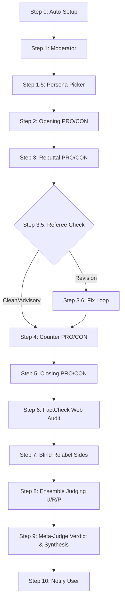

# Hệ Thống Debate Arena v2.0 (Multi-Agent Debate Competition)
*Bản mô tả chi tiết kiến trúc và quy trình hệ thống*

---

## 1. Tổng Quan Về Hệ Thống

**Debate Arena v2.0** là một hệ thống tự động sử dụng kiến trúc AI đa tác nhân (Multi-Agent) chạy trên nền tảng Claude Cowork (Anthropic) được thiết kế bởi EZLAW.

**Mục đích cốt lõi**: Khắc phục điểm yếu của các truy vấn LLM thông thường (1-shot answer thường bị giới hạn trong "prior" của mô hình). Thay vào đó, hệ thống thực hiện "stress-test" các ý tưởng, chính sách, hoặc vấn đề phức tạp qua **tranh luận có cấu trúc**, ép buộc tính đa dạng nhận thức (epistemic diversity), kiểm tra đối kháng (adversarial testing) và tổng hợp thông tin sâu sắc. Kết quả trả về cho user không chỉ là người chiến thắng mà là một tổng hợp (Synthesis) chi tiết bao gồm sự dung hòa, bất đồng và các đề xuất hành động.

**Các thông số kỹ thuật ấn tượng**:
- **10 Agents** hoạt động song song qua **11 Steps**.
- **4 Vòng tranh luận** (Rounds) với **3+1 Giám khảo** (Judges).
- Tích hợp **12 Personas** (nhân vật) và **12 Frameworks** lập luận khác nhau.
- Quản lý đánh giá với **15 Reason Codes** và kiểm soát **30 dạng ngụy biện** (Fallacies).

**Pillars Thiết Kế Cơ Bản**:
- **Filesystem-as-state**: Toàn bộ giao tiếp giữa các text agent diễn ra thông qua Markdown files lưu trong thư mục (VD: `debates/[id]/workspace/`), không sử dụng Database.
- **Parallel Independence**: Các sub-agents chạy song song nhưng độc lập tuyệt đối, không chia sẻ ngữ cảnh ngoài luồng quy định.
- **AutoTest Harness**: Vòng lặp Karpathy-style giúp tự tối ưu prompts.
- **Automation Default**: Quy trình 11 bước chạy tự động liền mạch từ đầu đến cuối một khi được kích hoạt, chỉ dừng nếu có vi phạm nghiêm trọng (escalation).

---

## 2. Kiến Trúc Các Tác Nhân (Agents)

Hệ thống điều phối 10 instances gồm các vai trò chuyên biệt sau:

### 2.1. Moderator (Người Điều Phối)
- Chuyển topic thô thành một bản tóm tắt tranh luận chuẩn (debate brief).
- Auto-detect ngôn ngữ (EN/VI).
- Format đề tài dưới dạng "This house believes that...".
- Cung cấp định nghĩa, phân chia *Shared Premises* (điểm chung) và các gánh nặng chứng minh (burdens of proof) cân bằng cho hai bên.

### 2.2. Persona Picker
- Đảm nhận việc chọn 2 nhân vật (persona) đối nghịch từ thư viện 12 nhân vật dựa trên khoảng cách framework (distance ≥ 6) để đảm bảo khác biệt nhận thức thực sự.
- Sinh ra các bài giới thiệu nhân vật nhập vai và ghi chú rõ "tại sao lại chọn cặp này".

### 2.3. Debater PRO & CON (Người Tranh Luận)
- Một prompt thiết kế duy nhất (parameterized) nhưng chạy dưới dạng 2 agents riêng biệt.
- Áp dụng nghiêm ngặt "persona voice" và thói quen đưa bằng chứng.
- Mỗi luận điểm phải rải đều các thành phần `[EVIDENCE]`, `[MECHANISM]`, `[ANTICIPATE]`, `[IMPACT]`.
- Ràng buộc độc lập: Các vòng sau chỉ được đọc brief và bài phản biện tương ứng của đối thủ, nghiêm cấm "đọc trộm" bài sắp viết của đối thủ.

### 2.4. Referee (Trọng Tài Danh Dự)
- Giám sát 8 lỗi thủ tục giữa lúc tranh luận: *Motion drift* (lạc đề), *Talking-Past* (ông nói gà bà nói vịt), *Strawman Density* (ngụy biện người rơm >30%), *Definition drift*, *Burden shifting*, v.v.
- Quyết định: Cho qua (Clean/Advisory), Bắt sửa đổi (Revision Required), hoặc Hủy lập tức (Stop).

### 2.5. FactCheck
- Kích hoạt cơ chế tìm kiếm web độc lập (Independent web search) dựa trên cấu trúc phân tầng Tier A/B/C/D của nguồn thông tin.
- Kiểm tra chéo ít nhất 3 claims mỗi bên và gắn các Reason code (cảnh báo vi phạm fact).

### 2.6. Ensemble Judges (Bộ 3 Giám Khảo)
Hệ thống sử dụng bộ 3 giám khảo giấu mặt chuyên biệt đánh giá song song, hoàn toàn Blind (được tráo nhãn `Side_A` và `Side_B`):
- **Judge U (Utilitarian)**: Chấm điểm dựa trên hệ quả thực tế, lợi ích lớn nhất cho nhiều người nhất.
- **Judge R (Rights-based)**: Đánh giá dựa trên quyền con người, nghĩa vụ cơ bản, và quy trình công bằng.
- **Judge P (Pragmatic)**: Đánh giá dưới góc độ tính khả thi về thể chế, ngân sách quy mô thực tế.

### 2.7. Meta-Judge (Siêu Giám Khảo)
- Đọc 3 lá phiếu từ ban giám khảo (blind), tìm ra điểm bất đồng trong hệ quy chiếu.
- Sau khi viết nháp, MỚI mở file ánh xạ (`_blind_mapping.md`) để biết ai là PRO/CON.
- Quyết định loại hình chiến thắng (Tuyệt đối, Đa số, hoặc Hòa do kẹt cứng).
- Viết Output giá trị nhất: **Synthesis Part VII**.

---

## 3. Quy Trình Vận Hành 11 Bước (Workflow)

**Mô tả chi tiết Vòng Tranh Luận (4 Vòng):**
1. **Opening**: 3 luận điểm khởi đầu + thiết lập hệ quy chiếu.
2. **Rebuttal**: Củng cố lý lẽ + đặt câu hỏi kiểm tra chéo (cross-exam).
3. **Counter**: Trả lời câu hỏi + phản biện ngược + mở rộng luận điểm. (Được kiểm tra bởi Referee trước đó).
4. **Closing**: Tóm tắt, nhượng bộ các luận điểm yếu (concession), và đưa bình luận chốt.

---

## 4. Hệ Thống Kiểm Soát Chất Lượng (Quality Safeguards)

Toàn bộ quá trình Debating AI được giăng các lưới kiểm soát để tự động uốn nắn hành vi "ảo giác" hoặc "lười biếng" của AI LLM:
- **Ngăn chặn Single-brain Bias**: Sử dụng ma trận khoảng cách để ép hệ thống dùng 2 mindset xa nhau nhất (VD: Chủ nghĩa tư bản lợi nhuận vs Đạo đức học xã hội).
- **Ngăn chặn Peak & Leak Info**: Workflow quản lý bằng Task Tool, việc agent rò rỉ thông tin (R00 flag) sẽ giết chết luồng chạy ngay lập tức.
- **Blind Judging**: Để chống lại thiên vị ẩn của LLM đối với phe "PRO" hoặc các luồng đạo lý phổ thông, quá trình chấm điểm là hoàn toàn mù (Random relabel A/B).
- **Synthesis Section Cốt Lõi**: Cuối cùng, user nhận được:
    - *Reconciliation*: Sự dung hòa của cả 2 góc nhìn.
    - *Residual Disagreement*: Tách biệt nhóm bất đồng do sự kiện, số liệu (Empirical) hay do hệ giá trị cốt lõi (Normative).
    - *Open Questions*: Những vấn đề mà cả 2 agents đều bỏ dở.
    - *Actionable Recommendations*: Định hướng thực tế từ Meta-Judge.

---

## Version Tracking

| Version | Date | Author | Description |
|:---|:---|:---|:---|
| v1.0 | 2026-04-10 | Antigravity | Initial synthesis research of Debate Arena v2.0 |
