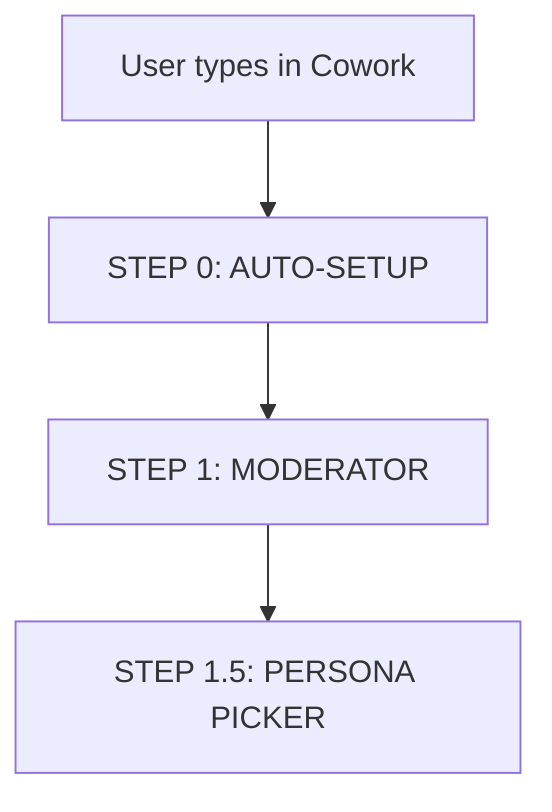

# Workflow - Part 1: Setup & Framing

## Workflow Diagram

## Chi tiết các bước

### STEP 0: AUTO-SETUP
- **Action**: Dispatcher classifies -> creates `debates/2026-04-09-001-...`
- **Output**: Saves `input.md` verbatim + `workspace/run_metadata.md`

### STEP 1: MODERATOR - Frame the debate
- **Action**: Detects language, validates substance, builds `debate_brief.md`.
- **Content**: Includes motion + definitions + shared premises + scope + burdens + clashes + forbidden moves.

### STEP 1.5: PERSONA PICKER - Assign distinct personas
- **Action**: Reads brief, selects 2 personas with framework distance ≥ 6.
- **Output**: Saves `personas.md` with both characters in-character intros.

---

## Version Tracking

| Version | Date | Author | Description |
|:---|:---|:---|:---|
| v1.0 | 2026-04-10 | Antigravity | Initial transcription from s1.jpg |
