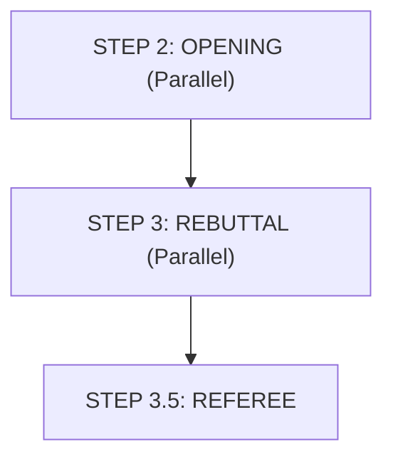

# Workflow - Part 2: Opening & Rebuttal

## Workflow Diagram

## Chi tiết các bước

### STEP 2: OPENING
- **Parallel sub-agents (Task tool)**: PRO || CON
- **Content**: 3 args + thesis + framework + `verified_facts`.

### STEP 3: REBUTTAL
- **Parallel**: each side reads only opponent's opening.
- **Content**: Steel-man + cross-exam Qs.

### STEP 3.5: REFEREE - Procedural check
- **Action**: 8 checks (motion drift, strawman density, definition drift, independence, persona consistency, cross-exam quality, burden shifting).
- **Severity Classification**:
    - **CLEAN**
    - **ADVISORY**
    - **REVISION_REQUIRED**
    - **STOP**

---

## Version Tracking

| Version | Date | Author | Description |
|:---|:---|:---|:---|
| v1.0 | 2026-04-10 | Antigravity | Initial transcription from s2.jpg |
