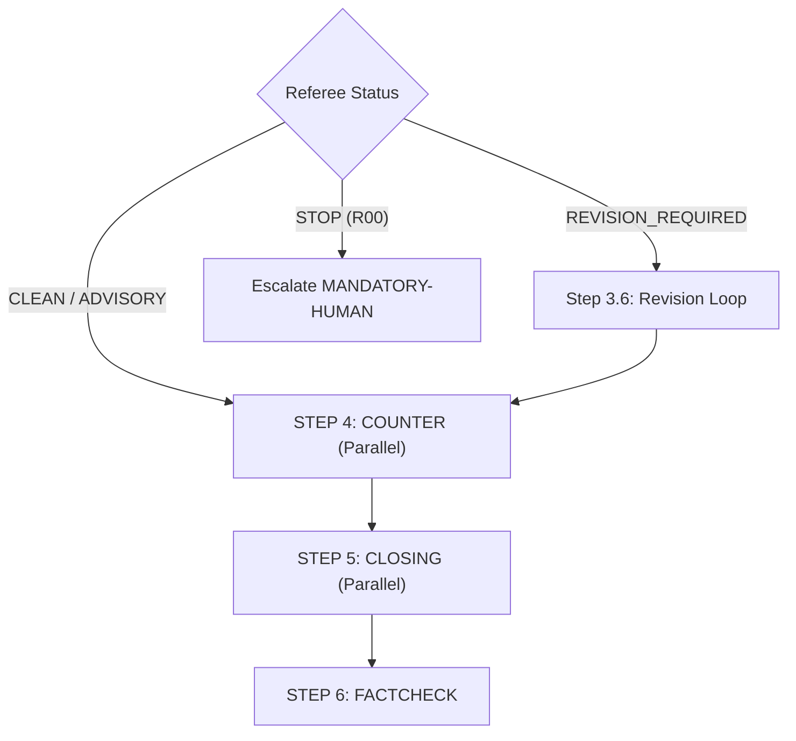

# Workflow - Part 3: Counter, Closing & FactCheck

## Workflow Diagram

## Chi tiết các bước

### STEP 4: COUNTER
- **Parallel**: answers + counter-rebuttal + extension.
- **Sides**: PRO || CON

### STEP 5: CLOSING
- **Parallel**: closing summary + final statement.
- **Sides**: PRO || CON

### STEP 6: FACTCHECK - Independent web search audit
- **Action**: Tier A/B/C/D source hierarchy.
- **Output**: `claims_audit[]` per side, spot-check ≥ 3 claims/side, Reason Code flags.

---

## Version Tracking

| Version | Date | Author | Description |
|:---|:---|:---|:---|
| v1.0 | 2026-04-10 | Antigravity | Initial transcription from s4.jpg |
