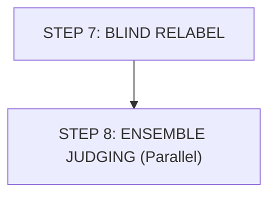

# Workflow - Part 4: Relabel & Ensemble Judging

## Workflow Diagram

## Chi tiết các bước

### STEP 7: BLIND RELABEL - Orchestration only
- **Action**: Random 50/50: `pro_*.md` ↔ `side_a_*.md` / `side_b_*.md`.
- **Security**: Mapping SEALED in `_blind_mapping.md`.

### STEP 8: ENSEMBLE JUDGING
- **Parallel x 3**: judges read only `side_a`/`side_b`.
- **Frameworks**:
    - **Judge U**: Utilitarian framework lens.
    - **Judge R**: Rights-based framework lens.
    - **Judge P**: Pragmatic framework lens.
- **Output**: Each writes scorecard + verdict by own framework.

---

## Version Tracking

| Version | Date | Author | Description |
|:---|:---|:---|:---|
| v1.0 | 2026-04-10 | Antigravity | Initial transcription from s7.jpg |
