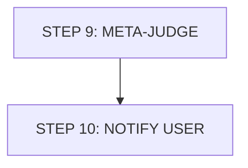

# Workflow - Part 5: Meta-Judge & Notification

## Workflow Diagram

## Chi tiết các bước

### STEP 9: META-JUDGE - Aggregate, reveal, synthesize
1.  **Read ballots**: Read 3 ballots (still blind).
2.  **Combine**: Compile mean + variance scorecard.
3.  **Drafting**: Write Parts I-V using Side A/B labels.
4.  **Reveal**: **NOW** open `_blind_mapping.md`, reveal sides.
5.  **Final Summary**: Write Part VI Verdict + Part VII SYNTHESIS.
    -   **A. Reconciliation**
    -   **B. Residual Disagreement** (empirical vs normative)
    -   **C. Open Questions**
    -   **D. Actionable Recommendations**

### STEP 10: NOTIFY USER
- **Action**: Print final summary + path to `verdict_report.md`.
- **Status**: Pipeline complete. User reads output.

---

## Version Tracking

| Version | Date | Author | Description |
|:---|:---|:---|:---|
| v1.0 | 2026-04-10 | Antigravity | Initial transcription from s9.jpg |
