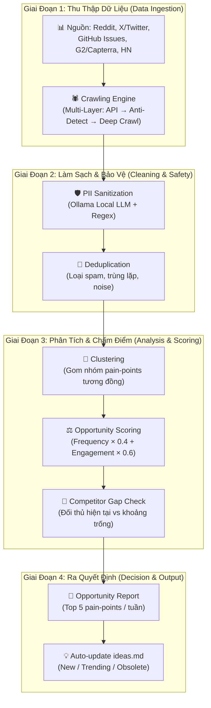
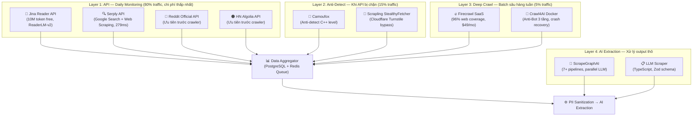

# Hệ Thống Tự Động Phát Hiện Nhu Cầu Thị Trường (Automated Pain-Point Discovery System)

> **Mục tiêu**: Xây dựng một hệ thống thu thập và xử lý dữ liệu tự động để phát hiện các "nỗi đau" (pain-points) trên mạng xã hội và cộng đồng kỹ thuật, từ đó gợi ý các giải pháp Micro-SaaS tiềm năng cho Solo Builder.
> **Triết lý**: "Đi tìm vàng" (Gold Mining) — chỉ tập trung vào những nhu cầu đã được chứng minh là có người sẵn sàng trả tiền, nhưng giải pháp hiện tại quá đắt hoặc phức tạp.
> **Nguyên tắc**: Không đo lường được thì không quản lý & tối ưu được — mọi thành phần đều phải có metric rõ ràng.

---

## 1. Kiến Trúc Hệ Thống Tổng Quan

Hệ thống vận hành theo pipeline 4 giai đoạn xuyên suốt. Mỗi giai đoạn có input/output rõ ràng và metric đo lường riêng.



**Điểm mấu chốt của pipeline**:
- Dữ liệu đi **một chiều** từ trái sang phải, không có vòng lặp phức tạp.
- **PII Sanitization** được đặt ngay sau Ingestion (trước khi data chạm Cloud LLM) — đây là yêu cầu bắt buộc về GDPR/CCPA.
- **Scoring** diễn ra SAU khi clustering, tránh chấm điểm cho noise data.

---

## 2. Kho Vũ Khí: 15 Công Cụ Thu Thập Dữ Liệu

Tổng hợp 15 công cụ đã nghiên cứu và **xác minh source code** (clone về `/oss`), phân thành 4 nhóm theo chức năng.

### 2.1. Nhóm A: Browser Engines — Động Cơ Headless Thế Hệ Mới

| Công cụ | Ngôn ngữ | Đặc điểm nổi bật | Anti-Bot | Tốc độ | RAM | Giá | Trạng thái Verify |
|:---|:---|:---|:---|:---|:---|:---|:---|
| **Lightpanda** | Zig | Rebuild từ đầu, KHÔNG dựa trên Chromium/WebKit/Blink. Hỗ trợ CDP → tương thích Puppeteer/Playwright. Native MCP Server. | ⚠️ Không có built-in | **9x nhanh hơn** Chrome (5s vs 46s) | **~123MB** (vs 2GB Chrome, giảm ~16x) | Open-source | ✅ Verified — **Beta**, CORS chưa implement (#2015). Không dùng cho trang có anti-bot. |
| **Camoufox** | Firefox (fork) | Anti-detect ở cấp C++ source code. Spoof: `navigator.hardwareConcurrency`, WebGL, Canvas, AudioContext, WebRTC — trước khi JS chạy. Có hệ sinh thái `camofox-mcp` + `camofox-browser` (REST API). | ✅ **Cấp C++ gốc** | Tương đương Firefox | Tương đương Firefox | Open-source | ✅ Verified — Tên chính xác upstream: **Camoufox** (daijro/camoufox). Các repo `camofox-*` là wrapper bên thứ ba. |

### 2.2. Nhóm B: SaaS Crawling APIs — Dịch Vụ API Thương Mại

| Công cụ | Loại | Bypass Anti-Bot | Quy mô | Giá |
|:---|:---|:---|:---|:---|
| **Firecrawl** | SaaS API | ✅ Tự động (96% web coverage), smart proxy management | Hàng triệu trang (Scale plan) | Từ $49/tháng |
| **Jina Reader** | SaaS API | ⚠️ Không chủ động bypass — tôn trọng kết quả chặn của website | ~4000 concurrent req, 10M token miễn phí | 10M token free khi tạo key |
| **Bright Data** | Enterprise SaaS | ✅ Unstoppable browsing, 400M+ IPs trên 195 quốc gia | Enterprise scale | Từ $1/1k requests |
| **ScraperAPI** | SaaS API | ✅ Auto proxy + CAPTCHA, 40M+ proxy tại 50+ quốc gia | 11 tỷ requests/tháng | Từ $49/tháng |
| **Serply** | SaaS API | ✅ NEVER GET BLOCKED BY CAPTCHA, 279ms response time | Hàng trăm triệu requests | Không công khai |
| **Zenscrape** | SaaS API | ✅ Auto-detect Cloudflare/CAPTCHA/DDoS, intelligent proxy rotation | Hàng triệu requests/ngày | Từ $59/tháng |
| **ZenRows** | SaaS API | ✅ 99.93% success rate, Cloudflare/Akamai/WAF bypass | Quy mô lớn ("at scale") | Không công khai |

### 2.3. Nhóm C: Open-Source Libraries — Thư Viện Mã Nguồn Mở

| Công cụ | Ngôn ngữ | Đặc điểm nổi bật | Anti-Bot | MCP | Giá | Trạng thái Verify |
|:---|:---|:---|:---|:---|:---|:---|
| **Crawl4AI** | Python | Stealth browser, CapSolver, LLMExtractionStrategy, Browser Pool, `arun_many()` batch. **Anti-Bot 3 tầng** (v0.8.5+), Shadow DOM Flattening, Deep Crawl Crash Recovery (`resume_state`), Prefetch Mode (5-10x faster). | ✅ Stealth + CapSolver + 3-tier detection | ✅ MCP Server | Open-source | ✅ Verified — **⚠️ BẮT BUỘC v0.8.6+** (vá RCE + supply chain). 50k+ stars. |
| **Scrapling** | Python | Smart Element Tracking, StealthyFetcher (Cloudflare bypass), ~784x nhanh hơn BS4. **Spider Framework** (Scrapy-like, concurrent, pause/resume), ProxyRotator, DNS Leak Prevention (DoH), CLI Shell. | ✅ StealthyFetcher | ✅ MCP Server | Open-source | ✅ Verified — Cần `pip install "scrapling[fetchers]"` + `scrapling install`. |
| **ScrapeGraphAI** | Python | 7+ pipeline (SmartScraperGraph, SearchGraph, SpeechGraph...), tích hợp Langchain/LlamaIndex/CrewAI. Gọi LLM song song, đa model. | ⚠️ Playwright only | ✅ MCP Server | Open-source | Chưa clone verify |
| **LLM Scraper** | TypeScript | 6 chế độ đầu vào (html, raw_html, markdown, text, image, custom). Zod/JSON Schema extraction. Streaming. | ⚠️ Playwright only | ❌ | Open-source | Chưa clone verify |
| **AutoScraper** | Python | ML — học quy tắc scrape từ ví dụ, áp dụng cho URL mới. Lưu/tải mô hình tái sử dụng. | ❌ | ❌ | Open-source | Chưa clone verify |

### 2.4. Ma Trận So Sánh Toàn Diện (15 Công Cụ)

| Tiêu chí | **Lightpanda** | **Camoufox** | **Firecrawl** | **Jina Reader** | **Bright Data** | **ScraperAPI** | **Serply** | **Zenscrape** | **ZenRows** | **Crawl4AI** | **Scrapling** | **ScrapeGraphAI** | **LLM Scraper** | **AutoScraper** |
|:---|:---|:---|:---|:---|:---|:---|:---|:---|:---|:---|:---|:---|:---|:---|
| **Loại** | Browser Engine | Anti-Detect Browser | SaaS API | SaaS API | Enterprise SaaS | SaaS API | SaaS API | SaaS API | SaaS API | Open-source Lib | Open-source Lib | Open-source Lib | Open-source Lib | Open-source Lib |
| **Bypass Anti-Bot** | ⚠️ Không built-in | ✅ **Cấp C++** (canvas, WebGL, AudioContext, WebRTC) | ✅ 96% web coverage | ⚠️ Không chủ động | ✅ 400M+ IPs, unstoppable | ✅ Auto proxy + CAPTCHA | ✅ NEVER BLOCKED | ✅ Cloudflare/CAPTCHA | ✅ 99.93% success | ✅ Stealth + CapSolver + 3-tier | ✅ StealthyFetcher + ProxyRotator | ⚠️ Playwright only | ⚠️ Playwright only | ❌ |
| **JS Rendering** | ✅ CDP (Puppeteer/Playwright) | ✅ Full Firefox engine | ✅ Smart wait | ⚠️ Hạn chế | ✅ Remote stealth browser | ✅ Headless Chrome | ✅ Full render | ✅ Full render | ✅ Full render | ✅ Browser pool | ✅ DynamicFetcher (Playwright) | ✅ Playwright | ✅ Playwright | ❌ |
| **Quy mô** | 100 trang = 5s, 123MB | Session isolation, proxy/GeoIP | Hàng triệu trang | ~4000 concurrent req | 400M+ IPs, 195 quốc gia | 11 tỷ req/tháng | 279ms avg response | Hàng triệu req/ngày | "At scale" | Browser Pool, `arun_many()` | Spider Framework, pause/resume | 7+ pipelines, parallel LLM | 6 formats, streaming | ML-based, reusable models |
| **LLM Integration** | ✅ Native MCP | ✅ camofox-mcp (3rd party) | ✅ JSON/Markdown | ✅ ReaderLM-v2 + MCP | ✅ Bright Data MCP | ✅ LangChain | ❌ (JSON output) | ❌ (REST API) | ❌ (API only) | ✅ LLMExtraction + MCP | ✅ MCP Server | ✅ MCP Server | ✅ Zod/JSON Schema | ❌ (ML only) |
| **Crash Recovery** | ❌ | ❌ | ❌ | ❌ | ❌ | ❌ | ❌ | ❌ | ❌ | ✅ `resume_state` + callbacks | ✅ `crawldir` checkpoint | ❌ | ❌ | ❌ |
| **Tốc độ** | **9x nhanh hơn Chrome** | Tương đương Firefox | Fast (smart proxy) | Fast (ReaderLM-v2) | Enterprise grade | Async scraper | **279ms** | Concurrent 10-100 req | Enterprise grade | Async, Browser Pool | Async + Streaming | Fast (parallel LLM) | Streaming objects | ML learning time |
| **RAM Usage** | **~123MB** (giảm 16x) | Tương đương Firefox | Zero local (API) | Zero local (API) | Zero local (API) | Zero local (API) | Zero local (API) | Zero local (API) | Zero local (API) | Depends on Docker | Low (Python lib) | Depends on LLM | Low (Playwright) | Very low (Python) |
| **Chi phí** | Miễn phí | Miễn phí | Từ $49/tháng | 10M token free | Từ $1/1k req | Từ $49/tháng | Không công khai | Từ $59/tháng | Không công khai | Miễn phí (self-host) | Miễn phí (self-host) | Miễn phí (self-host) | Miễn phí (self-host) | Miễn phí (self-host) |
| **Phù hợp nhất** | Engine nhanh cho trang không bảo vệ | Anti-detect bypass Google/Cloudflare | Production quy mô lớn | Daily monitoring, AI pipeline | Enterprise cực lớn | Startup, chi phí hợp lý | Google Search tốc độ cao | Startup, concurrent | Anti-bot khó nhất | Deep crawl + AI extraction | Full crawl framework + stealth | AI extraction pipeline | TypeScript type-safe | ML pattern learning |

---

## 3. Kiến Trúc Crawling Multi-Layer

**Nguyên lý**: Không dùng 1 tool cho mọi việc. Phân tầng theo mức độ khó và chi phí — ưu tiên giải pháp rẻ/nhanh trước, chỉ leo thang khi thất bại.



### Chiến lược sử dụng từng Layer & cơ chế leo thang tự động:

**🥇 Layer 1 — Daily Monitoring (Chi phí thấp nhất, chạy mỗi ngày)**
*   **Reddit Official API + HN Algolia API**: **Ưu tiên xử dụng trước bất kỳ crawler nào** — miễn phí, hợp pháp, không lo bị ban. Reddit API cho phép search posts/comments, HN Algolia cho phép full-text search.
*   **Jina Reader API**: Cron job quét các trang chưa có API (G2 listings, blog posts). 10M token miễn phí — đủ cho giai đoạn đầu.
*   **Serply API**: Google Search monitoring — theo dõi keyword trends, 279ms response time.
*   **Cơ chế leo thang**: Nếu response trả về 403/429/Cloudflare challenge → tự động chuyển URL đó sang hàng đợi Layer 2.

**🥈 Layer 2 — Anti-Detect Browsers (Khi Layer 1 thất bại)**
*   **Camoufox**: Firefox fork với anti-detect ở cấp C++ source code — spoofing Canvas, WebGL, AudioContext, WebRTC trước khi JS chạy. Dùng cho các trang có Cloudflare Enterprise.
*   **Scrapling StealthyFetcher**: Bypass Cloudflare Turnstile/Interstitial tự động, DNS Leak Prevention qua DoH. Kết hợp ProxyRotator cho residential proxy rotation.
*   **⚠️ Lightpanda KHÔNG nằm ở Layer này** (verify source xác nhận: không có anti-bot built-in). Lightpanda chỉ phù hợp làm engine nhanh cho các trang không bảo vệ hoặc xử lý nội bộ (vd: render HTML thô từ Layer 1 thành DOM để parse).

**🥉 Layer 3 — Deep Crawling (Batch hàng tuần)**
*   **Firecrawl SaaS**: Batch crawl G2/Capterra để lấy review 2-3 sao. 96% web coverage, smart proxy tự quản.
*   **Crawl4AI Docker**: Self-hosted cho các trường hợp cần CAPTCHA solver, Shadow DOM Flattening, hoặc deep crawl với crash recovery (`resume_state`). **Bắt buộc v0.8.6+** (vá RCE + supply chain).

**🧠 Layer 4 — AI Extraction (Xử lý output thô thành structured data)**
*   **ScrapeGraphAI**: 7+ pipeline, gọi LLM song song, tích hợp Langchain/LlamaIndex. Dùng để extract pain-points từ raw text.
*   **LLM Scraper**: TypeScript project — 6 format đầu vào, Zod schema extraction. Dùng khi cần type-safe output cho Node.js pipeline.
*   **AutoScraper**: ML backup — học pattern từ ví dụ, áp dụng cho URL mới có cấu trúc tương tự mà không cần LLM.

---

## 4. Pipeline Xử Lý & Chấm Điểm (Processing & Scoring Engine)

Dữ liệu thô sau khi thu thập (Section 3) đi qua pipeline xử lý thống nhất:

### 4.1. Làm sạch & Bảo vệ quyền riêng tư (Bắt buộc — trước mọi bước khác)

| Bước | Công cụ | Mục đích | Rủi ro nếu bỏ qua |
|:---|:---|:---|:---|
| **Regex PII Pre-filter** | Python regex patterns | Lọc email, SĐT, tên người dùng rõ ràng | Vi phạm GDPR/CCPA, bị Cloud LLM từ chối xử lý |
| **Ollama PII Scrubber** | Ollama local (Qwen2.5 / Phi-3) | Phát hiện PII ngữ cảnh (tên trong câu, địa chỉ) | Rò rỉ PII qua Cloud API → rủi ro pháp lý |
| **Deduplication** | Cosine similarity (Vector DB) | Gộp comment trùng lặp, loại spam/bot | Scoring Engine bị thổi phồng số liệu giả |

**Pipeline**: `Raw Data → Regex Filter → Ollama Scrubber (local) → Dedup → Sanitized Data`

### 4.2. Clustering & Scoring (Chấm điểm cơ hội)

**Bước 1 — Clustering**: Gom nhóm các pain-points tương đồng bằng Vector DB (ChromaDB/Qdrant).
- Ví dụ: 50 user phàn nàn "Datadog quá đắt" + 30 user phàn nàn "Datadog setup phức tạp" → 2 cluster: `Datadog_Pricing`, `Datadog_Complexity`.

**Bước 2 — Scoring**: Mỗi cluster được chấm điểm theo công thức:

```
Opportunity Score = (Frequency × 0.4) + (Engagement_Score × 0.6)
```

| Chỉ Số | Định Nghĩa | Cách Tính | Trọng Số |
|:---|:---|:---|:---|
| **Frequency** | Số lượng accounts riêng biệt cùng phàn nàn 1 vấn đề | Đếm unique usernames/accounts trong cluster | 40% |
| **Engagement** | Mức độ cộng đồng đồng cảm | Tổng Upvotes + Replies + Likes trên các bài post trong cluster | 60% |

**Bước 3 — Competitor Gap Check**: LLM tự động tìm kiếm (qua Serply/Google Search) xem đã có giải pháp nào giải quyết pain-point này chưa:
- Nếu **chưa có** → Gap rất lớn → "Blue Ocean"
- Nếu **có nhưng đắt/phức tạp** → Gap vừa → "Better/Cheaper Alternative"
- Nếu **có và miễn phí/tốt** → Loại bỏ khỏi danh sách

**Ngưỡng quyết định**: Chỉ đưa vào "Nên code" khi:
- `Frequency ≥ 50` accounts riêng biệt cùng phàn nàn
- `Engagement ≥ 200` (tổng upvotes + replies)
- `Competitor Gap ≠ "Đã giải quyết tốt"`

### 4.3. Output — Opportunity Report (Báo cáo tự động hàng tuần)

Hệ thống tự động sinh report chứa:
1. **Top 5 Pain Points** xếp theo Opportunity Score giảm dần.
2. Mỗi pain-point kèm: tóm tắt cluster, 3 quote mẫu từ user, danh sách đối thủ hiện tại, gợi ý MVP tối giản.
3. **Auto-sync vào `ideas.md`**: 
   - Pain-point mới đạt ngưỡng → tạo ý tưởng Micro-SaaS mới (tag `[NEW]`).
   - Pain-point trending tăng 2 tuần liên tiếp → tag `[TRENDING]`.
   - Ý tưởng cũ không còn xuất hiện trong data 4 tuần → tag `[OBSOLETE]`.

---

## 5. Yêu Cầu An Toàn & Vận Hành (Safety & Operations)

Các yêu cầu này KHÔNG phải "nice to have" — chúng là **điều kiện tiên quyết** để hệ thống chạy liên tục mà không gây sự cố.

### 5.1. 🔒 Container Isolation & Resource Limits

**Rủi ro**: Headless browser engines tự động spawn sub-processes render DOM. Script lỗi hoặc trang web độc hại kích hoạt hàng trăm processes, nhai cạn RAM trong vài phút.

**Giải pháp bắt buộc**:
```bash
# Mọi Headless engine (Crawl4AI, Camoufox) PHẢI chạy trong Docker với hard-limit
docker run \
  --shm-size=1g \
  --memory=2g \
  --cpus=2 \
  --security-opt=no-new-privileges \
  --user=1000:1000 \
  crawl4ai:v0.8.6

# Health check tự restart khi treo
HEALTHCHECK --interval=30s --timeout=10s --retries=3 \
  CMD curl -f http://localhost:11235/health || exit 1
```

### 5.2. 🛡️ PII Sanitization (Chi tiết ở Section 4.1)

**Pipeline bắt buộc**: `Raw Data → Regex → Ollama Local → Cloud LLM`. Không bao giờ gửi raw comment trực tiếp lên OpenAI/Anthropic.

### 5.3. 🔄 Crash Recovery

| Công cụ | Cơ chế | Cách sử dụng |
|:---|:---|:---|
| **Crawl4AI** | `resume_state` + `on_state_change` callback | Persist state vào Redis sau mỗi URL. Restart: truyền `resume_state=saved_state`. |
| **Scrapling** | `crawldir="./crawl_data"` | Tự động checkpoint. Ctrl+C graceful shutdown. Restart resume tự động. |
| **Backup** | Dual-write | Lưu checkpoint cả local disk + Redis, phòng Redis sập. |

### 5.4. ⚖️ Rate Limiting & Ethical Crawling

| Nguồn | Chiến lược ưu tiên | Rate Limit | Proxy |
|:---|:---|:---|:---|
| **Reddit** | ✅ **Official API trước** (miễn phí, hợp pháp) | 60 req/phút (API limit) | Không cần |
| **Hacker News** | ✅ **HN Algolia API trước** (miễn phí) | Không giới hạn rõ | Không cần |
| **G2/Capterra** | Zenscrape SaaS hoặc Firecrawl | 1 req/5s | Residential proxy bắt buộc |
| **X/Twitter** | Scraper chỉ khi API quá đắt | 1 req/3s | Residential proxy |
| **GitHub Issues** | ✅ **GitHub API trước** (5000 req/giờ) | 5000 req/giờ | Không cần |

**Nguyên tắc**: Tuân thủ `robots.txt` (Lightpanda: `--obey-robots`, Scrapling: `robots_txt_obey=True`). **Không bao giờ dùng datacenter proxy** cho các nguồn nhạy cảm — chỉ residential.

### 5.5. 📊 Monitoring & Alerting

**Công cụ chính**: Crawl4AI v0.7.7+ có built-in Monitoring Dashboard (`/dashboard`) + Monitor API + WebSocket streaming.

| Metric | Mục tiêu | Alert khi |
|:---|:---|:---|
| Success rate / source | > 95% | < 80% |
| Avg response time / layer | < 5s (L1), < 30s (L2), < 60s (L3) | Vượt 2x target |
| Container memory usage | < 1.5GB | > 1.8GB |
| Container restarts / giờ | 0 | > 3 |
| New pain-points / tuần | > 10 | < 3 (hệ thống có thể bị chặn) |

**Alert channel**: Telegram Bot notification.

---

## 6. Ước Tính Chi Phí Vận Hành Hàng Tháng

> *Tuân thủ nguyên tắc: Không đo lường được → không quản lý & tối ưu được.*

| Hạng mục | Công cụ | Chi phí / tháng | Ghi chú |
|:---|:---|:---|:---|
| **Layer 1 — Daily APIs** | Jina Reader (free tier) | $0 | 10M tokens/tháng, đủ cho MVP |
| | Serply API | ~$29 | Gói starter |
| **Layer 2 — Anti-Detect** | Camoufox + Scrapling (self-host) | $0 | Open-source, chạy trên VPS sẵn có |
| **Layer 3 — Deep Crawl** | Firecrawl | $49 | Gói Growth |
| | Crawl4AI (Docker self-host) | $0 | Open-source |
| **Proxy** | Residential Proxy (DataImpulse/Evomi) | ~$20 | ~40GB bandwidth/tháng |
| **Infrastructure** | VPS (4 vCPU, 8GB RAM) | ~$40 | Chạy Docker containers + PostgreSQL + Redis |
| **LLM Processing** | Ollama local (PII scrub) | $0 | Chạy trên VPS |
| | Cloud LLM (AI extraction khi cần) | ~$15 | GPT-4o-mini, ~500k tokens/tháng |
| **TỔNG** | | **~$153/tháng** | **Giai đoạn MVP** |

**ROI kỳ vọng**: Nếu hệ thống phát hiện được 1 ý tưởng Micro-SaaS khả thi mỗi quý (doanh thu $500-$2000/tháng), chi phí vận hành $153/tháng có payback time < 1 quý.

---

## 7. Lộ Trình Triển Khai (Implementation Roadmap)

### Phase 1: Core Infrastructure — Tuần 1-2

**Mục tiêu**: Hệ thống thu thập chạy được end-to-end (dù thô sơ), output ra file Markdown.

| Task | Công cụ | Deliverable | Metric đo |
|:---|:---|:---|:---|
| Setup Docker Compose | Crawl4AI v0.8.6 + Ollama + PostgreSQL + Redis | `docker-compose.yml` chạy được | Containers healthy |
| Cron job Layer 1 | Reddit API + HN Algolia API + Jina Reader | Script Python chạy mỗi 6h | > 500 data points / ngày |
| PII Sanitization | Ollama (Qwen2.5) + Regex | Pipeline local hoạt động | 0 PII leak qua Cloud |
| Data storage | PostgreSQL schema | Bảng `raw_data`, `cleaned_data` | Query time < 100ms |

### Phase 2: Scoring + AI Pipeline — Tuần 3-4

**Mục tiêu**: Hệ thống tự động chấm điểm và xuất Opportunity Report.

| Task | Công cụ | Deliverable | Metric đo |
|:---|:---|:---|:---|
| Vector DB setup | ChromaDB hoặc Qdrant | Clustering pipeline | Silhouette score > 0.5 |
| Scoring Engine | Python script | `Opportunity Score` cho mỗi cluster | Top 5 report hàng tuần |
| Competitor Check | Serply API + LLM | Gap analysis tự động | Accuracy > 80% |
| Auto-sync ideas.md | Python script | Tag `[NEW]`/`[TRENDING]`/`[OBSOLETE]` | ideas.md cập nhật mỗi tuần |

### Phase 3: Anti-Detect & Deep Crawl — Tuần 5-6

**Mục tiêu**: Mở rộng nguồn dữ liệu sang các trang bảo vệ chặt (G2, X/Twitter).

| Task | Công cụ | Deliverable | Metric đo |
|:---|:---|:---|:---|
| Layer 2 setup | Camoufox + Scrapling StealthyFetcher | Anti-detect fallback hoạt động | Success rate > 90% cho G2 |
| Layer 3 setup | Firecrawl SaaS | Batch crawl G2/Capterra reviews | > 1000 reviews / tuần |
| Auto-escalation | Python middleware | Tự động chuyển URL thất bại từ L1 → L2 → L3 | Escalation rate < 20% |
| Rate limiting | Built-in + custom | robots.txt compliance | 0 IP bans |

### Phase 4: Monitoring & Full Automation — Tháng 2+

**Mục tiêu**: Hệ thống chạy hoàn toàn tự động, tự giám sát, tự báo cáo.

| Task | Công cụ | Deliverable | Metric đo |
|:---|:---|:---|:---|
| Monitoring Dashboard | Crawl4AI built-in + custom | Dashboard realtime | All metrics visible |
| Telegram Alerts | Bot API | Alert khi anomaly | Response time < 5 phút |
| Weekly Report Generator | LLM + template | Email/Telegram report tự động | Report gửi đúng giờ mỗi tuần |
| Feedback loop | Manual review | Đánh giá accuracy của Scoring Engine | Precision > 70% |

---

## Version Tracking

| Version | Date | Author | Description |
| :--- | :--- | :--- | :--- |
| 1.0.0 | 2026-04-20 | Antigravity | Khởi tạo hệ thống. Định nghĩa kiến trúc 3 lớp, nguồn dữ liệu chính, bộ lọc điểm số và lộ trình triển khai. |
| 2.0.0 | 2026-04-20 | Antigravity | Loại bỏ bước Manual Validation. Tích hợp giải pháp Crawling quy mô lớn để tự động hóa 100% quy trình thu thập. |
| 3.0.0 | 2026-04-20 | Antigravity | Nghiên cứu sâu 7 AI-Native Crawling Services. Thiết kế Multi-Layer Architecture. Tích hợp MCP Server cho AI Agent. |
| 4.0.0 | 2026-04-20 | Antigravity | Nghiên cứu bổ sung 8 công cụ mới (Lightpanda, Camoufox, Scrapling, ScrapeGraphAI, LLM Scraper, AutoScraper, ZenRows). Ma trận so sánh 15 công cụ. Thiết kế lại Multi-Layer 4 lớp. |
| 5.0.0 | 2026-04-21 | Antigravity | Clone & verify source code OSS (Lightpanda, Camoufox, Crawl4AI v0.8.5+, Scrapling). Phát hiện năng lực mới. Bổ sung 5 đề xuất an toàn triển khai. Cảnh báo bảo mật Crawl4AI RCE + supply chain. |
| 6.0.0 | 2026-04-21 | Antigravity | **Tái cấu trúc toàn diện**: (1) Sửa mâu thuẫn kiến trúc "3 lớp" vs "4 layer" → thống nhất pipeline 4 giai đoạn. (2) Chuyển Lightpanda ra khỏi Layer Anti-Detect (verify không có anti-bot) → đúng vị trí. (3) Tích hợp PII Sanitization vào pipeline chính thay vì phụ lục. (4) Hợp nhất Scoring + AI Processing thành pipeline liền mạch với 3 bước rõ ràng (Cluster → Score → Gap Check). (5) Ưu tiên Official API (Reddit, HN, GitHub) trước crawler trong kiến trúc Layer 1. (6) Bổ sung bảng ước tính chi phí vận hành ($153/tháng MVP). (7) Tái thiết kế Roadmap thành 4 phase với metric đo lường cụ thể cho từng task. (8) Bổ sung ngưỡng quyết định định lượng (Frequency ≥ 50, Engagement ≥ 200). |
