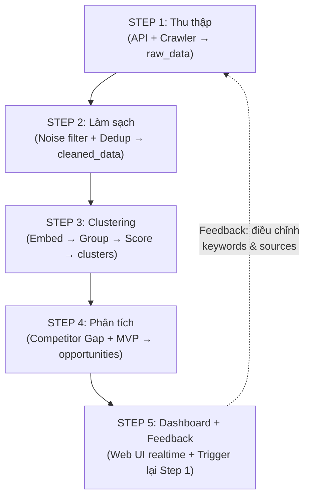
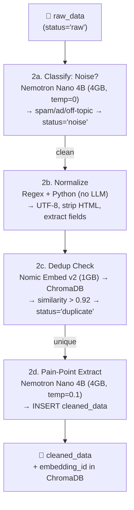
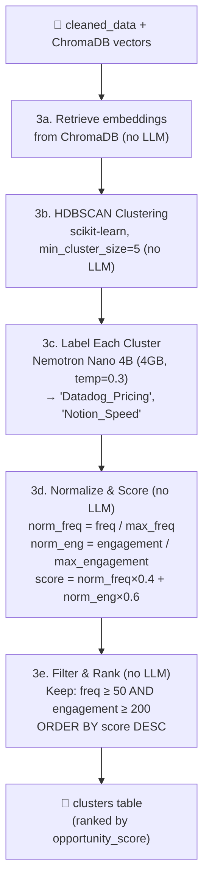
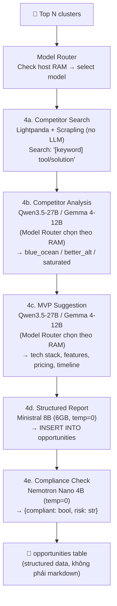
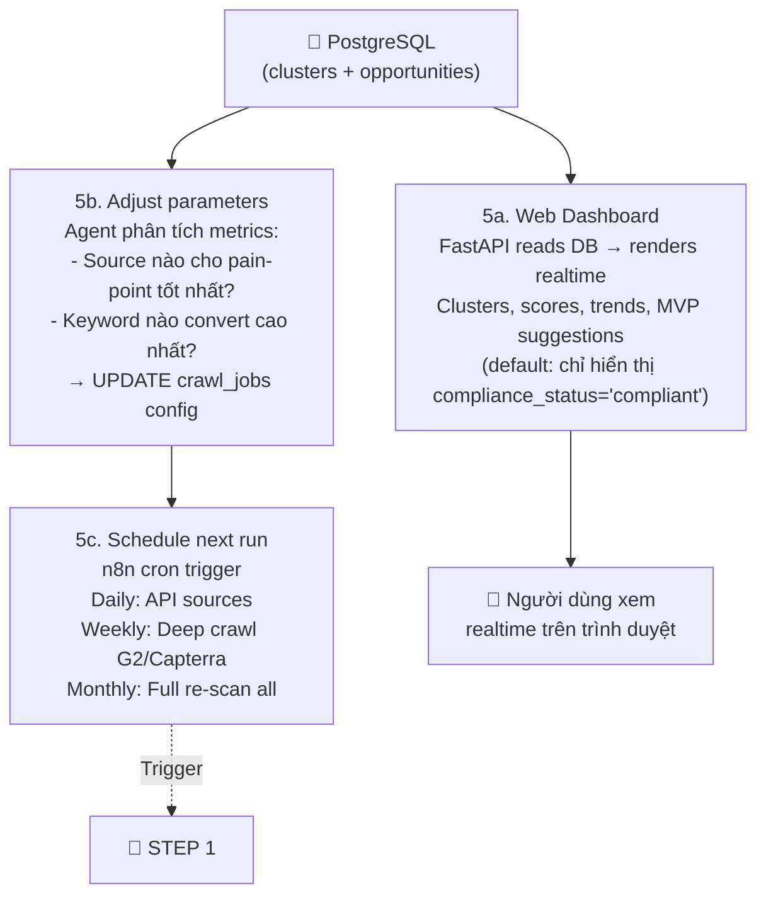
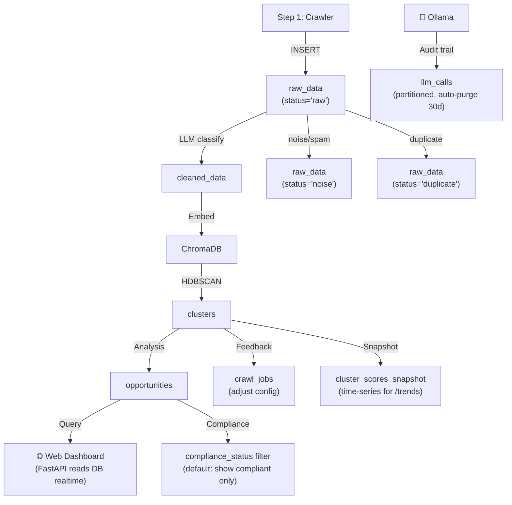
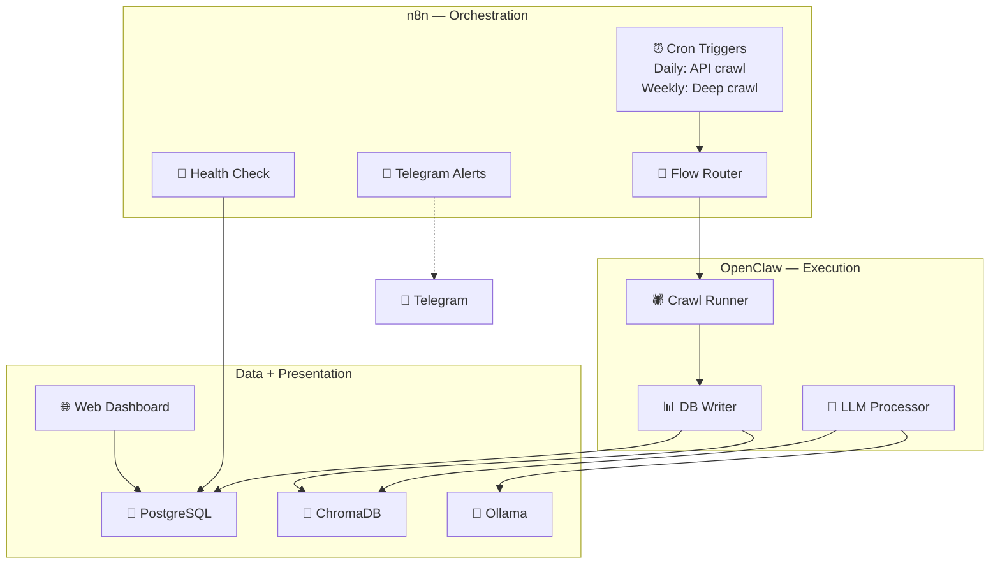

# Hệ Thống Tự Động Phát Hiện Nhu Cầu Thị Trường (Automated Pain-Point Discovery System)

> **Mục tiêu**: Xây dựng hệ thống local-first, vận hành hoàn toàn bởi AI Agent, tự động phát hiện "nỗi đau" (pain-points) từ cộng đồng toàn cầu và gợi ý ý tưởng Micro-SaaS.
> **Triết lý**: Ưu tiên giải pháp miễn phí, crawling chủ động, chạy trên máy local — tối thiểu phụ thuộc bên ngoài.
> **Nguyên tắc**: Không đo lường được thì không quản lý & tối ưu được.
> **Constraint**: Toàn bộ data lưu trữ trong Database (PostgreSQL + ChromaDB). Báo cáo và insights hiển thị realtime qua Web Dashboard. Không tự động sinh file định kỳ. Export file chỉ khi user chủ động request.
> **Note**: Jina Reader (free 10M tokens) + residential proxy (~$20/tháng) là 2 ngoại lệ duy nhất, chỉ dùng khi crawler bị chặn hoàn toàn.

---

## 1. Pipeline: 5 Bước End-to-End

Đây là phần cốt lõi: hệ thống chạy 5 bước tuần tự, mỗi bước có input/output/tools/LLM rõ ràng. AI Agent (OpenClaw + n8n) thực thi tự động. Mọi data persist qua DB. Kết quả hiển thị realtime trên Web Dashboard.



---

### STEP 1: Thu Thập Dữ Liệu Thô

**Input**: Keywords + danh sách sources → **Output**: `INSERT INTO raw_data`
**LLM**: Không cần — bước thu thập thuần túy. Job tracking qua bảng `crawl_jobs`.

```mermaid
graph TD
    subgraph "1a. Official APIs — Ưu tiên cao nhất"
        Reddit["🔴 Reddit API<br/>Keywords: 'alternative to', 'frustrated with',<br/>'too expensive', 'wish it could'<br/>Subs: r/SaaS, r/webdev, r/startups"]
        HN["🟠 HN Algolia API<br/>'Ask HN: pain point',<br/>'what tool do you pay for'"]
        GitHub["⚫ GitHub API<br/>is:issue label:enhancement<br/>'wish it could', 'too complex'"]
        PH["🟧 ProductHunt API<br/>New launches, review comments"]
        SO["📦 Stack Overflow API<br/>Trending questions, unanswered"]
    end

    subgraph "1b. Global Communities — Crawler"
        IndieH["💡 Indie Hackers — Scrapling"]
        DevTo["📝 DEV.to — Scrapling"]
        Lobster["🦞 Lobste.rs — Lightpanda"]
    end

    subgraph "1c. Regional — Crawler"
        V2EX["🇨🇳 V2EX / Juejin — Scrapling"]
        Qiita["🇯🇵 Qiita / Zenn — Lightpanda"]
        TabNews["🇧🇷 TabNews — Lightpanda"]
    end

    subgraph "1d. Review Sites — Heavy Crawler"
        G2["📊 G2 Reviews — Crawl4AI Docker"]
        Capterra["📊 Capterra — Crawl4AI Docker"]
    end

    Reddit --> DB["💾 PostgreSQL: raw_data"]
    HN --> DB
    GitHub --> DB
    PH --> DB
    SO --> DB
    IndieH --> DB
    DevTo --> DB
    Lobster --> DB
    V2EX --> DB
    Qiita --> DB
    TabNews --> DB
    G2 --> DB
    Capterra --> DB
```



**Cơ chế leo thang tự động**: Nếu source không có API → thử Lightpanda (nhanh) → bị chặn → Scrapling (Cloudflare bypass) → bị chặn → Camoufox (anti-detect C++) → bị chặn → Crawl4AI Docker (3-tier anti-bot) → tất cả fail → Jina Reader API (free 10M tokens, fallback cuối cùng).

---

### STEP 2: Làm Sạch & Chuẩn Hóa

**Input**: `raw_data (status='raw')` → **Output**: `cleaned_data` + embeddings trong ChromaDB



| Sub-step | Tool/Model | Output schema |
|:---|:---|:---|
| 2a. Noise classify | **Nemotron Nano 4B** | `{is_noise: bool, reason: str}` |
| 2b. Normalize | Regex + Python | Cleaned text fields |
| 2c. Dedup embedding | **Nomic Embed v2** → ChromaDB | Vector 768d |
| 2d. Pain-point extract | **Nemotron Nano 4B** | `{pain_point: str, category: str}` |

---

### STEP 3: Clustering & Chấm Điểm

**Input**: `cleaned_data` + ChromaDB vectors → **Output**: `clusters` table (ranked)



---

### STEP 4: Phân Tích Cơ Hội

**Input**: Top N clusters → **Output**: `opportunities` table



| Sub-step | Model | Output format |
|:---|:---|:---|
| 4a | — (Crawler) | HTML → text |
| Model Router | Host RAM check | Select Qwen3.5-27B (≥20GB) or Gemma 4-12B (≥8GB) |
| 4b | **Qwen3.5-27B** / Gemma 4-12B | `{gap_type: enum, competitors: [{name,pricing,weakness}]}` |
| 4c | **Qwen3.5-27B** / Gemma 4-12B | `{tech_stack, core_features, pricing, build_time}` |
| 4d | **Ministral 8B** | Structured JSON → INSERT opportunities |
| 4e | **Nemotron Nano 4B** | `{compliant: bool, risk: str}` | |

---

### STEP 5: Web Dashboard + Feedback Loop

**Input**: `clusters` + `opportunities` tables → **Output**: Realtime Web UI + trigger lại Step 1



> **Web Dashboard thay thế file reports**: Người dùng truy cập `http://localhost:8000` để xem kết quả realtime. Không cần generate file .md định kỳ. Dashboard query trực tiếp từ PostgreSQL, luôn hiển thị data mới nhất.

---

## 2. Nguồn Dữ Liệu Toàn Cầu (Global Data Sources)

### 2.1. Tier 1 — Có Free Official API (Ưu tiên cao nhất)

| Nguồn | API | Rate Limit (Free) | Dữ liệu | Ngôn ngữ |
|:---|:---|:---|:---|:---|
| **Reddit** | Reddit Data API (OAuth) | 100 req/phút | Posts, comments, upvotes, subreddit search | EN (chính), multilingual |
| **Hacker News** | HN Algolia API | Không giới hạn rõ | Full-text search, comments, points | EN |
| **GitHub** | GitHub REST API | 5,000 req/giờ | Issues, discussions, feature requests | EN (chính), multilingual |
| **Product Hunt** | PH API (GraphQL) | 500 req/ngày (free) | Product launches, reviews, comments | EN |
| **Stack Overflow** | SO Data API | 300 req/phút (w/key) | Questions, answers, tags, vote counts | EN (chính) |

### 2.2. Tier 2 — Community Sites Toàn Cầu (Cần Crawler)

#### 🌏 Global (English-centric)

| Site | Loại | Dữ liệu giá trị | Crawl Tool |
|:---|:---|:---|:---|
| **Indie Hackers** | Startup community | Revenue reports, pain-points, "I built X" | Scrapling Spider |
| **DEV.to** | Developer blogging | Tutorials, complaints, feature wishes | Scrapling Spider |
| **Lobste.rs** | Tech link aggregation | Invite-only, high signal-to-noise | Lightpanda |

#### 📊 Review Platforms (Heavy Crawler — cần Crawl4AI + proxy)

| Site | Loại | Dữ liệu giá trị | Crawl Tool | Ghi chú |
|:---|:---|:---|:---|:---|
| **G2 Reviews** | Software reviews | 2-3 star reviews = pure gold pain-points | Crawl4AI (Anti-Bot 3 tầng) | Cần residential proxy |
| **Capterra** | Software reviews | "Cons" section = pain-point trực tiếp | Crawl4AI (Anti-Bot) | Cần residential proxy |

#### 🇨🇳 China

| Site | Loại | Dữ liệu giá trị | Ghi chú |
|:---|:---|:---|:---|
| **V2EX** | Tech community | "Nỗi đau" dev Trung Quốc, tool wishes | Open community, dễ crawl |
| **CSDN** | Largest dev platform | Blog posts, Q&A, technical complaints | Cần Camoufox (anti-bot bypass) |
| **掘金 (Juejin)** | Dev blogging (ByteDance) | Trending topics, tool comparisons | Scrapling |
| **知乎 (Zhihu)** | Q&A (như Quora) | Deep technical discussions, product feedback | ⚠️ Login-wall, cần Camoufox |

#### 🇯🇵 Japan

| Site | Loại | Dữ liệu giá trị | Ghi chú |
|:---|:---|:---|:---|
| **Qiita** | Technical knowledge sharing | Article comments, trending topics | Lightpanda (dễ crawl) |
| **Zenn** | Dev articles + books | Technical pain-points, tool wishes | Lightpanda (open, Markdown) |
| **はてなブックマーク** | Social bookmarking | Hot tech topics, developer sentiment | Scrapling (cần parse Japanese) |

#### 🇰🇷 Korea

| Site | Loại | Dữ liệu giá trị | Ghi chú |
|:---|:---|:---|:---|
| **Naver Cafe** (tech cafes) | Community groups | Dev discussions, tool complaints | ⚠️ Login-wall + verified account |
| **Velog** | Dev blogging | Technical posts, personal projects | Lightpanda (dễ crawl) |

#### 🇮🇳 India

| Site | Loại | Dữ liệu giá trị | Ghi chú |
|:---|:---|:---|:---|
| **GeeksForGeeks** | Learning + Q&A | Interview prep, developer pain-points | Scrapling (dễ crawl) |

#### 🇧🇷 Brazil / LATAM

| Site | Loại | Dữ liệu giá trị | Ghi chú |
|:---|:---|:---|:---|
| **TabNews** | HN-like aggregator | Brazilian dev community, tool discussions | Lightpanda (open-source, dễ crawl) |
| **DevMedia** | Developer portal | Technical articles, complaints | Scrapling (Portuguese content) |

#### 🇩🇪 Germany / DACH

| Site | Loại | Dữ liệu giá trị | Ghi chú |
|:---|:---|:---|:---|
| **Heise Developer** | Professional tech news | Articles, comments, product reviews | Scrapling (dễ crawl, German text) |

### 2.3. Tier 3 — Social Networks (Rủi ro cao)

| Platform | Khả năng thu thập | Rủi ro | Khuyến nghị |
|:---|:---|:---|:---|
| **X/Twitter** | Scrapling StealthyFetcher, 1 req/3s | IP ban nhanh | ⚠️ Chỉ search keyword cụ thể |
| **Facebook Groups** | ⛔ Login-wall + anti-scraping enterprise | Khóa tài khoản, GDPR | ❌ KHÔNG KHUYẾN NGHỊ |
| **TikTok** | ⛔ TLS fingerprinting | Nội dung video, không phải text | ❌ KHÔNG KHUYẾN NGHỊ |
| **Threads (Meta)** | ⛔ Anti-scraping Meta | Rủi ro cao | ❌ KHÔNG KHUYẾN NGHỊ |
| **LinkedIn** | ⛔ Login-wall + aggressive | Restrict tài khoản vĩnh viễn | ❌ KHÔNG KHUYẾN NGHỊ |
| **Discord** | Bot API, cần invite vào server | Nội dung phân tán | ⚠️ Chỉ dùng nếu có access |
| **Telegram** | Bot API + public channels | Noise nhiều | ⚠️ Chỉ public channels |

> **Kết luận**: Facebook/TikTok/Threads/LinkedIn KHÔNG đáng rủi ro. Tập trung Tier 1-2 có ROI cao hơn nhiều.

---

## 3. Hạ Tầng Kỹ Thuật (Tech Stack)

### 3.1. Database Schema

#### PostgreSQL — Relational Data

```sql
-- Dữ liệu thô thu thập được
CREATE TABLE raw_data (
    id              SERIAL PRIMARY KEY,
    source          VARCHAR(50) NOT NULL,     -- 'reddit', 'hn', 'github', 'g2', 'v2ex'...
    source_url      TEXT NOT NULL,
    source_id       TEXT UNIQUE,              -- ID gốc trên platform (tránh crawl trùng)
    title           TEXT,
    body            TEXT NOT NULL,
    author          VARCHAR(255),
    upvotes         INTEGER DEFAULT 0,
    replies         INTEGER DEFAULT 0,
    published_at    TIMESTAMP,
    crawled_at      TIMESTAMP DEFAULT NOW(),
    language        VARCHAR(10),              -- 'en', 'zh', 'ja', 'ko', 'pt'...
    region          VARCHAR(50),              -- 'global', 'china', 'japan'...
    status          VARCHAR(20) DEFAULT 'raw' -- 'raw', 'cleaned', 'noise', 'duplicate'
);

-- Dữ liệu đã làm sạch
CREATE TABLE cleaned_data (
    id              SERIAL PRIMARY KEY,
    raw_id          INTEGER REFERENCES raw_data(id),
    normalized_text TEXT NOT NULL,
    pain_point      TEXT,                     -- Extracted pain-point summary
    category        VARCHAR(100),             -- 'pricing', 'complexity', 'missing_feature'...
    embedding_id    TEXT,                     -- Reference to ChromaDB vector
    created_at      TIMESTAMP DEFAULT NOW()
);

-- Clusters & Scoring
CREATE TABLE clusters (
    id              SERIAL PRIMARY KEY,
    label           VARCHAR(255) NOT NULL,    -- 'Datadog_Pricing', 'Sentry_Complexity'
    description     TEXT,
    frequency       INTEGER DEFAULT 0,        -- Unique accounts count
    engagement      INTEGER DEFAULT 0,        -- Total upvotes + replies
    opportunity_score FLOAT DEFAULT 0,        -- normalized_freq*0.4 + normalized_eng*0.6
    status          VARCHAR(20) DEFAULT 'active', -- 'active', 'trending', 'obsolete'
    first_seen      TIMESTAMP DEFAULT NOW(),
    last_updated    TIMESTAMP DEFAULT NOW()
);

-- Cluster ↔ Cleaned data mapping
CREATE TABLE cluster_members (
    cluster_id      INTEGER REFERENCES clusters(id),
    cleaned_id      INTEGER REFERENCES cleaned_data(id),
    PRIMARY KEY (cluster_id, cleaned_id)
);

-- Phân tích cơ hội & MVP gợi ý (structured data, không phải markdown)
CREATE TABLE opportunities (
    id              SERIAL PRIMARY KEY,
    cluster_id      INTEGER REFERENCES clusters(id),
    gap_type        VARCHAR(50),             -- 'blue_ocean', 'better_alternative', 'saturated'
    competitors     JSONB,                   -- [{name, pricing, weakness, url}]
    mvp_name        VARCHAR(255),            -- Tên sản phẩm gợi ý
    mvp_description TEXT,                    -- Mô tả ngắn
    core_features   JSONB,                   -- ["feature1", "feature2"]
    tech_stack      JSONB,                   -- ["Python", "FastAPI", "PostgreSQL"]
    est_build_time  VARCHAR(50),             -- '2 weeks', '1 month'
    est_pricing     VARCHAR(50),             -- '$5/mo', '$9/mo'
    confidence      FLOAT,                   -- 0.0 - 1.0
    compliance_status VARCHAR(20) DEFAULT 'pending', -- 'compliant', 'risk_flagged', 'pending'
    created_at      TIMESTAMP DEFAULT NOW()
);

-- Crawl job tracking (crash recovery)
CREATE TABLE crawl_jobs (
    id              SERIAL PRIMARY KEY,
    source          VARCHAR(50),
    job_type        VARCHAR(20),             -- 'daily_api', 'deep_crawl', 'monthly_full'
    status          VARCHAR(20),             -- 'pending', 'running', 'completed', 'failed'
    progress        JSONB,                   -- {total_urls, completed, failed, last_url}
    config          JSONB,                   -- {keywords, subreddits, rate_limit} — feedback loop updates this
    started_at      TIMESTAMP,
    completed_at    TIMESTAMP,
    error_log       TEXT
);

-- System metrics (cho dashboard monitoring)
CREATE TABLE metrics (
    id              SERIAL PRIMARY KEY,
    metric_name     VARCHAR(100),            -- 'crawl_success_rate', 'new_painpoints_week', 'pipeline_duration_ms'
    metric_value    FLOAT,
    source          VARCHAR(50),
    recorded_at     TIMESTAMP DEFAULT NOW()
);

-- LLM call audit trail (partitioned by month, auto-purge prompt/response sau 30 ngày)
CREATE TABLE llm_calls (
    id          SERIAL PRIMARY KEY,
    step        VARCHAR(20),                 -- '2a', '4b', '4e'...
    raw_id      INTEGER REFERENCES raw_data(id),  -- truy vết nguồn dữ liệu
    model_name  VARCHAR(100),                -- 'qwen3.5-27b', 'gemma-4-12b'
    model_hash  VARCHAR(64),                 -- SHA-256 model file (để reproduce)
    prompt      TEXT,                        -- auto-purge sau 30 ngày (xem retention policy)
    response    JSONB,                       -- auto-purge sau 30 ngày
    tokens_in   INTEGER,
    tokens_out  INTEGER,
    duration_ms INTEGER,
    created_at  TIMESTAMP DEFAULT NOW()
) PARTITION BY RANGE (created_at);

-- Cluster score time-series cho Dashboard /trends
CREATE TABLE cluster_scores_snapshot (
    id              SERIAL PRIMARY KEY,
    cluster_id      INTEGER REFERENCES clusters(id),
    recorded_at     TIMESTAMP DEFAULT NOW(),
    frequency       INTEGER,
    engagement      INTEGER,
    opportunity_score FLOAT
);
```

#### ChromaDB — Vector Storage

| Collection | Mục đích | Embedding Model |
|:---|:---|:---|
| `pain_points` | Lưu vectors cho dedup + clustering | Nomic Embed v2 (768d) |
| `competitors` | Lưu vectors tên/mô tả competitor | Nomic Embed v2 (768d) |

#### Data Flow qua DB



---

### 3.2. Web Dashboard (FastAPI + HTMX)

> Thay thế hoàn toàn việc sinh file .md định kỳ. Người dùng mở browser → xem kết quả realtime.

**Tech stack**: FastAPI (backend API) + Jinja2 templates + HTMX (reactive UI, nhẹ, không cần React/Vue) + Chart.js (biểu đồ)

**Endpoints & Views**:

| Trang | URL | Dữ liệu hiển thị | DB Query |
|:---|:---|:---|:---|
| **Dashboard** | `/` | KPI cards: total pain-points, top clusters, trending, new this week | `clusters`, `metrics` |
| **Opportunities** | `/opportunities` | Bảng ranked: label, score, gap_type, MVP suggestion, competitors | `opportunities JOIN clusters` |
| **Cluster Detail** | `/clusters/{id}` | Tất cả raw posts trong cluster, competitor list, MVP detail | `cluster_members JOIN cleaned_data` |
| **Sources** | `/sources` | Crawl health per source: success rate, volume, last run | `crawl_jobs`, `metrics` |
| **Trends** | `/trends` | Biểu đồ: cluster scores theo thời gian, new vs obsolete | `clusters` (time-series) |
| **API** | `/api/v1/*` | JSON API cho mọi data (programmatic access) | All tables |

**Tính năng chính**:
- **Realtime**: HTMX poll DB mỗi 30s hoặc SSE (Server-Sent Events) khi pipeline complete
- **Filter/Sort**: Theo source, region, gap_type, date range, score range
- **Export on-demand**: Nút "Export CSV" / "Export Markdown" nếu cần file — nhưng dashboard là primary view
- **Responsive**: Hoạt động trên cả desktop và mobile

---

### 3.3. Crawling Engine

| Công cụ | Vai trò | Anti-Bot | Crash Recovery | Khi nào dùng |
|:---|:---|:---|:---|:---|
| **Crawl4AI** (v0.8.6+) | Deep crawler chính | ✅ 3-tier + CapSolver | ✅ `resume_state` | G2, Capterra, CAPTCHA nặng |
| **Scrapling** | Spider framework | ✅ Cloudflare bypass | ✅ checkpoint | Indie Hackers, DEV.to, TabNews, V2EX |
| **Camoufox** | Anti-detect browser | ✅ C++ level spoofing | ❌ | Zhihu, CSDN (Cloudflare Enterprise) |
| **Lightpanda** | Fast engine | ⚠️ Không có | ❌ | Qiita, Zenn, Lobste.rs (không bảo vệ) |

**Fallback**: **Jina Reader** — 10M tokens free, 500 RPM. Dùng khi tất cả crawler đều bị chặn.

> **⚠️ Bảo mật Crawl4AI**: v0.8.5 vá lỗi RCE qua deserialization. v0.8.6 thay `litellm` → `unclecode-litellm` do supply chain compromise. **Bắt buộc v0.8.6+ và Docker flags: `--security-opt=no-new-privileges --user=1000:1000 --memory=4g --shm-size=1g`.**

---

### 3.4. LLM Stack (Local — Ollama)

#### Ma trận so sánh

| Model | Params | RAM (Q4) | Thế mạnh | Điểm yếu | License |
|:---|:---|:---|:---|:---|:---|
| **Nemotron Nano 4B** | 4B (MoE) | ~4GB | ~95% tool-calling, cực nhanh CPU | Reasoning sâu kém | NVIDIA Open |
| **Qwen3.5-27B** | 27B | ~20GB | Top-tier reasoning + JSON schema | RAM ngốn, chậm | Apache 2.0 |
| **Gemma 4-12B** | 12B | ~8GB | Multilingual mạnh, balanced | JSON compliance kém hơn Qwen | Apache 2.0 |
| **Ministral 8B** | 8B | ~6GB | Function calling, 128K context | Peak benchmark thấp | Apache 2.0 |
| **LFM2-2.6B** | 2.6B | ~2GB | 2x nhanh transformer, ultra-light | Accuracy thấp hơn | Liquid AI |
| **Nomic Embed v2** | ~137M | ~1GB | Embedding: CPU-friendly, 8K context | Chỉ embedding | Apache 2.0 |

#### Gán model cho từng task

| Step | Task | Model | Lý do | Alternative (RAM thấp) |
|:---|:---|:---|:---|:---|
| 2a, 2d | Noise classify + Pain-point extract | **Nemotron Nano 4B** | 95% accuracy, nhanh, tái sử dụng model | Qwen3.5-4B |
| 2c | Dedup embedding | **Nomic Embed v2** | CPU-friendly, 8K ctx, Matryoshka | BGE-M3 |
| 3c | Cluster labeling | **Nemotron Nano 4B** | Label ngắn, nhanh | LFM2-2.6B |
| 4b, 4c | Competitor analysis + MVP | **Qwen3.5-27B** | Cần deep reasoning + creativity | **Gemma 4-12B** |
| 4d | Structured report | **Ministral 8B** | 128K context, formatting tốt | Qwen3.5-4B |

> Steps **2b** (normalize), **3a-3b** (retrieve + HDBSCAN), **3d-3e** (score + filter) → **không cần LLM** — chạy thuần Python/SQL.

#### RAM Profiles

| RAM máy | Steps 2a/2d/3c | Embedding | Steps 4b/4c | Step 4d | Max RAM cần |
|:---|:---|:---|:---|:---|:---|
| **< 16GB** | Nemotron Nano 4B (4GB) | Nomic Embed v2 (1GB) | **Gemma 4-12B** (8GB) | Ministral 8B (6GB) | ~8GB |
| **16-32GB** | Nemotron Nano 4B (4GB) | Nomic Embed v2 (1GB) | **Qwen3.5-27B Q4** (20GB) | Ministral 8B (6GB) | ~20GB |
| **32GB+** | Nemotron Nano 4B (4GB) | Nomic Embed v2 (1GB) | **Qwen3.5-27B** (20GB) | Ministral 8B (6GB) | ~20GB + song song |

> **Nguyên tắc**: Ollama load/unload tự động. Pipeline chạy tuần tự nên chỉ cần RAM cho model lớn nhất đang active.
> **Model Router** (Sprint 2): Kiểm tra RAM available từ host → tự chọn model. Host-side health endpoint expose `psutil.virtual_memory().available` cho container Ollama đọc qua `host.docker.internal:12345/ram`. Nếu host < 16GB → dùng Gemma 4-12B thay Qwen3.5-27B cho bước 4b/4c.

---

### 3.5. Agent Orchestration: n8n + OpenClaw

| Tool | Layer | Vai trò | Thế mạnh |
|:---|:---|:---|:---|
| **n8n** | Orchestration | Scheduling (cron), routing, notifications, visual debugging | 400+ integrations, Canvas UI, self-hosted |
| **OpenClaw** | Execution | Chạy crawl scripts, gọi Ollama, write DB, generate reports | Persistent daemon, 100+ skills, model-agnostic |
| **Paperclip** | *Deferred* | Multi-agent management | Chỉ cần khi scale lên nhiều agents |

> **Trigger đánh giá Paperclip** (log `pipeline_duration_ms` vào bảng `metrics`):
> - LLM calls/ngày > 1,000 (pipeline chạy > 2 giờ/lần)
> - Crawl sources > 20 platforms
> - Pipeline end-to-end time > 4 giờ (từ Step 1 trigger đến Step 5 hoàn tất)
> - Cần chạy song song nhiều pipeline instances (VD: 1 cho English, 1 cho Chinese)



**Tại sao Hybrid?**: n8n xử lý scheduling/routing/notifications (visual, dễ debug). OpenClaw xử lý heavy execution (crawl, LLM, DB) với full Python control. Kết hợp cho best of both worlds.

---

## 4. Vận Hành & Chi Phí

### 4.1. Chi phí hàng tháng

| Hạng mục | Chi phí | Ghi chú |
|:---|:---|:---|
| Official APIs (Reddit, HN, GitHub, PH, SO) | **$0** | Free tier |
| Crawlers (Crawl4AI, Scrapling, Camoufox, Lightpanda) | **$0** | Open-source |
| Jina Reader (fallback) | **$0** | 10M tokens free |
| Ollama (Nemotron, Qwen, Nomic, Ministral) | **$0** | Local |
| PostgreSQL + ChromaDB | **$0** | Local |
| OpenClaw + n8n | **$0** | Open-source |
| FastAPI Dashboard | **$0** | Local |
| Residential Proxy (G2/Capterra/X) | **~$20** | ~40GB bandwidth |
| **TỔNG** | **~$20/tháng** | |

### 4.2. Yêu cầu an toàn

| Yêu cầu | Chi tiết |
|:---|:---|
| **Docker limits** | `--memory=4g --shm-size=1g --cpus=2 --security-opt=no-new-privileges --user=1000:1000` |
| **Rate limiting** | Reddit: 100 req/phút. G2/Capterra: 1 req/5s. X: 1 req/3s. Tuân thủ `robots.txt` |
| **Proxy** | Residential bắt buộc cho G2/Capterra/X. Không datacenter proxy cho nguồn nhạy cảm |
| **Crash recovery** | Crawl4AI: `resume_state` + Redis. Scrapling: `crawldir` checkpoint |
| **Health check** | Docker `HEALTHCHECK --interval=30s`. Container restart > 3/giờ → Telegram alert |
| **Monitoring** | Dashboard `/sources`: crawl success rate > 95%. New pain-points/tuần > 10. Silhouette > 0.5 |

---

## 5. Roadmap (AI Agent Driven — OpenClaw + n8n)

> Agent tự implement. Không timeline cứng — Agent tự quyết tiến độ dựa trên chất lượng output.

### Sprint 1: Infrastructure & Data Ingestion

**Mục tiêu**: Thu thập data từ 5+ nguồn, lưu PostgreSQL. Crawl job tracking hoạt động.

- [ ] Setup PostgreSQL (schema §3.1) + ChromaDB
- [ ] Setup n8n self-hosted + OpenClaw daemon
- [ ] Implement: Reddit API, HN API, GitHub API, PH API, SO API connectors
- [ ] Implement auto-escalation logic (6-layer)
- [ ] Setup Crawl4AI Docker cho G2/Capterra
- [ ] n8n workflow: daily cron → trigger crawl → health check
- [ ] Verify: > 500 raw_data records / ngày

**Done khi**: Data flows từ 5+ sources vào PostgreSQL tự động mỗi ngày.

### Sprint 2: Processing & Scoring

**Mục tiêu**: Raw data → ranked clusters.

- [ ] Implement noise classifier (Nemotron Nano 4B, Pydantic schema)
- [ ] Implement dedup (Nomic Embed v2 → ChromaDB → cosine similarity)
- [ ] Implement pain-point extractor (Nemotron Nano 4B)
- [ ] Implement HDBSCAN clustering + labeling + scoring
- [ ] **Model Router** (Sprint 2): Host RAM check → tự chọn Qwen3.5-27B hoặc Gemma 4-12B cho bước 4b/4c
- [ ] Implement `llm_calls` table (partitioned by month, auto-purge prompt/response sau 30 ngày)
- [ ] Implement `cluster_scores_snapshot` table + auto-insert sau mỗi pipeline run
- [ ] Verify: silhouette > 0.5, spot-check labels

**Done khi**: raw_data → clusters có scores hợp lý tự động.

### Sprint 3: Analysis & Web Dashboard

**Mục tiêu**: Phân tích cơ hội + Web Dashboard realtime.

- [ ] Implement competitor search + analysis (Qwen3.5-27B / Gemma 4-12B qua Model Router)
- [ ] Implement MVP suggestion generator (Qwen3.5-27B / Gemma 4-12B qua Model Router)
- [ ] Implement structured report writer (Ministral 8B → opportunities table)
- [ ] **Step 4e Compliance Check** (Nemotron Nano 4B): Flag idea vi phạm security/legal trước khi INSERT opportunities
- [ ] Build FastAPI + HTMX Web Dashboard (§3.2): Dashboard, Opportunities, Cluster Detail, Sources, Trends
- [ ] Implement feedback loop: adjust keywords/sources dựa trên metrics
- [ ] n8n: weekly trigger → full pipeline → Telegram notification
- [ ] Verify: dashboard loads < 2s, data reflects latest pipeline run

**Done khi**: Hệ thống end-to-end. Mở browser → thấy insights realtime.

### Sprint 4: Global Expansion & Monitoring

**Mục tiêu**: Mở rộng sang community sites toàn cầu. Monitoring ổn định.

- [ ] Thêm crawlers: Indie Hackers, DEV.to, Lobste.rs, V2EX, Qiita, TabNews
- [ ] Multilingual support (LLM xử lý Chinese/Japanese/Korean/Portuguese)
- [ ] Dashboard `/sources` monitoring: success rate, volume, last run per source
- [ ] Dashboard `/trends`: biểu đồ cluster scores theo thời gian
- [ ] Telegram alerts khi anomaly
- [ ] Chạy 2 tuần liên tục, verify stability

**Done khi**: Pipeline global, ổn định 2 tuần không can thiệp. Dashboard đầy đủ data.

---

## Appendix A: Công Cụ Đã Loại Bỏ (Reference)

### SaaS APIs (thay bằng OSS crawler)

| Công cụ | Giá | Thay bằng |
|:---|:---|:---|
| Firecrawl | $49/tháng | Crawl4AI |
| ScraperAPI | $49/tháng | Scrapling + Camoufox |
| Zenscrape | $59/tháng | Scrapling StealthyFetcher |
| ZenRows | Không công khai | Crawl4AI Anti-Bot 3 tầng |
| Bright Data | $1/1k req | Overkill |
| Serply | Không công khai | Pricing không minh bạch |

### OSS Libraries backup (chưa verify)

| Công cụ | Vai trò | Status |
|:---|:---|:---|
| ScrapeGraphAI | AI extraction pipeline | Backup cho Step 4 |
| LLM Scraper (TS) | Type-safe extraction | Backup nếu cần TypeScript |
| AutoScraper | ML pattern learning | Backup cho structured sites |

### Ma trận so sánh Crawlers (đã verify source code)

| Tiêu chí | **Crawl4AI** | **Scrapling** | **Camoufox** | **Lightpanda** |
|:---|:---|:---|:---|:---|
| **Vai trò** | Deep crawler + AI extraction | Spider framework + stealth | Anti-detect browser engine | Fast headless engine |
| **Anti-Bot** | ✅ 3-tier + CapSolver | ✅ StealthyFetcher + ProxyRotator | ✅ C++ level spoofing | ⚠️ Không có |
| **JS Rendering** | ✅ Browser Pool (Playwright) | ✅ DynamicFetcher (Playwright) | ✅ Full Firefox | ✅ CDP (Zig engine) |
| **Crash Recovery** | ✅ `resume_state` + Redis | ✅ `crawldir` checkpoint | ❌ | ❌ |
| **MCP Support** | ✅ Native | ✅ Native | ✅ 3rd party | ✅ Native |
| **LLM Integration** | ✅ LLMExtractionStrategy | ❌ (parser only) | ❌ (browser only) | ❌ (browser only) |
| **RAM** | Tùy Docker config | Low (Python) | ~Firefox | **123MB** (16x ít hơn) |

### Hybrid Orchestration: chi tiết so sánh

| Nhu cầu | n8n đơn lẻ | OpenClaw đơn lẻ | **Hybrid** |
|:---|:---|:---|:---|
| Scheduling (cron) | ✅ Native | ✅ Heartbeat | ✅ |
| Complex AI logic | ❌ Code Node hạn chế | ✅ Full Python | ✅ OpenClaw |
| Visual debugging | ✅ Canvas UI | ❌ Terminal logs | ✅ n8n |
| Persistent execution | ❌ Stateless per run | ✅ Daemon | ✅ OpenClaw |
| Notifications | ✅ 400+ integrations | ✅ Multi-channel | ✅ n8n |
| Heavy data processing | ❌ Memory bottleneck | ✅ Full Python | ✅ OpenClaw |

---

## Version Tracking

| Version | Date | Author | Description |
| :--- | :--- | :--- | :--- |
| 1.0.0 | 2026-04-20 | Antigravity | Khởi tạo. Kiến trúc 3 lớp, nguồn dữ liệu, scoring, roadmap. |
| 2.0.0 | 2026-04-20 | Antigravity | Tự động hóa 100%. Proxy Rotation, Stealth Plugins. |
| 3.0.0 | 2026-04-20 | Antigravity | 7 AI-Native Crawling Services. Multi-Layer Architecture. MCP Server. |
| 4.0.0 | 2026-04-20 | Antigravity | 15 công cụ. Ma trận so sánh. 4-layer crawling. |
| 5.0.0 | 2026-04-21 | Antigravity | Verify OSS source. Security sandbox. Crash recovery. |
| 6.0.0 | 2026-04-21 | Antigravity | Tái cấu trúc pipeline. Sửa mâu thuẫn. Chi phí $153/tháng. |
| 7.0.0 | 2026-04-21 | Antigravity | Tối ưu cho AI Agent. Loại SaaS trả phí. Chi phí $20/tháng. |
| 8.0.0 | 2026-04-21 | Antigravity | Database-first. LLM Stack 8 models. Data Sources 20+. OpenClaw + n8n. |
| 8.1.0 | 2026-04-21 | Antigravity | Sửa 10 mâu thuẫn nội bộ. Normalization scoring. Operational safeguards. |
| — | — | — | **─── Rewrite boundary: v9+ là cấu trúc hiện hành ───** |
| 9.0.0 | 2026-04-21 | Antigravity | **Tái cấu trúc toàn diện document + Web Dashboard**: **(1) Cấu trúc mới**: Đưa Pipeline (5 Steps) lên đầu thành Section 1 — trọng tâm của document. Gom toàn bộ hạ tầng (DB, Web Dashboard, Crawlers, LLMs, Orchestration) vào Section 3. Loại bỏ hoàn toàn duplicate (tool/LLM assignments chỉ xuất hiện 1 lần, inline trong step diagrams). Giảm từ 9 sections → 5 sections + Appendix. Reader flow: "cái gì" (pipeline) → "data từ đâu" (sources) → "tool nào" (tech stack) → "bao nhiêu tiền" (vận hành) → "khi nào" (roadmap). **(2) Web Dashboard thay file reports**: Loại bỏ hoàn toàn `reports` table (markdown content) — thay bằng `opportunities` table structured JSONB. Thêm Section 3.2 Web Dashboard: FastAPI + HTMX + Chart.js, 6 pages (Dashboard, Opportunities, Cluster Detail, Sources, Trends, API). Realtime via HTMX poll/SSE. Export on-demand (CSV/Markdown) thay vì generate file định kỳ. Step 5 output → Web Dashboard thay vì ideas.md. **(3) DB schema update**: Xóa `reports` table. Mở rộng `opportunities` table: thêm `competitors JSONB`, `mvp_name`, `mvp_description`, `core_features JSONB`, `tech_stack JSONB`, `confidence FLOAT`. Thêm `config JSONB` vào `crawl_jobs` cho feedback loop. **(4) Appendix mở rộng**: Di chuyển ma trận so sánh crawlers và hybrid orchestration comparison vào Appendix — giữ main document lean, dễ đọc. |
