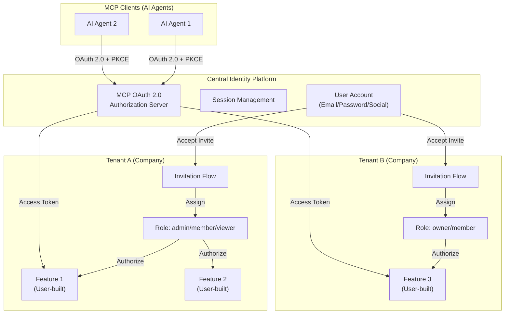
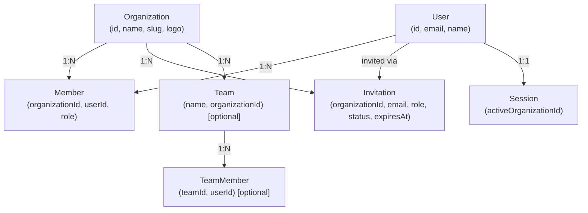
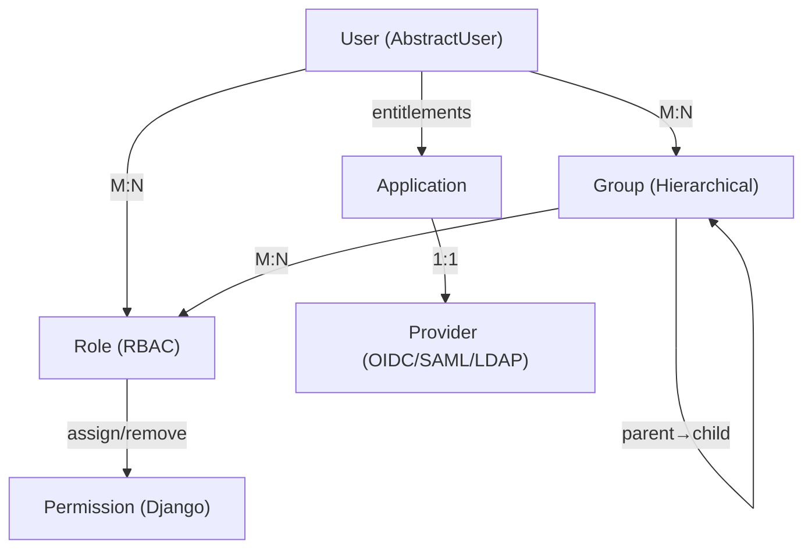
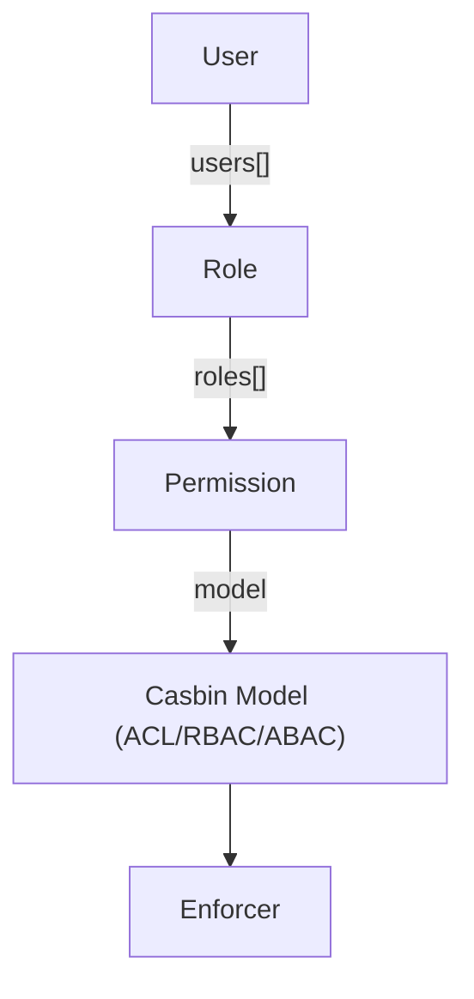
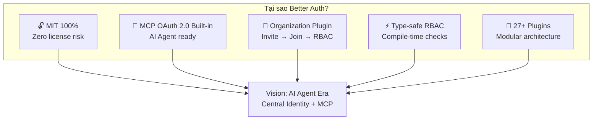
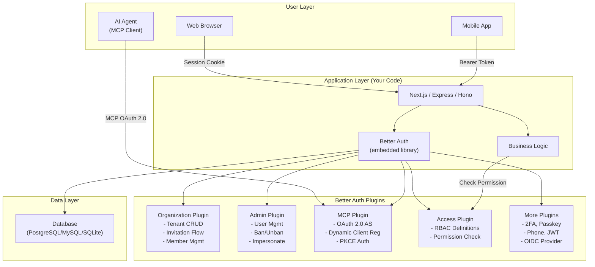

# Nghiên Cứu Giải Pháp IAM Open-Source: Centralized Identity + MCP

## 1. Tổng Quan & Bối Cảnh

### 1.1 Vision

```
User có tài khoản riêng (Centralized Identity)
  → Tenant (company) invite user → User join tenant
    → User có quyền truy cập tính năng tương ứng trong tenant đó
      → Tính năng do user chủ động phát triển (AI Agent era)
        → Kết nối tới MCP để tích hợp tài khoản linh hoạt
```

### 1.2 Kiến trúc mô hình mục tiêu



### 1.3 Yêu cầu cốt lõi (đo lường được)

| # | Yêu cầu | KPI đo lường | Priority |
|---|---------|-------------|----------|
| R1 | Centralized user account | 1 tài khoản = N tenants | P0 |
| R2 | Tenant invitation model | invite → accept → join flow | P0 |
| R3 | Per-tenant RBAC | Role/Permission per organization | P0 |
| R4 | MCP OAuth 2.0 integration | RFC 7591 Dynamic Client Reg + PKCE | P0 |
| R5 | MIT license | 100% MIT hoặc MIT core | P0 |
| R6 | Self-hosted | Docker compose / single binary | P1 |
| R7 | Multi-database | Không lock-in PostgreSQL | P1 |
| R8 | Developer-friendly API | REST/SDK cho feature integration | P1 |
| R9 | Admin UI | Quản lý tenants, users, roles | P2 |
| R10 | Per-tenant social login | OAuth app riêng per tenant | P2 |

---

## 2. Phương Pháp Nghiên Cứu

- **Clone repos** (shallow) vào `/Users/vanductai/Repo/oss/iam-research/`
- **Đọc kỹ codebase**: License, models, RBAC, MCP modules, Organization plugins, Social providers
- **Phân tích định lượng**: LOC, files, commit frequency

### Danh sách ứng viên

| # | Project | License Thực Tế | Đạt MIT? |
|---|---------|------------------|----------|
| 1 | **Authentik** | MIT (core) + Enterprise riêng | ⭐ Gần MIT |
| 2 | **Better Auth** | MIT 100% | ⭐⭐ MIT thuần |
| 3 | **Logto** | MPL-2.0 | ❌ |
| 4 | **Casdoor** | Apache 2.0 | ❌ |
| 5 | **Stack Auth** | AGPL-3.0 (server) | ❌ |

> **Kết quả xác minh license**: Chỉ có **Authentik** (MIT core + Enterprise riêng) và **Better Auth** (MIT 100%) thỏa mãn yêu cầu MIT. Logto dùng MPL-2.0, Casdoor dùng Apache 2.0, Stack Auth dùng AGPL-3.0 cho server.

---

## 3. Phân Tích Chi Tiết Từng Giải Pháp

### 3.1 Better Auth — "Developer-First Auth Library"

**License**: ✅ MIT 100% (thuần túy, không open-core)

#### Kiến trúc & Tech Stack

| Thành phần | Công nghệ |
|-----------|-----------|
| Runtime | TypeScript/Node.js |
| Framework | Framework-agnostic (adapter pattern) |
| Database | Bất kỳ SQL (Prisma, Drizzle, Kysely adapters) |
| Codebase | ~293K LOC, 350 TS files (core), 1802 total files |
| Last commit | 2026-04-06 (cập nhật hàng ngày) |

#### ✅ R1: Centralized User Account

- User model schema-based, tự động tạo tables
- Hỗ trợ: Email/Password, Social Login (OAuth), Magic Link, Passkeys, Phone OTP
- Multi-session support — 1 user login trên nhiều devices

#### ✅ R2: Tenant Invitation Model (Organization Plugin)

**Đọc từ codebase** (`plugins/organization/routes/crud-invites.ts`):

```typescript
// Flow hoàn chỉnh đã implement sẵn:
POST /organization/invite-member    // Tạo invitation (email + role)
POST /organization/accept-invitation // User accept → tự động tạo member
POST /organization/reject-invitation // User reject
GET  /organization/get-invitation   // Xem chi tiết invitation
GET  /organization/list-invitations // Danh sách invitations
```

**Schema từ codebase** (`plugins/organization/schema.ts`):



**Các tính năng invitation đã xác minh trong code:**

- ✅ Permission check trước khi invite (`hasPermission({ invitation: ["create"] })`)
- ✅ Email validation
- ✅ Duplicate member check
- ✅ Duplicate invitation check + resend option
- ✅ Invitation expiration (default 48h, configurable)
- ✅ Invitation limit per org (configurable, default 100)
- ✅ Membership limit per org (configurable)
- ✅ `beforeCreateInvitation` / `afterCreateInvitation` hooks
- ✅ `sendInvitationEmail()` callback
- ✅ Email verification requirement option
- ✅ Team assignment on invite (optional sub-grouping)

#### ✅ R3: Per-tenant RBAC

**Đọc từ codebase** (`plugins/access/access.ts` + `plugins/organization/permission.ts`):

```typescript
// Định nghĩa access control type-safe:
const ac = createAccessControl({
  organization: ["create", "update", "delete"],
  member: ["create", "update", "delete"],
  invitation: ["create", "cancel"],
});

// Tạo role với subset permissions:
const adminRole = ac.newRole({
  organization: ["create", "update"],
  member: ["create", "update", "delete"],
  invitation: ["create", "cancel"],
});

const memberRole = ac.newRole({
  organization: ["create"],
  member: ["create"],
  invitation: ["create"],
});
```

**Kiến trúc RBAC:**

- Default roles: `owner`, `admin`, `member`
- Custom roles: Tự định nghĩa qua config
- Dynamic roles: `dynamicAccessControl.enabled = true` → roles stored in DB per org
- Permission scope: Per-organization (user A là admin ở Org X, member ở Org Y)
- `creatorRole` concept: Owner tự động có all permissions
- AND/OR connector cho permission check

#### ✅ R4: MCP OAuth 2.0 Integration

**Đọc từ codebase** (`plugins/mcp/index.ts` — 1078 lines):

> **Better Auth có MCP plugin hoàn chỉnh** — implement full OAuth 2.0 Authorization Server spec cho MCP protocol. Đây là tính năng hiếm có, chỉ Better Auth có built-in.

**Endpoints đã implement:**

| Endpoint | Chức năng |
|----------|----------|
| `/.well-known/oauth-authorization-server` | OIDC Discovery metadata |
| `/.well-known/oauth-protected-resource` | Protected Resource metadata |
| `POST /mcp/register` | Dynamic Client Registration (RFC 7591) |
| `GET /mcp/authorize` | OAuth 2.0 Authorization |
| `POST /mcp/token` | Token exchange (auth code → access_token) |
| `GET /mcp/userinfo` | User info endpoint |
| `GET /mcp/jwks` | JSON Web Key Set |

**Tính năng MCP đã xác minh:**

- ✅ **Dynamic Client Registration** — AI Agent tự đăng ký client
- ✅ **PKCE support** (S256) — Bắt buộc cho public clients
- ✅ **Public & Confidential clients** — Mobile/Desktop vs Server
- ✅ **Refresh tokens** — `offline_access` scope
- ✅ **ID Tokens** (JWT) — `openid` scope
- ✅ **Scopes**: openid, profile, email, offline_access + custom
- ✅ **CORS enabled** — Cross-origin AI agents
- ✅ **Consent flow** — User approves agent access
- ✅ **Login prompt** — Redirect to login if not authenticated

#### ❌ R10: Per-tenant Social Login — KHÔNG HỖ TRỢ

**Bằng chứng từ codebase** (`create-context.ts:189-217`):

```typescript
// Social providers được resolve 1 lần duy nhất khi initialize context — GLOBAL
const providers = (
  await Promise.all(
    Object.entries(options.socialProviders || {}).map(async ([key, config]) => {
      const config = typeof originalConfig === "function" 
        ? await originalConfig()  // hỗ trợ async nhưng vẫn GLOBAL
        : originalConfig;
      const provider = socialProviders[key](config);
      return provider;
    })
  )
);
ctx.socialProviders = providers; // Assign vào global context — KHÔNG có tenant context
```

```typescript
// Sign-in flow lấy provider từ global context (sign-in.ts:241)
const provider = await getAwaitableValue(c.context.socialProviders, {
  value: c.body.provider, // tìm theo ID, KHÔNG theo tenant
});
```

```typescript
// Type definition xác nhận — KHÔNG có tenant param
type SocialProviders = {
  [K in SocialProviderList]?: AwaitableFunction<Config>
  // AwaitableFunction = T | (() => Promise<T>)
  // Không có context/request parameter → không biết tenant nào
};
```

**Workaround nếu cần per-tenant social login:**

| Approach | Khả thi? | Chi tiết |
|----------|----------|---------|
| **1. Generic OAuth plugin** | ✅ Tốt nhất | Dùng `generic-oauth` plugin + lưu OAuth credentials per-org trong DB, resolve dynamically |
| **2. Deploy nhiều instance** | ⚠️ Heavy | Mỗi tenant = 1 Better Auth instance với config riêng |
| **3. Custom middleware** | ⚠️ Cần hack | Hook vào sign-in flow, swap provider config dựa trên tenant header/domain |
| **4. OIDC Provider mode** | ⚠️ Indirect | Better Auth làm central IdP, mỗi tenant dùng OIDC flow riêng |

#### Điểm mạnh ✅

1. **MIT 100%** — zero enterprise lock-in
2. **MCP OAuth 2.0 Built-in** — duy nhất có tính năng này
3. **Organization + Invitation flow** hoàn chỉnh
4. **Type-safe RBAC** — compile-time permission checking
5. **Lightweight & Flexible** — ~350 files core, plug-and-play
6. **Framework-agnostic**: Next.js, Nuxt, SvelteKit, Express, Hono
7. **Database-agnostic**: Prisma, Drizzle, Kysely, MongoDB adapters
8. **Plugin ecosystem rộng**: 27+ plugins

#### Điểm yếu ❌

1. **Không có built-in Admin UI** — cần tự build
2. **Không hỗ trợ per-tenant social login** — global config only
3. **Không hỗ trợ SAML, LDAP** natively
4. **Không có reverse proxy** mode
5. **RBAC đơn giản**: Resource→Actions mapping, không per-object permissions
6. **Không self-contained**: Cần hosting app riêng

---

### 3.2 Authentik — "Enterprise-Grade IAM Platform"

**License**: MIT (core) + Enterprise License riêng cho `authentik/enterprise/`

#### Kiến trúc & Tech Stack

| Thành phần | Công nghệ |
|-----------|-----------|
| Backend | Python (Django) |
| Proxy/Gateway | Go |
| Frontend Web | TypeScript (Lit Elements) |
| Database | PostgreSQL |
| Cache | Redis |
| Codebase | ~921K LOC, 1907 Python files, 7224 total files |
| Last commit | 2026-04-07 (cập nhật hàng ngày) |

#### Mô hình Tài khoản

- **User model** kế thừa Django `AbstractUser`: `uuid`, `name`, `path`, `type`, `attributes` (JSON)
- **Group model** hỗ trợ **hierarchy** (parent→child) sử dụng PostgreSQL Materialized View
- **Roles** liên kết M:N với cả User và Group
- **User types**: `INTERNAL`, `EXTERNAL`, `SERVICE_ACCOUNT`, `INTERNAL_SERVICE_ACCOUNT`

#### Mô hình RBAC



- **Role** (`authentik/rbac/models.py`): `assign_perms()`, `remove_perms()` — global + per-object permissions
- **ObjectPermissions** (`authentik/rbac/permissions.py`): `django-guardian` based
- **Policy Engine**: Expression policies, GeoIP, reputation, password, expiry — ABAC-like
- **Flows & Stages**: Customizable authentication/authorization flows

#### Per-tenant Social Login: ✅ HỖ TRỢ

- Application → Provider mapping (1:1)
- Mỗi Application có thể dùng Provider riêng với OAuth credentials riêng
- Config qua Admin UI

#### Điểm mạnh ✅

1. **RBAC + Per-Object Permission** hoàn chỉnh nhất
2. **Group hierarchy** — PostgreSQL materialized views
3. **Reverse proxy** tích hợp — bảo vệ legacy apps
4. **Multi-protocol**: OIDC, OAuth2, SAML, LDAP, SCIM, RADIUS
5. **Admin UI** đầy đủ
6. **Per-tenant social login** supported
7. **Active development** — commit hàng ngày

#### Điểm yếu ❌

1. **Enterprise features** bị locked (audit nâng cao, search, reports)
2. **Heavy stack**: PostgreSQL + Redis + Python + Go
3. **Complexity cao**: 7224 files, learning curve dốc
4. **Không có MCP integration**
5. **PostgreSQL only**

#### Enterprise Lock-in Matrix

| Feature | MIT Core | Enterprise |
|---------|----------|------------|
| RBAC | ✅ | - |
| Per-object permissions | ✅ | - |
| Flows & Stages | ✅ | - |
| OIDC/OAuth2/SAML | ✅ | - |
| LDAP/SCIM Outpost | ✅ | - |
| Audit logging (basic) | ✅ | - |
| Advanced Audit | ❌ | ✅ |
| Enterprise policies | ❌ | ✅ |
| Search (advanced) | ❌ | ✅ |
| Reports | ❌ | ✅ |

---

### 3.3 Logto — "Developer-First OIDC Platform"

**License**: ❌ MPL-2.0 (Mozilla Public License) — **KHÔNG phải MIT**

> MPL-2.0 yêu cầu: Nếu bạn sửa file gốc của Logto, phải open-source file đã sửa. Đây là "weak copyleft".

| Thành phần | Công nghệ |
|-----------|-----------|
| Backend | TypeScript (Node.js) |
| Frontend Console | React |
| Database | PostgreSQL |
| Codebase | ~412K LOC, 6880 total files |
| Packages | 20 packages (monorepo) |

- OIDC/OAuth 2.1 native, standards-compliant
- Admin Console UI cực đẹp
- Organization với invitation + multi-tenancy
- RBAC: Roles + Scopes + Organization roles
- Không hỗ trợ SAML, LDAP
- Không có MCP integration

---

### 3.4 Casdoor — "UI-First All-in-One IAM"

**License**: ❌ Apache 2.0

| Thành phần | Công nghệ |
|-----------|-----------|
| Backend | Go (Beego framework) |
| Frontend | React |
| Authorization Engine | Casbin (tích hợp sẵn) |
| Database | MySQL/PostgreSQL/SQLite/SQL Server |
| Codebase | ~141K LOC, 432 Go files, 833 total files |

**RBAC:**



- **Casbin-powered** authorization — linh hoạt ACL/RBAC/ABAC
- **Multi-protocol**: OIDC, OAuth2, SAML, CAS, LDAP, SCIM, RADIUS
- **Per-tenant social login**: ✅ Organization → Providers[] mapping
- **MCP**: ⚠️ Chỉ là MCP **Client** (scan/discover), **KHÔNG phải** MCP OAuth Authorization Server
- **User model quá phức tạp** — 230+ fields, nhiều hardcoded social providers
- **Codebase compact**: 833 files

---

### 3.5 Stack Auth (Loại bỏ)

**License**: ❌ AGPL-3.0 (server) — **Hoàn toàn không phù hợp** với yêu cầu MIT

---

## 4. Ma Trận So Sánh Tổng Hợp

### 4.1 Mapping yêu cầu → Giải pháp

| Yêu cầu | Better Auth | Authentik | Logto | Casdoor |
|----------|------------|-----------|-------|---------|
| R1: Centralized Account | ✅ | ✅ | ✅ | ✅ |
| R2: Tenant Invitation | ✅ Built-in | ⚠️ Custom Flow | ✅ Built-in | ⚠️ Manual |
| R3: Per-tenant RBAC | ✅ Type-safe | ✅ django-guardian | ✅ Org roles | ✅ Casbin |
| R4: MCP OAuth 2.0 | ✅ **Built-in** | ❌ None | ❌ None | ⚠️ Client only |
| R5: MIT License | ✅ 100% | ⚠️ Core only | ❌ MPL-2.0 | ❌ Apache 2.0 |
| R6: Self-hosted | ✅ Any Node.js | ✅ Docker | ✅ Docker | ✅ Docker |
| R7: Multi-database | ✅ Any SQL+Mongo | ❌ PG only | ❌ PG only | ✅ Multi-DB |
| R8: Developer API | ✅ TypeScript SDK | ⚠️ Python DRF | ✅ TS SDK | ⚠️ Go API |
| R9: Admin UI | ❌ Self-build | ✅ Full | ✅ Beautiful | ✅ Full |
| R10: Per-tenant Social | ❌ Global only | ✅ Per-App | ✅ Per-Tenant | ✅ Per-Org |

### 4.2 Scoring cho mô hình cụ thể

| Tiêu chí (Weight) | Better Auth | Authentik | Logto | Casdoor |
|-------------------|-------------|-----------|-------|---------|
| Multi-tenant Invite (20%) | 10 | 5 | 8 | 4 |
| MCP Integration (20%) | 10 | 0 | 0 | 2 |
| MIT License (15%) | 10 | 8 | 3 | 5 |
| Per-tenant RBAC (15%) | 8 | 10 | 7 | 9 |
| Per-tenant Social Login (10%) | 2 | 10 | 9 | 9 |
| Plugin/Extension (10%) | 9 | 7 | 6 | 6 |
| Admin UI (5%) | 3 | 10 | 10 | 9 |
| Ease of Maintenance (5%) | 9 | 5 | 6 | 8 |
| **Weighted Score** | **8.15** | **5.95** | **5.05** | **5.30** |

---

## 5. Recommendation

### 5.1 Đề xuất #1: Better Auth (MIT 100%) — Tối ưu cho vision AI Agent era



**Khi nào chọn:**
- MCP integration là yêu cầu cốt lõi cho AI Agent
- MIT license là yêu cầu bắt buộc
- Tech stack là TypeScript/Node.js
- Không cần per-tenant social login ngay (workaround bằng generic-oauth)
- Team có thể tự build Admin UI

### 5.2 Đề xuất #2: Authentik (MIT core) — Nếu cần full platform

**Khi nào chọn:**
- Cần SAML/LDAP/SCIM protocols
- Cần per-tenant social login natively
- Cần Reverse Proxy mode
- Cần Admin UI sẵn có
- Chấp nhận stack nặng (Docker: PostgreSQL + Redis + Python + Go)
- Không cần MCP (hoặc build custom)

### 5.3 Kiến trúc đề xuất (Better Auth)



### 5.4 PoC Configuration

```typescript
// auth.ts — Core configuration
import { betterAuth } from "better-auth";
import { admin } from "better-auth/plugins/admin";
import { organization } from "better-auth/plugins/organization";
import { mcp } from "better-auth/plugins/mcp";
import { createAccessControl } from "better-auth/plugins/access";

// 1. Định nghĩa Access Control
const ac = createAccessControl({
  project: ["create", "read", "update", "delete"],
  member:  ["invite", "remove", "updateRole"],
  billing: ["view", "manage"],
  feature: ["create", "read", "update", "delete", "deploy"],
});

// 2. Định nghĩa Roles
const ownerRole = ac.newRole({
  project: ["create", "read", "update", "delete"],
  member:  ["invite", "remove", "updateRole"],
  billing: ["view", "manage"],
  feature: ["create", "read", "update", "delete", "deploy"],
});

const adminRole = ac.newRole({
  project: ["create", "read", "update"],
  member:  ["invite", "remove"],
  feature: ["create", "read", "update", "delete", "deploy"],
});

const memberRole = ac.newRole({
  project: ["read"],
  feature: ["create", "read", "update"],
});

// 3. Better Auth instance
export const auth = betterAuth({
  database: {
    provider: "pg", // hoặc mysql, sqlite
    url: process.env.DATABASE_URL,
  },
  socialProviders: {
    google: {
      clientId: process.env.GOOGLE_CLIENT_ID,
      clientSecret: process.env.GOOGLE_CLIENT_SECRET,
    },
    github: {
      clientId: process.env.GITHUB_CLIENT_ID,
      clientSecret: process.env.GITHUB_CLIENT_SECRET,
    },
  },
  plugins: [
    admin({
      defaultRole: "user",
      adminRoles: ["admin"],
    }),
    organization({
      roles: { owner: ownerRole, admin: adminRole, member: memberRole },
      creatorRole: "owner",
      sendInvitationEmail: async (data, request) => {
        // Gửi email invitation
      },
      invitationExpiresIn: 60 * 60 * 48, // 48h
      membershipLimit: 1000,
    }),
    mcp({
      loginPage: "/login",
    }),
  ],
});
```

### 5.5 Rủi ro & Mitigation

| Rủi ro | Mức độ | Mitigation |
|--------|--------|-----------|
| Không có Admin UI | Trung bình | Build admin dashboard riêng (dùng AI Agent) hoặc community admin |
| Per-tenant social login | Trung bình | Dùng generic-oauth plugin + DB-stored credentials per org |
| RBAC đơn giản (không per-object) | Thấp | Kết hợp business logic layer cho fine-grained checks |
| Library dependency | Thấp | MIT license → fork được nếu project bị abandoned |
| Performance Node.js | Thấp | Horizontal scaling, CDN, Edge deployment |

### 5.6 Next Steps

| # | Action | Timeline |
|---|--------|----------|
| 1 | Setup PoC: Better Auth + Organization + MCP plugins | Week 1 |
| 2 | Build Admin UI (users, orgs, invitations management) | Week 2-3 |
| 3 | Test MCP flow: AI Agent → OAuth → Access Token → API | Week 1-2 |
| 4 | Define production RBAC roles & permissions | Week 2 |
| 5 | Implement per-tenant social login workaround (generic-oauth) | Week 3 |
| 6 | Integration test: Feature app → Auth API → Permission check | Week 3 |
| 7 | Deploy staging environment | Week 4 |

---

## 6. Recommendation Matrix (Quick Reference)

| Use Case | Đề xuất | License | Lý do |
|----------|---------|---------|-------|
| Full IAM + MCP cho AI Agent era | **Better Auth** | MIT 100% | MCP built-in, Org invitation, type-safe |
| Full IAM platform (SAML/LDAP/proxy) | **Authentik** | MIT (core) | Most mature, admin UI, multi-protocol |
| Per-tenant social login required | **Authentik** | MIT (core) | Native per-app provider mapping |
| Multi-tenant B2B + ABAC | **Casdoor** | Apache 2.0 | Casbin, Go performance, compact code |
| OIDC-native + beautiful UX | **Logto** | MPL-2.0 | Best admin console, developer SDKs |

---

## Version Tracking

| Version | Ngày | Thay đổi |
|---------|------|----------|
| v1.0 | 2026-04-07 15:40 | Initial research: Clone 5 repos, phân tích license, so sánh cơ bản |
| v2.0 | 2026-04-07 15:55 | Cập nhật theo use case cụ thể: Centralized Identity + Multi-tenant Invitation + MCP. Deep-dive Better Auth |
| v3.0 | 2026-04-07 16:40 | Phân tích per-tenant social login — xác nhận Better Auth KHÔNG hỗ trợ (global only). So sánh với Authentik/Casdoor. Thêm workarounds. Cập nhật scoring matrix |
