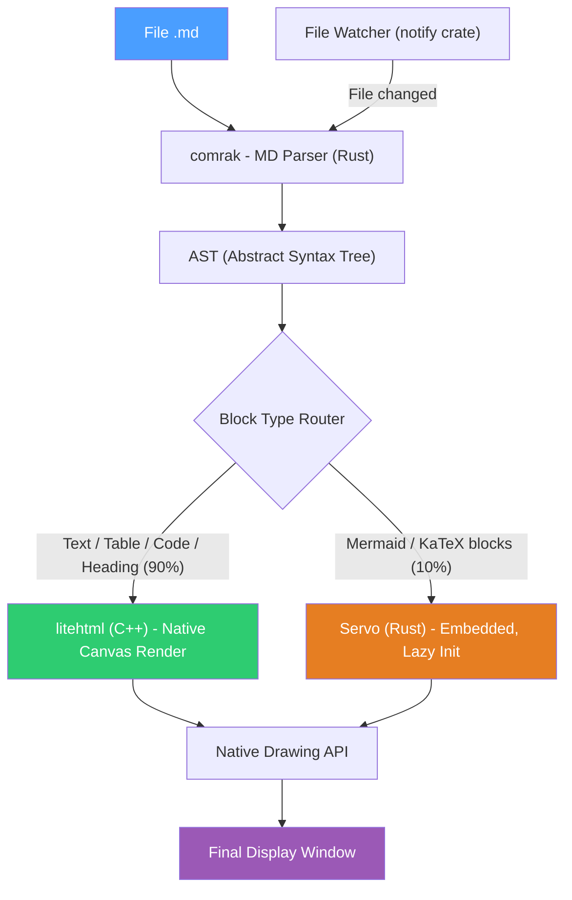
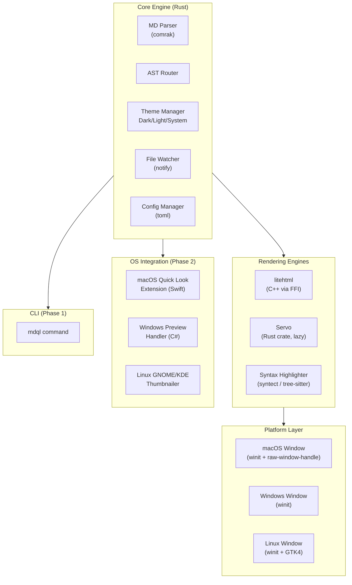
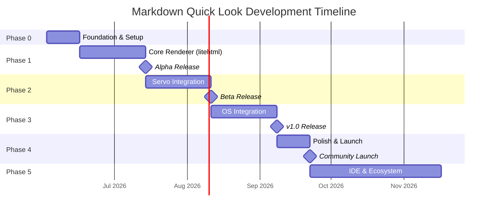
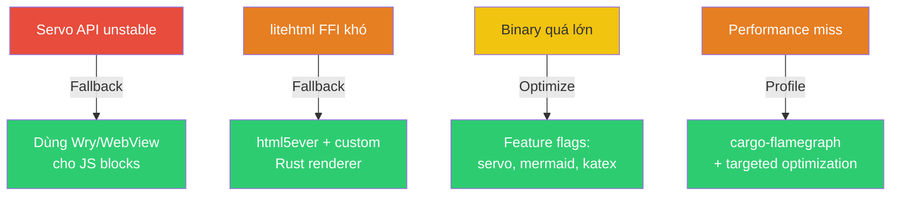

# Markdown Quick Look — Development Plan

> **Tham chiếu**: [Research gốc](./markdown-quick-look.md) — Section 8.6 Option A (litehtml + Servo)
>
> **Architecture**: Hybrid Rendering — litehtml (90% content) + Servo (10% JS-required blocks)

---

## Mục lục

1. [Tổng quan dự án](#1-tổng-quan-dự-án)
2. [Kiến trúc hệ thống](#2-kiến-trúc-hệ-thống)
3. [Tech Stack chi tiết](#3-tech-stack-chi-tiết)
4. [Cấu trúc dự án](#4-cấu-trúc-dự-án)
5. [Phân pha phát triển](#5-phân-pha-phát-triển)
6. [KPIs & Metrics đo lường](#6-kpis--metrics-đo-lường)
7. [Rủi ro & Giải pháp](#7-rủi-ro--giải-pháp)
8. [Version Tracking](#8-version-tracking)

---

## 1. Tổng quan dự án

### 1.1. Mục tiêu

Xây dựng **Markdown Quick Look** — ứng dụng cross-platform, view-only, hiển thị file Markdown đẹp, nhẹ và nhanh nhất có thể. Tích hợp sâu vào OS (Quick Look trên macOS, Preview Pane trên Windows).

### 1.2. Nguyên tắc thiết kế

| Nguyên tắc              | Mô tả                                                       |
| :---------------------- | :----------------------------------------------------------- |
| **View-only**           | Chỉ đọc, KHÔNG edit — giảm complexity triệt để               |
| **Speed-first**         | Mở file < 0.3s, render < 50ms cho 90% files                  |
| **Lightweight**         | RAM < 30MB idle, binary < 40MB (bao gồm Servo)               |
| **Native integration**  | Quick Look (macOS), Preview Pane (Windows), File manager (Linux) |
| **AI-workflow optimized** | Auto-refresh khi file thay đổi, GFM + Mermaid + KaTeX bắt buộc |

### 1.3. Target Users

- Developers & Engineers sử dụng AI tools hàng ngày
- Technical writers, Documentation reviewers
- Bất kỳ ai cần đọc file `.md` nhanh, đẹp, nhẹ

---

## 2. Kiến trúc hệ thống

### 2.1. Hybrid Rendering Architecture (Option A: litehtml + Servo)



### 2.2. Component Architecture



### 2.3. Data Flow chi tiết

```
Input: file.md (UTF-8)
  │
  ▼
[1] File I/O (Rust std::fs) ─────────────────── ~0.1ms
  │
  ▼
[2] comrak::parse_document() ────────────────── ~0.5-5ms
  │  → AST: Vec<Node> { Heading, Paragraph,
  │    Code, Table, MermaidBlock, MathBlock... }
  │
  ▼
[3] AST Router ──────────────────────────────── ~0.1ms
  │  → Phân loại blocks:
  │    - Standard blocks → litehtml pipeline
  │    - JS-required blocks → Servo pipeline
  │
  ├──→ [4a] Standard blocks (90%):
  │    │  comrak → HTML fragments
  │    │  → litehtml parse + layout
  │    │  → document_container callbacks
  │    │  → Native canvas draw ─────────────── ~5-15ms
  │    │
  │    ▼
  │    Native Drawing:
  │    - macOS: CoreGraphics / Metal
  │    - Windows: Direct2D / DirectWrite
  │    - Linux: Cairo / Pango
  │
  └──→ [4b] JS-required blocks (10%):
       │  (CHỈ khi có Mermaid/KaTeX)
       │  → Servo lazy-init (lần đầu ~200ms, sau đó ~50ms)
       │  → Mermaid.js / KaTeX.js execute
       │  → Servo render → bitmap/texture ──── ~100-300ms
       │
       ▼
       Composite vào cùng canvas

[5] Final Display ──────────────────────────── ~1ms
    │
    ▼
[6] File Watcher (notify crate)
    → Khi file thay đổi → quay lại [1]
    → Incremental re-render nếu có thể
```

---

## 3. Tech Stack chi tiết

### 3.1. Core Dependencies

| Component              | Library/Crate          | Vai trò                                      | License    |
| :--------------------- | :--------------------- | :------------------------------------------- | :--------- |
| **MD Parser**          | `comrak`               | Parse Markdown → AST/HTML (GFM compliant)    | BSD-2      |
| **Primary Renderer**   | `litehtml` (C++ via FFI) | Render HTML/CSS → native canvas (90% content) | BSD-3      |
| **JS Renderer**        | `servo` (Rust crate)   | Render Mermaid/KaTeX blocks (10% content)     | MPL-2.0    |
| **Syntax Highlighting** | `syntect`              | Code block highlighting (200+ languages)      | MIT        |
| **Windowing**          | `winit`                | Cross-platform window creation                | Apache-2.0 |
| **File Watching**      | `notify`               | Watch file changes, auto-refresh              | CC0/Artistic |
| **Graphics (macOS)**   | `core-graphics-rs`     | CoreGraphics bindings                         | MIT/Apache |
| **Graphics (Windows)** | `windows-rs`           | Direct2D/DirectWrite bindings                 | MIT/Apache |
| **Graphics (Linux)**   | `cairo-rs` + `pango`   | Cairo/Pango rendering                         | MIT        |
| **Theme Detection**    | `dark-light`           | Detect system dark/light mode                 | MIT        |
| **Config**             | `toml` + `dirs`        | App config storage                            | MIT        |
| **CLI**                | `clap`                 | Command-line argument parsing                 | MIT/Apache |
| **Logging**            | `tracing`              | Structured logging + performance tracing      | MIT        |

### 3.2. Build & Tooling

| Tool                   | Vai trò                                    |
| :--------------------- | :----------------------------------------- |
| **Cargo**              | Rust build system + dependency management  |
| **cc crate**           | Compile litehtml C++ source từ Rust        |
| **bindgen**            | Generate Rust FFI bindings cho litehtml    |
| **cargo-bundle**       | Package app cho macOS (.app), Windows (.msi), Linux (.deb/.AppImage) |
| **cross**              | Cross-compilation cho các platform         |
| **cargo-criterion**    | Benchmarking & performance regression      |
| **GitHub Actions**     | CI/CD: build, test, release cho 3 OS       |

### 3.3. litehtml Integration (FFI)

```rust
// Pseudo-code: Rust wrapper cho litehtml (C++)
// Build: cc crate compile litehtml → static lib → link

#[repr(C)]
pub struct LitehtmlDocument {
    ptr: *mut c_void,
}

extern "C" {
    fn litehtml_parse(html: *const c_char, css: *const c_char) -> *mut c_void;
    fn litehtml_render(doc: *mut c_void, container: *mut c_void, max_width: c_int);
    fn litehtml_draw(doc: *mut c_void, container: *mut c_void, x: c_int, y: c_int);
    fn litehtml_destroy(doc: *mut c_void);
}

// document_container callbacks — implement per-platform
pub trait NativeCanvas {
    fn draw_text(&mut self, text: &str, x: i32, y: i32, font: &Font, color: Color);
    fn draw_rect(&mut self, x: i32, y: i32, w: i32, h: i32, color: Color);
    fn draw_image(&mut self, url: &str, x: i32, y: i32, w: i32, h: i32);
    fn measure_text(&self, text: &str, font: &Font) -> (i32, i32);
}
```

### 3.4. Servo Integration

```rust
// Pseudo-code: Servo embedded cho Mermaid/KaTeX blocks
use servo::Servo;

pub struct ServoRenderer {
    instance: Option<Servo>,  // Lazy — chỉ init khi cần
    mermaid_js: &'static str, // Bundle Mermaid.js source
    katex_js: &'static str,   // Bundle KaTeX.js source
}

impl ServoRenderer {
    pub fn new() -> Self {
        Self {
            instance: None, // KHÔNG init ngay — lazy
            mermaid_js: include_str!("../assets/mermaid.min.js"),
            katex_js: include_str!("../assets/katex.min.js"),
        }
    }

    /// Chỉ gọi khi gặp Mermaid/KaTeX block lần đầu
    pub fn ensure_initialized(&mut self) {
        if self.instance.is_none() {
            self.instance = Some(Servo::new(/* config */));
            // Pre-load Mermaid.js + KaTeX.js
        }
    }

    pub fn render_mermaid(&mut self, mermaid_source: &str) -> Bitmap {
        self.ensure_initialized();
        // Servo execute: Mermaid.render(source) → SVG → bitmap
        todo!()
    }

    pub fn render_katex(&mut self, latex: &str) -> Bitmap {
        self.ensure_initialized();
        // Servo execute: katex.renderToString(latex) → HTML → render → bitmap
        todo!()
    }
}
```

---

## 4. Cấu trúc dự án

```
markdown-quick-look/
├── Cargo.toml                    # Workspace root
├── Cargo.lock
├── README.md
├── LICENSE                       # MIT
│
├── crates/
│   ├── mdql-core/                # Core engine (parser + AST router)
│   │   ├── Cargo.toml
│   │   └── src/
│   │       ├── lib.rs
│   │       ├── parser.rs         # comrak wrapper, AST types
│   │       ├── router.rs         # Block type classification
│   │       ├── theme.rs          # Theme management
│   │       ├── config.rs         # App configuration
│   │       └── watcher.rs        # File watcher (notify)
│   │
│   ├── mdql-litehtml/            # litehtml FFI wrapper
│   │   ├── Cargo.toml
│   │   ├── build.rs              # cc crate: compile litehtml C++
│   │   ├── litehtml/             # Git submodule: litehtml source
│   │   └── src/
│   │       ├── lib.rs
│   │       ├── ffi.rs            # Raw FFI bindings
│   │       ├── document.rs       # Safe Rust wrapper
│   │       └── container.rs      # document_container trait
│   │
│   ├── mdql-servo/               # Servo integration (lazy)
│   │   ├── Cargo.toml
│   │   └── src/
│   │       ├── lib.rs
│   │       ├── renderer.rs       # Servo renderer for Mermaid/KaTeX
│   │       └── js_bundles.rs     # Bundled JS files
│   │
│   ├── mdql-platform/            # Platform-specific rendering
│   │   ├── Cargo.toml
│   │   └── src/
│   │       ├── lib.rs
│   │       ├── macos.rs          # CoreGraphics canvas
│   │       ├── windows.rs        # Direct2D canvas
│   │       └── linux.rs          # Cairo canvas
│   │
│   └── mdql-highlight/           # Syntax highlighting
│       ├── Cargo.toml
│       └── src/
│           ├── lib.rs
│           └── themes/           # Custom syntax themes
│
├── apps/
│   ├── mdql-desktop/             # Desktop GUI app (winit)
│   │   ├── Cargo.toml
│   │   └── src/
│   │       ├── main.rs
│   │       ├── app.rs            # App lifecycle
│   │       ├── window.rs         # Window management
│   │       ├── input.rs          # Keyboard/mouse handling
│   │       └── scroll.rs         # Scroll & viewport
│   │
│   └── mdql-cli/                 # CLI tool
│       ├── Cargo.toml
│       └── src/
│           └── main.rs           # `mdql file.md` command
│
├── extensions/                   # OS integrations (Phase 2)
│   ├── macos-quicklook/          # Swift Quick Look Extension
│   │   ├── Package.swift
│   │   └── Sources/
│   ├── windows-preview/          # C# Preview Handler
│   │   └── PreviewHandler.cs
│   └── linux-thumbnailer/        # GNOME/KDE thumbnailer
│       └── mdql.thumbnailer
│
├── assets/
│   ├── mermaid.min.js            # Bundled Mermaid.js
│   ├── katex.min.js              # Bundled KaTeX.js
│   ├── katex.min.css
│   ├── default-light.css         # Default CSS themes
│   ├── default-dark.css
│   └── icons/                    # App icons (all sizes)
│
├── benches/                      # Performance benchmarks
│   ├── parsing.rs
│   ├── rendering.rs
│   └── fixtures/                 # Test .md files (various sizes)
│
├── tests/                        # Integration tests
│   ├── e2e.rs
│   └── fixtures/
│
└── .github/
    └── workflows/
        ├── ci.yml                # Build + test on all 3 OS
        └── release.yml           # Auto-release binaries
```

---

## 5. Phân pha phát triển

### Tổng quan resource

| Resource                     | Yêu cầu                                                    |
| :--------------------------- | :---------------------------------------------------------- |
| **Team size tối thiểu**      | 1 senior Rust developer (full-stack)                        |
| **Team size khuyến nghị**    | 2-3 devs: 1 Rust core + 1 platform (Swift/C#) + 1 UI/CSS   |
| **Thời gian Phase 0→v1.0**   | ~16 tuần (~4 tháng) với 1 dev, ~10 tuần với 2-3 devs       |
| **Kiến thức bắt buộc**       | Rust, C++ FFI, native graphics APIs (CoreGraphics/Direct2D) |
| **Kiến thức Phase 3**        | Swift (macOS QL), C# (Windows Preview), Xcode               |
| **Hardware cho testing**     | macOS machine + Windows machine + Linux (hoặc CI matrix)    |

---

### Phase 0: Foundation (2 tuần)

**Mục tiêu**: Setup project, build pipeline, core parsing.

| Task                                                    | Ước lượng | Output                          |
| :------------------------------------------------------ | :-------- | :------------------------------ |
| Khởi tạo Cargo workspace + cấu trúc crates             | 1 ngày    | Project skeleton                |
| Setup CI/CD (GitHub Actions) — build 3 OS               | 1 ngày    | Green CI trên macOS/Windows/Linux |
| Implement `mdql-core`: comrak parser + AST types        | 2 ngày    | Parse .md → typed AST           |
| Implement AST Router (classify block types)             | 1 ngày    | Standard vs JS-required blocks  |
| Unit tests cho parser + router                          | 1 ngày    | > 90% coverage cho core         |
| Setup benchmark suite (cargo-criterion)                 | 1 ngày    | Baseline performance numbers    |
| Chọn & implement CSS theme (light + dark)               | 1 ngày    | 2 theme CSS files               |
| Code review & documentation                             | 1 ngày    | README, CONTRIBUTING.md         |

**KPIs Phase 0**:

| KPI                         | Mục tiêu                |
| :--------------------------- | :---------------------- |
| Parse 100KB .md              | < 5ms                   |
| AST routing accuracy         | 100% (unit tests)       |
| CI build time (all 3 OS)     | < 10 phút               |

---

### Phase 1: Core Renderer — litehtml (4 tuần)

**Mục tiêu**: Render Markdown thuần (text, tables, code) via litehtml trên native canvas.

| Task                                                    | Ước lượng | Output                          |
| :------------------------------------------------------ | :-------- | :------------------------------ |
| Build litehtml từ source (cc crate + build.rs)          | 2 ngày    | Static lib linked vào Rust      |
| Generate FFI bindings (bindgen hoặc manual)             | 2 ngày    | Safe Rust wrapper               |
| Implement `document_container` cho macOS (CoreGraphics) | 3 ngày    | Text, rect, image drawing       |
| Implement `document_container` cho Windows (Direct2D)   | 3 ngày    | Text, rect, image drawing       |
| Implement `document_container` cho Linux (Cairo)        | 3 ngày    | Text, rect, image drawing       |
| Implement syntax highlighting (syntect → inline CSS)    | 2 ngày    | Code blocks highlighted         |
| Implement scroll & viewport management                  | 2 ngày    | Smooth scrolling                |
| winit window + event loop                               | 2 ngày    | Cross-platform window           |
| Dark/Light theme detection + CSS switching              | 1 ngày    | Auto theme                      |
| File watcher (notify) + auto-refresh                    | 1 ngày    | Live reload                     |
| CLI tool (`mdql file.md`)                               | 1 ngày    | Opens file in GUI window        |
| Performance optimization + profiling                    | 2 ngày    | Meet KPI targets                |
| Integration tests                                       | 1 ngày    | E2E tests                       |

**KPIs Phase 1**:

| KPI                         | Mục tiêu                | Cách đo               |
| :--------------------------- | :---------------------- | :--------------------- |
| Render file 100KB (no Mermaid) | < 30ms               | Benchmark              |
| Cold start time              | < 0.5s                  | Time from exec to display |
| RAM idle                     | < 15MB                  | Activity Monitor       |
| Binary size (stripped)       | < 10MB                  | `ls -lh`               |
| GFM rendering accuracy       | > 95%                  | Visual diff vs GitHub   |

**Deliverable**: **Alpha release** — Desktop app mở .md files, render đẹp, auto-refresh, light/dark theme. Chưa có Mermaid/KaTeX.

---

### Phase 2: Servo Integration — Mermaid & KaTeX (4 tuần)

**Mục tiêu**: Render Mermaid diagrams + KaTeX math via Servo embedded.

| Task                                                    | Ước lượng | Output                          |
| :------------------------------------------------------ | :-------- | :------------------------------ |
| Research Servo crate API + embedding patterns           | 3 ngày    | Technical spike document        |
| Implement `mdql-servo` crate: lazy initialization       | 3 ngày    | Servo init chỉ khi cần          |
| Bundle Mermaid.js + KaTeX.js vào binary                 | 1 ngày    | include_str! assets             |
| Implement Mermaid rendering pipeline                    | 3 ngày    | Mermaid → SVG → bitmap          |
| Implement KaTeX rendering pipeline                      | 2 ngày    | LaTeX → HTML → bitmap           |
| Composite: merge litehtml output + Servo output         | 3 ngày    | Unified canvas                  |
| Performance optimization: Servo startup                 | 2 ngày    | Lazy init < 200ms               |
| Servo rendering cache (không re-render unchanged blocks) | 2 ngày   | Cache bitmaps                   |
| Tests: Mermaid accuracy, KaTeX accuracy                 | 2 ngày    | Visual regression tests         |
| Cross-platform testing (macOS + Windows + Linux)        | 2 ngày    | Verified on all 3 OS            |

**KPIs Phase 2**:

| KPI                              | Mục tiêu                | Cách đo                    |
| :--------------------------------- | :---------------------- | :------------------------- |
| Servo lazy init (first Mermaid)   | < 300ms                 | Benchmark                  |
| Mermaid render (single diagram)   | < 500ms                 | Benchmark                  |
| File without Mermaid/KaTeX        | Không ảnh hưởng Phase 1 perf | Benchmark so sánh       |
| RAM với Servo loaded              | < 50MB                  | Activity Monitor           |
| Binary size (with Servo)          | < 40MB                  | `ls -lh`                   |
| Mermaid rendering accuracy        | > 90% (so với browser)  | Visual diff                |

**Deliverable**: **Beta release** — Full rendering: GFM + Mermaid + KaTeX. Cross-platform.

---

### Phase 3: OS Integration (4 tuần)

**Mục tiêu**: Nhúng vào OS — Quick Look (macOS), Preview Pane (Windows).

> [!IMPORTANT]
> Phase 3 yêu cầu **ngôn ngữ khác ngoài Rust**: Swift (macOS Quick Look), C# (Windows Preview Handler). Core rendering logic được share qua C FFI từ Rust → static library. Nếu team chỉ có Rust devs, có thể skip Phase 3 và dùng standalone app + file association thay thế.

| Task                                                    | Ước lượng | Output                          |
| :------------------------------------------------------ | :-------- | :------------------------------ |
| **macOS Quick Look Extension** (Swift)                  | 5 ngày    | Space = preview .md trong Finder |
| — QLPreviewProvider + comrak (via C FFI from Rust)      |           |                                 |
| — Signing + notarization                                |           |                                 |
| **Windows Preview Handler** (C#/.NET)                   | 5 ngày    | Preview Pane trong Explorer      |
| — IPreviewHandler implementation                        |           |                                 |
| — Registry registration                                |           |                                 |
| **Linux GNOME Thumbnailer**                             | 3 ngày    | Thumbnail preview trong Nautilus |
| File association (.md → mdql) trên 3 OS                 | 2 ngày    | Double-click .md = mở app       |
| Install scripts / package managers                      | 2 ngày    | brew, winget, apt/snap           |
| Testing trên các OS versions                            | 3 ngày    | macOS 13+, Win 10+, Ubuntu 22+  |

**KPIs Phase 3**:

| KPI                                   | Mục tiêu         |
| :-------------------------------------- | :---------------- |
| macOS Quick Look: Space → preview      | < 0.5s            |
| Windows Preview Pane: select → preview | < 0.5s            |
| Installation (brew/winget/apt)         | 1 lệnh            |

**Deliverable**: **v1.0 release** — Full app + OS integration + package managers.

---

### Phase 4: Polish & Community (2 tuần)

**Mục tiêu**: Polish UX, documentation, community launch.

| Task                                                    | Ước lượng |
| :------------------------------------------------------ | :-------- |
| Custom CSS themes (user-configurable)                   | 2 ngày    |
| Font selection & typography polish                      | 1 ngày    |
| Image rendering support (inline images in .md)          | 2 ngày    |
| TOC (Table of Contents) sidebar                         | 2 ngày    |
| Keyboard shortcuts (scroll, zoom, copy code block)      | 1 ngày    |
| Comprehensive README + demo GIFs                        | 1 ngày    |
| Homebrew formula PR / winget manifest PR                | 1 ngày    |
| Launch trên Hacker News, Reddit r/rust, r/commandline   | 1 ngày    |

---

### Phase 5: IDE & Ecosystem (ongoing)

**Mục tiêu**: Mở rộng ecosystem — IDE extensions, advanced features.

| Task                             | Ước lượng |
| :------------------------------- | :-------- |
| VS Code extension (side preview) | 2 tuần    |
| Neovim plugin (popup preview)    | 1 tuần    |
| Export: MD → PDF (via Servo)     | 1 tuần    |
| Search within document           | 3 ngày    |
| Multi-file preview               | 3 ngày    |
| Plugin system (user extensions)  | 2 tuần    |

---

### Timeline tổng quan



### Tổng kết effort

| Phase   | Thời gian | Nhân sự | Deliverable                    |
| :------ | :-------- | :------ | :----------------------------- |
| Phase 0 | 2 tuần    | 1 dev   | Project skeleton + parser      |
| Phase 1 | 4 tuần    | 1-2 dev | **Alpha** — litehtml rendering |
| Phase 2 | 4 tuần    | 1-2 dev | **Beta** — Servo + Mermaid     |
| Phase 3 | 4 tuần    | 2-3 dev | **v1.0** — OS integration      |
| Phase 4 | 2 tuần    | 1-2 dev | Polish + community launch      |
| Phase 5 | Ongoing   | 1+ dev  | IDE extensions, ecosystem      |
| **Tổng cộng** | **~16 tuần** | | **~4 tháng full-time** |

---

## 6. KPIs & Metrics đo lường

> Không đo lường được thì không quản lý & tối ưu được.

### 6.1. Performance KPIs

| KPI                              | Phase 1 Target | Phase 2 Target | v1.0 Target | Cách đo                        |
| :------------------------------- | :------------- | :------------- | :---------- | :------------------------------ |
| Cold start time                  | < 0.5s         | < 0.5s         | < 0.3s      | Benchmark script                |
| Render file 100KB (no Mermaid)   | < 30ms         | < 30ms         | < 30ms      | Criterion benchmark             |
| Render file 100KB (with Mermaid) | N/A            | < 500ms        | < 300ms     | Criterion benchmark             |
| RAM idle                         | < 15MB         | < 50MB         | < 30MB      | Activity Monitor / Task Manager |
| RAM peak (1MB file)              | < 30MB         | < 80MB         | < 60MB      | Benchmark                       |
| Binary size                      | < 10MB         | < 40MB         | < 40MB      | Build output                    |
| File watch → re-render           | < 100ms        | < 100ms        | < 100ms     | Benchmark                       |

### 6.2. Quality KPIs

| KPI                    | Target    | Cách đo                          |
| :--------------------- | :-------- | :------------------------------- |
| GFM rendering accuracy | > 95%     | Visual diff vs GitHub rendering   |
| Mermaid accuracy       | > 90%     | Visual diff vs browser            |
| KaTeX accuracy         | > 95%     | Visual diff vs browser            |
| Crash rate             | < 0.1%    | Sentry / crash reports            |
| Test coverage          | > 80%     | cargo-tarpaulin                   |
| CI pass rate           | > 98%     | GitHub Actions metrics            |

### 6.3. Adoption KPIs (post-launch)

| KPI                    | 3 tháng    | 6 tháng    | Cách đo                   |
| :--------------------- | :--------- | :--------- | :------------------------- |
| GitHub stars           | > 200      | > 500      | GitHub metrics             |
| Downloads / installs   | > 1,000    | > 5,000    | brew analytics / releases  |
| User satisfaction      | > 4.0/5    | > 4.5/5    | GitHub issues / surveys    |
| Contributors           | > 5        | > 15       | GitHub contributors        |
| Open issues backlog    | < 20       | < 30       | GitHub issues              |

### 6.4. Benchmark Automation

```rust
// benches/rendering.rs — Chạy tự động trong CI
use criterion::{criterion_group, criterion_main, Criterion};

fn bench_parse_100kb(c: &mut Criterion) {
    let md = include_str!("fixtures/large_100kb.md");
    c.bench_function("parse_100kb", |b| {
        b.iter(|| mdql_core::parse(md))
    });
}

fn bench_render_litehtml(c: &mut Criterion) {
    let md = include_str!("fixtures/large_100kb.md");
    let ast = mdql_core::parse(md);
    c.bench_function("render_litehtml_100kb", |b| {
        b.iter(|| mdql_litehtml::render(&ast, 800, Theme::Light))
    });
}

criterion_group!(benches, bench_parse_100kb, bench_render_litehtml);
criterion_main!(benches);
```

---

## 7. Rủi ro & Giải pháp

### 7.1. Technical Risks

| Rủi ro                                            | Mức độ | Xác suất | Giải pháp                                                                                   |
| :------------------------------------------------- | :----- | :------- | :------------------------------------------------------------------------------------------ |
| **Servo API chưa stable**                         | Cao    | Trung bình | Fallback: Wry/WebView cho Phase 2 nếu Servo API breaking changes quá nhiều. Pin version cụ thể |
| **litehtml FFI phức tạp**                         | Trung bình | Trung bình | Bắt đầu bằng technical spike 2 ngày. Nếu quá khó → dùng `html5ever` (Rust-native HTML parser) + custom renderer |
| **Platform-specific rendering inconsistency**      | Trung bình | Cao        | Visual regression tests chạy trên 3 OS. Dùng pixel diff (image-compare crate)             |
| **Mermaid.js bundle size quá lớn**                 | Thấp   | Trung bình | Lazy load, chỉ bundle khi build với feature flag `mermaid`                                 |
| **Cross-compile Servo cho 3 OS**                   | Cao    | Trung bình | Dùng GitHub Actions matrix build. Nếu fail → build natively trên mỗi OS runner             |

### 7.2. Product Risks

| Rủi ro                                            | Mức độ | Xác suất | Giải pháp                                                  |
| :------------------------------------------------- | :----- | :------- | :--------------------------------------------------------- |
| **User không tìm thấy app**                       | Trung bình | Cao      | SEO: README tốt, Homebrew formula, blog posts, Hacker News  |
| **User muốn editing**                             | Thấp   | Cao      | Giữ firm view-only. Link ra MarkEdit/VS Code nếu cần edit |
| **Cạnh tranh với QLMarkdown/PowerToys**            | Trung bình | Cao      | USP: cross-platform + Mermaid + ultra-fast + single app    |

### 7.3. Mitigation Matrix



---

## 8. Version Tracking

| Version | Ngày       | Thay đổi                                                                                          |
| :------ | :--------- | :------------------------------------------------------------------------------------------------- |
| v1.0    | 2026-05-23 | Khởi tạo plan: 6 phases, kiến trúc Option A (litehtml + Servo), tech stack, KPIs, risks, timeline |
