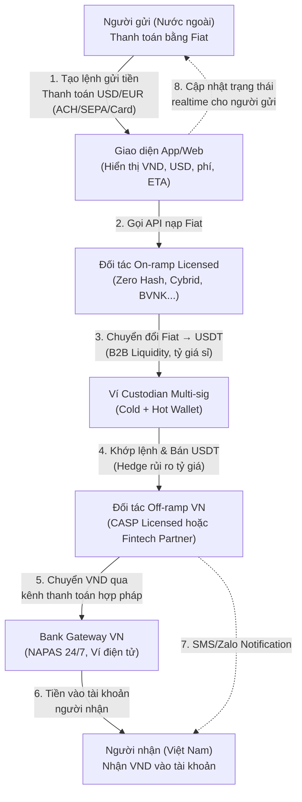

# Phân tích Mô hình Kinh doanh Chuyển tiền Xuyên biên giới bằng USDT (Remittance)

## 1. Bối cảnh Thị trường & Cơ hội

### 1.1. Thị trường Kiều hối Việt Nam
Việt Nam nhiều năm liên tục nằm trong **top 10 quốc gia nhận kiều hối lớn nhất thế giới**. Lượng kiều hối tập trung chủ yếu từ các hành lang (corridor): Mỹ, EU, Úc, Nhật Bản, Hàn Quốc, Đài Loan. Tuy nhiên, kênh chuyển tiền truyền thống (ngân hàng, Western Union, MoneyGram) vẫn tồn tại nhiều nỗi đau:
- **Phí cao:** Thường 5-10% giá trị giao dịch.
- **Tốc độ chậm:** 1-5 ngày làm việc.
- **Tỷ giá kém:** Nhiều lớp trung gian khiến tỷ giá bất lợi cho người gửi.
- **Thủ tục phức tạp:** Nhiều rào cản giấy tờ, đặc biệt với gia đình không rành thủ tục ngân hàng.

### 1.2. Cơ hội từ Stablecoin
Stablecoin (USDT, USDC) cho phép chuyển giá trị **gần như tức thời** qua blockchain, với chi phí on-chain cực thấp. Các tổ chức lớn (Stripe, Circle, Visa, PayPal) đều đang dịch chuyển theo hướng sử dụng stablecoin làm **lớp thanh toán bù trừ (settlement layer)** cho thanh toán xuyên biên giới.

### 1.3. Định vị Dịch vụ
> **Nguyên tắc cốt lõi:** Dịch vụ phải được định vị là *"App gửi tiền về nhà, nhận VND siêu nhanh, siêu rẻ"*. USDT chỉ là **đường ray thanh toán (payment rail)** chạy ở backend, **tuyệt đối không xuất hiện** với người dùng phổ thông.

Bản chất mô hình: dùng Blockchain làm settlement layer trong khi trải nghiệm người dùng cuối (frontend) hoàn toàn là tiền tệ pháp định (Fiat-to-Fiat). Người dùng không cần biết về Crypto, Wallet hay Private Key.

---

## 2. Đối tượng Tham gia & Thiết kế Trải nghiệm

### 2.1. Người gửi (Sống ở nước ngoài)
- **Đặc điểm:** Lao động xuất khẩu, sinh viên, hoặc người định cư. Có thu nhập hợp pháp bằng ngoại tệ (USD, JPY, KRW, EUR). Không nhất thiết phải rành công nghệ.
- **Nhu cầu:** Gửi tiền về nhà nhanh, phí rẻ, tỷ giá tốt, thủ tục đơn giản, có chứng từ chứng minh nguồn tiền.
- **Trải nghiệm lý tưởng:** App giống các fintech quen thuộc (Wise, Remitly). Nhập số tiền -> thấy ngay phí, tỷ giá, số tiền VND người nhà nhận được -> thanh toán qua Apple Pay / Thẻ tín dụng / Bank Transfer (ACH/SEPA).

### 2.2. Người nhận (Gia đình ở Việt Nam)
- **Đặc điểm:** Bố mẹ, ông bà, người lớn tuổi, người ở nông thôn, ít tiếp xúc với công nghệ tài chính.
- **Nhu cầu:** Nhận tiền an toàn, nhanh chóng, trực tiếp vào tài khoản ngân hàng quen thuộc hoặc nhận tiền mặt qua đại lý.
- **Trải nghiệm lý tưởng:** Nhận thông báo SMS/Zalo báo có tiền. Tiền tự động vào thẻ ATM (qua NAPAS 24/7) mà **không cần thao tác gì thêm**, không cần biết USDT là gì.

### 2.3. Đơn vị Vận hành (Community Operator)
- **Vai trò:** Thiết kế app/portal, quản lý user, hỗ trợ khách hàng, **điều phối dòng tiền giữa các đối tác** (on-ramp/off-ramp). Không tự làm "ngân hàng bóng tối".
- **Định vị:** Đóng vai trò **lớp UX + điều phối (orchestrator)**, còn lưu ký và xử lý on/off-ramp do đối tác licensed chịu trách nhiệm.

---

## 3. Kiến trúc Hệ thống & Quy trình Dòng tiền

### 3.1. Lựa chọn Blockchain Network
Sử dụng mạng lưới **Tron (TRC-20)** là lựa chọn ưu tiên cho remittance corridor Đông Nam Á, do phí gas cực thấp (< $1) và tốc độ nhanh (vài giây). Các lựa chọn thay thế: Polygon, BSC, Solana.

### 3.2. Sơ đồ Luồng tiền (Fiat-First, Crypto-in-Backend)



### 3.3. Mô tả Chi tiết Luồng Giao dịch
1. **Người gửi** tạo lệnh "Gửi 10 triệu VND cho mẹ ở Việt Nam" trong app.
2. App hiển thị: số tiền phải trả bằng USD/EUR, phí dịch vụ, tỷ giá đã khóa (locked rate), thời gian ước tính (ETA).
3. Người gửi thanh toán **bằng Fiat** cho đối tác on-ramp (bank transfer, card, ACH/SEPA).
4. On-ramp chuyển đổi Fiat → USDT và chuyển vào ví custodian multi-sig do hệ thống kiểm soát.
5. Hệ thống khớp lệnh với quỹ VND của đối tác off-ramp tại Việt Nam; USDT được bán/hedge qua đối tác off-ramp.
6. Đối tác off-ramp chuyển VND vào tài khoản ngân hàng/ví điện tử của người nhận qua kênh hợp pháp.
7. App cập nhật trạng thái, lưu lịch sử và chứng từ cho cả 2 bên.

> **Điểm quan trọng:** Người nhận tại Việt Nam **luôn nhận VND** qua kênh thanh toán hợp pháp (ngân hàng, ví điện tử) — không bao giờ nhận trực tiếp USDT.

---

## 4. Khung Pháp lý Chi tiết

### 4.1. Việt Nam — Hiện trạng & Chương trình Thí điểm

#### Lập trường hiện tại
- Crypto (bao gồm USDT) **không phải phương tiện thanh toán hợp pháp** tại Việt Nam.
- Nghị định 52/2024/NĐ-CP về thanh toán không dùng tiền mặt **không liệt kê** tiền mã hóa như công cụ thanh toán được phép.
- Mọi hoạt động thanh toán hàng hóa, dịch vụ **phải bằng VND** qua công cụ được công nhận (thẻ, ví, chuyển khoản).

#### Nghị quyết 05/2025/NQ-CP — Chương trình Thí điểm
- **Thời hạn:** 5 năm, từ 09/09/2025.
- **Cơ sở pháp lý:** Luật Công nghiệp Công nghệ số (có hiệu lực 01/01/2026) công nhận crypto là loại **tài sản**, không phải tiền tệ.
- **Yêu cầu cấp phép (rất cao):**
  - Vốn điều lệ tối thiểu: **10.000 tỷ VND (~400 triệu USD)**.
  - Ít nhất 65% vốn do tổ chức góp, trong đó >35% từ tổ chức tài chính/công nghệ (ngân hàng, công ty chứng khoán, bảo hiểm...).
  - Giới hạn FDI: tối đa **49%** vốn nước ngoài.
- **Quy định giao dịch:** Mọi giao dịch trong khuôn khổ thí điểm phải thanh toán bằng VND, crypto chỉ là tài sản được ghi nhận qua tổ chức CASP được cấp phép.
- **Giám sát:** Ủy ban Chứng khoán Nhà nước. Thuế tạm áp dụng tương tự chứng khoán.
- **Tiến độ (đến 05/2026):** Đã có một số doanh nghiệp vượt qua vòng sơ loại cấp phép sàn giao dịch.

#### Hàm ý cho Mô hình Remittance
- **Tuyệt đối không** để người dùng tại Việt Nam "thanh toán bằng USDT". Họ chỉ được **nhận VND** qua ngân hàng/ví.
- Nếu muốn hoạt động quy mô lớn → gần như **bắt buộc phải đi chung** với một trong các CASP được cấp phép trong chương trình thí điểm.
- Không định vị dịch vụ là "thanh toán bằng USDT" mà là **giải pháp hỗ trợ kiều hối**, khâu thanh toán cuối cùng luôn bằng VND.

### 4.2. Mỹ — GENIUS Act & Money Transmitter License
- **GENIUS Act (2025):** Đạo luật liên bang yêu cầu nhà phát hành stablecoin giữ 100% dự trữ, báo cáo định kỳ. Stablecoin được định nghĩa là trọng tâm mới trong AML.
- **Money Transmitter License (MTL):** Remittance có dính crypto thường cần MTL **theo từng bang** + tuân thủ FinCEN. Quy trình mất 12-18 tháng.
- **Giải pháp:** Dùng đối tác on-ramp đã có MTL (Zero Hash có 48+ MTL) thay vì tự xin license.

### 4.3. EU — MiCA Framework
- Stablecoin (EMT - E-Money Token, ART - Asset-Referenced Token) được quản lý dưới **MiCA** (Markets in Crypto-Assets).
- CASP phải được cấp phép và đặt tại EU hoặc có đại diện pháp lý.
- Yêu cầu về vốn, dự trữ, giám sát chặt chẽ.

### 4.4. FATF Travel Rule — Chuẩn mực Toàn cầu
- VASP phải thu thập và truyền thông tin người gửi/nhận (tên, số tài khoản, địa chỉ/ID).
- **EU & UK:** Không ngưỡng (áp dụng mọi giao dịch).
- **Mỹ:** Ngưỡng $1.000-$3.000.
- Self-hosted wallet: Nhiều quốc gia yêu cầu xác minh quyền sở hữu ví (Satoshi Test).

### 4.5. Bài học Cảnh báo từ Trung Quốc
- Tòa án TQ coi hành vi mua bán USDT **tương đương mua bán đô la Mỹ** → tội "kinh doanh ngoại hối trái phép".
- Doanh nghiệp chỉ "nhận USDT hộ" nhưng tiền gốc liên quan cờ bạc/lừa đảo → vẫn phải chịu trách nhiệm hình sự về tội **che giấu nguồn gốc tài sản phạm tội**.
- Tài khoản ngân hàng bị **đóng băng** nếu dòng tiền xuất phát từ hoạt động bất hợp pháp, kể cả khi doanh nghiệp không biết.

> **⚠️ Hàm ý:** Tuyệt đối không chạy mô hình kiểu "U-merchant" (nhận USDT, trả tiền mặt) dưới dạng chợ đen. Luôn gắn chặt KYC/AML, chứng minh nguồn tiền kiều hối hợp pháp.

---

## 5. Hệ sinh thái Đối tác On-ramp/Off-ramp

### 5.1. Đối tác On-ramp (Phía nước ngoài)

| Đối tác | Thế mạnh | License/Compliance |
|---------|----------|-------------------|
| **Zero Hash** | Hạ tầng B2B sâu, highly regulated | 48+ US MTL, NY BitLicense |
| **Cybrid** | Stablecoin/fiat orchestration, developer-first | KYC/KYB API, licensed US & Canada |
| **BVNK** | Enterprise-grade B2B cross-border | 25+ global licenses, mạnh Tron/EVM USDT |
| **Crossmint** | Full-stack (wallets, ramps, compliance) | SOC 2, MiCA-authorized (EU) |
| **Stripe** | Fiat-to-stablecoin on-ramp cho mainstream app | Tập trung US/EU, settlement bằng fiat |

### 5.2. Đối tác Off-ramp (Phía Việt Nam)
- **Lựa chọn lý tưởng:** Tổ chức đã tham gia pilot crypto theo NQ 05/2025 (CASP được cấp phép).
- **Lựa chọn thực tế:** Fintech/tổ chức tài chính có hệ thống kiểm soát AML tốt, có khả năng xử lý USDT → VND và disbursement qua NAPAS 24/7.
- **Yêu cầu bắt buộc:** Pháp nhân rõ ràng, hệ thống kế toán, hợp đồng dịch vụ, chứng cứ tuân thủ (license, chính sách AML).

### 5.3. Cấu trúc Pháp nhân Đề xuất
- **Không tự ôm vai trò lưu ký stablecoin** — đóng vai trò UX + orchestrator.
- Ký hợp đồng dịch vụ rõ ràng với đối tác on/off-ramp.
- Cân nhắc đặt **pháp nhân tại nước có khung pháp lý rõ ràng** (Singapore, Dubai, EU) → phục vụ cộng đồng Việt nhưng vẫn tuân thủ luật VN khi liên quan VND và người nhận tại VN.

---

## 6. Mô hình Doanh thu & Chi phí

### 6.1. Nguồn Doanh thu

| Nguồn | Mô tả | Ghi chú |
|-------|-------|---------|
| **Phí giao dịch** | Flat fee hoặc % nhỏ trên mỗi lệnh gửi tiền | Tổng chi phí cho user phải thấp hơn đáng kể so với kênh truyền thống (5-10%) |
| **Chênh lệch tỷ giá (Spread)** | Spread trong quá trình USD ↔ USDT ↔ VND | Phải minh bạch, tránh "ăn dày" gây phản ứng |
| **Gói Membership** | Giảm phí, hỗ trợ ưu tiên cho người gửi thường xuyên | Tặng thêm dịch vụ: bảo hiểm nhỏ, tư vấn thuế nước sở tại |
| **Giá trị gia tăng** | Sản phẩm tài chính nhỏ (tiết kiệm kiều hối) | ⚠️ Cẩn trọng pháp lý về huy động vốn, đầu tư |

### 6.2. Cấu trúc Chi phí

| Hạng mục | Chi tiết |
|----------|---------|
| **Phí On/Off-ramp** | Phí đối tác mua/bán stablecoin, phí mạng blockchain (gas), phí nạp/rút fiat |
| **Chi phí AML/KYC** | Onboarding eKYC, screening PEP/sanctions, on-chain analytics, transaction monitoring, lưu trữ hồ sơ (tối thiểu 5 năm) |
| **Chi phí Pháp lý** | Tư vấn luật sư 2 đầu (VN + nước gửi), thiết kế cấu trúc pháp nhân, hợp đồng đối tác |
| **Chi phí Vận hành** | Hạ tầng ví custodian, bảo mật, support khách hàng, marketing cộng đồng |

### 6.3. Công thức Lợi nhuận trên mỗi Giao dịch
```
Take Rate = (Chênh lệch tỷ giá mua/bán) + (Phí thu người dùng) - (Phí cổng thanh toán) - (Phí gas) - (Phí KYC/AML phân bổ)
```

---

## 7. Thiết kế Sản phẩm & Trải nghiệm Người dùng (UX)

### 7.1. Nguyên tắc UX — "Zero-Crypto Abstraction"
- **Loại bỏ hoàn toàn thuật ngữ Crypto:** Không hiển thị "USDT", "Gas fee", "Wallet address", "TRC-20", "Hash". Chỉ nói "số dư", "gửi tiền", "nhận VND".
- **Minh bạch thông tin:** Chỉ hiển thị 3 thông số: (1) Tỷ giá khóa cố định, (2) Phí giao dịch, (3) Số tiền thực nhận chính xác.
- **Đa ngôn ngữ:** Tiếng Việt cho người nhận, Tiếng Việt/Anh cho người gửi.

### 7.2. Các Tính năng Cốt lõi

#### Phía Người gửi (Mobile App)
- **Đăng ký & eKYC:** CMND/CCCD/Hộ chiếu, chứng nhận cư trú, liveness check khuôn mặt. Bằng chứng quan hệ gia đình nếu cần.
- **Quản lý Người thụ hưởng:** Lưu sẵn thông tin tài khoản ngân hàng bố mẹ/người thân. Cấu hình hạn mức và **nhắc lịch gửi tiền định kỳ**.
- **Gửi tiền:**
  - Nhập số tiền VND muốn người nhận nhận **HOẶC** số tiền USD/EUR muốn trả.
  - Hệ thống hiển thị: phí, tỷ giá đã khóa (15-30 phút), ETA, số tiền thực nhận.
  - Thanh toán qua kênh fiat (chuyển khoản, thẻ, Apple Pay).
- **Theo dõi Giao dịch:** Timeline "đang xử lý" → "đã chuyển" → "đã nhận", kèm biên lai và lịch sử chi tiết.

#### Phía Người nhận (Passive — Không cần app)
- Nhận SMS/Zalo/thông báo ngân hàng khi tiền về.
- Tiền tự động vào tài khoản ngân hàng hoặc nhận tiền mặt qua đại lý.
- Không cần thao tác gì thêm.

### 7.3. Thiết kế 3 Màn hình Chính (Focus UI)
1. **Danh sách người thân (Beneficiaries)** + số tài khoản ngân hàng.
2. **Màn hình gửi tiền:** Nhập số tiền → hiện ngay phí/tỷ giá/ETA → nút "Gửi ngay".
3. **Timeline giao dịch** + nút "Gọi hỗ trợ".

### 7.4. Hỗ trợ Offline qua Đại lý Cộng đồng
- Người nhận lớn tuổi đến đại lý (quầy chuyển tiền hợp tác) để được hỗ trợ mở tài khoản, rút tiền, tra cứu lịch sử.
- Đại lý được training về KYC cơ bản và nhận diện giao dịch bất thường.
- Hỗ trợ đa kênh: hotline, chat, call center, cộng đồng.

---

## 8. Quản trị Rủi ro & Compliance

### 8.1. KYC/AML & Giám sát Giao dịch
- **KYC đầy đủ cả 2 đầu:**
  - Người gửi: eKYC (chụp ID, liveness check), kiểm tra PEP/Sanction list, đánh giá rủi ro khách hàng.
  - Người nhận: Đối chiếu tên chủ tài khoản ngân hàng + bằng chứng quan hệ thân nhân (chứng minh là kiều hối thực).
- **Hạn mức theo cấp độ:** Người mới hạn mức thấp → nâng dần theo lịch sử giao dịch sạch (Risk Scoring).
- **Transaction Monitoring:** Rule-based (ngưỡng tiền, tần suất, pattern bất thường) + ML nếu có thể. Flag trường hợp "dị thường" để kiểm tra thủ công.
- **On-chain Analytics:** Sử dụng dịch vụ phân tích on-chain (Chainalysis, Elliptic) để đánh giá rủi ro ví nguồn/đích, tránh tương tác với ví bị gắn cờ (ransomware, dark web, cờ bạc).
- **Lưu trữ hồ sơ:** Tối thiểu **5 năm** theo quy định AML quốc tế.

### 8.2. Bảo mật Hệ thống
- **Quản lý ví:** Cold wallet cho quỹ dự trữ lớn. Hot wallet chỉ vận hành tự động lượng USDT vừa đủ giao dịch trong ngày.
- **Multi-sig:** Đa chữ ký cho mọi lệnh xuất quỹ. Ngưỡng cảnh báo (Rate Limiting) cho lệnh xuất quỹ lớn bất thường.
- **Bảo vệ tài khoản người dùng:** 2FA, xác thực thiết bị, mã PIN giao dịch, khóa nhanh khi nghi ngờ bị hack, cảnh báo đăng nhập bất thường.
- **Bảo vệ dữ liệu:** Mã hóa dữ liệu nhạy cảm, tuân thủ ISO 27001, GDPR (nếu hoạt động EU), tiêu chuẩn ATTT quốc gia VN.
- **Ưu tiên dùng custodian uy tín** thay vì tự phát triển ví on-chain (trừ khi có năng lực bảo mật cao).

### 8.3. Quản trị Thanh khoản (Liquidity & Treasury)
- **Đối tác OTC B2B:** Hợp tác API sâu với nhà cung cấp thanh khoản OTC lớn để có tỷ giá sỉ tốt nhất khi chuyển đổi Fiat ↔ USDT liên tục.
- **Lock tỷ giá (Khóa tỷ giá):** Cơ chế khóa tỷ giá 15-30 phút để người gửi an tâm thanh toán mà hệ thống không bị lỗ do biến động USDT/VND.
- **Cân bằng Treasury:** Cảnh báo realtime khi quỹ Fiat hoặc quỹ USDT ở một đầu sắp cạn để kịp thời rebalance.

---

## 9. Hệ thống Đo lường & Tối ưu (KPIs)

> **Nguyên tắc cốt lõi:** Không đo lường được thì không quản lý & tối ưu được.

Dashboard quản trị (Admin Panel) đo lường các chỉ số theo thời gian thực:

### 9.1. Dòng tiền & Kinh doanh (Financial Metrics)
| KPI | Mô tả | Mục tiêu |
|-----|-------|----------|
| **GTV** | Tổng giá trị giao dịch (chia theo corridor: USD-VND, JPY-VND...) | Tăng trưởng MoM |
| **Take Rate** | Tỷ suất lợi nhuận/giao dịch = Spread + Phí - Chi phí | > 1.5% |
| **Slippage Loss/Gain** | Lời/lỗ do biến động tỷ giá USDT trong thời gian xử lý | < 0.1% |
| **Liquidity Health** | Cảnh báo khi quỹ Fiat/USDT sắp cạn | Alert realtime |

### 9.2. Vận hành & Hệ thống (Operational Metrics)
| KPI | Mô tả | Mục tiêu |
|-----|-------|----------|
| **TTP (Time-to-Pay)** | Thời gian từ thanh toán → tiền vào tài khoản người nhận | < 5 phút |
| **Failure Rate** | Phân tích nguyên nhân thất bại (On-ramp lỗi, Bank VN bảo trì, Blockchain nghẽn) | < 1% |
| **Gas Fee Efficiency** | Chi phí gas trung bình/giao dịch (đánh giá batching) | < $0.50 |
| **System Uptime** | Khả dụng hệ thống | > 99.9% |

### 9.3. Trải nghiệm & Tăng trưởng (Growth Metrics)
| KPI | Mô tả | Mục tiêu |
|-----|-------|----------|
| **eKYC Drop-off Rate** | % người bỏ cuộc tại phễu eKYC | < 20% |
| **CAC** | Chi phí thu hút 1 khách hàng mới | Giảm qua referral |
| **LTV** | Giá trị trọn đời khách hàng | LTV/CAC > 3x |
| **Retention Rate** | % người gửi quay lại sau 1, 3, 6 tháng | > 70% (kiều hối có tính lặp lại cao) |

---

## 10. Chiến lược Triển khai (Go-to-Market)

### 10.1. Giai đoạn 1 — POC cho Cộng đồng Nhỏ
1. **Xác định tuyến ưu tiên:** Ví dụ Mỹ → Việt Nam, tập trung 1-2 thành phố có đông người Việt (California, Texas).
2. **Đàm phán đối tác on-ramp/off-ramp** đã có license và API. Đảm bảo họ cover được các bang/quốc gia mục tiêu.
3. **Xây dựng MVP** theo kiến trúc "fiat-first, crypto-backend":
   - Frontend: Chỉ hiển thị VND, USD/EUR, phí, ETA.
   - Backend: Module kết nối on/off-ramp, ví custodian, on-chain tracking.
4. **Xây khung KYC/AML tối thiểu:** Quy trình onboard, rule AML, hạn mức, log lưu trữ 5 năm.
5. **Rà pháp lý với luật sư 2 đầu** (Mỹ/EU và Việt Nam).

### 10.2. Giai đoạn 2 — Mở rộng Cộng đồng
- Mở thêm corridor: Nhật → VN, Hàn → VN, EU → VN.
- Xây mạng lưới đại lý tại VN hỗ trợ người nhận lớn tuổi.
- Tối ưu UX dựa trên dữ liệu đo lường.

### 10.3. Giai đoạn 3 — Mở rộng B2B
- Sau khi luồng P2P ổn định → mở rộng sang **B2B** (doanh nghiệp thanh toán tiền hàng xuyên biên giới).
- Tích hợp thêm sản phẩm giá trị gia tăng (bảo hiểm, tiết kiệm kiều hối).

---

## 11. Kịch bản Xử lý Sự cố

| Sự cố | Giải pháp |
|-------|-----------|
| **Giao dịch on-chain bị kẹt / phí mạng tăng đột biến** | Retry tự động, chuyển sang mạng backup (Polygon thay Tron), thông báo user ETA mới |
| **Đối tác on/off-ramp downtime** | Hệ thống failover sang đối tác dự phòng, tạm dừng nhận lệnh mới nếu cần |
| **Tài khoản ngân hàng VN bị "treo"** | Chuẩn bị sẵn bộ hồ sơ chứng minh nguồn tiền (hợp đồng lao động, chứng từ thu nhập, quan hệ gia đình, lịch sử giao dịch). Nhiều tài khoản ngân hàng dự phòng |
| **Thay đổi chính sách pháp lý đột ngột** | Phương án dừng dịch vụ an toàn, trả lại tiền cho khách, chuyển hướng sang kênh remittance truyền thống backup |
| **Nghi ngờ gian lận / rửa tiền** | Đóng băng giao dịch, escalate cho compliance team, báo cáo SAR nếu cần |

---

## 12. Review & Đánh giá (Self-Review)

### 12.1. Tính khả thi
- Mô hình sử dụng stablecoin làm settlement layer là xu hướng tất yếu của Fintech toàn cầu. Trải nghiệm **Zero-Crypto** là điểm mấu chốt để tiếp cận tệp mass user.
- Cơ hội sản phẩm (rẻ, nhanh, tiện) là rất lớn, đặc biệt với thị trường kiều hối VN.

### 12.2. Rủi ro lớn nhất
- **Nút thắt cổ chai nằm ở hệ thống ngân hàng (Banking)**, không phải Blockchain: Làm sao duy trì tài khoản ngân hàng (Fiat rails) mà không bị các ngân hàng truyền thống "de-risk" (đóng băng tài khoản vì nghi ngờ giao dịch crypto).
- **Giải pháp:** Dùng đối tác BaaS hoặc Payment Gateway đã có license thay vì tự vận hành dòng tiền mặt.
- **Rủi ro pháp lý:** Mô hình có thể bị coi là "mua bán ngoại tệ trá hình" nếu thiết kế không cẩn thận.

### 12.3. Điểm cần lưu ý đặc biệt
- Không cổ vũ người dùng **giữ USDT** như tiền tiết kiệm/đầu tư → tránh bị coi là cung cấp dịch vụ tài sản mã hóa trái phép.
- Bắt buộc xây dựng năng lực KYC/AML và hợp tác với ít nhất một đối tác on/off-ramp đã có license.
- Triển khai thận trọng theo từng **cộng đồng nhỏ** trước khi mở rộng.

### 12.4. Phát triển tương lai
- Sau khi luồng P2P ổn định → mở rộng B2B (thanh toán tiền hàng xuyên biên giới).
- Tích hợp sản phẩm giá trị gia tăng theo lộ trình.

---

### Version Tracking

| Version | Date | Author | Changes |
|---------|------|--------|---------|
| 1.0.0 | 2026-05-18 | Antigravity | Khởi tạo tài liệu nghiên cứu chi tiết mô hình kinh doanh Remittance sử dụng USDT |
| 2.0.0 | 2026-05-18 | Antigravity | Cập nhật toàn diện: bổ sung bối cảnh thị trường kiều hối VN, khung pháp lý chi tiết (NQ 05/2025, GENIUS Act, MiCA, FATF Travel Rule, bài học TQ), hệ sinh thái đối tác on/off-ramp cụ thể (Zero Hash, Cybrid, BVNK...), mô hình doanh thu/chi phí, thiết kế sản phẩm UX chi tiết, chiến lược Go-to-Market 3 giai đoạn, kịch bản xử lý sự cố, cấu trúc pháp nhân đề xuất. Tổng hợp từ 2 nguồn Perplexity research + web research bổ sung |
