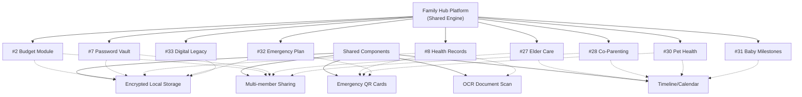
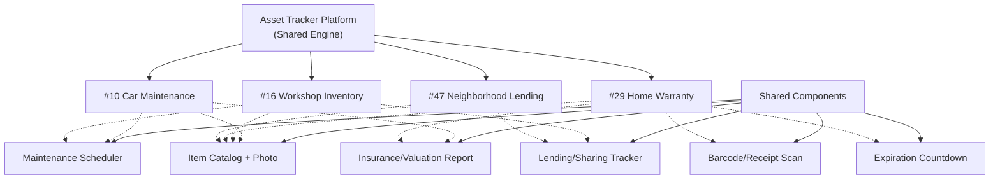
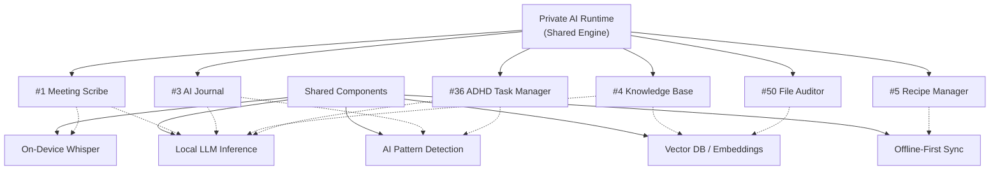
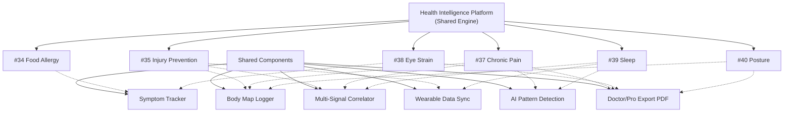
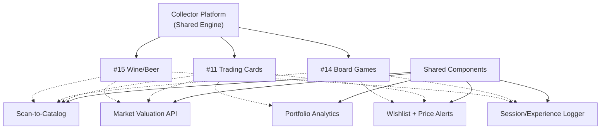
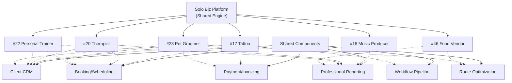
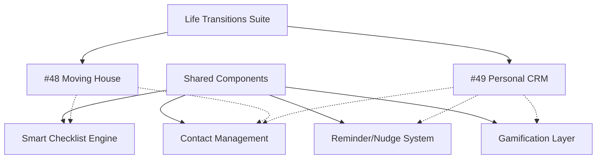

# 36 Ý Tưởng Niche App Đã Chọn — Gom Nhóm Theo Chiến Lược Khai Thác

> **Ngày tạo**: 23/05/2026  
> **Cập nhật lần cuối**: 23/05/2026  
> **Nguồn**: Lọc từ [50 Super Niche Local App Ideas](file:///Volumes/DATA/Repo/research/ideas/random-260523.md)  
> **Số ý tưởng**: 36/50 được chọn  
> **Nguyên tắc gom nhóm**: Các ý tưởng chia sẻ core concept, data model, hoặc target audience → có thể phát triển thành 1 hệ thống/platform khai thác nhiều thị trường bằng cùng 1 codebase hoặc shared modules.

---

## Mục lục

- [Cluster 1: Family Life Hub — Vault & Coordination](#cluster-1-family-life-hub--vault--coordination)
- [Cluster 2: Asset & Maintenance Tracker](#cluster-2-asset--maintenance-tracker)
- [Cluster 3: Privacy-First AI Productivity](#cluster-3-privacy-first-ai-productivity)
- [Cluster 4: Body & Mind Health Intelligence](#cluster-4-body--mind-health-intelligence)
- [Cluster 5: Collector & Hobbyist Portfolio](#cluster-5-collector--hobbyist-portfolio)
- [Cluster 6: Solo Professional Business-in-a-Box](#cluster-6-solo-professional-business-in-a-box)
- [Cluster 7: Community & Life Transitions](#cluster-7-community--life-transitions)
- [Tổng hợp đánh giá](#tổng-hợp-đánh-giá)

---

## Cluster 1: Family Life Hub — Vault & Coordination

> **Shared concept**: Family-centric apps quản lý data nhạy cảm (health, finances, legal), chia sẻ qua local network, coordinate giữa family members. Chung core engine: **encrypted local vault + multi-member sharing + timeline/calendar + emergency access**.
>
> **Chiến lược khai thác**: Xây 1 "Family Hub" app với module system. Mỗi module = 1 market riêng (health, budget, passwords, caregiving, co-parenting). User mua module cần, không bị ép mua cả suite.

---

### #2. Privacy-First Family Budget Manager (No Bank Sync)

| Tiêu chí | Chi tiết |
|:---|:---|
| **Nỗi đau** | Nhiều gia đình KHÔNG MUỐN link bank account với app (Mint đã đóng cửa, YNAB requires cloud sync). Lo ngại bảo mật khi tập trung dữ liệu tài chính gia đình lên cloud |
| **Giải pháp** | Desktop/mobile app lưu 100% local. Manual fast-entry (< 10 giây/giao dịch). Multi-member family sharing qua local network/QR code. Export CSV/PDF cho accountant |
| **Bằng chứng nhu cầu** | Mint shutdown (2024) để lại hàng triệu user orphaned. Reddit r/personalfinance có hàng trăm thread "alternative to Mint that doesn't need bank login". YNAB tăng giá gây backlash |
| **Competitors yếu** | YNAB (cloud-only, $99/năm). Goodbudget (limited). Chưa có app nào kết hợp local-first + family multi-user tốt |
| **Monetization** | One-time purchase $19.99 hoặc $4.99/tháng. Premium: multi-device sync qua self-hosted server |
| **Đo lường thành công** | DAU/MAU ratio; số giao dịch nhập/tuần; conversion từ free → paid |

---

### #7. Zero-Knowledge Family Password & Secret Vault

| Tiêu chí | Chi tiết |
|:---|:---|
| **Nỗi đau** | 1Password, LastPass = cloud (LastPass bị breach 2022). Gia đình cần share passwords (Netflix, WiFi, bank) nhưng không muốn trust cloud provider. KeePass local nhưng UX tệ, không có family sharing |
| **Giải pháp** | Local-first password manager với beautiful UI. Family vault sharing qua local network hoặc encrypted file. Biometric unlock. Emergency access (nếu member qua đời, gia đình access được) |
| **Bằng chứng nhu cầu** | LastPass breach (2022) → millions users tìm alternatives. r/privacy thường xuyên recommend KeePass nhưng acknowledge "UX sucks". Bitwarden (cloud) là top alternative nhưng vẫn cloud |
| **Competitors yếu** | KeePass (UX tệ hại). 1Password (cloud, $5/tháng/person). Bitwarden (cloud). Chưa có local-first + family + beautiful UX |
| **Monetization** | $29.99 one-time family license. Premium: hardware key support, advanced sharing $9.99 |
| **Đo lường thành công** | Passwords stored/family; sharing events/tháng; NPS score vs 1Password |

---

### #8. Private Health Data Vault cho Gia đình

| Tiêu chí | Chi tiết |
|:---|:---|
| **Nỗi đau** | Medical records phân tán: mỗi bệnh viện 1 hệ thống, kết quả xét nghiệm trong email, đơn thuốc trên giấy. Khi cần thông tin khẩn cấp (emergency room) → không tìm được. Super apps health tracking chỉ track steps, không store medical records |
| **Giải pháp** | Local encrypted vault lưu trữ tất cả medical records gia đình. Scan đơn thuốc bằng camera → OCR extract thông tin. Timeline view theo từng member. Emergency card có QR code chứa thông tin dị ứng, thuốc đang dùng |
| **Bằng chứng nhu cầu** | r/healthcare, r/chronicillness recurring "how do you organize medical records?". Apple Health chỉ track metrics, không store documents. Google Health đã shutdown nhiều lần |
| **Competitors yếu** | Apple Health (limited to metrics). MyChart (hospital-specific). Chưa có family-wide, local-first medical vault |
| **Monetization** | $14.99 one-time hoặc $3.99/tháng family. Premium: doctor-shareable export, medication interaction checker |
| **Đo lường thành công** | Documents stored/family; emergency card activations; user retention 6 tháng |

---

### #27. Elderly Care Coordination Hub cho Sandwich Generation

| Tiêu chí | Chi tiết |
|:---|:---|
| **Nỗi đau** | Gia đình có bố mẹ già: 3-4 anh chị em phải coordinate ai đưa đi khám, ai quản lý thuốc, ai ở bên khi caregiver vắng. Hiện dùng group chat WhatsApp → thông tin bị trôi. Medication schedule bị miss. Doctor notes không ai ghi lại đầy đủ |
| **Giải pháp** | Family caregiving hub: shared medication log với reminders (ai cho uống thuốc, lúc nào). Doctor appointment calendar (ai đưa đi). Care protocol cho specific conditions (Alzheimer's, post-stroke). Daily care log (ăn gì, mood, vitals). Emergency contacts + insurance info. Caregiver rotation schedule |
| **Bằng chứng nhu cầu** | 53M unpaid caregivers in US. r/CaregiverSupport 85K members. AARP survey: 60% caregivers feel overwhelmed by coordination. CareZone app shutdown (2023) left users orphaned. Caring Village exists nhưng limited |
| **Competitors yếu** | CareZone (shutdown). Caring Village (basic). Lotsa Helping Hands (dated). CaringBridge (updates only, no coordination). Chưa có modern, comprehensive family care coordination app |
| **Monetization** | Free (1 care recipient) → $9.99/tháng family plan. Premium: medication interaction checker, professional caregiver integration $14.99/tháng |
| **Đo lường thành công** | Active family members/care group; medication compliance rate; appointment coordination success; caregiver stress reduction (survey) |

---

### #28. Co-Parenting Communication & Expense Tracker

| Tiêu chí | Chi tiết |
|:---|:---|
| **Nỗi đau** | Separated/divorced parents cần neutral communication channel (court-admissible), shared custody schedule, split expenses tracking. Text messages = emotional, no accountability. Google Calendar = no expense tracking. Existing tools (OurFamilyWizard) cost $100+/năm PER PARENT |
| **Giải pháp** | Shared custody calendar với swap request workflow. Communication log (all messages archived, court-admissible format). AI tone detector ("This message sounds confrontational. Would you like to rephrase?"). Shared expense tracker (medical, education, activities) with split calculations. Photo/document sharing for kids |
| **Bằng chứng nhu cầu** | 50% marriages end in divorce in US. OurFamilyWizard ($200/năm for both parents) validate demand — courts actually MANDATE this app in some jurisdictions. r/coparenting "cheaper alternative to OurFamilyWizard" recurring. AI tone suggestion = most requested feature |
| **Competitors yếu** | OurFamilyWizard (expensive, dated UX). Cozi (family calendar, no co-parenting features). TalkingParents (basic). Chưa có affordable option với AI conflict prevention |
| **Monetization** | Free (basic calendar) → $7.99/tháng per parent (full suite). Court-admissible export $2.99/report. Lawyer referral commission |
| **Đo lường thành công** | Active parent pairs; communication frequency; expense disputes resolved; AI rephrase adoption rate |

---

### #30. Pet Medication & Vet Visit Coordinator

| Tiêu chí | Chi tiết |
|:---|:---|
| **Nỗi đau** | Multi-pet households: flea/tick prevention schedule khác nhau per pet, vaccination due dates, special diet requirements, medication for chronic conditions. Vet records scattered across clinics. Emergency = panic không nhớ con nào dị ứng gì, uống thuốc gì |
| **Giải pháp** | Per-pet health profile: vaccination timeline, medication schedule với reminders, weight tracking, vet visit history, diet/allergy info. Emergency card (QR code trên tag). Multi-pet medication calendar view. Vet record scanner (OCR). Appointment reminders |
| **Bằng chứng nhu cầu** | 70% US households own pets. PetDesk validates market nhưng clinic-focused (B2B). r/pets, r/dogs "how do you track medications for multiple pets?" recurring. 11Pets app exists nhưng UX kém, limited. Average US pet owner spends $1,533/năm on vet |
| **Competitors yếu** | PetDesk (clinic-side, not owner-side). 11Pets (poor UX). Generic reminders (no pet-specific context). Chưa có beautiful multi-pet health manager from owner perspective |
| **Monetization** | Free (2 pets) → $3.99/năm per additional pet. Premium: vet record digitization, AI symptom checker $6.99/năm |
| **Đo lường thành công** | Pets profiled/household; medication reminders completed on time %; vet visit records logged; emergency card scans |

---

### #31. Baby Development Milestone Tracker (Evidence-Based)

| Tiêu chí | Chi tiết |
|:---|:---|
| **Nỗi đau** | New parents anxious: "Is my baby developing normally?" Generic parenting apps track feedings/diapers (Huckleberry, Baby Tracker) nhưng KHÔNG track developmental milestones theo evidence-based guidelines (CDC, WHO). Pediatrician visits 10 min — parents forget to ask about concerns. Gap between medical guidelines và daily parenting app |
| **Giải pháp** | Milestone tracker based on CDC/WHO developmental guidelines. Age-appropriate checklist (gross motor, fine motor, language, social). Photo/video evidence log per milestone. Red flag alerts ("If not [skill] by [age], discuss with pediatrician"). Printable pediatrician visit preparation sheet. Sibling comparison (anonymous — "most babies achieve this by...") |
| **Bằng chứng nhu cầu** | 3.6M births/year in US. CDC "Milestone Tracker" app exists nhưng UX terrible, low ratings. r/NewParents, r/beyondthebump "is this normal for [X months]?" = top category of questions. Early intervention works best when caught early |
| **Competitors yếu** | CDC Milestone Tracker (terrible UX). Huckleberry (feeding-focused). What to Expect (content, not tracking). Chưa có beautiful, evidence-based milestone tracker with photo evidence |
| **Monetization** | Free (first child) → $4.99 per additional child. Premium: professional development assessment, speech/motor screening tools $9.99 |
| **Đo lường thành công** | Milestones logged/child; pediatrician reports generated; red flag alert → doctor visit conversion; parent anxiety reduction (survey) |

---

### #32. Family Emergency Preparedness Planner

| Tiêu chí | Chi tiết |
|:---|:---|
| **Nỗi đau** | Natural disasters, power outages, medical emergencies — families "plan to plan" but never actually do. Emergency kits không được cập nhật (food expired, batteries dead). No single place with: evacuation routes, emergency contacts, insurance info, medical info, meeting points. FEMA recommends preparation nhưng no tool makes it easy |
| **Giải pháp** | Family emergency plan builder: customizable by disaster type (earthquake, hurricane, fire, medical). Emergency kit inventory with expiration tracking. Per-member medical/allergy info. Evacuation route maps (offline). Emergency contact tree. Document vault (insurance, IDs — offline accessible). Practice drill scheduler |
| **Bằng chứng nhu cầu** | FEMA: only 39% Americans have emergency plan. r/preppers 500K members (extreme end). r/homeowners, r/parenting emergency planning threads. Climate change → increasing disaster frequency. No beautiful consumer app exists — only government PDFs and survivalist forums |
| **Competitors yếu** | FEMA app (info only, no planning). Red Cross (limited). ICE apps (contact only). Chưa có comprehensive family emergency planning app |
| **Monetization** | Free (basic plan) → $6.99 one-time family plan. Premium: document vault, offline maps, drill scheduling $3.99/năm |
| **Đo lường thành công** | Plans completed/family; kit items tracked + expired items replaced; drill completions; document vault usage |

---

### #33. Digital Legacy & Account Inheritance Manager

| Tiêu chí | Chi tiết |
|:---|:---|
| **Nỗi đau** | Khi người thân qua đời: hàng trăm online accounts (email, bank, social media, subscriptions, crypto) cần được close/transfer. Family không biết accounts nào tồn tại, passwords ở đâu. Digital legacy = massive unspoken problem. Super apps không bao giờ address mortality |
| **Giải pháp** | Catalog tất cả digital accounts (not passwords — links/instructions only). Per-account instructions: "Delete", "Transfer to [person]", "Memorialize". Designate digital executor. Dead man's switch (if no login for X months → notify executor). Letter templates cho platforms (Facebook memorialization, bank account closure). Integration với will/estate planning |
| **Bằng chứng nhu cầu** | Average person has 100+ online accounts. r/legaladvice, r/personalfinance "how to close deceased's accounts" = heartbreaking recurring threads. Google Inactive Account Manager exists nhưng only for Google. No comprehensive digital legacy tool |
| **Competitors yếu** | Google Inactive Account Manager (Google-only). Everplans (enterprise/advisor). Cake (content, not tool). Chưa có consumer-friendly, comprehensive digital legacy planner |
| **Monetization** | $9.99 one-time setup. $2.99/năm maintenance. Premium: dead man's switch, executor tools $14.99 |
| **Đo lường thành công** | Accounts cataloged/user; executor designations; instruction completeness %; year-over-year retention |

---

#### Cluster 1 — Synergy Map

| Shared Module | Sử dụng bởi |
|:---|:---|
| Encrypted Local Storage | #2, #7, #8, #32, #33 |
| Multi-member Sharing (QR/Local) | #2, #7, #8, #27, #28 |
| Timeline/Calendar Engine | #27, #28, #30, #31 |
| Emergency QR Cards | #8, #30, #32 |
| OCR Document Scanner | #8, #30 |
| AI Medication Interaction | #8, #27, #30 |

---

## Cluster 2: Asset & Maintenance Tracker

> **Shared concept**: Quản lý tài sản vật lý (xe, tools, thiết bị gia đình) — track inventory, lịch bảo trì, lifecycle, giá trị, và cho mượn/chia sẻ. Chung core engine: **item catalog + photo/barcode scan + maintenance schedule + location tracking + sharing/lending**.
>
> **Chiến lược khai thác**: Xây 1 "Asset Tracker" framework có thể skin/customize cho từng vertical (automotive, workshop, home, neighborhood). Mỗi vertical = riêng brand + riêng App Store listing, nhưng dùng chung 80% codebase.

---

### #10. Classic/Enthusiast Car Maintenance & Parts Tracker

| Tiêu chí | Chi tiết |
|:---|:---|
| **Nỗi đau** | Generic car maintenance apps (Drivvo, Fuelly) chỉ track oil change & gas. Enthusiast cars cần: specific part numbers, torque specs, fluid types, mod history, service interval cho từng model cụ thể. Khi bán xe, không có "professional service history" để tăng giá trị |
| **Giải pháp** | "Digital Glovebox" chuyên cho enthusiast/classic cars. Database part numbers theo model. Photo log mỗi lần service. Exportable "Service History Report" (như Carfax DIY) cho resale. OBD2 integration giải thích check engine light bằng plain language |
| **Bằng chứng nhu cầu** | r/projectcar 780K members, r/MechanicAdvice 1.5M. Recurring "how do you track maintenance?" threads. Classic car market $30B+ globally. Buyer luôn hỏi service history |
| **Competitors yếu** | Drivvo/Fuelly (quá basic). AUTOsist (generic). Chưa có enthusiast-specific app với part database + resale report |
| **Monetization** | $7.99 one-time per vehicle. Premium: multi-vehicle, resale report generator, OBD2 features $14.99 |
| **Đo lường thành công** | Service entries/xe/năm; resale reports generated; part database usage |

---

### #16. Maker Workshop Tool & Material Inventory

| Tiêu chí | Chi tiết |
|:---|:---|
| **Nỗi đau** | Woodworkers, metalworkers, 3D printers, crafters mua tools/materials rồi quên mình có gì. Đi mua trùng. Không track tool maintenance (sharpening, calibration). Không biết mình có đủ material cho project tiếp theo không |
| **Giải pháp** | Catalog tools với photo, location trong workshop, maintenance schedule. Material inventory (wood species, sheet metal thickness, filament rolls). Project cost calculator (materials used per project). Tool lending tracker (ai mượn gì) |
| **Bằng chứng nhu cầu** | r/woodworking 3.8M, r/3Dprinting 2.1M, r/metalworking 280K. "How do you organize your workshop?" = common thread. No dedicated app exists — all using spreadsheets or memory |
| **Competitors yếu** | Sortly (generic inventory, not maker-specific). Không có app nào với material consumption tracking + project cost |
| **Monetization** | $7.99 one-time. Premium: project cost analytics, tool lending management $3.99/tháng |
| **Đo lường thành công** | Items cataloged; material consumption logs; project cost reports; tool maintenance compliance |

---

### #29. Family Warranty & Home Asset Manager

| Tiêu chí | Chi tiết |
|:---|:---|
| **Nỗi đau** | Mua tủ lạnh $2,000. Hỏng sau 18 tháng. Warranty đâu? Receipt đâu? Serial number đâu? Tìm trong email 30 phút. Gọi support không nhớ model. Trung bình mỗi hộ gia đình mất $200-500/năm vì quên claim warranty |
| **Giải pháp** | Scan receipt → AI extract product info, serial, warranty period. Store multiple warranties per item (manufacturer + store + credit card extended). Countdown alerts ("Warranty expires in 30 days"). One-click support contact info + claim template. Home inventory for insurance |
| **Bằng chứng nhu cầu** | Americans forfeit $975B in unused warranties annually (Consumer Reports). r/Frugal, r/HomeImprovement "how do you track warranties?" recurring. No dedicated app dominates this space. HomeLedger new but limited |
| **Competitors yếu** | HomeLedger (new, limited). Centriq (shutdown then revived, uncertain). AI receipt scanning apps exist nhưng not warranty-focused. Chưa có comprehensive warranty + home asset vault |
| **Monetization** | Free (10 items) → $4.99/năm unlimited. Premium: insurance documentation, multi-property $9.99/năm |
| **Đo lường thành công** | Items tracked/household; warranty claims assisted; money saved (claimed vs would-have-expired); receipt scan accuracy |

---

### #47. Neighborhood Verified Resource Exchange (Tool Lending)

| Tiêu chí | Chi tiết |
|:---|:---|
| **Nỗi đau** | Mỗi nhà có drill, pressure washer, extension ladder — dùng 2 lần/năm. Hàng xóm cũng vậy. Nextdoor quá noisy (complaints, drama). Không có trust mechanism cho lending. Tool libraries physical tồn tại nhưng limited. "Can I borrow your X?" awkward qua text |
| **Giải pháp** | Verified neighborhood group (address verification). Catalog shared resources (tools, camping gear, kitchen equipment). Lending request → accept → return tracking. Reputation system. Optional small fee/deposit. Skill exchange ("I fix your sink, you teach my kid guitar"). Closed community = high trust |
| **Bằng chứng nhu cầu** | 1,000+ tool libraries worldwide (growing). Nextdoor ($1.7B valuation) validates neighborhood app demand nhưng noise problem. r/BuyItForLife, r/ZeroWaste "sharing economy" discussions. Average American household owns $14K in barely-used items. Peerby (Netherlands) validates model |
| **Competitors yếu** | Nextdoor (too broad, too noisy). Peerby (limited to Netherlands). Facebook Groups (no tracking). Chưa có dedicated, verified, trust-first neighborhood resource sharing app |
| **Monetization** | Free (basic sharing). Premium community features $2.99/tháng per household. Transaction fee on deposits 2%. HOA/building license $99/năm |
| **Đo lường thành công** | Items shared/community; lending completion rate; trust score distribution; community active member % |

---

#### Cluster 2 — Synergy Map

| Shared Module | Sử dụng bởi |
|:---|:---|
| Item Catalog + Photo | #10, #16, #29, #47 |
| Maintenance Scheduler | #10, #16 |
| Barcode/Receipt Scanner | #29 (+ #10 for parts, #16 for materials) |
| Lending/Sharing Tracker | #16, #47 |
| Expiration/Countdown Alerts | #29 (warranty), #16 (consumables) |
| Insurance/Valuation Report | #10 (resale), #29 (insurance) |

---

## Cluster 3: Privacy-First AI Productivity

> **Shared concept**: On-device AI processing cho data nhạy cảm — transcription, journaling, knowledge management, task management, recipes. Chung core engine: **local LLM/Whisper inference + local vector DB + semantic search + offline-first sync**.
>
> **Chiến lược khai thác**: Xây 1 "Private AI" runtime layer có thể dùng chung cho nhiều app. Investment vào on-device inference engine 1 lần → deploy cho tất cả apps trong cluster.

---

### #1. Local AI Meeting Scribe (Zero-Cloud)

| Tiêu chí | Chi tiết |
|:---|:---|
| **Nỗi đau** | Luật sư, bác sĩ, therapist KHÔNG THỂ dùng cloud-based AI (Otter.ai, Fireflies) do compliance (HIPAA, attorney-client privilege). Họ vẫn phải ghi chép tay hoặc dùng recorder rồi tự transcribe |
| **Giải pháp** | Desktop app chạy Whisper model 100% on-device. Auto-format thành template theo ngành (medical chart, legal brief, therapy note). Auto-redact PII |
| **Bằng chứng nhu cầu** | r/legaltech, r/therapists có recurring threads về "HIPAA-compliant transcription". Otter.ai bị cấm ở nhiều law firm do data concerns |
| **Competitors yếu** | Otter.ai (cloud-only), Rev (đắt, cloud). Chưa có local-first player mạnh cho vertical này |
| **Monetization** | License $29–79/tháng (professional tool = high willingness to pay). Upsell template packs theo ngành |
| **Đo lường thành công** | Retention rate >60% sau 30 ngày; NPS từ professional users; số transcriptions/tuần/user |

---

### #3. On-Device Private Journal với AI Mood Analysis

| Tiêu chí | Chi tiết |
|:---|:---|
| **Nỗi đau** | Day One (market leader) đã chuyển sang subscription + cloud sync. Users muốn AI insights (phân tích mood, pattern) nhưng SỢ data nhạy cảm lên server. Đây là dữ liệu cá nhân nhất — thoughts, feelings, secrets |
| **Giải pháp** | Local-first journal chạy on-device LLM để phân tích mood trends, detect burnout patterns, suggest self-reflection prompts. Data KHÔNG BAO GIỜ rời device |
| **Bằng chứng nhu cầu** | Day One có 4.8★ nhưng reviews phàn nàn về subscription model và privacy. r/journaling thường xuyên hỏi "offline journal app with AI". Obsidian users hack journal workflows nhưng thiếu AI mood analysis |
| **Competitors yếu** | Day One (cloud, subscription). Notion (quá generic). Journey (limited AI). Chưa ai kết hợp local AI + journal workflow tốt |
| **Monetization** | $9.99 one-time (basic) + $29.99 (AI features unlock). No subscription = strong selling point |
| **Đo lường thành công** | Streak length trung bình; % users enable AI features; App Store rating vs Day One |

---

### #4. Local-First Personal Knowledge Base với AI Semantic Search

| Tiêu chí | Chi tiết |
|:---|:---|
| **Nỗi đau** | Knowledge workers lưu trữ notes, bookmarks, PDFs rải rác khắp nơi (Notion cloud-dependent, Evernote legacy). Khi cần tìm lại thông tin cụ thể, phải nhớ chính xác keyword. Không có semantic search ("tìm cái article về neural network mà tôi đọc tháng trước") |
| **Giải pháp** | Desktop app index tất cả local files (PDF, MD, TXT, bookmarks). Chạy local embedding model để semantic search. "Hỏi knowledge base của bạn" bằng natural language |
| **Bằng chứng nhu cầu** | Obsidian đạt millions users nhưng thiếu native AI search. Notion AI requires cloud. Rewind.ai (acquired by Microsoft) validate demand cho "search your digital life" nhưng cloud-based |
| **Competitors yếu** | Obsidian (cần plugin phức tạp). Notion (cloud-only). Apple Spotlight (không semantic). Chưa có native local semantic search app |
| **Monetization** | $39.99 one-time hoặc $7.99/tháng. Upsell: advanced AI models, multi-format support |
| **Đo lường thành công** | Số queries/ngày; search accuracy satisfaction rate; indexed documents count |

---

### #5. Offline-First Recipe & Meal Prep Manager với Smart Shopping List

| Tiêu chí | Chi tiết |
|:---|:---|
| **Nỗi đau** | Recipe apps (Paprika, Mealime) hoặc yêu cầu subscription hoặc limited offline. Khi đi chợ ở vùng sóng yếu, app không load được recipe. Meal prep cho gia đình cần tính toán portions phức tạp mà super apps không hỗ trợ |
| **Giải pháp** | 100% offline recipe database. AI auto-generate shopping list từ meal plan tuần. Smart scaling (6 người thay vì 4). Nutritional calculation per serving. Import recipe từ URL với 1 click |
| **Bằng chứng nhu cầu** | Paprika ($4.99, 4.5★) có reviews khen nhưng phàn nàn "wish it had better meal planning". r/mealprep 2.5M members, recurring "best app for meal prep?" threads |
| **Competitors yếu** | Paprika (aging UI, limited meal plan). Mealime (subscription, limited customization). RecipeSage (open-source nhưng UX kém) |
| **Monetization** | $6.99 one-time (per platform) hoặc $2.99/tháng family plan. Upsell: community recipe packs |
| **Đo lường thành công** | Recipes saved/user; meal plans created/tuần; shopping list usage rate |

---

### #36. ADHD-Specific Task Manager & Focus Timer

| Tiêu chí | Chi tiết |
|:---|:---|
| **Nỗi đau** | Standard task managers (Todoist, Things) FAIL for ADHD brains: too many items = paralysis, no dopamine reward, poor time estimation, forget to check app. Generic Pomodoro timers don't account for ADHD hyperfocus vs complete inability to start. Existing apps designed for neurotypical workflows |
| **Giải pháp** | "What's the ONE thing to do right now?" — single task view. Body doubling timer (virtual co-working). Dopamine reward system (celebrations, streaks, visual progress). AI time estimation ("You usually underestimate by 40% — block 1.5 hours, not 45 min"). Task decomposition helper ("Break this into 3 smaller steps"). Gentle re-engagement nudges (not guilt) |
| **Bằng chứng nhu cầu** | 8.7M+ adults diagnosed ADHD in US (growing). r/ADHD 2.1M members — "best task manager for ADHD?" = top recurring. "How do you actually get started?" = universal ADHD struggle. Focused/Tiimo exist nhưng limited. ADHD coaching = $200+/hour validates willingness to pay |
| **Competitors yếu** | Tiimo (visual schedule, limited). Focused (basic timer). Todoist/Things (neurotypical design). Chưa có comprehensive ADHD-first task manager with AI time estimation + body doubling |
| **Monetization** | Free (basic timer + 3 tasks) → $4.99/tháng (unlimited + AI features). Premium: body doubling community, coach integration $9.99/tháng |
| **Đo lường thành công** | Tasks completed/day (target: small but consistent); focus session completion rate; time estimation accuracy improvement; user-reported productivity (survey) |

---

### #50. Digital Declutter Weekly Review & File Auditor

| Tiêu chí | Chi tiết |
|:---|:---|
| **Nỗi đau** | Knowledge workers: files across 5 locations (Desktop, Downloads, Google Drive, iCloud, Dropbox). 47 Chrome tabs open. Screenshots accumulating. Duplicate files wasting storage. "Where did I save that?" = daily frustration. No tool makes digital cleanup satisfying and habitual. Marie Kondo for your digital life doesn't exist |
| **Giải pháp** | Weekly "Digital Review" ritual: guided 15-min cleanup session. Scans Desktop, Downloads, recent files → "Archive, Trash, or Organize?" per item. Duplicate file finder across local + cloud storage. Large file identifier. Screenshot auto-organizer. Tab bankruptcy assistant (save or close each tab). Storage health dashboard. Gamification (streak, "digital wellness score") |
| **Bằng chứng nhu cầu** | Average knowledge worker searches for files 1.8 hours/day. r/digitalminimalism 200K members. "How to organize digital files" 50K+ monthly searches. Hazel (Mac, $42) validates file organization demand. Gemini 2 (duplicate finder) validates cleanup demand. No app combines weekly review ritual + cross-platform audit |
| **Competitors yếu** | Hazel (rules-based, not review-based). Gemini (duplicates only). CleanMyMac (system cleanup, not personal file management). Chưa có weekly review habit app for digital decluttering |
| **Monetization** | Free (basic weekly scan) → $4.99/tháng (cross-platform audit + cloud scan). Premium: advanced duplicate detection, automated organizing rules $7.99/tháng |
| **Đo lường thành công** | Weekly reviews completed (streak); files organized/deleted; storage recovered; time-to-find-file improvement |

---

#### Cluster 3 — Synergy Map

| Shared Module | Sử dụng bởi |
|:---|:---|
| On-Device Whisper STT | #1 (transcription) |
| Local LLM Inference | #1 (formatting), #3 (mood), #4 (Q&A), #36 (time est.) |
| Vector DB / Embeddings | #4 (search), #50 (file classification) |
| Offline-First Data Layer | #5, #36, #50 |
| AI Pattern Detection | #3 (mood trends), #36 (time patterns) |

---

## Cluster 4: Body & Mind Health Intelligence

> **Shared concept**: Health tracking cho specific conditions/populations — correlate nhiều signals (pain, sleep, activity, environment, medication) → AI tìm patterns và predict. Chung core engine: **body map logger + multi-signal correlation + AI pattern detection + doctor/professional export PDF**.
>
> **Chiến lược khai thác**: Xây 1 "Health Intelligence" platform với condition-specific modules. Core data model chung (daily log → pattern → report). Mỗi condition = 1 app riêng hoặc 1 module trong app tổng.

---

### #34. Food Allergy Cross-Contamination Risk Scanner

| Tiêu chí | Chi tiết |
|:---|:---|
| **Nỗi đau** | 32M Americans có food allergies. Reading labels tốn thời gian, "natural flavors" che giấu allergens, cross-contamination warnings inconsistent. Ăn ngoài = anxiety. Travel abroad = terrifying (language barrier + different food labeling laws). Parents managing children's severe allergies live in constant fear |
| **Giải pháp** | Scan food label → AI decode ALL ingredients (including hidden allergens in "natural flavors", additives). Cross-contamination risk rating. Restaurant menu scanner với allergen flags. Multi-language allergy cards cho travel. Community-verified restaurant database. Emergency protocol reminder (EpiPen steps) |
| **Bằng chứng nhu cầu** | Food allergy market projected $45B by 2028. r/FoodAllergies 50K members. "Fig" app exists nhưng limited scanner accuracy. Spokin (restaurant database) acquired validates market. FARE (non-profit) frequently asked "best allergy app?" |
| **Competitors yếu** | Fig (limited accuracy, some allergens missing). Yummly (recipe, not allergy-first). Spokin (acquired/uncertain). Chưa có comprehensive scan + restaurant + travel allergy tool |
| **Monetization** | Free (basic scan) → $5.99/tháng family (multiple profiles). Premium: restaurant database, travel cards, cross-contamination AI $9.99/tháng |
| **Đo lường thành công** | Scans/user/tuần; allergen detection accuracy %; restaurant lookups; allergy incident reduction (survey) |

---

### #35. Masters Athlete Injury Prevention & Recovery Tracker

| Tiêu chí | Chi tiết |
|:---|:---|
| **Nỗi đau** | Athletes 35+ (tennis, running, cycling, CrossFit): primary goal = longevity, not PRs. Generic fitness apps push "harder, faster" — wrong message. Need to track body load, recovery quality, pain patterns. One injury = months lost. No app correlates sleep/stress/training → injury risk |
| **Giải pháp** | Track "Body Load" (training intensity × duration) vs "Recovery Quality" (sleep, HRV, soreness). AI injury risk score ("You're overtraining — rest day recommended"). Pain point logger (body map — tap where it hurts, rate severity, track over time). Wearable integration (Oura, Apple Watch, Garmin). Celebrate consistency, not intensity |
| **Bằng chứng nhu cầu** | 60M Americans 35+ exercise regularly. Masters athletics growing 15%/year. r/running30plus, r/fitness30plus active communities. "How to avoid injury" = top concern. No app specifically targets "stay in the game" vs "push harder" |
| **Competitors yếu** | Strava (performance-focused). Whoop (expensive hardware). TrainingPeaks (serious athletes). Chưa có app framing fitness as longevity/injury prevention cho everyday athlete |
| **Monetization** | Free (basic logging) → $6.99/tháng (AI risk analysis + wearable sync). Premium: coach consultation marketplace $12.99/tháng |
| **Đo lường thành công** | Training sessions logged; injury incidents (target: decrease over time); recovery day compliance; wearable data sync rate |

---

### #37. Chronic Pain Pattern Logger with Doctor Export

| Tiêu chí | Chi tiết |
|:---|:---|
| **Nỗi đau** | 51M Americans live with chronic pain. Doctor asks "How has your pain been?" — patient says "bad" (useless data). No tool correlates: pain level + location + weather + activity + sleep + medication → patterns. Paper pain diaries abandoned within weeks. Doctors want data but patients can't provide structured information |
| **Giải pháp** | Quick daily log (< 30 seconds): body map pain location, intensity (1-10), medication taken, sleep quality, activity, weather (auto). AI pattern detection ("Your pain increases 2 days after high activity + poor sleep"). Doctor-ready PDF report (charts over time). Medication effectiveness tracker. Flare prediction |
| **Bằng chứng nhu cầu** | Chronic pain affects 20% adults globally. r/ChronicPain 170K members. "Pain diary app" searches trending. Manage My Pain app exists nhưng limited AI. Doctors consistently report wanting better patient data. Insurance companies increasingly value quantified outcomes |
| **Competitors yếu** | Manage My Pain (basic, dated UX). PainScale (limited analytics). CatchMyPain (body map only). Chưa có app with AI pattern detection + beautiful doctor export |
| **Monetization** | Free (basic logging) → $4.99/tháng (AI patterns + doctor reports). Premium: medication effectiveness analytics, provider portal $9.99/tháng |
| **Đo lường thành công** | Daily log completion rate (target > 70%); patterns detected/user; doctor reports generated; pain trend direction (improvement indicator) |

---

### #38. Eye Strain Prevention with Smart Break Scheduler

| Tiêu chí | Chi tiết |
|:---|:---|
| **Nỗi đau** | Remote workers: 8-12 hours screen time/day. 20-20-20 rule exists nhưng nobody follows rigid timers. Existing break reminders (Stretchly, Time Out) are dumb — interrupt during important meetings or deep work. No correlation between actual eye strain symptoms và screen time patterns |
| **Giải pháp** | Smart break scheduler: learns user's work patterns (meetings, deep work blocks) → suggests breaks at natural transition points. Eye exercise guided animations. Screen distance reminder (using front camera to detect face distance). Blue light exposure tracking. Symptom logger (dry eyes, headache, blurry vision). Weekly eye health report |
| **Bằng chứng nhu cầu** | 65% adults experience digital eye strain. r/EyeCare, r/optometry "how to reduce eye strain" recurring. Stretchly (open source, 28K GitHub stars) validates demand nhưng "dumb" timer. Eye care market $57B globally |
| **Competitors yếu** | Stretchly (rigid timer, no intelligence). Time Out Mac (basic). f.lux (blue light only). Chưa có "smart" break scheduler that respects work context |
| **Monetization** | Free (basic reminders) → $3.99/tháng (smart scheduling + exercises). Premium: eye health analytics, optometrist report $6.99/tháng |
| **Đo lường thành công** | Break compliance rate; eye strain symptom reduction %; screen distance improvements; user productivity satisfaction |

---

### #39. Sleep Environment Optimizer

| Tiêu chí | Chi tiết |
|:---|:---|
| **Nỗi đau** | Sleep trackers (Apple Watch, Oura) tell you WHAT happened (sleep stages) nhưng không tell you WHY. Room temperature, light level, noise, humidity, caffeine timing, screen time — nào ảnh hưởng sleep nhất? Users have data nhưng no actionable insights. Generic "sleep hygiene" advice không personalized |
| **Giải pháp** | Combine wearable sleep data + environment sensors (temperature, light, noise via phone mic) + behavior log (caffeine, alcohol, exercise, screen time). AI correlate → "Your sleep quality drops 40% when room temp > 24°C". Personalized recommendations, not generic. Sleep score with actionable explanations. Bedroom optimization checklist |
| **Bằng chứng nhu cầu** | 70M Americans have sleep disorders. Sleep tech market $32B. Oura Ring 1M+ users want better insights. r/sleep 500K members. "Why can't I sleep?" = top Google search related. SleepScore (partnered with ResearchKit) validates clinical demand |
| **Competitors yếu** | Sleep Cycle (basic tracking). Pillow (Apple-only, no environment). SleepScore (hardware required). Chưa có app combining environment + behavior → personalized actionable insights |
| **Monetization** | Free (basic tracking) → $5.99/tháng (AI insights + environment monitoring). Premium: long-term trends, professional report $9.99/tháng |
| **Đo lường thành công** | Nightly data completeness; sleep quality trend (improvement over time); recommendation adoption rate; user retention 3 tháng |

---

### #40. Posture & Ergonomics Tracker cho Remote Workers

| Tiêu chí | Chi tiết |
|:---|:---|
| **Nỗi đau** | Remote workers: no ergonomics assessment, no one to remind about posture. Back pain, neck pain, carpal tunnel = epidemic. One-time ergonomic setup helps nhưng habits slip. Wearable posture devices (Upright Go) expensive ($100+) và uncomfortable. Camera-based solutions feel creepy |
| **Giải pháp** | Non-intrusive background monitoring using laptop camera (opt-in, processed locally). Gentle posture alerts when slouching detected. Ergonomic setup wizard (desk height, monitor distance, chair settings based on user's height). Stretch/exercise reminders customized to sitting patterns. Weekly posture report. Desk setup recommendations |
| **Bằng chứng nhu cầu** | 50% remote workers report new back/neck pain. r/WFH, r/Posture, r/ErgonomicAdvice active communities. Upright Go ($99, 100K+ units) validates hardware demand nhưng many find uncomfortable. "How to improve posture while working from home" = trending searches |
| **Competitors yếu** | Upright Go (expensive hardware). PostureMinder (basic timer). Chưa có software-only, non-intrusive, AI posture tracker with ergonomic setup |
| **Monetization** | Free (basic reminders) → $3.99/tháng (AI posture tracking + exercises). Premium: ergonomic assessment, professional report $7.99/tháng |
| **Đo lường thành công** | Posture correction events/day; slouch time reduction %; pain symptom improvement (survey); ergonomic setup completion |

---

#### Cluster 4 — Synergy Map

| Shared Module | Sử dụng bởi |
|:---|:---|
| Body Map Logger | #35 (pain points), #37 (pain), #40 (posture) |
| Multi-Signal Correlator | #35, #37, #39 |
| AI Pattern Detection | #37 (pain patterns), #39 (sleep factors) |
| Doctor/Professional PDF Export | #37, #38, #40 |
| Wearable Data Sync | #35, #39 |
| Symptom Tracker | #34 (allergies), #38 (eye strain) |

---

## Cluster 5: Collector & Hobbyist Portfolio

> **Shared concept**: Catalog collections, track market values, log sessions/experiences, share with community. Chung core engine: **scan-to-catalog (barcode/image AI) + market valuation + session/tasting logger + portfolio analytics + community features**.
>
> **Chiến lược khai thác**: Xây 1 "Collector" app framework. Mỗi vertical (cards, board games, wine, music) = 1 skin + custom metadata schema. Core scanning, portfolio, và community engine dùng chung.

---

### #11. Trading Card Portfolio Manager (TCG/Sports)

| Tiêu chí | Chi tiết |
|:---|:---|
| **Nỗi đau** | Card collectors (Pokemon, MTG, Sports cards) cần track grading, market value, portfolio performance. Apps hiện tại hoặc quá basic (spreadsheet replacement) hoặc quá phức tạp. Scan card → không nhận đúng version/edition |
| **Giải pháp** | AI scan card → identify exact version, edition, condition estimate. Real-time market valuation từ TCGPlayer/eBay. Portfolio view như stock portfolio (gains/losses). Grading submission tracker (PSA, BGS). Trade history log |
| **Bằng chứng nhu cầu** | TCG market $35B+ (2024). CollX raised funding validate market. r/pkmntcg, r/mtgfinance active communities. PSA graded 80M+ cards. "Best app to track card collection?" = top recurring question |
| **Competitors yếu** | CollX (good but limited analytics). TCGPlayer (marketplace, not portfolio). Chưa có app nào làm tốt "portfolio performance view" như brokerage |
| **Monetization** | Free (50 cards) → $4.99/tháng unlimited. Premium: portfolio analytics, price alerts, insurance valuation $9.99/tháng |
| **Đo lường thành công** | Cards scanned/user; scan accuracy %; portfolio value tracked; premium conversion |

---

### #14. Board Game Collection & Session Logger

| Tiêu chí | Chi tiết |
|:---|:---|
| **Nỗi đau** | Board gamers track collections trên BoardGameGeek (BGG) — website từ 2000, UX cổ đại. Muốn log play sessions (ai thắng, bao lâu, rating). Không có app nào combine collection + play tracking + group stats + "what should we play tonight?" recommendations tốt |
| **Giải pháp** | Scan barcode/cover → pull BGG data. Log play sessions với players, scores, duration. Group stats (win rates, favorite games). AI recommendation "tonight's pick" dựa trên player count, time available, mood. Wishlist với price tracking |
| **Bằng chứng nhu cầu** | BGG 3M+ registered users. Board game market $21B (2025). r/boardgames 4.8M members. BG Stats app exists nhưng UX kém, limited recommendation. "Best board game logging app?" recurring |
| **Competitors yếu** | BG Stats (functional nhưng ugly UX). BGG app (abandoned). Board Game Oracle (new, limited). Chưa ai làm beautiful + recommendation engine |
| **Monetization** | Free (20 games) → $6.99 one-time unlimited. Premium: group analytics, recommendation engine $2.99/tháng |
| **Đo lường thành công** | Games cataloged; sessions logged/tháng; recommendation acceptance rate; group engagement |

---

### #15. Craft Beer / Wine Cellar Manager với Aging Alerts

| Tiêu chí | Chi tiết |
|:---|:---|
| **Nỗi đau** | Wine collectors/craft beer enthusiasts cần track inventory, drinking windows, tasting notes. Vivino (wine) cloud-based, scanner ok nhưng cellar management kém. Craft beer apps hầu như không tồn tại cho collectors. Biết lúc nào nên uống chai wine đắt tiền = critical |
| **Giải pháp** | Scan label → auto-identify. Cellar map (rack/shelf position). Optimal drinking window alerts ("Drink this Barolo within 6 months"). Tasting note templates. Value tracking. Party planning ("pick 3 wines for tonight's dinner, budget $X") |
| **Bằng chứng nhu cầu** | Vivino 65M users nhưng cellar feature limited. r/wine 900K, r/CraftBeer 450K. CellarTracker web-based, 1M+ wines tracked validates demand. Untappd (beer) social-focused, weak for collectors |
| **Competitors yếu** | Vivino (social-first, cellar afterthought). CellarTracker (web-only, dated). Untappd (social, no cellar). Chưa có beautiful local-first cellar manager |
| **Monetization** | Free (25 bottles) → $9.99 one-time unlimited. Premium: aging predictions, value tracking $4.99/tháng |
| **Đo lường thành công** | Bottles tracked; drinking window alert engagement; tasting notes/tháng; inventory accuracy |

---

#### Cluster 5 — Synergy Map

| Shared Module | Sử dụng bởi |
|:---|:---|
| Scan-to-Catalog (Barcode/Image AI) | #11, #14, #15 |
| Market Valuation Integration | #11, #15 |
| Session/Experience Logger | #14 (play sessions), #15 (tasting notes) |
| Portfolio Analytics (Value Tracking) | #11 (card portfolio), #15 (cellar value) |
| Wishlist + Price Alerts | #11, #14 |

---

## Cluster 6: Solo Professional Business-in-a-Box

> **Shared concept**: Solo practitioners/freelancers trong specific verticals cần: booking, client management, workflow automation, invoicing/payments, portfolio/reporting. Chung core engine: **client CRM + booking/scheduling + payment processing + workflow pipeline + professional reporting**.
>
> **Chiến lược khai thác**: Xây 1 "Solo Biz" platform framework. Mỗi vertical (tattoo, music, therapy, training, grooming, food vendor) = custom workflow pipeline + industry-specific features. Core booking, payment, client management dùng chung.

---

### #17. Tattoo Artist Booking & Consultation Manager

| Tiêu chí | Chi tiết |
|:---|:---|
| **Nỗi đau** | Tattoo artists vẫn book qua Instagram DM + spreadsheet. Không có deposit management riêng. Client gửi reference photos qua 5 kênh khác nhau. Aftercare communication manual. Calendly/Acuity quá generic — không có consultation form cho tattoo-specific needs (skin type, placement, size) |
| **Giải pháp** | Booking app với structured consultation form (reference photos, placement, size, skin sensitivity, budget). Automated deposit collection. Design approval workflow. Post-session aftercare messaging sequence. Touch-up booking reminders |
| **Bằng chứng nhu cầu** | r/tattoo, r/tattooartists recurring "best way to manage bookings?". TattooPro app exists nhưng low ratings. Many artists use Square Appointments nhưng phàn nàn "doesn't understand my workflow". Tattoo industry $3B+ US alone |
| **Competitors yếu** | Square Appointments (generic). TattooPro (buggy, limited). Instagram DM (chaos). Chưa có app hiểu tattoo consultation → booking → aftercare flow |
| **Monetization** | Free (basic booking) → $19.99/tháng pro (deposits, aftercare, client portal). Transaction fee on deposits 2.9% |
| **Đo lường thành công** | Bookings/artist/tháng; deposit collection rate; aftercare message open rate; artist retention |

---

### #18. Music Producer Royalty Split & Catalog Tracker

| Tiêu chí | Chi tiết |
|:---|:---|
| **Nỗi đau** | Independent music producers/artists phải track royalty splits across multiple collaborators, ISRC codes, sync licensing, distribution platforms. Hiện tại dùng Google Sheets. Khi song viral, không biết ai được bao nhiêu %. Chưa có tool nào link metadata trực tiếp vào project files |
| **Giải pháp** | Desktop app link DAW projects → metadata (writers, producers, ISRC, splits). Royalty calculator per platform. Sync licensing tracker. Revenue forecasting. Export "split sheet" legal documents. Integration với DistroKid/TuneCore data |
| **Bằng chứng nhu cầu** | r/WeAreTheMusicMakers 2.5M. "How do you track splits?" recurring. Beatstars ($200M+ marketplace) validate industry size. Splice, SoundBetter validate producer tool market. No dedicated split tracker exists beyond spreadsheets |
| **Competitors yếu** | Splits.io (limited, web-only). Create Music Group (enterprise). Songtrust (publishing-focused). Chưa có desktop app cho independent producers |
| **Monetization** | Free (5 songs) → $9.99/tháng unlimited. Premium: sync licensing management, revenue analytics $19.99/tháng |
| **Đo lường thành công** | Songs cataloged; splits documented; revenue tracked; legal exports generated |

---

### #20. Private Practice Therapist Session Notes (Clinical-First)

| Tiêu chí | Chi tiết |
|:---|:---|
| **Nỗi đau** | EHR systems (SimplePractice, TherapyNotes) "fundamentally misunderstand behavioral healthcare". UX bureaucratic, feels like interruption during sessions. Billing-first design, clinical workflow afterthought. Therapists spend 30+ min/day on admin that should take 10 min. Bulk operations missing — mỗi task phải làm từng cái một |
| **Giải pháp** | Clinical-first session note app: templates cho CBT, DBT, psychodynamic. Quick note during session (< 60 seconds). AI-assisted SOAP note generation post-session. Outcome tracking (PHQ-9, GAD-7 scores over time). Batch billing. Client portal for homework/resources |
| **Bằng chứng nhu cầu** | SimplePractice $100M+ ARR validates market. r/therapists, r/psychotherapy consistent "I hate SimplePractice" threads. APA survey: 40% therapists report admin burden as top frustration. "Clinical-first" = recurring wishlist item |
| **Competitors yếu** | SimplePractice (billing-first, clinical afterthought). TherapyNotes (dated UX). Jane App (better nhưng expensive). Chưa ai focus clinical workflow + AI note generation |
| **Monetization** | $29/tháng solo practitioner. $49/tháng with AI notes. Group practice $19/therapist/tháng |
| **Đo lường thành công** | Note completion time (target < 5 min); therapist NPS; client outcome tracking adoption; churn vs SimplePractice |

---

### #22. Personal Trainer Hybrid Coaching Dashboard

| Tiêu chí | Chi tiết |
|:---|:---|
| **Nỗi đau** | Post-COVID, trainers do mix in-person + remote coaching. Cần: video form feedback (client upload clip, trainer mark up corrections), automated check-ins, programming beyond just workouts (sleep, recovery, nutrition). Generic fitness apps (Trainerize) expensive ($50+/tháng) và complex |
| **Giải pháp** | Trainer dashboard: create programs → assign to clients. Client app: log workouts, upload form check videos, daily check-in (sleep, energy, soreness). Trainer: annotate videos, adjust programs, track wearable data (Oura, Apple Watch). Automated accountability messages |
| **Bằng chứng nhu cầu** | Online coaching market $11B (2025). Trainerize/TrueCoach validate demand. r/personaltraining "cheaper than Trainerize" recurring. 43M Americans use personal trainers. Video form check = #1 requested remote coaching feature |
| **Competitors yếu** | Trainerize ($50+/tháng, complex). TrueCoach (limited). Everfit (new). Chưa ai combine video annotation + wearable synthesis + affordable pricing |
| **Monetization** | Free (3 clients) → $14.99/tháng (15 clients) → $29.99/tháng unlimited. Client-facing white-label option $9.99 add-on |
| **Đo lường thành công** | Active clients/trainer; video annotations/tuần; client retention rate; trainer churn vs Trainerize |

---

### #23. Pet Groomer Route Optimization & Client Manager

| Tiêu chí | Chi tiết |
|:---|:---|
| **Nỗi đau** | Mobile pet groomers drive van to clients' homes. Need: route optimization (minimize drive time), client preferences per pet (cut style, anxiety triggers, allergies), automated reminders (6-week rebooking), deposit management. Generic scheduling apps don't understand grooming-specific workflow |
| **Giải pháp** | Daily route optimizer (drag-drop appointments on map). Per-pet profile (breed, temperament, cut preferences, medical notes). Auto 6-week rebooking reminders. Before/after photo gallery per pet. Invoice + tip management |
| **Bằng chứng nhu cầu** | MoeGo ($2M+ ARR) validates market but expensive. Pet grooming $14B US market. r/doggrooming "how do you manage your mobile business?" recurring. Many still use paper calendars |
| **Competitors yếu** | MoeGo (expensive, overly complex for solo groomers). Gingr (salon-focused). Generic booking (no route optimization). Chưa có affordable mobile groomer-specific tool |
| **Monetization** | $14.99/tháng solo. $29.99/tháng (route optimization + auto-reminders). Transaction fee on deposits 2.5% |
| **Đo lường thành công** | Appointments/day; drive time reduced %; rebooking rate; groomer retention |

---

### #46. Mobile Food Vendor Location & Sales Tracker

| Tiêu chí | Chi tiết |
|:---|:---|
| **Nỗi đau** | Food trucks/market vendors: different location each day, need to track which locations = most profitable, manage permits per location, coordinate with other vendors (avoid overlap), announce location to customers. Square POS doesn't track location-based performance. Social media posting for "where are we today?" manual |
| **Giải pháp** | Location calendar (where are you each day). Per-location sales analytics (revenue, items sold, time-of-day patterns). Best location recommendations (AI: "Thursdays at Location X = 40% more revenue"). Permit tracker per jurisdiction. Customer notification system ("We're at [Location] today!"). Multi-vendor coordination for food truck parks |
| **Bằng chứng nhu cầu** | 35K+ food trucks in US, $2.5B market. r/foodtrucks "how do you track which locations work?" recurring. StreetFoodFinder validates location discovery demand. No dedicated business management + location analytics tool exists. Most use Square + Instagram + Google Sheets |
| **Competitors yếu** | Square (generic POS). StreetFoodFinder (consumer-facing only). Chưa có vendor-side location analytics + business management tool |
| **Monetization** | Free (basic calendar) → $12.99/tháng (analytics + customer notifications). Premium: multi-truck fleet management $24.99/tháng |
| **Đo lường thành công** | Location sessions logged; revenue per location tracked; customer notification reach; vendor retention |

---

#### Cluster 6 — Synergy Map

| Shared Module | Sử dụng bởi |
|:---|:---|
| Client CRM | #17, #20, #22, #23 |
| Booking/Scheduling | #17, #20, #22, #23 |
| Payment/Invoicing | #17, #23 (deposits), #46 |
| Workflow Pipeline | #17 (consult→book→aftercare) |
| Professional Reporting | #18 (split sheets), #20 (clinical), #22 (progress), #46 (analytics) |
| Route Optimization | #23 (grooming routes), #46 (food truck locations) |

---

## Cluster 7: Community & Life Transitions

> **Shared concept**: Apps hỗ trợ major life transitions và relationship maintenance — event-driven, one-time or periodic use, high emotional value. Chung core engine: **smart checklist/workflow + contact management + reminder system + gamification**.
>
> **Chiến lược khai thác**: Các apps này ít overlap về codebase nhưng share target audience (family-oriented, life-milestone-focused). Cross-sell opportunities mạnh: user dùng Moving app → suggest Personal CRM.

---

### #48. Moving House End-to-End Automation & Checklist

| Tiêu chí | Chi tiết |
|:---|:---|
| **Nỗi đau** | Moving = top 5 most stressful life events. 50+ tasks: change address (bank, insurance, subscriptions, government, mail), set up utilities, find movers, pack/inventory, clean old place. No single tool handles end-to-end. People use scattered notes + generic to-do apps. Miss critical items (forwarding mail → lost bills → late payments) |
| **Giải pháp** | Smart checklist customized by move type (apartment→house, city→city, state→state). Automated address change for major services (API integrations where possible). Room-by-room packing inventory with box numbering. Mover comparison + booking. Utility setup wizard. AR room measurement for new space planning. Timeline with critical path (what to do 8 weeks, 4 weeks, 1 week before) |
| **Bằng chứng nhu cầu** | 27M Americans move annually. r/moving "moving checklist" most searched topic. Updater app (B2B, acquired) validates market. Sortly, MoveAdvisor exist nhưng limited. "I forgot to forward my mail" = universal moving regret |
| **Competitors yếu** | MoveAdvisor (basic checklist). Sortly (inventory only). Moved (limited). Chưa có comprehensive end-to-end moving app with address change automation |
| **Monetization** | Free (basic checklist) → $9.99 one-time per move (full suite). Premium: AR room planning, address change automation $14.99. Mover/utility referral commissions |
| **Đo lường thành công** | Checklist items completed %; address changes automated; user stress reduction (survey); referral conversion rate |

---

### #49. Personal CRM — Relationship Warmth Tracker

| Tiêu chí | Chi tiết |
|:---|:---|
| **Nỗi đau** | Want to maintain relationships with mentors, extended family, old friends — but life gets busy và forget. LinkedIn is for business. Generic CRM (HubSpot) = sales tool feeling. No app reminds "You haven't called your grandmother in 2 months" hoặc "Your mentor mentioned their garden — ask about it". Relationships die from neglect, not conflict |
| **Giải pháp** | Contact profiles with "Memory Triggers" (shared experiences, topics they care about, life milestones). "Warmth Score" (relationship depth based on interaction quality, not just frequency). Soft reminders ("It's been 3 months since you talked to [Name] about [Topic]"). Interaction log (call, meet, text — with personal notes). Birthday/milestone reminders. "Connection Rituals" suggestions |
| **Bằng chứng nhu cầu** | Monica CRM (open source, 28K GitHub stars) validates demand. Clay ($1.3M ARR) validates professional relationship management. r/productivity "personal CRM" recurring topic. Dunbar's number research validates limited relationship capacity. "I'm bad at keeping in touch" = universal admission |
| **Competitors yếu** | Monica CRM (requires self-hosting). Clay (professional/sales focus). Dex (limited). Chưa có beautiful, emotion-first relationship tracker focused on warmth over pipeline |
| **Monetization** | Free (50 contacts) → $4.99/tháng unlimited. Premium: family group sharing, AI relationship insights $7.99/tháng |
| **Đo lường thành công** | Contacts maintained; interaction logs/tháng; reminder response rate; user-reported relationship satisfaction |

---

#### Cluster 7 — Synergy Map

| Shared Module | Sử dụng bởi |
|:---|:---|
| Smart Checklist Engine | #48 |
| Contact Management | #48 (service providers), #49 (relationships) |
| Reminder/Nudge System | #49 (warmth reminders) |
| Gamification Layer | #49 (streak, warmth score) |
| **Cross-sell opportunity** | #48 → #49 (sau khi move, duy trì quan hệ với hàng xóm cũ/mới) |

---

## Tổng hợp đánh giá

### Cluster Overview

| Cluster | Số ý tưởng | Core Value Proposition | Market Size Indicator | Codebase Reuse % |
|:---|:---:|:---|:---|:---:|
| **1. Family Life Hub** | 9 | Encrypted local vault + multi-member coordination cho gia đình | 53M caregivers + 50% divorce rate + 70% pet owners | 70% |
| **2. Asset & Maintenance** | 4 | Item catalog + maintenance schedule + sharing/lending | $30B classic car + $975B unused warranties | 80% |
| **3. AI Productivity** | 6 | On-device AI processing cho data nhạy cảm | HIPAA market + 8.7M ADHD adults | 60% |
| **4. Health Intelligence** | 6 | Multi-signal health correlation + AI pattern detection | 51M chronic pain + 70M sleep disorders | 65% |
| **5. Collector Portfolio** | 3 | Scan-to-catalog + market valuation + session logger | $35B TCG + $21B board games + 65M Vivino | 75% |
| **6. Solo Professional** | 6 | Booking + client CRM + workflow automation per vertical | $3B tattoo + $11B coaching + $14B grooming | 55% |
| **7. Life Transitions** | 2 | Smart checklists + contact management + nudges | 27M movers/year + universal relationship need | 40% |

### Ma trận đánh giá tất cả 36 ý tưởng đã chọn

| # | Ý tưởng | Cluster | Nhu cầu | Competitive Gap | Monetization | Buildable | **Tổng** |
|:---|:---|:---:|:---:|:---:|:---:|:---:|:---:|
| 1 | Local AI Meeting Scribe | C3 | ★★★★★ | ★★★★★ | ★★★★★ | ★★★★☆ | **4.75** |
| 36 | ADHD Task Manager | C3 | ★★★★★ | ★★★★★ | ★★★★☆ | ★★★★★ | **4.75** |
| 28 | Co-Parenting Tracker | C1 | ★★★★★ | ★★★★☆ | ★★★★★ | ★★★★★ | **4.75** |
| 29 | Warranty & Home Asset | C2 | ★★★★★ | ★★★★★ | ★★★★☆ | ★★★★★ | **4.75** |
| 37 | Chronic Pain Logger | C4 | ★★★★★ | ★★★★★ | ★★★★☆ | ★★★★★ | **4.75** |
| 17 | Tattoo Booking | C6 | ★★★★☆ | ★★★★★ | ★★★★★ | ★★★★★ | **4.75** |
| 33 | Digital Legacy Manager | C1 | ★★★★★ | ★★★★★ | ★★★★☆ | ★★★★★ | **4.75** |
| 20 | Therapist Session Notes | C6 | ★★★★★ | ★★★★☆ | ★★★★★ | ★★★★☆ | **4.50** |
| 27 | Elderly Care Hub | C1 | ★★★★★ | ★★★★★ | ★★★★☆ | ★★★★☆ | **4.50** |
| 22 | PT Hybrid Coaching | C6 | ★★★★★ | ★★★★☆ | ★★★★★ | ★★★★☆ | **4.50** |
| 3 | Private Journal + AI | C3 | ★★★★★ | ★★★★☆ | ★★★★☆ | ★★★★★ | **4.50** |
| 49 | Personal CRM Warmth | C7 | ★★★★★ | ★★★★☆ | ★★★★☆ | ★★★★★ | **4.50** |
| 34 | Food Allergy Scanner | C4 | ★★★★★ | ★★★★☆ | ★★★★★ | ★★★☆☆ | **4.25** |
| 4 | Knowledge Base Search | C3 | ★★★★★ | ★★★★☆ | ★★★★☆ | ★★★★☆ | **4.25** |
| 7 | Family Password Vault | C1 | ★★★★★ | ★★★★☆ | ★★★★☆ | ★★★★☆ | **4.25** |
| 8 | Health Data Vault | C1 | ★★★★★ | ★★★★★ | ★★★★☆ | ★★★☆☆ | **4.25** |
| 35 | Masters Athlete Tracker | C4 | ★★★★☆ | ★★★★☆ | ★★★★☆ | ★★★★★ | **4.25** |
| 39 | Sleep Optimizer | C4 | ★★★★★ | ★★★★☆ | ★★★★☆ | ★★★★☆ | **4.25** |
| 50 | Digital Declutter | C3 | ★★★★☆ | ★★★★★ | ★★★★☆ | ★★★★☆ | **4.25** |
| 10 | Car Maintenance | C2 | ★★★★☆ | ★★★★☆ | ★★★★☆ | ★★★★★ | **4.25** |
| 2 | Family Budget | C1 | ★★★★★ | ★★★★☆ | ★★★★☆ | ★★★★☆ | **4.25** |
| 11 | Trading Cards | C5 | ★★★★★ | ★★★★☆ | ★★★★☆ | ★★★★☆ | **4.25** |
| 23 | Pet Groomer Route | C6 | ★★★★☆ | ★★★★★ | ★★★★☆ | ★★★★☆ | **4.25** |
| 48 | Moving House | C7 | ★★★★★ | ★★★★☆ | ★★★★☆ | ★★★★☆ | **4.25** |
| 18 | Music Producer Catalog | C6 | ★★★★☆ | ★★★★☆ | ★★★★☆ | ★★★★★ | **4.25** |
| 5 | Recipe & Meal Prep | C3 | ★★★★☆ | ★★★★☆ | ★★★★☆ | ★★★★★ | **4.25** |
| 15 | Wine/Beer Cellar | C5 | ★★★★☆ | ★★★★☆ | ★★★★☆ | ★★★★★ | **4.25** |
| 38 | Eye Strain Prevention | C4 | ★★★★☆ | ★★★★☆ | ★★★☆☆ | ★★★★★ | **4.00** |
| 40 | Posture Tracker | C4 | ★★★★☆ | ★★★★☆ | ★★★☆☆ | ★★★★☆ | **4.00** |
| 30 | Pet Medication | C1 | ★★★★☆ | ★★★★☆ | ★★★★☆ | ★★★★☆ | **4.00** |
| 31 | Baby Milestones | C1 | ★★★★☆ | ★★★★☆ | ★★★★☆ | ★★★★☆ | **4.00** |
| 32 | Emergency Plan | C1 | ★★★★☆ | ★★★★★ | ★★★☆☆ | ★★★★☆ | **4.00** |
| 14 | Board Games | C5 | ★★★★☆ | ★★★★☆ | ★★★★☆ | ★★★★☆ | **4.00** |
| 16 | Workshop Inventory | C2 | ★★★★☆ | ★★★★☆ | ★★★★☆ | ★★★★☆ | **4.00** |
| 46 | Food Truck Tracker | C6 | ★★★★☆ | ★★★★☆ | ★★★★☆ | ★★★★☆ | **4.00** |
| 47 | Neighborhood Exchange | C2 | ★★★★☆ | ★★★★★ | ★★★☆☆ | ★★★☆☆ | **3.75** |

### Phân bổ theo platform phù hợp (chỉ ý tưởng đã chọn)

| Platform | Ý tưởng |
|:---|:---|
| **Desktop-first** | #1 (AI Scribe), #4 (Knowledge Base), #18 (Music), #20 (Therapist), #38 (Eye Strain), #40 (Posture), #50 (Declutter) |
| **Mobile-first** | #11 (Cards), #17 (Tattoo), #23 (Groomer), #30 (Pet Meds), #31 (Baby), #34 (Allergy), #46 (Food Truck) |
| **Cross-platform** | #2, #3, #5, #7, #8, #10, #14, #15, #16, #22, #27, #28, #29, #32, #33, #35, #36, #37, #39, #47, #48, #49 |

### Phân bổ theo mô hình kinh doanh (chỉ ý tưởng đã chọn)

| Model | Count | Ý tưởng đại diện |
|:---|:---:|:---|
| **Subscription (Monthly)** | 20 | Professional & B2B tools (#17, #20, #22, #23, #36, #46...) |
| **One-time Purchase** | 10 | Privacy-first consumer tools (#2, #3, #5, #7, #10, #29, #32, #48...) |
| **Freemium** | 28 | Hầu hết đều có free tier để validate demand |
| **Transaction Fee** | 4 | Booking/payment tools (#17, #23, #28, #47) |

### Đề xuất thứ tự ưu tiên phát triển theo Cluster

| Thứ tự | Cluster | Lý do ưu tiên | Ý tưởng khởi đầu |
|:---|:---|:---|:---|
| **1st** | C3: AI Productivity | Highest individual scores; "Private AI" = strong market positioning; on-device AI investment reusable across all clusters | **#1 Meeting Scribe** → #36 ADHD → #3 Journal |
| **2nd** | C1: Family Life Hub | Largest cluster (9 ideas), sticky daily-use apps, cross-sell potential enormous | **#28 Co-Parenting** → #27 Elder Care → #7 Password |
| **3rd** | C4: Health Intelligence | High demand + willing-to-pay population, shares AI tech with C3 | **#37 Chronic Pain** → #35 Athlete → #39 Sleep |
| **4th** | C6: Solo Professional | High revenue per user (B2B SaaS pricing), proven willingness to pay | **#17 Tattoo** → #20 Therapist → #22 Trainer |
| **5th** | C2: Asset Maintenance | Highest codebase reuse (80%), broadest TAM | **#29 Warranty** → #10 Car → #16 Workshop |
| **6th** | C5: Collector Portfolio | Passionate niche communities, high engagement, clear monetization | **#11 Cards** → #15 Wine → #14 Board Games |
| **7th** | C7: Life Transitions | Smallest cluster, event-driven (lower retention) | **#49 Personal CRM** → #48 Moving |

### Cross-Cluster Synergy Matrix

| Shared Technology | Clusters Using It | Development Leverage |
|:---|:---|:---|
| On-device AI (LLM + Whisper) | C3, C4, C1 | Build once → 21 apps benefit |
| OCR/Scan Engine | C2, C1, C5, C6 | Build once → 15 apps benefit |
| Encrypted Local Storage | C1, C3 | Build once → 15 apps benefit |
| Calendar/Scheduling | C1, C6, C7 | Build once → 17 apps benefit |
| Body Map Logger | C4 | Specialized but high-value for 3 apps |
| Portfolio Analytics | C5, C2 | Build once → 7 apps benefit |

---

## Version Tracking

| Version | Ngày | Thay đổi |
|:---|:---|:---|
| v1.0 | 23/05/2026 | Initial selection: 36 ý tưởng được chọn từ 50 ideas gốc. Gom nhóm thành 7 clusters dựa trên shared concept/technology. Mỗi cluster có synergy map (Mermaid TD), shared module table, và chiến lược khai thác. Bổ sung full Tổng hợp đánh giá: ma trận 36 ý tưởng, platform/business model distribution, thứ tự ưu tiên phát triển, và cross-cluster synergy matrix. |