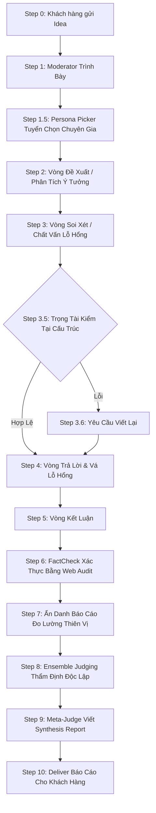

# Hệ Thống AI Roundtable (Nền Tảng Đánh Giá & Hoàn Thiện Ý Tưởng)
*Bản mô tả kiến trúc cốt lõi và định hướng phát triển dịch vụ B2B*

---

## 1. Tổng Quan Hệ Thống

**AI Roundtable** (Tiền thân là Debate Arena) là một hệ thống tự động sử dụng kiến trúc AI đa tác nhân (Multi-Agent). Trọng tâm của hệ thống là tạo ra một **"Bàn tròn thảo luận" (Roundtable)**, nơi các AI đóng vai trò những chuyên gia độc lập, cùng phân tích, cọ xát và đúc kết nhằm tạo ra đầu ra chất lượng cao nhất cho một vấn đề hay một ý tưởng.

**Định hướng Phát triển Dịch vụ (Service Vision)**:
Hệ thống không chỉ dừng lại ở công cụ nghiên cứu cá nhân mà được mở rộng thành một **Dịch vụ Đánh giá & Hoàn thiện ý tưởng cho khách hàng/đối tác (Idea Evaluation & Refinement Consulting)**. Khách hàng đưa vào một ý tưởng sơ phác (chiến lược kinh doanh, sản phẩm số, giải pháp tài chính...). Nền tảng sẽ thiết lập một "Hội đồng AI" chuyên trách để "stress-test" ý tưởng đó. Nền tảng bên dưới được thiết kế để kết nối linh hoạt với **rất đa dạng AI Providers** (Anthropic, OpenAI, Meta, Google), tạo nên các tổ đội chuyên án khác biệt biệt tùy theo thị trường và nhu cầu.

**Các thông số kỹ thuật đặc thù của Core Engine**:
- **10 Agents** hoạt động song song qua **11 Steps**.
- **4 Vòng hội chẩn** với **3+1 Giám khảo thẩm định độc lập**.
- Tích hợp **12 Personas** và **12 Frameworks** góc nhìn.
- Quản lý rủi ro logic qua **15 Reason Codes** và kiểm soát **30 dạng ngụy biện** (Fallacies).

---

## 2. Tiềm Năng Dịch Vụ: "Hội Đồng Chuyên Gia Theo Yêu Cầu"

### 2.1. Đa Dạng Hóa Bàn Tròn Môn Phái (Domain-Specific Teams)
Hệ thống khả năng "lắp ráp" ban bệ tùy biến cho từng khách hàng cụ thể:
- **Chuyên đánh giá ý tưởng Đầu tư / Tài chính**: Bàn tròn gồm "Chuyên gia quản trị rủi ro", "Nhà kinh tế học vĩ mô", và "Nhà phân tích định lượng". Họ sẽ đào xới giả định, stress-test dòng tiền và cảnh báo thiên nga đen.
- **Chuyên đánh giá ý tưởng Sản phẩm / Giải pháp Số**: Bàn tròn gồm "System Architect", "Nhà xã hội học ứng dụng", "Chuyên gia Hành vi người dùng (UX)". Đánh giá ngay tính khả thi kỹ thuật, rủi ro bảo mật dữ liệu và tỷ lệ chấp thuận của thị trường.
- **Hoạch định Chiến lược / M&A**: Bàn tròn tập trung mổ xẻ rào cản pháp lý, xung đột văn hóa doanh nghiệp và chiến lược rút lui (exit strategy).

### 2.2. AI Provider Agnostic (Hợp Lực Đa Mô Hình Cơ Sở)
- Để tránh hiện tượng "hòa tan" hay "thiên vị chung" (Single-brain bias) do dùng chung một model, kiến trúc Roundtable cho phép **mỗi Persona tại bàn tròn chạy trên một LLM model biệt lập**. 
- Ví dụ: Chuyên gia Pháp lý chạy qua hệ chuyên gia Claude 3.5 Sonnet, trong khi Kỹ sư Hệ thống chạy qua GPT-4o, và Chuyên gia Data chạy qua Gemini 2.5 Flash.

---

## 3. Kiến Trúc Tác Nhân Cốt Lõi (10 Core Agents)

Hệ thống điều phối các vai trò chuyên biệt sau để vận hành quá trình thẩm định:

### 3.1. Moderator (Người Điều Phối Định Hướng)
- Chuyển ý tưởng thô của khách hàng thành một Bản Trình Bày chuẩn mực (Brief).
- Rà soát tính rõ ràng, chốt các định nghĩa chung (definitions), và đặt ra các tiêu chuẩn cần đạt (burdens of proof).

### 3.2. Persona Picker (Hội Đồng Tuyển Chọn)
- Dựa trên lĩnh vực của bài toán, thuật toán sẽ chọn cặp các chuyên gia từ thư viện sao cho khoảng cách hệ quy chiếu nhận thức của họ (framework distance) ≥ 6. Ép buộc sự đa dạng góc nhìn (epistemic diversity) để ý tưởng được mổ xẻ triệt để nhất.

### 3.3. Analyst / Challenger (Chuyên Gia Phân Tích & Phản Biện)
- Chạy dưới dạng các tác nhân đối lập (Đội ủng hộ ý tưởng vs Đội Tìm kiếm rủi ro).
- Mỗi luận điểm bảo vệ hoặc bẻ gãy đều phải bao gồm đủ quy chuẩn: `[CƠ SỞ DỮ LIỆU]`, `[CƠ CHẾ TÁC ĐỘNG]`, `[ANTICIPATE RỦI RO]`, `[IMPACT HỆ QUẢ]`.

### 3.4. Referee (Trọng Tài Danh Dự)
- Giám sát các lỗi ngụy biện trong phòng họp (Motion drift, Strawman, Lén đổi định nghĩa...). Trọng tài có quyền đóng băng vòng thảo luận và ép Agent viết lại lập luận nếu phát hiện gian lận logic.

### 3.5. FactCheck (Ban Kiểm Định Sự Thật)
- Thực hiện web search độc lập để chứng thực các số liệu do Analyst/Challenger đưa ra.
- Xác minh theo phân tầng nguồn: Tier A (Nghiên cứu khoa học, Cấp chính phủ) -> Tier B (Báo chí uy tín) -> Tier C -> Tier D. Xẻ nhãn rõ ràng: Đúng, Sai, hoặc Chưa Kiểm Chứng.

### 3.6. Ensemble Judges (Bộ 3 Thẩm Định Viên Độc Lập)
Hệ thống sử dụng bộ 3 giám khảo giấu mặt đánh giá song song và hoàn toàn Blind (được tráo nhãn các bản báo cáo để tránh thiên vị AI):
- **Judge U (Hiệu Quả / Vị Lợi)**: Xem xét phương án mang lại tổng giá trị, lợi nhuận hoặc phúc lợi lớn nhất.
- **Judge R (Hành lang Pháp lý / Đạo Đức)**: Xem xét phương án có tuân thủ chặt chẽ quyền sở hữu, an toàn dài hạn hay không.
- **Judge P (Thực Tiễn / Triển Khai)**: Đánh giá dưới góc độ "trần trụi": Nguồn vốn, ngân sách, nhân lực và thể chế có cho phép hiện thực hóa không?

### 3.7. Meta-Judge (Chuyên Gia Đúc Kết / Chủ Tọa)
- Tổng hợp phiếu bầu và đọc toàn trình hội nghị. Trách nhiệm duy nhất là nhào nặn cuộc thảo luận thành **Báo Cáo Đúc Kết Hành Động (Actionable Report)** cho khách hàng.

---

## 4. Quy Trình Vận Hành 11 Bước (Workflow)

---

## 5. Giá Trị Cốt Lõi Vượt Trội (Synthesis & Safeguards)

Đầu ra của **AI Roundtable** không đơn giản báo cáo phương án này "Được" hay "Không Được", mà là một **Bản Hoàn Thiện Ý Tưởng** với giá trị tư vấn sâu sắc:

1. **Reconciliation (Sự Dung Hòa Vàng)**: Tinh lọc những góc nhìn sắc sảo nhất từ hội đồng hội chẩn để gộp thành giải pháp tối ưu cho khách hàng.
2. **Residual Disagreement (Nhận Diện Ranh Giới)**: Xác định rõ rào cản hiện tại của ý tưởng là do thiếu thông tin Thực chứng (Empirical - cần làm thêm nghiên cứu thị trường) hay do xung đột Giá trị (Normative - tùy theo khẩu vị rủi ro của ban giám đốc).
3. **Open Questions (Vùng Trắng Rủi Ro)**: Các biến số tương lai mà toàn bộ hội đồng chưa thể đo lường (VD: Biến động chính trị, chuỗi cung ứng ngắt quãng), khách hàng nhận được checklist quản trị rủi ro ngay.
4. **Actionable Recommendations (Kế hoạch Hành động)**: Đề xuất Next-steps cụ thể, thiết thực nhất từ Meta-Judge.

**Pillars Kỹ Thuật Đảm Bảo:**
- **Thanh Liêm Logic (Integrity)**: Các Agents không thể lén đọc "trộm" tư duy của nhau trong quá trình xây dựng luận điểm (Independence).
- **Filesystem-as-state & Audit Trail**: Toàn bộ luồng hoạt động trao đổi nội bộ của Team AI được lưu lại minh bạch, khách hàng dễ dàng audit (kiểm tra) cách AI đi đến kết luận.

---

## Version Tracking

| Version | Date | Author | Description |
|:---|:---|:---|:---|
| v1.0 | 2026-04-10 | Antigravity | Initial synthesis research of Debate Arena v2.0 |
| v2.0 | 2026-04-10 | Antigravity | Tái định vị thành thương hiệu "Roundtable", mở rộng tầm nhìn trở thành dịch vụ Đánh giá & Hoàn thiện ý tưởng (B2B SaaS / Consulting) với Multi-provider LLMs. |
